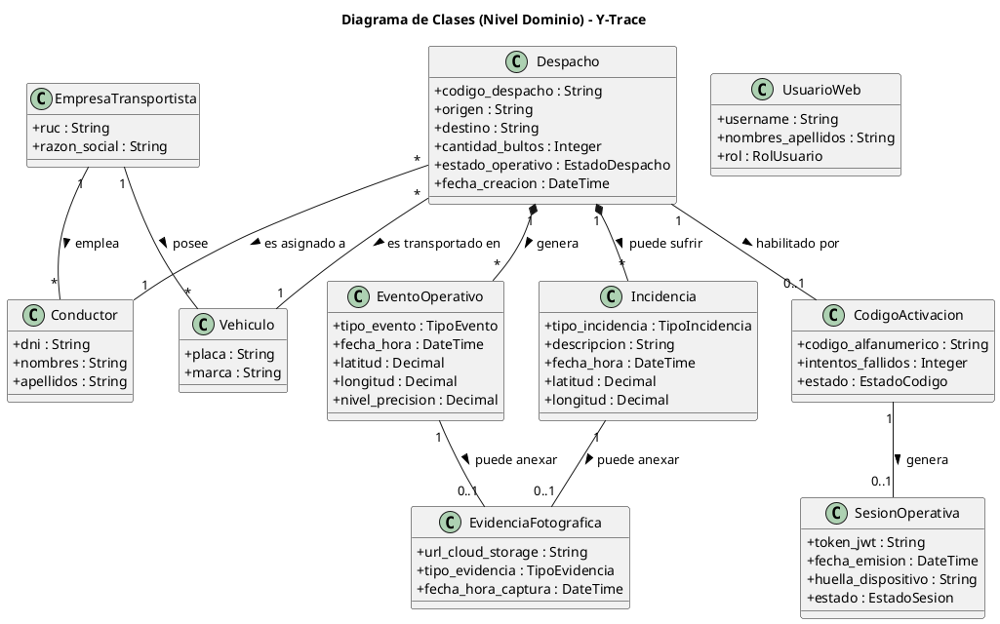

# Modelo de Dominio y Diccionario de Datos: Y-Trace

Este documento contiene el modelo conceptual de negocio de Y-Trace, elaborado a partir del análisis de la documentación operativa, la matriz de requerimientos y el modelo general de Casos de Uso del Negocio (CUN).

---

## 1. Diagrama de Clases (Nivel Dominio)

A continuación, se presenta el diagrama de clases a nivel conceptual (entidades clave del negocio), sus atributos principales y relaciones.

---

## 2. Diccionario de Datos

| Entidad | Descripción | Atributos Clave | Tipo de Dato |
| :--- | :--- | :--- | :--- |
| **Despacho** | Entidad principal del sistema. Representa una carga logística consolidada desde su disponibilidad hasta la entrega final. | `codigo_despacho` | String |
| | | `origen` | String |
| | | `destino` | String |
| | | `cantidad_bultos` | Integer |
| | | `estado_operativo` | Enum (`DISPONIBLE`, `HABILITADO`, `EN_RUTA`, `CON_INCIDENCIA`, `EN_DESTINO`, `ENTREGADO`, `NO_ENTREGADO`, `FINALIZADO`, `DESPACHO_CANCELADO`) |
| | | `fecha_creacion` | DateTime |
| **Empresa Transportista** | Socio logístico (tercero) encargado de la operación de traslado físico de los despachos. | `ruc` | String |
| | | `razon_social` | String |
| **Vehículo** | Unidad de transporte asignada físicamente al traslado de la carga. | `placa` | String |
| | | `marca` | String |
| **Conductor** | Persona designada por la empresa transportista para ejecutar el traslado y operar la PWA. | `dni` | String |
| | | `nombres` | String |
| | | `apellidos` | String |
| **Código Activación** | Clave efímera generada por el Supervisor para vincular al conductor con un despacho específico. | `codigo_alfanumerico` | String (8 caracteres) |
| | | `intentos_fallidos` | Integer (Max. 5) |
| | | `estado` | Enum (`VIGENTE`, `BLOQUEADO`, `CONSUMIDO`, `REVOCADO`) |
| **Sesión Operativa** | Vínculo técnico efímero (JWT) entre el dispositivo móvil del conductor y el viaje activo. | `token_jwt` | String |
| | | `fecha_emision` | DateTime |
| | | `huella_dispositivo` | String |
| | | `estado` | Enum (`ACTIVA`, `REVOCADA`) |
| **Evento Operativo** | Hito inmutable (*append-only*) generado durante el ciclo de vida del despacho, ya sea automatizado o manual. | `tipo_evento` | Enum (`SALIDA`, `LLEGADA`, `ENTREGA`, `RECHAZO`, `GPS_TRACKING`) |
| | | `fecha_hora` | DateTime |
| | | `latitud` / `longitud` | Decimal |
| | | `nivel_precision` | Decimal (metros) |
| **Incidencia** | Evento anómalo en ruta reportado por el conductor que altera el flujo normal de transporte. | `tipo_incidencia` | Enum (`MECANICA`, `ACCIDENTE`, `BLOQUEO_VIAL`, `CLIMA`) |
| | | `descripcion` | String |
| | | `fecha_hora` | DateTime |
| | | `latitud` / `longitud` | Decimal |
| **Evidencia Fotográfica** | Elemento de respaldo opcional en la plataforma, almacenado externamente, vinculado a un hito logístico o incidencia. | `url_cloud_storage` | String (URL) |
| | | `tipo_evidencia` | Enum (`GUIA_SELLADA`, `CARGA_RECHAZADA`, `SINIESTRO`) |
| | | `fecha_hora_captura` | DateTime |
| **Usuario Web** | Trabajador interno de Yanbal (Supervisor, Jefe, SAC, Administrador) autorizado a usar la Torre de Control. | `username` | String |
| | | `nombres_apellidos`| String |
| | | `rol` | Enum (`ADMIN`, `SUPERVISOR`, `JEFE`, `SAC`) |

---

## 3. Matriz de Entidades y Trazabilidad

A continuación se muestra el ciclo de vida o intervención de cada entidad clave a lo largo de las fases de la distribución:

| Entidad | 1. Disponibilidad y Andén | 2. Activación PWA | 3. Ruta y Monitoreo | 4. Llegada y Recepción | 5. Cierre y Trazabilidad |
| :--- | :---: | :---: | :---: | :---: | :---: |
| **Despacho** | Se consulta | Se asocia código | Cambia de estado | Cambia a `ENTREGADO` o `NO_ENTREGADO` | Cambia a `FINALIZADO` |
| **Código Activación** | Se genera | Se valida | - | - | Se extingue / revoca |
| **Sesión Operativa** | - | Se emite | Mantiene conexión | Valida transacciones | Se revoca inmediatamente |
| **Evento Operativo** | - | - | Generación GPS (cada 10 min) | Hito `EN_DESTINO` e hitos entrega | Se consolidan / auditan |
| **Incidencia** | - | - | Se genera alerta (si aplica) | - | Se analiza en auditoría |
| **Evidencia (Foto)** | - | - | Opción por incidencia | Opción en entrega / rechazo | Se guarda referencia |
| **Usuario Web** | Habilita despacho | - | Visualiza semáforo | Recibe alerta 60 min | Analiza Dashboard |
| **Conductor** | Recibe carga | Digita código | Conduce (GPS auto) | Confirma llegada / entrega | Presiona Finalizar |
