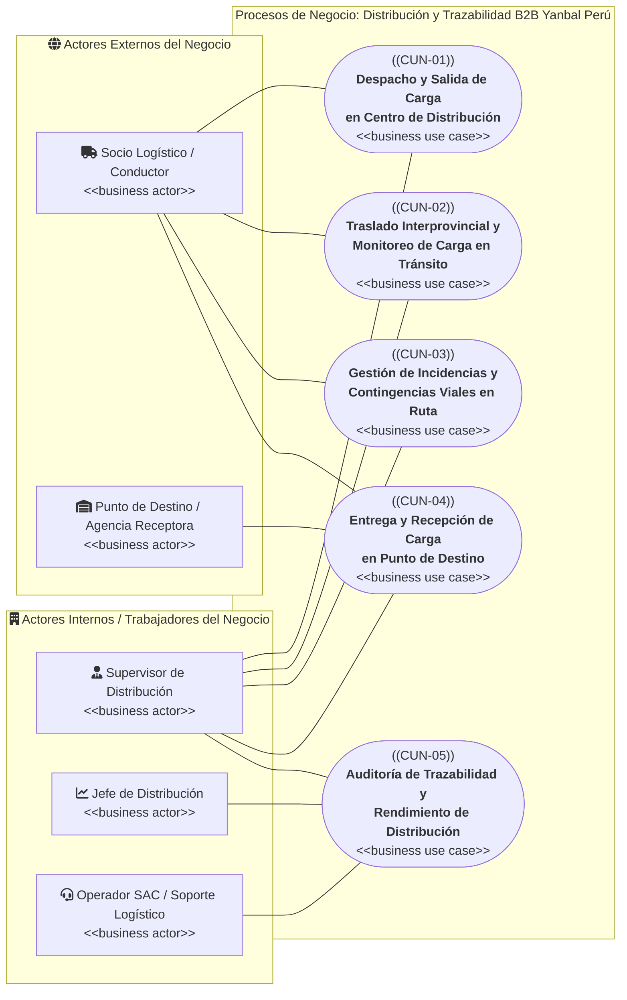

# Modelo General de Casos de Uso del Negocio (CUN): Y-Trace

> **Carpeta:** `detalles/Diagrama de Casos de Uso del Negocio (CUN)`  
> **Documento:** `00_INDICE_Y_MODELO_GENERAL_CUN.md`  
> **Proyecto Oficial:** Sistema Web y Móvil para la Gestión y Trazabilidad de Despachos y Entregas de Yanbal Perú (Y-Trace)  
> **Marco Metodológico:** Rational Unified Process (RUP) — Modelado del Negocio (Sesión 4 UTP / Arquitectura Empresarial)  
> **Estado:** [CONSOLIDADO OFICIAL — ALCANCE B2B PUNTO A PUNTO]  
>  
> 🔗 **Documentos de Base del Proyecto:**  
> - [[01_MATRIZ_DE_REQUERIMIENTOS]] — Matriz maestra unificada (34 RF activos)  
> - [[02_REQUERIMIENTOS_FUNCIONALES]] — Especificación técnica de RFs (RF001 a RF034)  
> - [[03_REQUERIMIENTOS_NO_FUNCIONALES]] — Especificación técnica de RNFs (RNF001 a RNF023)  
> - [[04_RESUMEN_OPERATIVO_Y_TRAZABILIDAD_REQUERIMIENTOS]] — Resumen operativo extremo a extremo  

---

## 1. Introducción y Marco Teórico RUP

En la metodología **Rational Unified Process (RUP)** y bajo los principios de **Arquitectura Empresarial**, el **Modelado del Negocio** describe cómo una organización estructura sus procesos operacionales para brindar valor a sus clientes, socios y áreas usuarias.

Un **Caso de Uso del Negocio (CUN)** representa un proceso de negocio integral de principio a fin, ejecutado por personas, roles y recursos dentro de la empresa, que genera un resultado de valor observable para un actor del negocio.

### 1.1 Demarcación Rigurosa entre Niveles de Modelado

Es fundamental distinguir los tres niveles de abstracción del proyecto para evitar errores conceptuales habituales:

```
┌─────────────────────────────────────────────────────────────────────────────────────────────────┐
│                                   NIVELES DE MODELADO DE SISTEMAS                               │
├──────────────────────────────┬──────────────────────────────────┬───────────────────────────────┤
│ Casos de Uso del Negocio     │ Casos de Uso del Sistema         │ Requerimientos Funcionales    │
│ (CUN - Macro-Procesos)       │ (CUS - Interacción con Software) │ (RF - Especificación Técnica) │
├──────────────────────────────┼──────────────────────────────────┼───────────────────────────────┤
│ • Nivel: Negocio / Proceso.  │ • Nivel: Frontera del Sistema.   │ • Nivel: Detalle de Software. │
│ • Foco: ¿Qué hace la empresa │ • Foco: ¿Cómo interactúa el      │ • Foco: ¿Qué capacidades de   │
│   para transportar la carga? │   usuario con las pantallas?     │   procesamiento tiene la app? │
│ • No depende de la UI.       │ • Pantallas, botones, inputs.    │ • 34 RF activos en Y-Trace.   │
│ • 5 CUN identificados.       │ • Se derivan de los CUN.         │ • Dan soporte a los CUS/CUN.  │
└──────────────────────────────┴──────────────────────────────────┴───────────────────────────────┘
```

> [!IMPORTANT]
> **Reglas Metodológicas Clave:**
> 1. **No convertir los 34 RFs en CUNs:** Hacerlo generaría "CUNs botón" o "CUNs pantalla" (ej. "CUN Autenticarse", "CUN Capturar GPS"). En el negocio no existen esos procesos; esos son servicios computacionales que dan soporte a los verdaderos procesos logísticos.
> 2. **Frontera B2B Punto a Punto:** El alcance modela estrictamente la distribución completa entre puntos de distribución (Origen CD Lurín $\rightarrow$ Traslado $\rightarrow$ Punto de Destino / Agencias departamentales). Quedan excluidos los procesos de manufactura, picking en SPY, ruteo maestro en Driving y reparto minorista domiciliario B2C a consultoras o familiares.

---

## 2. Mapa General de Casos de Uso del Negocio

El modelo de procesos de distribución B2B de Yanbal Perú se articula a través de **5 Casos de Uso del Negocio** interconectados con **5 Actores del Negocio** (2 externos y 3 internos):



---

## 3. Catálogo Sintético de Actores y Casos de Uso

### 3.1 Actores del Negocio
| Identificador | Nombre del Actor | Clasificación | Rol Principal en la Cadena B2B |
| :--- | :--- | :---: | :--- |
| **ACT-NEG-01** | **Socio Logístico / Conductor** | Externo | Transportista tercero encargado del traslado físico, custodia de la carga en ruta, reporte de eventos/incidencias y entrega física en destino. |
| **ACT-NEG-02** | **Punto de Destino / Agencia Receptora** | Externo | Agencia comercial, almacén intermedio o centro secundario que recepciona físicamente los bultos/pallets y otorga la conformidad o rechazo. |
| **ACT-NEG-03** | **Supervisor de Distribución** | Interno | Operador de la Torre de Control en CD Lurín que valida andenes, genera habilitaciones de viaje, supervisa la telemetría y atiende incidencias. |
| **ACT-NEG-04** | **Jefe de Distribución** | Interno | Responsable táctico/estratégico que evalúa el cumplimiento de SLAs (*Lead Time*, puntualidad), siniestros y desempeño de transportistas asociados. |
| **ACT-NEG-05** | **Operador SAC / Soporte Logístico** | Interno | Personal de servicio al cliente que atiende consultas operacionales de las áreas comerciales y valida evidencias y cronología de despachos. |

### 3.2 Casos de Uso del Negocio (CUN)
| Código | Caso de Uso del Negocio | Objetivo de Valor del Negocio | Actores Asociados | Documento Detallado |
| :---: | :--- | :--- | :--- | :---: |
| **CUN-01** | **Despacho y Salida de Carga en Centro de Distribución** | Formalizar la verificación física, traspaso de custodia y habilitación de salida de la carga preparada en CD Lurín hacia el transportista. | Supervisor de Distribución, Socio Logístico / Conductor | [[02_CUN_01_DESPACHO_Y_SALIDA_CD]] |
| **CUN-02** | **Traslado Interprovincial y Monitoreo de Carga en Tránsito** | Garantizar el transporte físico seguro a los 24 departamentos con visibilidad y monitoreo continuo de avance y cumplimiento del *Lead Time*. | Socio Logístico / Conductor, Supervisor de Distribución | [[03_CUN_02_TRASLADO_Y_MONITOREO]] |
| **CUN-03** | **Gestión de Incidencias y Contingencias Viales en Ruta** | Alertar, mitigar y resolver contingencias en carretera (mecánicas, viales, siniestros) salvaguardando carga, personal y plazos. | Socio Logístico / Conductor, Supervisor de Distribución | [[04_CUN_03_GESTION_DE_INCIDENCIAS]] |
| **CUN-04** | **Entrega y Recepción de Carga en Punto de Destino** | Certificar el arribo, la inspección física, la recepción conforme o rechazo y la liquidación formal del viaje con evidencias operativas. | Socio Logístico / Conductor, Punto de Destino, Supervisor | [[05_CUN_04_ENTREGA_Y_RECEPCION_DESTINO]] |
| **CUN-05** | **Auditoría de Trazabilidad y Rendimiento de Distribución** | Evaluar el desempeño de las empresas transportistas, auditar evidencias operativas y proveer información histórica ágil. | Jefe de Distribución, Operador SAC | [[06_CUN_05_AUDITORIA_Y_RENDIMIENTO]] |

---

## 4. Matriz de Relacionamiento y Participación (Actores vs. CUN)

La siguiente matriz define el grado de interacción de cada actor con los procesos de negocio:
- **I (Iniciador):** Detona o ejecuta proactivamente el flujo del proceso.
- **P (Participante):** Interviene activamente en tareas intermedias o colaborativas.
- **R (Receptor):** Recibe el valor o resultado final del proceso.

| Actor del Negocio | CUN-01: Despacho y Salida CD | CUN-02: Traslado y Monitoreo | CUN-03: Gestión Incidencias | CUN-04: Entrega y Recepción | CUN-05: Auditoría y Rendimiento |
| :--- | :---: | :---: | :---: | :---: | :---: |
| **Socio Logístico / Conductor** | **P** (Recibe carga y código) | **I** (Conduce y emite datos) | **I** (Reporta percance) | **I** (Entrega bultos) | — |
| **Punto de Destino / Agencia** | — | — | — | **R** (Inspecciona y recibe) | — |
| **Supervisor de Distribución** | **I** (Controla andén y habilita) | **P** (Torre de Control) | **P** (Coordina auxilio/cierre) | **P** (Supervisa arribo) | — |
| **Jefe de Distribución** | — | — | — | — | **I** (Evalúa KPIs/SLAs) |
| **Operador SAC / Soporte** | — | — | — | — | **P** (Atiende consultas) |

---

## 5. Estructura Documental de la Carpeta

Para una exploración detallada, los módulos documentales se organizan de la siguiente manera:

1. **[[00_INDICE_Y_MODELO_GENERAL_CUN]]** (Este documento): Marco conceptual, diagrama macro en Mermaid y visión consolidada.
2. **[[01_ACTORES_DEL_NEGOCIO]]**: Fichas exhaustivas de caracterización de actores, atribuciones, gobernanza e información intercambiada.
3. **[[02_CUN_01_DESPACHO_Y_SALIDA_CD]]**: Especificación formal de CUN-01 (Despacho y Salida de Carga).
4. **[[03_CUN_02_TRASLADO_Y_MONITOREO]]**: Especificación formal de CUN-02 (Traslado y Monitoreo).
5. **[[04_CUN_03_GESTION_DE_INCIDENCIAS]]**: Especificación formal de CUN-03 (Gestión de Incidencias).
6. **[[05_CUN_04_ENTREGA_Y_RECEPCION_DESTINO]]**: Especificación formal de CUN-04 (Entrega y Recepción).
7. **[[06_CUN_05_AUDITORIA_Y_RENDIMIENTO]]**: Especificación formal de CUN-05 (Auditoría y Rendimiento).
8. **[[07_MATRIZ_TRAZABILIDAD_CUN_VS_RF]]**: Mapeo bidireccional entre los 5 CUN y los 34 Requerimientos Funcionales de software.
9. **[[08_GUIA_MODELADO_VISUAL_PARADIGM]]**: Manual paso a paso para diagramar el CUN en Visual Paradigm Community Edition conforme a la Sesión 4 de la UTP.
