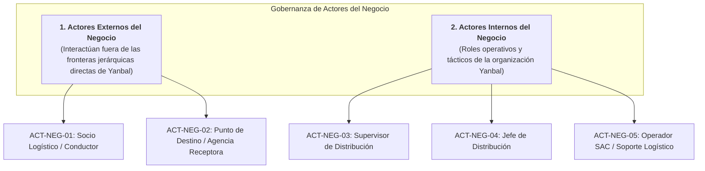

# Actores del Negocio: Distribución B2B Yanbal Perú

> **Carpeta:** `detalles/Diagrama de Casos de Uso del Negocio (CUN)`  
> **Documento:** `01_ACTORES_DEL_NEGOCIO.md`  
> **Proyecto Oficial:** Sistema Web y Móvil para la Gestión y Trazabilidad de Despachos y Entregas de Yanbal Perú (Y-Trace)  
> **Marco Metodológico:** Rational Unified Process (RUP) — Modelado del Negocio  
>  
> 🔗 **Documentos Relacionados:**  
> - [[00_INDICE_Y_MODELO_GENERAL_CUN]] — Modelo general y diagrama macro  
> - [[informacion/08 - Actores/Actores y responsabilidades]] — Fichas corporativas de actores Yanbal  
> - [[04_RESUMEN_OPERATIVO_Y_TRAZABILIDAD_REQUERIMIENTOS]] — Resumen operativo extremo a extremo  

---

## 1. Definición y Clasificación de Actores del Negocio en RUP

En el marco de **Rational Unified Process (RUP)** y la práctica docente de la **Universidad Tecnológica del Perú (Sesión 4)**, los **Actores del Negocio (`<<business actor>>`)** representan roles externos a la organización (clientes, contratistas o destinatarios) o roles/áreas funcionales de la empresa que intervienen en los procesos del negocio ejecutando tareas o recibiendo sus resultados de valor.

> **Nota Aclaratoria:** El **Administrador Principal** es un rol estrictamente informático y del sistema (gestión de usuarios web y permisos), por lo que **no constituye un Actor del Negocio logístico** (`<<business actor>>`) ni participa operativamente en los Casos de Uso del Negocio (CUN).

---

## 2. Fichas Descriptivas de Actores del Negocio

### 2.1 Actores Externos

#### ACT-NEG-01: Socio Logístico / Conductor
* **Estereotipo RUP:** `<<business actor>>`
* **Tipo:** Externo (Contratista de transporte tercero).
* **Descripción Institucional:**
  Representa tanto a las empresas transportistas homologadas por Yanbal como a los conductores asignados a las unidades de carga pesada o mediana (furgones, camiones interprovinciales) para realizar el traslado troncal e interdepartamental.
* **Objetivo de Negocio:**
  Recibir la carga en andén, trasladarla cumpliendo los estándares de seguridad vial y los tiempos de entrega pactados (*Lead Time*), y formalizar la entrega en el punto de distribución.
* **Responsabilidades en el Proceso:**
  1. Recibir físicamente los pallets o bultos precintados en el CD Lurín y validar su correspondencia con la guía de remisión.
  2. Activar la unidad en la aplicación PWA Android mediante el Código de Activación efímero entregado por el Supervisor.
  3. Ejecutar el traslado interprovincial portando el dispositivo móvil que emite telemetría satelital periódica en ruta.
  4. Reportar de inmediato siniestros viales, desperfectos mecánicos o bloqueos de carreteras mediante el canal operativo móvil.
  5. Entregar la carga completa en el punto de destino, recabar la conformidad del receptor y capturar la evidencia geoespacial y fotográfica complementaria.
* **Información que Recibe:**
  - Código Único de Activación (8 caracteres).
  - Datos operativos del despacho: código de viaje, punto de destino, dirección y observaciones de ruta.
* **Información que Genera:**
  - Confirmación de inicio de despacho (`EN_RUTA`).
  - Muestreo periódico de telemetría GPS en ruta.
  - Reportes de siniestros viales y contingencias en carretera con evidencias.
  - Registro de llegada (`EN_DESTINO`) y confirmación formal de entrega (`ENTREGADO` o `NO_ENTREGADO` con motivo).

---

#### ACT-NEG-02: Punto de Destino / Agencia Receptora
* **Estereotipo RUP:** `<<business actor>>`
* **Tipo:** Externo / Destinatario B2B (Agencia comercial, almacén intermedio o centro de distribución secundario).
* **Descripción Institucional:**
  Representa al encargado de recepción de mercadería en las sedes regionales o puntos de distribución departamentales de Yanbal ubicados a lo largo de los 24 departamentos del Perú.
* **Objetivo de Negocio:**
  Recepcionar formalmente la carga consolidada, verificar su integridad física exterior y dar conformidad de recepción para permitir el abastecimiento regional.
* **Responsabilidades en el Proceso:**
  1. Recibir al conductor del socio logístico a su arribo a las instalaciones de la agencia o almacén.
  2. Realizar la inspección visual exterior de bultos, precintos de seguridad y pallets.
  3. Validar las cantidades declaradas en los manifiestos de transporte.
  4. Otorgar la conformidad de recepción al conductor o emitir las observaciones y causales formales de rechazo en caso de anomalías severas o arribo fuera de horario.
* **Información que Recibe:**
  - Carga consolidada y bultos rotulados.
  - Manifiesto físico / electrónico de entrega.
* **Información que Genera:**
  - Dictamen de conformidad de entrega física (o rechazo tipificado).
  - Firma/sello en comprobante de recepción.

---

### 2.2 Actores Internos (Trabajadores del Negocio)

#### ACT-NEG-03: Supervisor de Distribución
* **Estereotipo RUP:** `<<business actor>>`
* **Tipo:** Interno (Nivel de Gestión Operativa / Torre de Control CD Lurín).
* **Descripción Institucional:**
  Colaborador interno de Yanbal Perú encargado del control diario de las operaciones de salida y monitoreo de la flota desde la Torre de Control Logístico.
* **Objetivo de Negocio:**
  Garantizar el despacho fluido de la carga desde el andén de Lurín, mantener visibilidad permanente del convoy en carretera y brindar soporte inmediato ante incidencias.
* **Responsabilidades en el Proceso:**
  1. Inspeccionar en andén los despachos consolidados y puestos a disposición por el WMS SPY y TMS Driving.
  2. Generar el Código Único de Activación efímero y realizar el traspaso formal de custodia al conductor del transportista.
  3. Supervisar en tiempo real la traza satelital y el estado de la flota sobre el mapa cartográfico interactivo.
  4. Recibir y gestionar alertas sonoras y visuales por contingencias viales o demoras excesivas en destino (ventana de 60 min).
  5. Coordinar el auxilio vial o desvío de ruta con los socios logísticos y activar la contingencia de recuperación de dispositivo si un móvil se avería.
  6. Autorizar cierres forzados administrativos en bitácora inmutable en casos de siniestro total o fuerza mayor comprobada.
* **Información que Recibe:**
  - Despachos preparados listos para seguimiento (vía Bus / SPY / Driving).
  - Telemetría GPS en tiempo real de los vehículos en ruta.
  - Alertas inmediatas de incidencias viales y notificaciones de ventana vencida en destino.
* **Información que Genera:**
  - Código Único de Activación de 8 caracteres y registro del hito de control previo.
  - Códigos de recuperación para sustitución controlada de dispositivos en ruta.
  - Resoluciones de contingencias y cierres forzados justificados en bitácora.

---

#### ACT-NEG-04: Jefe de Distribución
* **Estereotipo RUP:** `<<business actor>>`
* **Tipo:** Interno (Nivel Táctico / Estratégico de Supply Chain).
* **Descripción Institucional:**
  Máximo responsable del área de Distribución y Transporte de Yanbal Perú (encarnado en el caso de estudio por el Ing. Joao Condorpusa Mendoza).
* **Objetivo de Negocio:**
  Evaluar estratégicamente el nivel de servicio de la red de transporte intercentros, asegurar el cumplimiento contractual de los transportistas terceros y abatir las brechas de latencia y siniestralidad.
* **Responsabilidades en el Proceso:**
  1. Evaluar periódicamente los indicadores de rendimiento logístico (*Lead Time*, cumplimiento de entrega conforme, tasa de puntualidad).
  2. Monitorear la latencia de integración con el Bus corporativo (SLA $\le$ 30 minutos).
  3. Fiscalizar el desempeño comparativo entre las empresas de transporte asociadas para la asignación estratégica de contratos y rutas.
  4. Exportar reportes analíticos consolidados exclusivamente en formato Excel para conciliación logística y penalidades.
* **Información que Recibe:**
  - Tablero ejecutivo de indicadores (Dashboard) con métricas consolidadas.
  - Historial consolidado de trazabilidad y siniestralidad por transportista.
* **Información que Genera:**
  - Calificación de desempeño de contratistas de transporte.
  - Reportes gerenciales consolidados para la Dirección de Operaciones.

---

#### ACT-NEG-05: Operador SAC / Soporte Logístico
* **Estereotipo RUP:** `<<business actor>>`
* **Tipo:** Interno (Servicio al Cliente y Trazabilidad Operacional).
* **Descripción Institucional:**
  Agente de atención y soporte interno/externo encargado de responder requerimientos de trazabilidad sobre despachos en tránsito o entregados.
* **Objetivo de Negocio:**
  Resolver consultas e inquietudes de clientes internos (agencias comerciales, fuerza de ventas) en el primer contacto, contando con datos de trazabilidad fidedignos y actualizados.
* **Responsabilidades en el Proceso:**
  1. Realizar búsquedas ágiles de despachos mediante código de viaje o placa de la unidad vehicular.
  2. Examinar la línea de tiempo completa del despacho (cronología de hitos desde la salida hasta la entrega).
  3. Validar evidencias operativas (estampa de tiempo, coordenadas GPS certificadas de arribo y enlaces a fotos de respaldo en Cloud Storage).
  4. Responder tickets de consulta y resolver discrepancias de entrega sin recurrir a llamadas ciegas a los conductores en ruta.
* **Información que Recibe:**
  - Solicitudes de consulta o reclamos por estado de despachos.
  - Cronología histórica completa y evidencias certificadas de entrega.
* **Información que Genera:**
  - Respuestas fundadas a consultas operativas de trazabilidad.
  - Validación de entrega conforme ante auditorías internas.

---

## 3. Matriz de Atribuciones y Flujo de Intercambio de Información

| Actor del Negocio | Rol Institucional | Entradas de Información | Salidas / Entregables | Herramienta Operativa |
| :--- | :--- | :--- | :--- | :--- |
| **Socio Logístico / Conductor** | Transportista tercero de carga pesada | Manifiesto de carga, Código de Activación de 8 caracteres | Telemetría GPS en ruta, alertas de incidencias, evidencia de entrega | PWA Android (Y-Trace Móvil) |
| **Punto de Destino / Agencia** | Receptor físico B2B en destino | Carga consolidada, guía de remisión física | Dictamen de conformidad, sello/firma de recepción | Manifiesto físico / Verificación visual |
| **Supervisor de Distribución** | Control operativo de andén y flota | Cargas preparadas en SPY/Driving, telemetría de vehículos, alertas | Código de activación, asignación de contingencias, cierre forzado | Plataforma Web (Torre de Control) |
| **Jefe de Distribución** | Dirección táctica y control de SLAs | Métricas consolidadas de tiempos, entregas conformes y latencia | Evaluaciones contractuales de flota, reportes en Excel | Plataforma Web (Dashboard Ejecutivo) |
| **Operador SAC / Soporte** | Atención de consultas de trazabilidad | Requerimientos de seguimiento de agencias / áreas comerciales | Información certificada de entrega, resolución de discrepancias | Plataforma Web (Buscador de Trazabilidad) |

---

## 4. Gobernanza y Segregación de Responsabilidades

Para asegurar la integridad del negocio y prevenir colusión o fraudes:
1. **Segregación Operativa en Andén:** El Supervisor de Distribución solo puede habilitar el seguimiento de despachos ya preparados y validados externamente por el WMS SPY; no puede crear despachos ficticios.
2. **Segregación en Ruta:** El Conductor no puede modificar los datos del despacho, ni reprogramar rutas, ni alterar el kilometraje ni las coordenadas GPS capturadas de forma nativa por el dispositivo Android.
3. **Segregación en Destino:** El arribo a la geocerca (`EN_DESTINO`) es una evidencia geoespacial que no sustituye la confirmación manual de entrega (`ENTREGADO`), garantizando que la presencia del vehículo no acredite automáticamente la descarga conforme.
