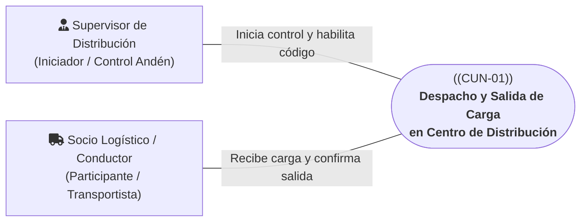
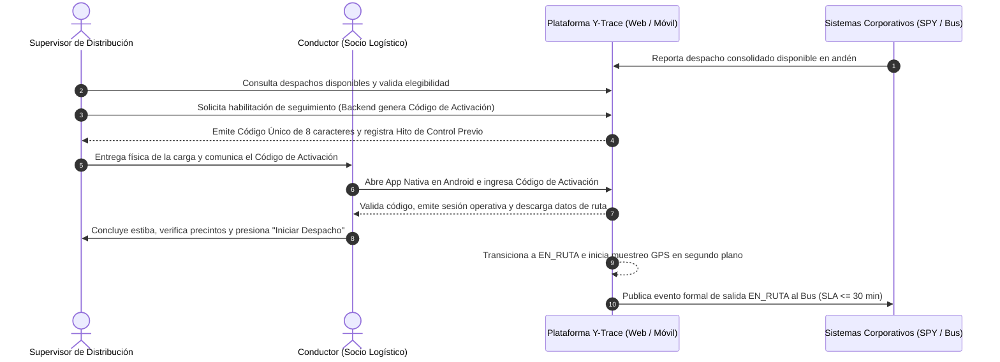

# CUN-01: Despacho y Salida de Carga en Centro de Distribución

> **Carpeta:** `detalles/Diagrama de Casos de Uso del Negocio (CUN)`  
> **Documento:** `02_CUN_01_DESPACHO_Y_SALIDA_CD.md`  
> **Proyecto Oficial:** Sistema Web y Móvil para la Gestión y Trazabilidad de Despachos y Entregas de Yanbal Perú (Y-Trace)  
> **Marco Metodológico:** Rational Unified Process (RUP) — Especificación de Casos de Uso del Negocio  
>  
> 🔗 **Documentos Vinculados:**  
> - [[00_INDICE_Y_MODELO_GENERAL_CUN]] — Modelo general de casos de uso del negocio  
> - [[01_ACTORES_DEL_NEGOCIO]] — Catálogo y fichas de actores del negocio  
> - [[07_MATRIZ_TRAZABILIDAD_CUN_VS_RF]] — Matriz de trazabilidad con requerimientos de software  

---

## 1. Ficha de Identificación del Proceso

| Atributo                 | Detalle                                                                                                                                                                                                                             |
| :----------------------- | :---------------------------------------------------------------------------------------------------------------------------------------------------------------------------------------------------------------------------------- |
| **Identificador:**       | **CUN-01**                                                                                                                                                                                                                          |
| **Nombre del Proceso:**  | **Despacho y Salida de Carga en Centro de Distribución**                                                                                                                                                                            |
| **Estereotipo RUP:**     | `<<business use case>>`                                                                                                                                                                                                             |
| **Área Responsable:**    | Gerencia de Supply Chain — Área de Distribución y Transporte (CD Lurín)                                                                                                                                                             |
| **Alcance Operativo:**   | Distribución troncal completa B2B (Andén de Salida CD Lurín $\rightarrow$ Habilitación, Activación y Salida Física)                                                                                                                  |
| **Objetivo de Negocio:** | Formalizar el control previo en andén, la transferencia formal de custodia de la carga consolidada al transportista tercero y la habilitación operativa del seguimiento para garantizar el inicio seguro del viaje interprovincial. |

---

## 2. Actores del Negocio Participantes

* **Actor Iniciador:** **Supervisor de Distribución (Interno)**. Controla el andén de salida, verifica que la carga consolidada esté lista para viaje y habilita el seguimiento generando el Código Único de Activación.
* **Actor Secundario / Participante:** **Socio Logístico / Conductor (Externo)**. Se presenta en andén, recibe la estiba de los bultos/pallets, activa la unidad en su App Nativa Android con el código recibido y declara formalmente la salida de planta.

---

## 3. Precondiciones del Negocio

1. El Centro de Distribución de Yanbal (CD Lurín) ha completado la consolidación, cubicaje y rotulación de los bultos y pallets en el sistema WMS (SPY).
2. El sistema TMS corporativo (Driving) ha establecido la zonificación geográfica, punto de destino de distribución y la empresa transportista asignada.
3. El despacho preparado se encuentra físicamente posicionado en el andén de carga y su registro ha sido puesto a disposición para seguimiento en la Torre de Control Logístico.
4. El Conductor asignado por el transportista tercero se encuentra presente en el andén con la unidad vehicular inspeccionada y un dispositivo móvil Android (versión 8.0 o superior) con la App Nativa Y-Trace instalada.

---

## 4. Flujo Básico de Actividades del Negocio (Happy Path)

1. **Consulta y Verificación en Andén:** El Supervisor de Distribución accede a la plataforma Web y visualiza la lista de despachos preparados puestos a disposición en andén por el WMS SPY.
2. **Generación de Habilitación Operativa:** El Supervisor selecciona el despacho verificado y solicita la emisión del Código Único de Activación. El sistema registra el **hito interno de control previo** (asegurando trazabilidad interna) y genera un código alfanumérico efímero de 8 caracteres (ej. `TRC-82F4`).
3. **Traspaso de Custodia y Handoff:** El Supervisor entrega el código al Conductor del transportista asociado junto con las guías físicas de remisión y transfiere formalmente la custodia física de los bultos/pallets estibados.
4. **Activación de la Unidad Móvil:** El Conductor accede a la App Nativa de Y-Trace en su teléfono Android e ingresa el Código de Activación recibido. El sistema valida la elegibilidad del viaje, asocia la huella del dispositivo, emite una sesión operativa temporal y descarga los datos operativos del despacho y punto de destino.
5. **Declaración Formal de Salida (`EN_RUTA`):** Con la carga asegurada y la unidad lista para cruzar la garita de control de Lurín, el Conductor pulsa *"Iniciar Despacho"*.
6. **Inicio de Telemetría y Notificación Corporativa:** El sistema transiciona el estado a `EN_RUTA`, activa la captura periódica de coordenadas GPS en segundo plano y notifica el hito de salida al Bus de Integración de Yanbal para sincronizar a SAP R/3 y Salesforce dentro del SLA de 30 minutos.

---

## 5. Flujos Alternativos y Excepciones del Negocio

### A1: Bloqueo por Intentos Fallidos Consecutivos (Seguridad Anti-Fuerza Bruta)
* **Condición:** El Conductor ingresa erróneamente el código de activación en su teléfono Android.
* **Acción de Negocio:**
  - El sistema permite hasta 4 reintentos.
  - Al registrarse el **quinto intento fallido consecutivo**, el sistema invalida y bloquea automáticamente el código, emitiendo una alerta visual inmediata al Supervisor en la plataforma Web.
  - El Supervisor verifica la identidad presencial del Conductor en andén, anula el código bloqueado y, cuando corresponda, genera un nuevo código de activación previa validación administrativa.

### A2: Cancelación Externa Previa a la Salida
* **Condición:** El Centro de Distribución o el área comercial ordena detener el despacho antes de que la unidad cruce la garita (ej. retención de calidad o cancelación de pedido).
* **Acción de Negocio:**
  - La cancelación del despacho se tramita mediante el procedimiento corporativo externo establecido por Yanbal.
  - Al procesarse administrativamente dicha cancelación externa en la plataforma Y-Trace, el sistema invalida de inmediato el Código de Activación generado y cancela cualquier sesión móvil pendiente, registrando el estado correspondiente.
  - El Supervisor retira la carga del andén y la devuelve a custodia interna del CD conforme al protocolo operativo de planta.

### A3: Incapacidad de Activación en el Dispositivo del Conductor en Andén
* **Condición:** El dispositivo móvil del conductor no puede completar la activación en andén (por descarga de batería, avería física o falta temporal de conectividad).
* **Acción de Negocio:**
  - El Conductor reporta el percance al Supervisor de andén.
  - La situación se resuelve mediante el proceso operativo externo correspondiente de la empresa transportista o del Centro de Distribución.
  - En Y-Trace, el código de activación previo no utilizado se invalida. Cuando corresponda y una vez solventada la contingencia externa, el Supervisor podrá generar un nuevo código de activación mediante el procedimiento operativo establecido, sin que Y-Trace realice asignaciones logísticas de vehículos ni conductores.

---

## 6. Postcondiciones del Negocio

* **Estado de Éxito:**
  - La custodia física de la carga ha sido transferida formalmente a la empresa transportista.
  - El despacho se encuentra en estado `EN_RUTA` emitiendo telemetría satelital periódica.
  - El hito de salida física ha sido notificado al ecosistema Yanbal (SAP / Salesforce) vía Bus de Integración.
* **Estado de Cancelación:**
  - La carga permanece bajo custodia del CD Lurín y el código de activación queda revocado sin emitir datos en ruta.

---

## 7. Reglas de Negocio Vinculadas

* **RN-CUN-01.1 (Carga Preexistente):** Y-Trace no planifica rutas ni consolida bultos; solo gestiona despachos completos previamente preparados por los sistemas corporativos (SPY / Driving).
* **RN-CUN-01.2 (Hito Interno de Control Previo):** La emisión del código de activación genera un hito interno que audita la habilitación del viaje, sin constituir una autorización logística de salida externa ni publicarse al Bus.
* **RN-CUN-01.3 (Cero Contraseñas en Móvil):** Los conductores externos no poseen cuentas ni contraseñas permanentes; su autenticación se realiza exclusivamente mediante códigos de activación efímeros de 8 caracteres vinculados al despacho.
* **RN-CUN-01.4 (Límite Anti-Fuerza Bruta):** Máximo 5 intentos fallidos antes del bloqueo definitivo del código.

---

## 8. Trazabilidad con Requerimientos Funcionales del Sistema (Y-Trace)

Los siguientes requerimientos de software implementan y dan soporte operativo a este Caso de Uso del Negocio:

| ID Requerimiento | Nombre del Requerimiento Funcional | Rol en el Soporte de CUN-01 |
| :---: | :--- | :--- |
| **RF007** | Consulta de Despachos Disponibles para Seguimiento | Permite al Supervisor visualizar y filtrar los despachos preparados disponibles para iniciar seguimiento. |
| **RF008** | Habilitación de Seguimiento y Generación de Código de Activación | Emite el código de 8 caracteres y registra el hito interno de control previo. |
| **RF010** | Activación de Operación Móvil Mediante Código Único | Valida el código en la App Nativa Android del conductor y habilita la jornada. |
| **RF011** | Establecimiento y Mantenimiento de Sesión Operativa Móvil | Asocia el dispositivo Android al despacho y mantiene sesión operativa persistente. |
| **RF012** | Visualización de Información del Despacho y Destino | Presenta los datos de ruta y punto de destino descargados en la memoria local del dispositivo. |
| **RF013** | Registro de Inicio de Traslado del Despacho (`EN_RUTA`) | Formaliza el inicio de viaje y activa los sensores de geolocalización en segundo plano. |
| **RF027** | Control de Intentos Fallidos y Bloqueo de Códigos de Activación | Protege el código efímero contra ataques de adivinación o fuerza bruta en andén. |
