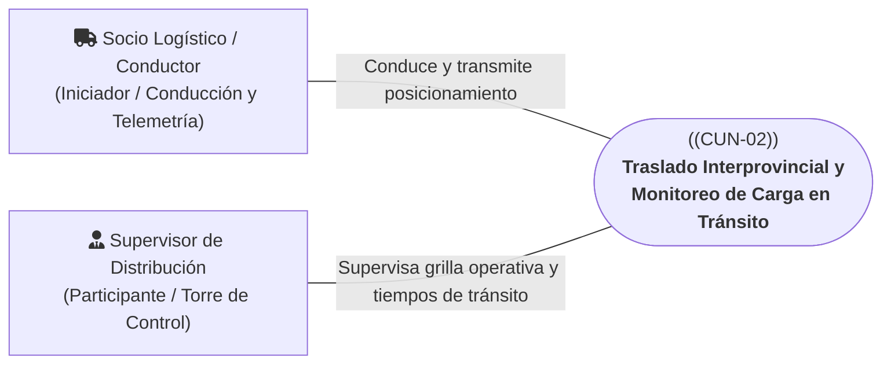
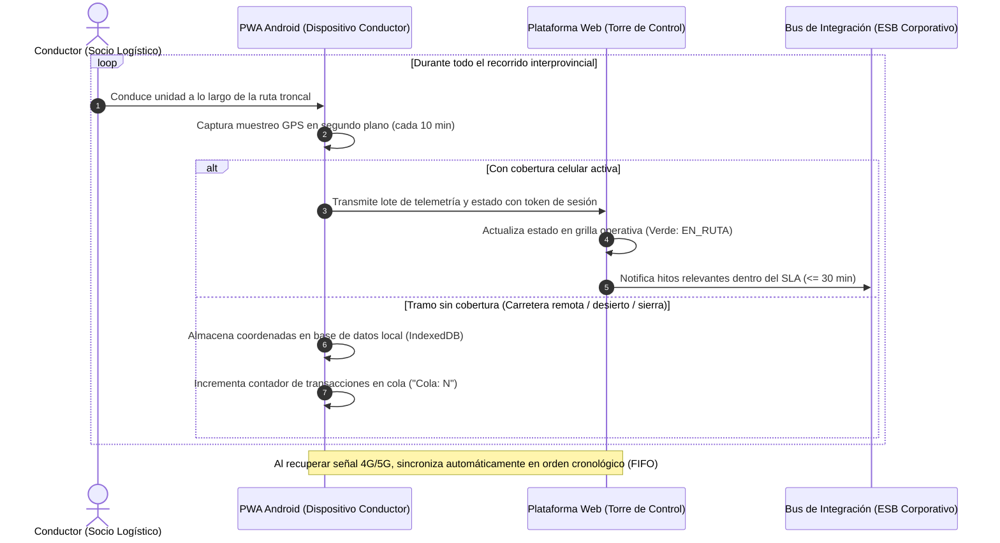

# CUN-02: Traslado Interprovincial y Monitoreo de Carga en Tránsito

> **Carpeta:** `detalles/Diagrama de Casos de Uso del Negocio (CUN)`  
> **Documento:** `03_CUN_02_TRASLADO_Y_MONITOREO.md`  
> **Proyecto Oficial:** Sistema Web y Móvil para la Gestión y Trazabilidad de Despachos y Entregas de Yanbal Perú (Y-Trace)  
> **Marco Metodológico:** Rational Unified Process (RUP) — Especificación de Casos de Uso del Negocio  
>  
> 🔗 **Documentos Vinculados:**  
> - [[00_INDICE_Y_MODELO_GENERAL_CUN]] — Modelo general de casos de uso del negocio  
> - [[01_ACTORES_DEL_NEGOCIO]] — Catálogo y fichas de actores del negocio  
> - [[07_MATRIZ_TRAZABILIDAD_CUN_VS_RF]] — Matriz de trazabilidad con requerimientos de software  

---

## 1. Ficha de Identificación del Proceso

| Atributo | Detalle |
| :--- | :--- |
| **Identificador:** | **CUN-02** |
| **Nombre del Proceso:** | **Traslado Interprovincial y Monitoreo de Carga en Tránsito** |
| **Estereotipo RUP:** | `<<business use case>>` |
| **Área Responsable:** | Gerencia de Supply Chain — Torre de Control Logístico / Socios de Transporte Asociados |
| **Alcance Operativo:** | Traslado físico nacional (Rutas troncales hacia los 24 departamentos del Perú) |
| **Objetivo de Negocio:** | Asegurar el traslado físico seguro de la carga consolidada a través del territorio nacional, garantizando la custodia ininterrumpida, el monitoreo continuo de avance del convoy y el cumplimiento de los tiempos de entrega (*Lead Time*). |

---

## 2. Actores del Negocio Participantes

* **Actor Iniciador:** **Socio Logístico / Conductor (Externo)**. Conduce la unidad de carga, custodia los bultos en ruta y porta el dispositivo móvil con la sesión operativa activa transmitiendo posicionamiento periódico.
* **Actor Participante / Supervisor:** **Supervisor de Distribución (Interno)**. Monitorea la posición, velocidad estimada y avance geográfico de las unidades desde la Torre de Control Web, fiscalizando el cumplimiento del itinerario.

---

## 3. Precondiciones del Negocio

1. El despacho se encuentra formalmente en estado `EN_RUTA` tras haber completado con éxito [[02_CUN_01_DESPACHO_Y_SALIDA_CD]].
2. La carga consolidada viaja sellada en el furgón del camión bajo custodia del socio transportista.
3. El dispositivo móvil Android del Conductor cuenta con la sesión operativa vinculada al viaje y los permisos de geolocalización activos.
4. La Torre de Control Logístico se encuentra operativa con acceso a la plataforma Web y a la grilla operativa de monitoreo.

---

## 4. Flujo Básico de Actividades del Negocio (Happy Path)

1. **Desplazamiento por la Red Vial Nacional:** El Conductor avanza por las carreteras nacionales según el plan de viaje definido hacia el departamento de destino (Lima Metropolitana: 24 horas; Provincias: hasta 7 días).
2. **Muestreo Periódico de Posicionamiento:** En segundo plano y sin distraer al conductor, la PWA Android captura periódicamente las coordenadas geográficas (latitud, longitud, estampa de tiempo) optimizadas cada 10 minutos para preservar la batería del dispositivo.
3. **Monitoreo y Seguimiento en Torre de Control:** Los paquetes de telemetría son procesados por la plataforma Web. El Supervisor de Distribución visualiza el despacho en color verde (`EN_RUTA`) con el estado y tiempos de ciclo actualizados en la grilla operativa de seguimiento.
4. **Control de Tiempos y Ciclo de Viaje:** El Supervisor y el Jefe de Distribución consultan el tiempo transcurrido desde la salida de Lurín y comparan el avance frente a los tiempos teóricos de viaje para anticipar posibles demoras.
5. **Propagación al Ecosistema Corporativo:** Los hitos operativos de paso y confirmación de ruta son comunicados al Bus de Integración de Yanbal para sincronizar los sistemas transaccionales (SAP R/3 para estatus logístico y Salesforce para Servicio al Cliente) cumpliendo con el SLA máximo de 30 minutos desde la recepción en el backend.

---

## 5. Flujos Alternativos y Resiliencia Operativa

### A1: Tránsito por Zonas de Sombra Celular Prolongada (Operación Offline-First)
* **Condición:** El vehículo ingresa a tramos desérticos, valles interandinos o zonas selváticas con pérdida total de cobertura celular durante varias horas.
* **Acción de Negocio:**
  - El Conductor continúa su marcha normalmente sin interrupciones operativas.
  - La aplicación móvil almacena de manera inmediata y atómica cada coordenada GPS en la base de datos local del teléfono (IndexedDB) en menos de 500 ms.
  - El semáforo de sincronización en la pantalla del móvil muestra un contador visual (ej. *"Cola: 5 pendientes"* en color amarillo), asegurando al conductor que sus datos están seguros en memoria local.
  - Al salir del tramo sin cobertura y detectar señal celular activa (4G/5G o Wi-Fi), un proceso en segundo plano (Service Worker) transmite automáticamente todos los registros retenidos en orden cronológico estricto (FIFO).
  - La Torre de Control recibe la ráfaga y actualiza la traza histórica completa sin perder ningún punto intermedio del trayecto.

### A2: Alerta por Detención Prolongada No Programada en Carretera
* **Condición:** El vehículo permanece inmóvil en carretera por más de 45 minutos sin reporte de llegada a destino.
* **Acción de Negocio:**
  - El sistema detecta ausencia de desplazamiento geográfico y resalta la unidad en la vista de monitoreo de la Torre de Control.
  - El Supervisor verifica si existe reporte de incidencia vial o se comunica con el coordinador de tráfico de la empresa transportista para descartar contingencias operativas.

---

## 6. Postcondiciones del Negocio

* **Estado de Éxito:**
  - La unidad de transporte arriba a las proximidades geográficas del punto de destino habiendo conservado la custodia de la carga.
  - La Torre de Control y los sistemas corporativos (SAP / Salesforce) disponen de la traza histórica y telemetría completa del viaje.
* **Estado de Fallo:**
  - Si ocurre un siniestro en ruta que impida la continuación del viaje, el proceso se desvía formalmente hacia [[04_CUN_03_GESTION_DE_INCIDENCIAS]].

---

## 7. Reglas de Negocio Vinculadas

* **RN-CUN-02.1 (Resiliencia Offline Obligatoria):** Ningún evento ni coordenada GPS puede perderse por falta de conectividad móvil; la persistencia local en el teléfono es mandatoria e inmediata.
* **RN-CUN-02.2 (SLA de Integración Corporativa):** Todo evento recibido en el backend debe ser aceptado por el Bus corporativo en un plazo máximo de 30 minutos.
* **RN-CUN-02.3 (Muestreo No Intrusivo):** El muestreo GPS se ejecuta en segundo plano a intervalos operativos de 10 minutos durante el estado `EN_RUTA` para garantizar la autonomía de la batería del smartphone durante trayectos interprovinciales largos.
* **RN-CUN-02.4 (Aislamiento de Flotas):** Cada empresa transportista y sus supervisores asociados solo pueden visualizar en la grilla operativa los despachos y vehículos correspondientes a su razón social.

---

## 8. Trazabilidad con Requerimientos Funcionales del Sistema (Y-Trace)

| ID Requerimiento | Nombre del Requerimiento Funcional | Rol en el Soporte de CUN-02 |
| :---: | :--- | :--- |
| **RF014** | Muestreo periódico de coordenadas en ruta | Captura automática de coordenadas GPS en segundo plano cada 10 min en Android. |
| **RF021** | Almacenamiento local offline en dispositivo | Persistencia en IndexedDB de coordenadas y eventos ante pérdida de señal celular. |
| **RF022** | Sincronización automática FIFO al recuperar red | Transmisión secuencial y ordenada de transacciones retenidas al reconectar. |
| **RF023** | Indicador visual de estado de sincronización | Muestra al conductor el semáforo de datos al día o contador de cola pendiente. |
| **RF024** | Consulta de avance y detalle de despachos | Permite al Supervisor auditar tiempos de traslado, origen, destino y permanencia en grilla operativa. |
| **RF029** | Publicación de eventos de estado al Bus (ESB) | Transmisión de hitos en formato JSON hacia el Bus corporativo de Yanbal. |
