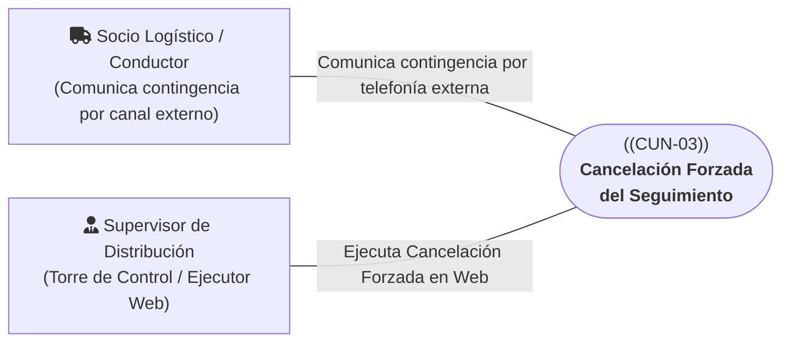
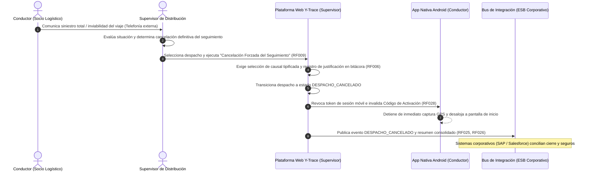

# CUN-03: Cancelación Forzada del Seguimiento

> **Carpeta:** `detalles/Diagrama de Casos de Uso del Negocio (CUN)`  
> **Documento:** `04_CUN_03_CANCELACION_FORZADA_SEGUIMIENTO.md`  
> **Proyecto Oficial:** Sistema Web y Móvil para la Gestión y Trazabilidad de Despachos y Entregas de Yanbal Perú (Y-Trace)  
> **Marco Metodológico:** Rational Unified Process (RUP) — Especificación de Casos de Uso del Negocio  
>  
> 🔗 **Documentos Vinculados:**  
> - [[00_INDICE_Y_MODELO_GENERAL_CUN]] — Modelo general de casos de uso del negocio  
> - [[01_ACTORES_DEL_NEGOCIO]] — Catálogo y fichas de actores del negocio  
> - [[07_MATRIZ_TRAZABILIDAD_CUN_VS_RF]] — Matriz de trazabilidad con requerimientos de software  

---

## 1. Ficha de Identificación del Proceso

| Atributo | Detalle |
| :--- | :--- |
| **Identificador:** | **CUN-03** |
| **Nombre del Proceso:** | **Cancelación Forzada del Seguimiento** |
| **Estereotipo RUP:** | `<<business use case>>` |
| **Área Responsable:** | Gerencia de Supply Chain — Torre de Control Logístico / Socios de Transporte Asociados |
| **Alcance Operativo:** | Contingencias viales graves, siniestros o fuerza mayor en carretera comunicadas por vías externas que impiden culminar el viaje |
| **Objetivo de Negocio:** | Concluir formal, administrativa y técnicamente el seguimiento de un despacho en Y-Trace cuando una contingencia externa insalvable imposibilite la culminación del viaje, garantizando la revocación inmediata de la sesión móvil, la invalidación del código de activación, el cese total de la telemetría GPS y la notificación consolidada al Bus corporativo. |

---

## 2. Actores del Negocio Participantes



* **Actor Iniciador:** **Socio Logístico / Conductor (Externo)**. Detecta la anomalía vial o siniestro en carretera y la comunica de forma inmediata a la Torre de Control mediante **llamada telefónica o canal operativo externo de auxilio de Yanbal (fuera de Y-Trace)**.
* **Actor Participante / Resolutor:** **Supervisor de Distribución (Interno)**. Recibe la comunicación externa, evalúa la gravedad de la situación; si el viaje no puede continuar, accede a la plataforma Web y ejecuta la **Cancelación Forzada del Seguimiento (`RF009`)**.

---

## 3. Precondiciones del Negocio

1. El despacho se encuentra formalmente en estado `EN_RUTA` ejecutándose bajo [[03_CUN_02_TRASLADO_Y_MONITOREO]].
2. Se presenta una contingencia física, vial o de fuerza mayor en carretera (avería grave, siniestro, bloqueo definitivo de vía o retención insalvable).
3. El conductor o su base de transportes se comunica por telefonía con la Torre de Control de Yanbal en Lima.

---

## 4. Flujos de Actividades del Negocio

```
              Contingencia externa
                        │
                        ▼
           Comunicación fuera de Y-Trace
                        │
                        ▼
          Supervisor evalúa la situación
                        │
             ¿Puede continuar el viaje?
             ├── Sí ──► Continúa en carretera
             │          (Y-Trace mantiene estado EN_RUTA)
             │
             └── No ──► Ejecución de Cancelación Forzada Web (RF009)
                        │
                        ▼
                 DESPACHO_CANCELADO
                        │
                        ├─► Revocación de sesión móvil e invalidación de código
                        ├─► Cese inmediato de telemetría GPS en la App
                        └─► Notificación formal al Bus corporativo (SLA <= 30 min)
```

### 4.1 Contingencia Mitigable en Carretera (El viaje continúa)

En contingencias leves o mitigables (ej. pinchazo de neumático, control vehicular, retén breve), el sistema Y-Trace **no administra módulos de incidencias ni cambia a estados intermedios**:
1. **Detención Segura:** El conductor ubica el vehículo en zona segura de la berma.
2. **Comunicación Externa:** El conductor llama por teléfono al Supervisor informando el retraso estimado.
3. **Resolución Externa:** Se brinda asistencia o se aguarda la subsanación física del inconveniente.
4. **Reanudación de Marcha:** Una vez solventada la situación, la unidad reanuda su trayecto hacia el destino. El despacho en Y-Trace se mantiene ininterrumpidamente en estado `EN_RUTA` y la telemetría GPS periódica continúa registrando la posición sin desvíos de proceso.

---

### 4.2 Flujo de Cancelación Forzada por Siniestro Total o Imposibilidad de Continuar

Cuando la contingencia vial imposibilita de forma definitiva continuar el traslado de la carga:



1. **Notificación Telefónica Externa:** El conductor o las autoridades comunican la contingencia grave a la Torre de Control de Yanbal por vía telefónica externa.
2. **Evaluación Operativa:** El Supervisor evalúa la gravedad del percance y constata que la unidad no podrá alcanzar su destino físico.
3. **Ejecución de Cancelación Forzada (`RF009`):** El Supervisor accede a la plataforma Web, selecciona el despacho afectado y activa la acción administrativa de Cancelación Forzada del Seguimiento.
4. **Registro Inmutable de Justificación:** El sistema exige la selección obligatoria de una causal tipificada de cancelación y una justificación textual, registrando la operación en la bitácora inmutable de auditoría web ([[RF006]]).
5. **Cierre Técnico Inmediato:** El sistema transiciona el despacho a `DESPACHO_CANCELADO`, revoca la sesión operativa móvil, invalida de forma definitiva el Código de Activación ([[RF028]]) y apaga los sensores de geolocalización GPS en el dispositivo del conductor.
6. **Publicación al Bus Corporativo:** El sistema genera el payload JSON canónico de `DESPACHO_CANCELADO` y el resumen consolidado de trazabilidad, publicándolos al Bus de Integración ([[RF025]], [[RF026]]) dentro del SLA $\le$ 30 minutos para su sincronización con SAP R/3 y Salesforce.

---

## 5. Postcondiciones del Negocio

* **Estado de Cancelación Formal:** El seguimiento del despacho queda formalmente cerrado en Y-Trace con estado `DESPACHO_CANCELADO`, causal tipificada y registro pericial en bitácora inmutable.
* **Cese Total de Emisión Móvil:** El smartphone del conductor deja de emitir paquetes satelitales y queda desvinculado del despacho de forma inmediata.
* **Integración Corporativa:** El Bus de Integración recibe la notificación del evento y el resumen consolidado para la gestión de seguros, reposición y conciliación externa en los sistemas corporativos.

---

## 6. Reglas de Negocio Vinculadas

* **RN-CUN-03.1 (Contingencias Externas):** Y-Trace no administra incidencias internamente ni posee submódulos de tickets o chat; toda contingencia se comunica y atiende por canales operativos externos (telefonía).
* **RN-CUN-03.2 (Justificación Inmutable Obligatoria):** Toda Cancelación Forzada exige imperativamente la selección de una causal tipificada y el ingreso de una justificación textual auditada en bitácora inmutable (`RF006`).
* **RN-CUN-03.3 (Cese Inmediato y Revocación de Credenciales):** Al transicionar a `DESPACHO_CANCELADO`, la sesión móvil queda revocada, el código efímero extinguido y la captura GPS apagada de inmediato.

---

## 7. Trazabilidad con Requerimientos Funcionales del Sistema (Y-Trace)

| ID Requerimiento | Nombre del Requerimiento Funcional | Rol en el Soporte de CUN-03 |
| :---: | :--- | :--- |
| **RF006** | Registro de Bitácora de Auditoría de Acciones Web | Registra de forma inmutable el usuario, causal y timestamp de la cancelación forzada. |
| **RF009** | Cancelación Forzada del Seguimiento del Despacho | Capacidad web que permite al Supervisor cerrar el seguimiento, revocar credenciales y cesar GPS. |
| **RF025** | Publicación de Eventos de Despacho al Bus de Integración | Publica el mensaje JSON canónico de `DESPACHO_CANCELADO` hacia el middleware corporativo (SLA $\le$ 30 min). |
| **RF026** | Envío de Resumen de Trazabilidad del Despacho al Bus | Envía la síntesis cronológica consolidada del despacho interrumpido al Bus. |
| **RF028** | Unicidad, Vigencia y Caducidad del Código de Activación | Invalida de forma automática e inmediata el código y la sesión móvil al pasar a `DESPACHO_CANCELADO`. |
