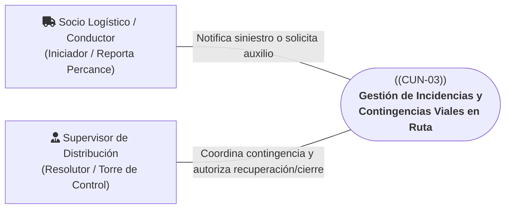
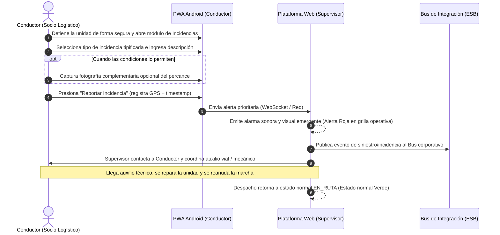

# CUN-03: Gestión de Incidencias y Contingencias Viales en Ruta

> **Carpeta:** `detalles/Diagrama de Casos de Uso del Negocio (CUN)`  
> **Documento:** `04_CUN_03_GESTION_DE_INCIDENCIAS.md`  
> **Proyecto Oficial:** Sistema Web y Móvil para la Gestión y Trazabilidad de Despachos y Entregas de Yanbal Perú (Y-Trace)  
> **Marco Metodológico:** Rational Unified Process (RUP) — Especificación de Casos de Uso del Negocio  
>  
> 🔗 **Documentos Vinculados:**  
> - [[00_INDICE_Y_MODELO_GENERAL_CUN]] — Modelo general de casos de uso del negocio  
> - [[01_ACTORES_DEL_NEGOCIO]] — Catálogo y fichas de actores del negocio  
> - [[07_MATRIZ_TRAZABILIDAD_CUN_VS_RF]] — Matriz de trazabilidad con requerimientos de software  

---

## 1. Ficha de Identificación del Proceso

| Atributo | Detalle |
| :--- | :--- |
| **Identificador:** | **CUN-03** |
| **Nombre del Proceso:** | **Gestión de Incidencias y Contingencias Viales en Ruta** |
| **Estereotipo RUP:** | `<<business use case>>` |
| **Área Responsable:** | Gerencia de Supply Chain — Torre de Control Logístico / Seguridad Patrimonial / Socios de Transporte |
| **Alcance Operativo:** | Contingencias viales y operativas ocurridas durante el traslado interprovincial |
| **Objetivo de Negocio:** | Responder de forma oportuna, estructurada y auditable ante cualquier siniestro vial, desperfecto mecánico, bloqueo de vía, asalto o falla tecnológica en ruta, coordinando el auxilio logístico y minimizando el impacto en la seguridad del personal y la carga. |

---

## 2. Actores del Negocio Participantes

* **Actor Iniciador:** **Socio Logístico / Conductor (Externo)**. Detecta y notifica el evento disruptivo desde la carretera mediante su dispositivo móvil.
* **Actor Participante / Resolutor:** **Supervisor de Distribución (Interno)**. Recibe la alerta emergente en la Torre de Control Web, evalúa la gravedad, activa auxilio vial o emite protocolos de contingencia técnica (código de recuperación o cierre forzado).

---

## 3. Precondiciones del Negocio

1. El despacho se encuentra formalmente en estado `EN_RUTA` ejecutándose bajo [[03_CUN_02_TRASLADO_Y_MONITOREO]].
2. Se presenta una contingencia física, vial o tecnológica que amenaza la continuidad del traslado o el cumplimiento del horario de entrega.
3. La Torre de Control Logístico en Lima se encuentra operativa para recibir alertas en tiempo real.

---

## 4. Flujo Básico de Actividades del Negocio (Happy Path - Incidencia Mitigable)

1. **Detección y Detención Segura:** El Conductor identifica una anomalía vial (falla mecánica leve, neumático averiado, retén policial o bloqueo parcial de vía) y ubica la unidad en zona segura.
2. **Registro de la Incidencia Tipificada:** Desde la PWA Android, el Conductor selecciona la causal tipificada correspondiente: *Falla mecánica, Accidente vial, Bloqueo de carretera, Asalto o Clima adverso*, e ingresa una breve descripción del suceso.
3. **Evidencia Operativa y Fotografía Complementaria:** El sistema registra de manera atómica la fecha, hora y ubicación GPS exacta del percance. Si las condiciones de seguridad lo permiten, el Conductor adjunta una fotografía complementaria (la ausencia de foto nunca bloquea el reporte).
4. **Disparo de Alerta en Torre de Control:** La plataforma Web recibe la notificación inmediata vía WebSockets, disparando una alarma sonora y visual en la pantalla del Supervisor y cambiando el indicador del despacho a color rojo (`CON_INCIDENCIA`).
5. **Notificación Corporativa Preventiva:** El sistema publica de inmediato el evento de incidencia grave al Bus de Integración para poner en sobreaviso a los sistemas adyacentes (SAP / Salesforce) sobre un posible retraso logístico.
6. **Coordinación y Reanudación de Marcha:** El Supervisor coordina el soporte necesario con la empresa transportista o autoridades. Una vez resuelto el problema, la unidad reanuda el trayecto y la Torre de Control normaliza el estado del despacho a `EN_RUTA` (verde).

---

## 5. Flujos Alternativos y Contingencias Críticas

### A1: Sustitución de Dispositivo por Avería o Pérdida en Ruta (Código de Recuperación)
* **Condición:** El teléfono del conductor se apaga definitivamente por batería destruida, caída, rotura de pantalla o falla de hardware mientras el vehículo se encuentra en pleno traslado interprovincial (`EN_RUTA`).
* **Acción de Negocio:**
  - El Conductor contacta telefónicamente al Supervisor desde un número de auxilio o el teléfono del copiloto.
  - El Supervisor valida la identidad y autenticidad del requerimiento y genera desde la plataforma Web un **Código de Activación de Recuperación** de un solo uso para dicho despacho en estado `EN_RUTA`.
  - El Conductor abre la PWA de Y-Trace en el nuevo dispositivo Android e ingresa el código de recuperación.
  - El sistema revoca inmediatamente la sesión del dispositivo averiado, vincula el nuevo smartphone al mismo despacho y restaura la operación sin reiniciar el viaje ni perder los datos históricos transmitidos previamente.

### A2: Cierre Administrativo Forzado por Siniestro Total o Fuerza Mayor
* **Condición:** Ocurre un siniestro grave que destruye la carga (volcadura, incendio de furgón, robo total a mano armada o corte definitivo de carretera por derrumbe) que imposibilita físicamente continuar el viaje hasta el punto de destino.
* **Acción de Negocio:**
  - El Supervisor de Distribución toma conocimiento formal del siniestro mediante la policía de carreteras o el transportista.
  - El Supervisor accede a la plataforma Web y ejecuta la acción de **Cierre Forzado de Despacho** (`RF009`).
  - El sistema exige obligatoriamente la selección de una causal tipificada de siniestro y el ingreso de un texto de justificación administrativa.
  - La acción se graba en la bitácora inmutable de auditoría, el despacho transiciona a `FINALIZADO` con causa justificada y se revoca inmediatamente cualquier sesión móvil o código de activación activo.
  - El sistema envía el resumen final de trazabilidad del siniestro al Bus de Integración para que Seguridad Patrimonial y Calidad inicien los reclamos de seguros y la preparación de un nuevo despacho de reposición urgente desde planta.

---

## 6. Postcondiciones del Negocio

* **Estado de Resolución Normal:** La unidad vehicular supera el percance y continúa su avance hacia el destino final bajo [[03_CUN_02_TRASLADO_Y_MONITOREO]].
* **Estado de Contingencia Tecnológica:** El despacho continúa bajo supervisión satelital empleando un nuevo dispositivo móvil Android validado.
* **Estado de Siniestro Total:** El viaje queda formalmente cancelado/cerrado de forma administrativa en bitácora inmutable, activando los protocolos de reclamos de seguros y reposición industrial.

---

## 7. Reglas de Negocio Vinculadas

* **RN-CUN-03.1 (Evidencia Fotográfica No Bloqueante):** La fotografía constituye un respaldo complementario opcional. En caso de accidentes graves o situaciones de peligro, la falta de fotografía no anula ni bloquea el registro operativo de la incidencia.
* **RN-CUN-03.2 (Código de Recuperación Estricto):** Un código de recuperación solo puede ser generado por un Supervisor autorizado y aplica exclusivamente a despachos que ya se encuentren en estado `EN_RUTA`. Su uso revoca al instante el token del dispositivo anterior.
* **RN-CUN-03.3 (Inmutabilidad de Cierres Forzados):** Todo cierre forzado debe quedar grabado con marca temporal, identificación del supervisor y causa justificada en la bitácora inmutable, impidiendo modificaciones retroactivas.

---

## 8. Trazabilidad con Requerimientos Funcionales del Sistema (Y-Trace)

| ID Requerimiento | Nombre del Requerimiento Funcional | Rol en el Soporte de CUN-03 |
| :---: | :--- | :--- |
| **RF008** | Emisión de código de recuperación autorizado | Permite al Supervisor generar el código de un solo uso para sustituir el móvil averiado en ruta. |
| **RF009** | Cierre forzado del despacho en contingencia | Permite al Supervisor terminar administrativamente un viaje interrumpido por siniestro total. |
| **RF018** | Gestión de evidencias y fotografía complementaria | Permite adjuntar fotos opcionales del siniestro sin bloquear el envío del reporte. |
| **RF019** | Envío de reporte de incidencia en ruta | Permite al conductor clasificar y reportar siniestros viales con coordenadas GPS inmediatas. |
| **RF026** | Recepción de alertas de incidencias en Torre Web | Dispara notificaciones sonoras y visuales emergentes en la consola de supervisión. |
| **RF030** | Publicación de evento de siniestro al Bus (ESB) | Comunica contingencias graves al Bus corporativo para alertar a SAP y Salesforce. |
