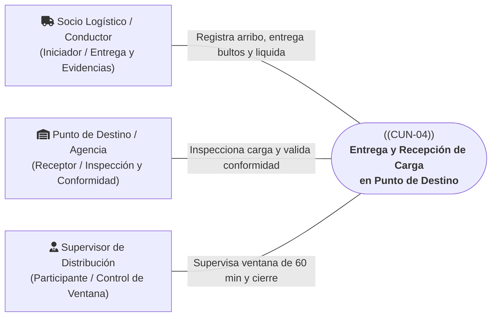
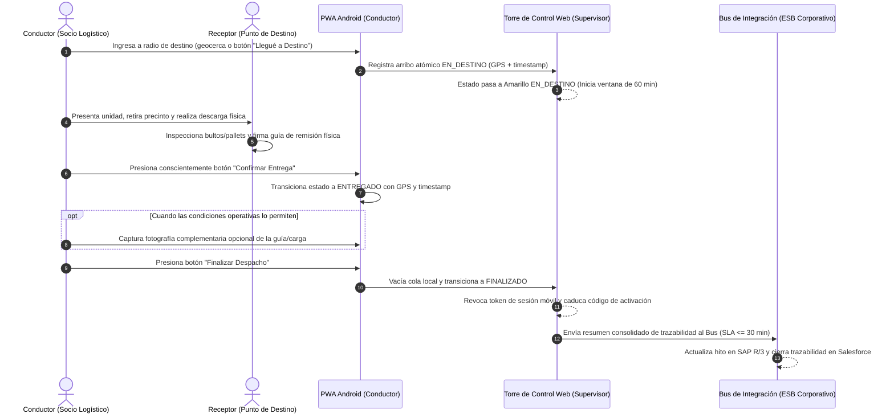

# CUN-04: Entrega y Recepción de Carga en Punto de Destino

> **Carpeta:** `detalles/Diagrama de Casos de Uso del Negocio (CUN)`  
> **Documento:** `05_CUN_04_ENTREGA_Y_RECEPCION_DESTINO.md`  
> **Proyecto Oficial:** Sistema Web y Móvil para la Gestión y Trazabilidad de Despachos y Entregas de Yanbal Perú (Y-Trace)  
> **Marco Metodológico:** Rational Unified Process (RUP) — Especificación de Casos de Uso del Negocio  
>  
> 🔗 **Documentos Vinculados:**  
> - [[00_INDICE_Y_MODELO_GENERAL_CUN]] — Modelo general de casos de uso del negocio  
> - [[01_ACTORES_DEL_NEGOCIO]] — Catálogo y fichas de actores del negocio  
> - [[07_MATRIZ_TRAZABILIDAD_CUN_VS_RF]] — Matriz de trazabilidad con requerimientos de software  

---

## 1. Ficha de Identificación del Proceso

| Atributo                 | Detalle                                                                                                                                                                                                                                                    |
| :----------------------- | :--------------------------------------------------------------------------------------------------------------------------------------------------------------------------------------------------------------------------------------------------------- |
| **Identificador:**       | **CUN-04**                                                                                                                                                                                                                                                 |
| **Nombre del Proceso:**  | **Entrega y Recepción de Carga en Punto de Destino**                                                                                                                                                                                                       |
| **Estereotipo RUP:**     | `<<business use case>>`                                                                                                                                                                                                                                    |
| **Área Responsable:**    | Gerencia de Supply Chain — Puntos de Distribución Regionales / Socios de Transporte Asociados                                                                                                                                                              |
| **Alcance Operativo:**   | Recepción formal B2B en destino (Agencia Comercial / Centro Secundario Departamental)                                                                                                                                                                      |
| **Objetivo de Negocio:** | Certificar el arribo físico de la unidad, realizar la inspección técnica de la carga consolidada, formalizar la entrega conforme o el rechazo tipificado mediante evidencias operativas, y cerrar el ciclo de viaje revocando las credenciales temporales. |

---

## 2. Actores del Negocio Participantes

* **Actor Iniciador:** **Socio Logístico / Conductor (Externo)**. Conduce la unidad a la agencia de destino, registra la llegada física, entrega los pallets/bultos y captura la evidencia operativa de cierre.
* **Actor Receptor / Participante:** **Punto de Destino / Agencia Receptora (Externo)**. Encargado de recepción que inspecciona la integridad exterior de los precintos y emite la conformidad o rechazo formal de la carga.
* **Actor de Supervisión:** **Supervisor de Distribución (Interno)**. Monitorea desde la Torre de Control que la entrega se formalice dentro de la ventana operativa de 60 minutos tras el arribo.

---

## 3. Precondiciones del Negocio

1. El despacho se encuentra en estado `EN_RUTA` habiendo completado el trayecto nacional bajo [[03_CUN_02_TRASLADO_Y_MONITOREO]].
2. La unidad de transporte se encuentra físicamente posicionada dentro del radio geográfico de la agencia o almacén de destino.
3. El personal de recepción del punto de destino se encuentra habilitado para recibir y descargar la mercadería.

---

## 4. Flujo Básico de Actividades del Negocio (Happy Path - Entrega Conforme)

1. **Acreditación de Arribo Físico (`EN_DESTINO`):** Al aproximarse a las instalaciones, la PWA detecta automáticamente la geocerca de la agencia (o el Conductor presiona *"Llegué a Destino"*). El sistema registra de manera atómica la fecha, hora y coordenadas GPS exactas, transicionando a `EN_DESTINO`. **Este evento acredita presencia física pero NO convalida la entrega de mercadería.**
2. **Descarga e Inspección Técnica:** El Conductor y el personal de la Agencia Receptora proceden con la apertura del furgón, verificación de precintos numerados y descarga física de los bultos consolidados.
3. **Conformidad de Recepción:** El personal del Punto de Destino coteja las cantidades declaradas en la guía física de remisión y suscribe el comprobante de recepción con sello y firma de conformidad.
4. **Confirmación Manual de Entrega (`ENTREGADO`):** Para evitar entregas ficticias o automatizadas por simple proximidad, el Conductor debe presionar manualmente *"Confirmar Entrega"*. El sistema genera el evento inmutable `ENTREGADO` con estampa temporal y geolocalización certificada.
5. **Evidencia Fotográfica Complementaria:** Si las condiciones de iluminación y operativas lo permiten, el Conductor toma una fotografía de la guía sellada o de la carga estibada. La foto es comprimida y respaldada en Cloud Storage de manera asíncrona.
6. **Liquidación y Cierre de Viaje (`FINALIZADO`):** El Conductor verifica que no existan eventos pendientes en la cola local de sincronización y presiona *"Finalizar Despacho"*. El sistema transiciona el viaje a `FINALIZADO`.
7. **Revocación de Accesos y Propagación Corporativa:**
   - El servidor central invalida y revoca inmediatamente el token de sesión móvil y el Código de Activación.
   - La PWA purga los datos temporales del viaje de la base de datos local y apaga los sensores GPS (**Condición Mandatoria de Cese de Transmisión**).
   - El sistema transmite el resumen consolidado de trazabilidad al Bus corporativo de Yanbal (SLA $\le$ 30 min), notificando a SAP R/3 (conciliación logística de transporte) y a Salesforce (cierre formal de trazabilidad).

---

## 5. Flujos Alternativos y Excepciones del Negocio

### A1: Rechazo de Carga o Local Cerrado (`NO_ENTREGADO`)
* **Condición:** La agencia de destino se encuentra cerrada fuera de horario, el acceso vial está bloqueado o el receptor rechaza formalmente la carga por discrepancias graves en precintos.
* **Acción de Negocio:**
  - El Conductor accede al módulo de entrega en la PWA y presiona *"Registrar No Entrega"*.
  - Selecciona la causal tipificada correspondiente: *Destino cerrado, Rechazo formal de carga o Acceso bloqueado*.
  - El sistema registra atómicamente el estado `NO_ENTREGADO` con coordenadas GPS y estampa de tiempo.
  - El Conductor puede adjuntar fotografía complementaria opcional del local cerrado o documento de rechazo.
  - El Conductor presiona *"Finalizar Despacho"*, cerrando el viaje en `FINALIZADO` y revocando la sesión.
  - **Directriz de Retorno (Frontera B2B):** Y-Trace concluye el seguimiento de ese despacho. Si la Gerencia de Operaciones determina que la carga debe regresar a Lima, el retorno se coordina y gestiona como un nuevo despacho corporativo independiente. Y-Trace no muta el viaje original en un circuito de logística inversa.

### A2: Alerta por Vencimiento de Ventana Operativa de 60 Minutos en Destino
* **Condición:** El vehículo arriba a destino (`EN_DESTINO`), pero transcurren más de 60 minutos sin que el Conductor confirme la entrega (`ENTREGADO`) ni reporte el rechazo (`NO_ENTREGADO`).
* **Acción de Negocio:**
  - El sistema emite automáticamente una alerta sonora y visual en la Torre de Control Web para advertir una retención excesiva de la unidad en el andén de descarga.
  - El Supervisor de Distribución se comunica telefónicamente con la agencia o el transportista para averiguar la causa de la demora.
  - En caso de contingencia comprobada o abandono de la aplicación por el conductor, el Supervisor puede ejecutar el cierre forzado justificado en bitácora inmutable (`RF009`).

---

## 6. Postcondiciones del Negocio

* **Estado de Entrega Exitosa:**
  - La carga queda bajo custodia formal del Punto de Destino (Agencia regional).
  - El despacho pasa a `FINALIZADO` con evidencias geoespaciales y fotográficas certificadas.
  - El transportista queda desvinculado del viaje y su aplicación móvil inhabilitada para transmitir.
* **Estado de Rechazo:**
  - El despacho concluye como `NO_ENTREGADO`, con causal tipificada auditada en bitácora.
  - La carga queda retenida en custodia del transportista a la espera de la orden de un nuevo despacho de retorno.

---

## 7. Reglas de Negocio Vinculadas

* **RN-CUN-04.1 (Regla Híbrida de Entrega):** La geocerca (`EN_DESTINO`) solo prueba presencia física geoespacial; la entrega (`ENTREGADO`) exige imperativamente la confirmación manual consciente del Conductor.
* **RN-CUN-04.2 (Evidencia Fotográfica Opcional):** La fotografía complementaria nunca condiciona ni bloquea la finalización formal del despacho.
* **RN-CUN-04.3 (Cese Mandatorio de Transmisión):** Una vez que el despacho pasa a `FINALIZADO`, la aplicación móvil queda terminantemente bloqueada para emitir coordenadas o eventos posteriores.
* **RN-CUN-04.4 (No Conciliación Económica):** Y-Trace entrega la trazabilidad operativa consolidada; la liquidación monetaria y facturación de fletes corresponde exclusivamente a SAP ERP.

---

## 8. Trazabilidad con Requerimientos Funcionales del Sistema (Y-Trace)

| ID Requerimiento | Nombre del Requerimiento Funcional | Rol en el Soporte de CUN-04 |
| :---: | :--- | :--- |
| **RF015** | Registro de llegada por geocerca o manual | Registra el arribo a destino pasando a `EN_DESTINO` con coordenadas GPS atómicas. |
| **RF016** | Confirmación manual de entrega en destino | Acción manual obligatoria del conductor que formaliza el estado `ENTREGADO`. |
| **RF017** | Registro de despacho no entregado o rechazado | Formaliza el estado `NO_ENTREGADO` bajo causales operativas tipificadas. |
| **RF018** | Gestión de evidencias y fotografía complementaria | Asocia coordenadas, timestamp y fotografías seguras opcionales en Cloud Storage. |
| **RF020** | Cierre de despacho y finalización de sesión | Valida el vaciado de cola local, pasa a `FINALIZADO` y revoca credenciales móviles. |
| **RF029** | Publicación de eventos de estado al Bus (ESB) | Comunica los estados finales de entrega hacia el ecosistema central de Yanbal. |
| **RF031** | Envío de resumen de trazabilidad del despacho | Transmite al Bus la síntesis consolidada de hitos y tiempos del viaje liquidado. |
| **RF033** | Revocación inmediata de código y sesión al cierre | Elimina el token de sesión y extingue la validez del código efímero de activación. |
