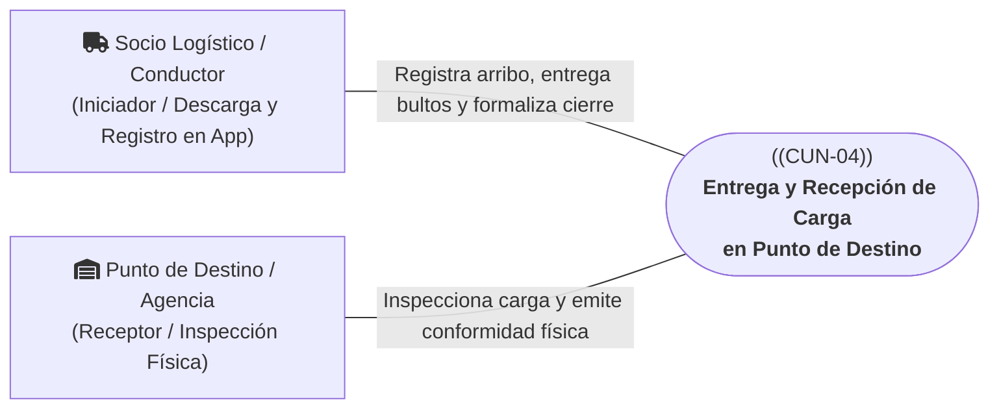
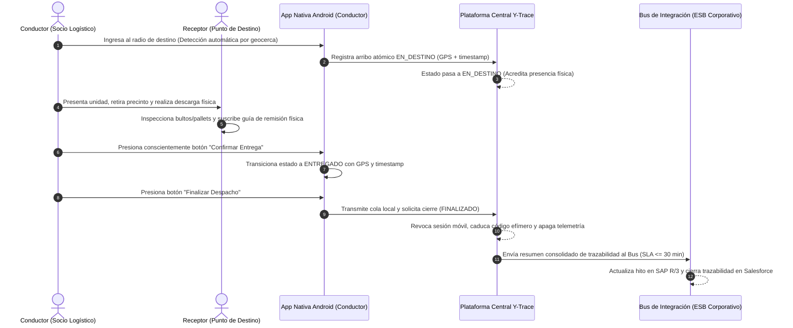

# CUN-04: Entrega y Recepción de Carga en Punto de Destino

> **Carpeta:** `detalles/Diagrama de Casos de Uso del Negocio (CUN)`  
> **Documento:** `05_CUN_04_ENTREGA_Y_RECEPCION_DESTINO.md`  
> **Proyecto Oficial:** Sistema Web y Móvil para la Gestión y Trazabilidad de Despachos y Entregas de Yanbal Perú (Y-Trace)  
> **Marco Metodológico:** Rational Unified Process (RUP) — Especificación de Casos de Uso del Negocio  
>  
> 🔗 **Documentos Vinculados:**  
> - [[00_INDICE_Y_MODELO_GENERAL_CUN]] — Modelo general de casos de uso del negocio  
> - [[01_ACTORES_DEL_NEGOCIO]] — Catálogo y fichas de actores del negocio  
> - [[07_MATRIZ_TRAZABILIDAD_CUN_VS_RF]] — Matriz de trazabilidad con requerimientos de software  

---

## 1. Ficha de Identificación del Proceso

| Atributo                 | Detalle                                                                                                                                                                                                                                                    |
| :----------------------- | :--------------------------------------------------------------------------------------------------------------------------------------------------------------------------------------------------------------------------------------------------------- |
| **Identificador:**       | **CUN-04**                                                                                                                                                                                                                                                 |
| **Nombre del Proceso:**  | **Entrega y Recepción de Carga en Punto de Destino**                                                                                                                                                                                                       |
| **Estereotipo RUP:**     | `<<business use case>>`                                                                                                                                                                                                                                    |
| **Área Responsable:**    | Gerencia de Supply Chain — Puntos de Distribución Regionales / Socios de Transporte Asociados                                                                                                                                                              |
| **Alcance Operativo:**   | Recepción física B2B en destino (Agencia Comercial / Centro Secundario Departamental) y formalización de cierre de seguimiento                                                                                                                             |
| **Objetivo de Negocio:** | Certificar el arribo físico de la unidad mediante geocerca, realizar la inspección física de la carga consolidada, formalizar la entrega conforme o el rechazo tipificado mediante datos operativos estructurados (coordenadas GPS y sellos de tiempo en la App Móvil), y cerrar el ciclo de viaje revocando las credenciales temporales. |

---

## 2. Actores del Negocio Participantes

* **Actor Iniciador:** **Socio Logístico / Conductor (Externo)**. Conduce la unidad a la agencia de destino, acredita la llegada física por geocerca, entrega los pallets/bultos, registra la confirmación (`ENTREGADO` o `NO_ENTREGADO`) en la App Nativa Android y ejecuta la finalización del seguimiento.
* **Actor Receptor / Participante:** **Punto de Destino / Agencia Receptora (Externo)**. Encargado de recepción que recibe físicamente al conductor, inspecciona la integridad exterior de los precintos y bultos, y suscribe la conformidad en el comprobante físico de recepción. **No interactúa directamente con el sistema Y-Trace.**

---

## 3. Precondiciones del Negocio

1. El despacho se encuentra en estado `EN_RUTA` habiendo completado el trayecto interprovincial bajo [[03_CUN_02_TRASLADO_Y_MONITOREO]].
2. La unidad de transporte se encuentra físicamente posicionada dentro del radio geográfico de la agencia o almacén de destino.
3. El personal de recepción del punto de destino se encuentra disponible en las instalaciones para la descarga e inspección de mercadería.

---

## 4. Flujo Básico de Actividades del Negocio (Happy Path - Entrega Conforme)

1. **Acreditación de Arribo Físico (`EN_DESTINO`):** Al aproximarse e ingresar al radio perimétrico configurado de la agencia receptora, la App Nativa detecta automáticamente la geocerca. El sistema registra de manera atómica la fecha, hora y coordenadas GPS exactas, transicionando a `EN_DESTINO`. **Este evento acredita presencia física mediante geocerca pero NO convalida la entrega de mercadería.**
2. **Descarga e Inspección Física:** El Conductor y el personal del Punto de Destino proceden con la apertura del furgón, verificación de precintos numerados y descarga física de los bultos consolidados.
3. **Conformidad de Recepción Física:** El personal del Punto de Destino coteja las cantidades declaradas en la guía física de remisión y suscribe el comprobante de recepción con sello y firma física.
4. **Confirmación Manual de Entrega en Sistema (`ENTREGADO`):** Para evitar entregas ficticias o automatizadas por simple proximidad geográfica, el Conductor debe presionar conscientemente *"Confirmar Entrega"* en la App Nativa Android (`RF016`). El sistema genera el evento inmutable `ENTREGADO` con estampa de tiempo y geolocalización satelital certificada, sin capturar fotografías ni POD multimedia.
5. **Finalización y Cierre de Seguimiento (`FINALIZADO`):** El Conductor verifica que no existan eventos pendientes en la cola local de sincronización y presiona *"Finalizar Despacho"* (`RF018`). El sistema transiciona el viaje a `FINALIZADO`, concluyendo formalmente el seguimiento operativo en Y-Trace.
6. **Revocación de Accesos y Propagación Corporativa:**
   - El servidor central invalida y revoca inmediatamente el token de sesión móvil y el Código de Activación efímero (`RF028`).
   - La App Nativa purga los datos de sesión local y apaga de forma inmediata los sensores GPS (**Condición Mandatoria de Cese de Transmisión**).
   - El sistema transmite el resumen consolidado de trazabilidad al Bus corporativo de Yanbal dentro del SLA $\le$ 30 min (`RF025`, `RF026`), notificando a SAP R/3 y Salesforce.

---

## 5. Flujos Alternativos y Excepciones del Negocio

### A1: Rechazo de Carga o Destino Cerrado (`NO_ENTREGADO`)
* **Condición:** La agencia de destino se encuentra cerrada fuera de horario, el acceso vial está bloqueado o el receptor rechaza formalmente la carga por discrepancias en precintos o daños visibles exteriores.
* **Acción de Negocio:**
  - El Conductor accede a la App Nativa Android y selecciona *"Registrar No Entrega"* (`RF017`).
  - Selecciona la causal tipificada correspondiente: *Destino cerrado, Rechazo formal de carga o Acceso bloqueado*.
  - El sistema registra atómicamente el estado `NO_ENTREGADO` con coordenadas GPS y estampa de tiempo, sin captura de fotografías.
  - El Conductor presiona *"Finalizar Despacho"*, cerrando el seguimiento en `FINALIZADO` y revocando la sesión móvil (`RF018`, `RF028`).
  - **Directriz de Retorno (Frontera B2B):** Y-Trace concluye formalmente el seguimiento de ese despacho. Si la Gerencia de Operaciones determina que la carga debe regresar a Lima o ser redirigida, el traslado posterior se gestiona como un nuevo despacho independiente. Y-Trace no muta el viaje original en un circuito de logística inversa.

---

## 6. Postcondiciones del Negocio

* **Estado de Entrega Exitosa:**
  - La carga queda bajo custodia física formal del Punto de Destino.
  - El despacho pasa a `FINALIZADO` en Y-Trace con datos geoespaciales y marcas de tiempo certificadas.
  - El transportista queda desvinculado del viaje y su aplicación móvil inhabilitada para transmitir.
* **Estado de Rechazo:**
  - El despacho concluye como `NO_ENTREGADO`, con causal tipificada auditada en el sistema.
  - La carga queda bajo custodia del transportista a la espera de instrucciones corporativas externas.

---

## 7. Reglas de Negocio Vinculadas

* **RN-CUN-04.1 (Regla Híbrida de Entrega):** La geocerca (`EN_DESTINO`) solo acredita presencia física geoespacial; la entrega (`ENTREGADO`) exige imperativamente la confirmación manual consciente del Conductor en la aplicación móvil.
* **RN-CUN-04.2 (Trazabilidad Estructurada Sin Fotografías):** La trazabilidad operativa se certifica exclusivamente mediante coordenadas GPS satelitales, marcas de tiempo y causales tipificadas, sin capturar ni almacenar fotografías ni POD multimedia.
* **RN-CUN-04.3 (Cese Mandatorio de Transmisión):** Una vez que el despacho transiciona a `FINALIZADO`, la aplicación móvil apaga inmediatamente los sensores de ubicación y queda terminantemente bloqueada para emitir coordenadas o eventos posteriores.
* **RN-CUN-04.4 (No Conciliación Económica):** Y-Trace entrega la trazabilidad operativa consolidada; la liquidación monetaria de fletes y penalidades corresponde a los sistemas ERP corporativos.

---

## 8. Trazabilidad con Requerimientos Funcionales del Sistema (Y-Trace)

| ID Requerimiento | Nombre del Requerimiento Funcional | Rol en el Soporte de CUN-04 |
| :---: | :--- | :--- |
| **RF015** | Registro de Llegada al Punto de Destino por Geocerca | Registra el arribo a destino pasando a `EN_DESTINO` con coordenadas GPS atómicas. |
| **RF016** | Confirmación de Recepción / Entrega del Despacho Completo | Acción manual obligatoria del conductor que formaliza el estado `ENTREGADO` sin fotos. |
| **RF017** | Registro de No Entrega o Rechazo de Despacho en Destino | Formaliza el estado `NO_ENTREGADO` bajo causales operativas tipificadas sin fotos. |
| **RF018** | Finalización y Cierre del Seguimiento del Despacho | Valida el vaciado de cola local, transiciona a `FINALIZADO` y cesa telemetría GPS. |
| **RF025** | Publicación de Eventos de Despacho al Bus de Integración | Comunica los estados finales de entrega (`ENTREGADO` / `NO_ENTREGADO`) hacia el Bus (SLA $\le$ 30 min). |
| **RF026** | Envío de Resumen de Trazabilidad del Despacho al Bus | Transmite al Bus la síntesis consolidada de hitos y tiempos del viaje finalizado. |
| **RF028** | Unicidad, Vigencia y Caducidad del Código de Activación | Elimina el token de sesión y extingue la validez del código efímero de activación. |
