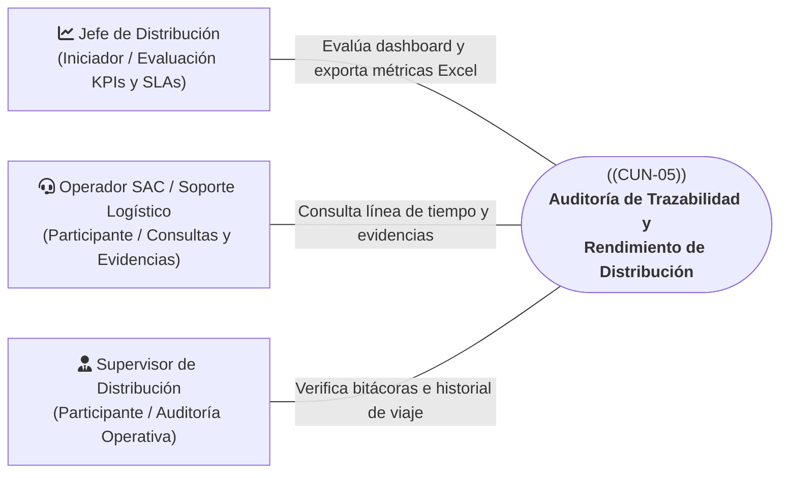
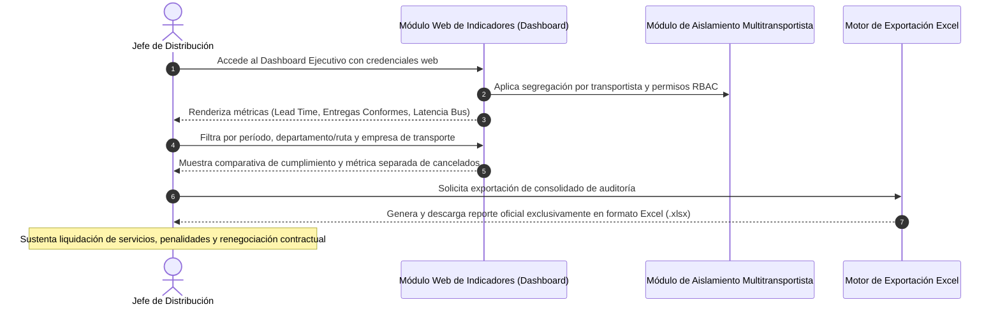
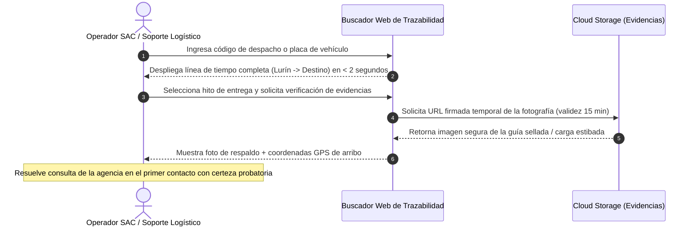

# CUN-05: Auditoría de Trazabilidad y Rendimiento de Distribución

> **Carpeta:** `detalles/Diagrama de Casos de Uso del Negocio (CUN)`  
> **Documento:** `06_CUN_05_AUDITORIA_Y_RENDIMIENTO.md`  
> **Proyecto Oficial:** Sistema Web y Móvil para la Gestión y Trazabilidad de Despachos y Entregas de Yanbal Perú (Y-Trace)  
> **Marco Metodológico:** Rational Unified Process (RUP) — Especificación de Casos de Uso del Negocio  
>  
> 🔗 **Documentos Vinculados:**  
> - [[00_INDICE_Y_MODELO_GENERAL_CUN]] — Modelo general de casos de uso del negocio  
> - [[01_ACTORES_DEL_NEGOCIO]] — Catálogo y fichas de actores del negocio  
> - [[07_MATRIZ_TRAZABILIDAD_CUN_VS_RF]] — Matriz de trazabilidad con requerimientos de software  

---

## 1. Ficha de Identificación del Proceso

| Atributo | Detalle |
| :--- | :--- |
| **Identificador:** | **CUN-05** |
| **Nombre del Proceso:** | **Auditoría de Trazabilidad y Rendimiento de Distribución** |
| **Estereotipo RUP:** | `<<business use case>>` |
| **Área Responsable:** | Gerencia de Supply Chain — Jefatura de Distribución / Servicio al Cliente (SAC) |
| **Alcance Operativo:** | Auditoría post-entrega, evaluación de proveedores de transporte y análisis analítico de KPIs |
| **Objetivo de Negocio:** | Proporcionar visibilidad analítica integral sobre el cumplimiento de los tiempos de entrega (*Lead Time*), evaluar el desempeño operativo de los socios logísticos terceros y resolver consultas operacionales de trazabilidad con evidencias fidedignas y certificadas. |

---

## 2. Actores del Negocio Participantes

* **Actor Iniciador:** **Jefe de Distribución (Interno)**. Evalúa el desempeño logístico global de la red de transporte, analiza el cumplimiento de compromisos contractuales y califica a los contratistas.
* **Actores Participantes:**
  - **Operador SAC / Soporte Logístico (Interno):** Atiende requerimientos y consultas de seguimiento de áreas internas y agencias comerciales, utilizando la cronología de hitos y fotos seguras.
  - **Supervisor de Distribución (Interno):** Audita eventos pasados, demoras justificadas y bitácoras inmutables de auditoría.

---

## 3. Precondiciones del Negocio

1. Existen despachos registrados en el sistema Y-Trace que han completado su ciclo operativo (`FINALIZADO`) o que se encuentran en tránsito.
2. Los eventos de trazabilidad, marcas de tiempo y evidencias operativas han sido debidamente persistidos en la base de datos central y en Cloud Storage.
3. Los usuarios internos cuentan con credenciales corporativas autorizadas y perfiles RBAC específicos para acceder a los módulos de auditoría y tableros de indicadores.

---

## 4. Flujos de Actividades del Negocio

### 4.1 Flujo Táctico: Evaluación Estratégica de Rendimiento y SLAs (Jefatura de Distribución)

1. **Acceso al Tablero Ejecutivo:** El Jefe de Distribución accede a la plataforma Web y visualiza el consolidado gráfico de los indicadores clave de rendimiento (KPIs) de transporte nacional.
2. **Evaluación de Tiempos de Ciclo (*Lead Time*):** Analiza los tiempos reales de traslado desde la salida del andén en Lurín hasta la entrega en destino frente a la promesa de servicio (24 horas para Lima Metropolitana; hasta 7 días para provincias).
3. **Métrica Separada de Cancelaciones:** El sistema asegura que los despachos cancelados administrativamente antes de la salida no distorsionen los promedios de *Lead Time* ni de puntualidad, presentándolos en una métrica analítica separada de cancelación.
4. **Fiscalización Comparativa de Flotas:** Gracias al aislamiento multitransportista, el Jefe compara objetivamente el rendimiento, tasa de puntualidad y siniestralidad entre las distintas empresas de transporte asociadas a Yanbal.
5. **Generación de Reportes Oficiales:** El Jefe exporta la data analítica consolidada exclusivamente en formato Excel para sustentar la liquidación formal del servicio contratado, aplicar penalidades por demoras injustificadas o premiar la puntualidad de los socios.

---

### 4.2 Flujo de Soporte: Consulta de Trazabilidad Rápida y Resolución de Consultas (SAC)

1. **Recepción de Consulta Operativa:** Una agencia regional o área comercial requiere confirmar la situación exacta de un cargamento programado.
2. **Búsqueda Instantánea:** El Operador SAC ingresa el código alfanumérico del despacho o la placa vehicular en el buscador web de Y-Trace.
3. **Inspección de la Línea de Tiempo (*Timeline*):** En menos de 2 segundos, el sistema despliega la cronología completa del viaje:
   - Hito de disponibilidad y emisión de código en CD Lurín.
   - Hito formal de salida física (`EN_RUTA`).
   - Puntos de paso y coordenadas de telemetría en carretera.
   - Registro atómico de arribo (`EN_DESTINO`).
   - Confirmación formal de entrega (`ENTREGADO` o `NO_ENTREGADO` con motivo tipificado).
   - Liquidación y cierre del despacho (`FINALIZADO`).
4. **Verificación de Evidencias Certificadas:** El operador visualiza las coordenadas GPS capturadas al momento de la entrega física y accede a la fotografía complementaria de respaldo alojada en Cloud Storage mediante enlaces firmados temporales (15 minutos de vigencia).
5. **Cierre de Caso:** El operador atiende la consulta y desvirtúa reclamos falsos de pérdida o extravío sin requerir llamadas telefónicas a los conductores en ruta.

---

## 5. Postcondiciones del Negocio

* **Nivel de Servicio Calificado:** La Jefatura de Distribución cuenta con el sustento analítico auditable para evaluar el desempeño de la flota y aplicar acuerdos contractuales.
* **Consultas Resueltas:** Las áreas comerciales y agencias obtienen respuestas inmediatas y certificadas sobre la recepción de mercadería con evidencias geoespaciales.

---

## 6. Reglas de Negocio Vinculadas

* **RN-CUN-05.1 (Aislamiento Multitransportista):** Los supervisores y usuarios vinculados a una empresa transportista tercera específica jamás podrán visualizar datos de flotas o despachos de empresas competidoras.
* **RN-CUN-05.2 (Tratamiento Riguroso de Cancelados):** Los despachos en estado `CANCELADO` quedan taxativamente excluidos del cálculo de *Lead Time* y puntualidad, computándose en un indicador independiente de cancelación.
* **RN-CUN-05.3 (Formato Único de Exportación):** Toda exportación de reportes analíticos consolidados se realiza estrictamente en formato Excel (.xlsx).
* **RN-CUN-05.4 (Seguridad de Evidencias en Nube):** Las fotografías de respaldo en Cloud Storage no poseen URLs públicas permanentes; se consultan mediante enlaces firmados temporales con caducidad máxima de 15 minutos.

---

## 7. Trazabilidad con Requerimientos Funcionales del Sistema (Y-Trace)

| ID Requerimiento | Nombre del Requerimiento Funcional | Rol en el Soporte de CUN-05 |
| :---: | :--- | :--- |
| **RF025** | Visualización de evidencias y enlace a Cloud Storage | Permite consultar coordenadas GPS y enlaces seguros temporales a fotos de respaldo. |
| **RF027** | Búsqueda por despacho y visualización de timeline | Despliega en menos de 2 segundos la cronología completa de hitos del viaje. |
| **RF028** | Tablero de indicadores (Dashboard) y exportación Excel | Calcula métricas de Lead Time, entregas conformes y latencia, con exportación a Excel. |
| **RF034** | Aislamiento de datos entre empresas transportistas | Aplica segregación de seguridad impidiendo acceso cruzado a datos de transporte tercero. |
