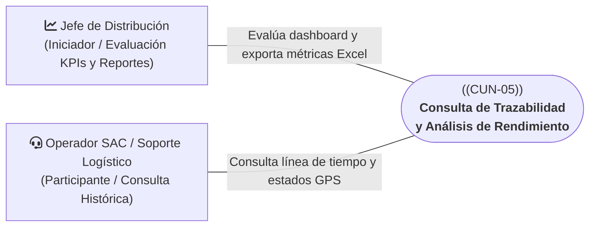
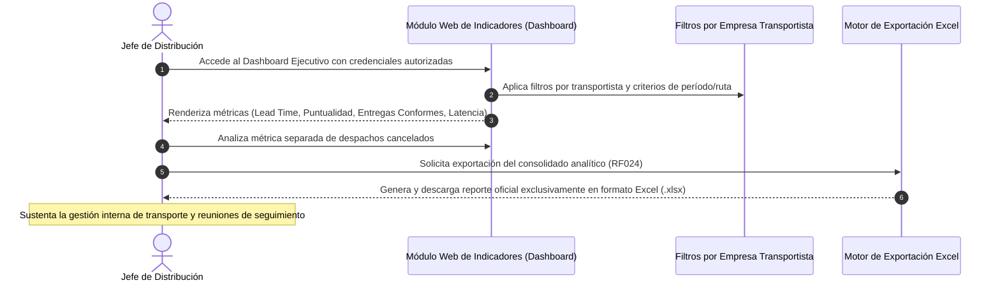
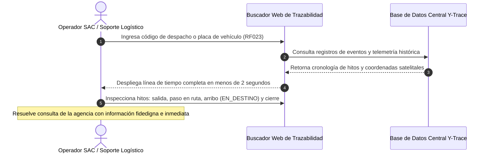

# CUN-05: Consulta de Trazabilidad y Análisis de Rendimiento

> **Carpeta:** `detalles/Diagrama de Casos de Uso del Negocio (CUN)`  
> **Documento:** `06_CUN_05_CONSULTA_TRAZABILIDAD_Y_RENDIMIENTO.md`  
> **Proyecto Oficial:** Sistema Web y Móvil para la Gestión y Trazabilidad de Despachos y Entregas de Yanbal Perú (Y-Trace)  
> **Marco Metodológico:** Rational Unified Process (RUP) — Especificación de Casos de Uso del Negocio  
>  
> 🔗 **Documentos Vinculados:**  
> - [[00_INDICE_Y_MODELO_GENERAL_CUN]] — Modelo general de casos de uso del negocio  
> - [[01_ACTORES_DEL_NEGOCIO]] — Catálogo y fichas de actores del negocio  
> - [[07_MATRIZ_TRAZABILIDAD_CUN_VS_RF]] — Matriz de trazabilidad con requerimientos de software  

---

## 1. Ficha de Identificación del Proceso

| Atributo | Detalle |
| :--- | :--- |
| **Identificador:** | **CUN-05** |
| **Nombre del Proceso:** | **Consulta de Trazabilidad y Análisis de Rendimiento** |
| **Estereotipo RUP:** | `<<business use case>>` |
| **Área Responsable:** | Gerencia de Supply Chain — Jefatura de Distribución / Servicio al Cliente (SAC) |
| **Alcance Operativo:** | Consulta histórica de despachos y evaluación analítica de indicadores de transporte |
| **Objetivo de Negocio:** | Proveer a la organización visibilidad analítica e histórica sobre la trazabilidad de los despachos mediante su cronología de estados y coordenadas GPS, y permitir a la Jefatura de Distribución evaluar el rendimiento operativo y cumplimiento de SLAs mediante indicadores y comparativas por transportista con exportación a Excel. |

---

## 2. Actores del Negocio Participantes



* **Actor Iniciador:** **Jefe de Distribución (Interno)**. Analiza los indicadores de rendimiento logístico global (*Lead Time*, puntualidad, entregas conformes, latencia del Bus), filtra y compara objetivamente el desempeño por empresa transportista y exporta consolidados a Excel.
* **Actor Participante:** **Operador SAC / Soporte Logístico (Interno)**. Atiende requerimientos y consultas de seguimiento de agencias comerciales y áreas internas consultando la línea de tiempo completa del despacho en la plataforma Web.

---

## 3. Precondiciones del Negocio

1. Existen despachos registrados en el sistema Y-Trace que han completado su ciclo (`FINALIZADO`), que han sido cancelados (`DESPACHO_CANCELADO`) o que se encuentran en tránsito.
2. Los eventos de trazabilidad, marcas de tiempo y coordenadas GPS han sido debidamente persistidos en la base de datos relacional del backend.
3. Los usuarios internos cuentan con credenciales corporativas autorizadas y perfiles RBAC específicos para acceder al buscador de trazabilidad o al tablero de indicadores.

---

## 4. Flujos de Actividades del Negocio

```
                            Y-TRACE WEB
                                 │
           ┌─────────────────────┴─────────────────────┐
           ▼                                           ▼
   Operador SAC                              Jefe de Distribución
 (Consulta Histórica)                        (Análisis Rendimiento)
           │                                           │
  Búsqueda por código/placa                  Visualiza Dashboard de KPIs
           │                                           │
  Línea de tiempo (< 2 s)                    Filtra y compara por transportista
  (Estados, GPS, tiempos)                              │
           │                                 Métrica separada de cancelados
  Resolución de consultas                              │
                                             Exportación a Excel (.xlsx)
```

### 4.1 Flujo Táctico: Evaluación de Rendimiento y Comparación de Transportistas (Jefatura de Distribución)



1. **Acceso al Tablero Ejecutivo:** El Jefe de Distribución accede a la plataforma Web y visualiza el consolidado gráfico de los indicadores clave de rendimiento (KPIs) de transporte nacional.
2. **Evaluación de Tiempos de Ciclo (*Lead Time*):** Analiza los tiempos reales de traslado desde la salida física en Lurín hasta la entrega en destino frente a los objetivos de servicio.
3. **Métrica Separada de Cancelaciones:** El sistema asegura que los despachos cancelados administrativamente antes o durante el viaje no distorsionen los promedios de *Lead Time* ni de puntualidad, presentándolos en una métrica analítica independiente.
4. **Análisis Comparativo por Transportista:** Mediante los filtros por transportista en el Dashboard, el Jefe compara objetivamente los tiempos de viaje, tasa de puntualidad y volumen de operaciones entre las empresas de transporte asociadas a Yanbal.
5. **Generación de Reportes Oficiales en Excel:** El Jefe exporta la data analítica consolidada exclusivamente en formato Excel (.xlsx) para soportar la conciliación operativa y las revisiones periódicas de servicio.

---

### 4.2 Flujo de Soporte: Consulta de Trazabilidad Histórica (Operador SAC)



1. **Recepción de Consulta Operativa:** Una agencia regional o área comercial requiere conocer la situación exacta o historial de un despacho programado.
2. **Búsqueda Inmediata:** El Operador SAC ingresa el código del despacho o la placa vehicular en el buscador web de Y-Trace.
3. **Inspección de la Línea de Tiempo (*Timeline*):** En menos de 2 segundos, el sistema despliega la cronología completa del despacho:
   - Registro y habilitación de salida en CD Lurín.
   - Hito formal de salida física (`EN_RUTA`).
   - Muestreo periódico de telemetría GPS registrada en ruta.
   - Acreditación de arribo por geocerca (`EN_DESTINO`).
   - Confirmación formal de entrega (`ENTREGADO` o `NO_ENTREGADO` con causal tipificada).
   - Cierre formal del seguimiento (`FINALIZADO`) o cancelación justificada (`DESPACHO_CANCELADO`).
4. **Resolución de la Consulta:** El operador atiende la consulta con datos fidedignos de estados, fechas, horas y geolocalización satelital, resolviendo discrepancias sin recurrir a comunicaciones ciegas con los conductores en carretera.

---

## 5. Postcondiciones del Negocio

* **Nivel de Servicio Evaluado:** La Jefatura de Distribución dispone de indicadores consolidados y reportes en Excel para el control del desempeño logístico de los transportistas.
* **Consultas de Trazabilidad Resueltas:** Las áreas comerciales y agencias obtienen respuestas inmediatas y precisas sobre el ciclo de vida de los despachos con sustento en datos de auditoría interna.

---

## 6. Reglas de Negocio Vinculadas

* **RN-CUN-05.1 (Análisis Comparativo por Transportista):** El sistema permite filtrar, evaluar y comparar el desempeño y puntualidad por empresa transportista en el Dashboard ejecutivo ([[RF024]]), sin constituir una plataforma multi-tenant externa.
* **RN-CUN-05.2 (Tratamiento Riguroso de Cancelados):** Los despachos en estado `DESPACHO_CANCELADO` quedan excluidos del cálculo de *Lead Time* y puntualidad, computándose en un indicador independiente de cancelación.
* **RN-CUN-05.3 (Formato Único de Exportación):** Toda exportación de reportes analíticos consolidados se realiza estrictamente en formato Excel (.xlsx).
* **RN-CUN-05.4 (Seguridad y Acceso RBAC):** El acceso a la consulta histórica y al tablero de indicadores está protegido por roles de usuario autorizados (RBAC) en la plataforma Web.

---

## 7. Trazabilidad con Requerimientos Funcionales del Sistema (Y-Trace)

| ID Requerimiento | Nombre del Requerimiento Funcional | Rol en el Soporte de CUN-05 |
| :---: | :--- | :--- |
| **RF023** | Consulta de Trazabilidad y Resumen del Despacho | Permite consultar coordenadas GPS, línea de tiempo completa, eventos y duración por código de despacho o placa en < 2 s. |
| **RF024** | Visualización de Indicadores Clave de Desempeño Logístico (KPIs) | Calcula métricas de Lead Time, puntualidad, entregas conformes y filtros comparativos por transportista, con exportación oficial a Excel (.xlsx). |
