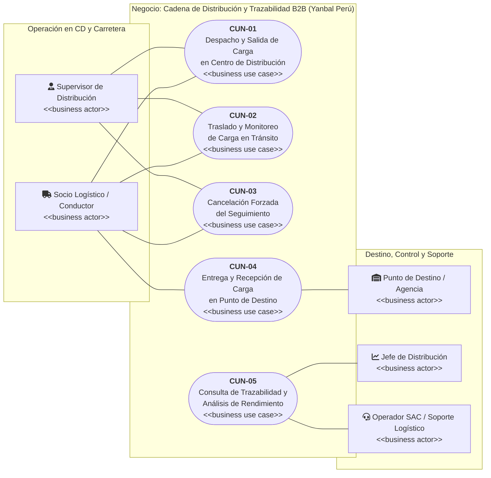
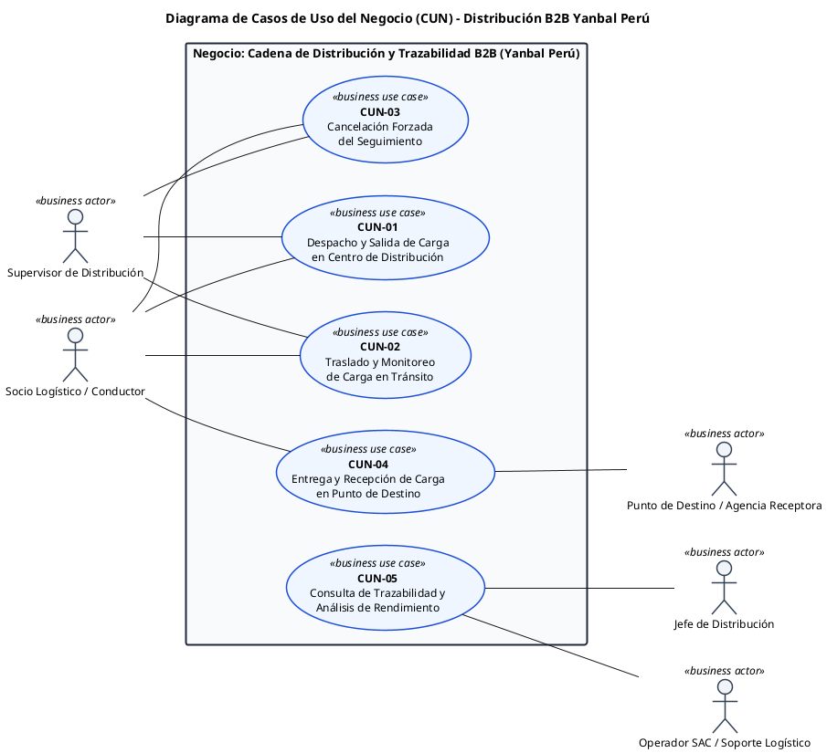

# Diagrama General de Casos de Uso del Negocio (CUN) — Y-Trace Yanbal

> **Archivo:** `diagrama.md`  
> **Carpeta:** `detalles/Diagrama de Casos de Uso del Negocio (CUN)`  
> **Proyecto:** Sistema Web y Móvil para la Gestión y Trazabilidad de Despachos y Entregas de Yanbal Perú (Y-Trace)  
> **Metodología:** Rational Unified Process (RUP) — Modelado del Negocio (Sesión 4 UTP / Arquitectura Empresarial)  
> **Estado:** [CONSOLIDADO OFICIAL — ALCANCE B2B PUNTO A PUNTO]  
>  
> 🔗 **Documentos Vinculados:**  
> - [[00_INDICE_Y_MODELO_GENERAL_CUN]] — Marco conceptual y matriz de participación  
> - [[01_ACTORES_DEL_NEGOCIO]] — Caracterización detallada de actores  
> - [[07_MATRIZ_TRAZABILIDAD_CUN_VS_RF]] — Matriz CUN vs 28 Requerimientos Funcionales  

---

## 1. Diagrama de Casos de Uso del Negocio en Mermaid (Nativo para Obsidian)

Este diagrama representa la relación formal entre los **5 Actores del Negocio** y los **5 Casos de Uso del Negocio (CUN)** dentro de la frontera del negocio de distribución B2B de Yanbal:



---

## 2. Mapa Conceptual de Interacción entre Procesos de Negocio

El siguiente esquema refleja la articulación secuencial y de control de los macro-procesos operacionales de la distribución B2B:

```
                    CADENA LOGÍSTICA Y-TRACE
                               │
       ┌───────────────────────┼───────────────────────┐
       │                       │                       │
       ▼                       ▼                       ▼
    CUN-01                  CUN-02                  CUN-04
Despacho y Salida     Traslado y Monitoreo     Entrega y Recepción
       │                       │                       │
       │                       │                       ▼
       │                       │                    CUN-05
       │                       │                 Trazabilidad
       │                       │                 y Rendimiento
       │                       │
       │                       └───────────┐
       │                                   ▼
       │                                CUN-03
       │                             Cancelación
       │                               Forzada
       │
       └───────────────────────────────────►
```

> [!NOTE]
> **Precisiones de Frontera y Flujo:**
> - El flujo ordinario (*happy path*) avanza linealmente de **CUN-01** (Salida) $\rightarrow$ **CUN-02** (Traslado) $\rightarrow$ **CUN-04** (Entrega).
> - Al culminar las entregas, la información histórica alimenta **CUN-05** para consulta analítica y evaluación de rendimiento.
> - Si se suscita una contingencia externa o siniestro insalvable durante el traslado (o antes de la salida física), el proceso se desvía formalmente hacia **CUN-03 (Cancelación Forzada del Seguimiento)** para el cierre formal, administrativo y técnico.

---

## 3. Código PlantUML Oficial (Para Importar o Dibujar en Visual Paradigm)

Copia el siguiente bloque completo para importarlo en **Visual Paradigm** o en cualquier visor de PlantUML:



---

## 4. Guía de Uso en Visual Paradigm

1. **En Visual Paradigm Community Edition:**
   - Abre o crea un diagrama de tipo **Use Case Diagram**.
   - Si se dibuja a mano:
     - Crea los **5 actores del negocio** y asígnales el estereotipo `business actor`.
     - Crea el contenedor **System Boundary** con el nombre: `Negocio: Cadena de Distribución y Trazabilidad B2B (Yanbal Perú)`.
     - Dibuja los **5 óvalos** dentro del contenedor y asígnales el estereotipo `business use case`.
     - Traza líneas de **Association** (sólidas, sin flechas direccionales ni includes/extends) conectando a cada actor con sus respectivos CUNs según la matriz oficial.
2. **Exportar:**
   - **Project** $\rightarrow$ **Export** $\rightarrow$ **Active Diagram as Image (PNG/SVG)** a 300 DPI.
