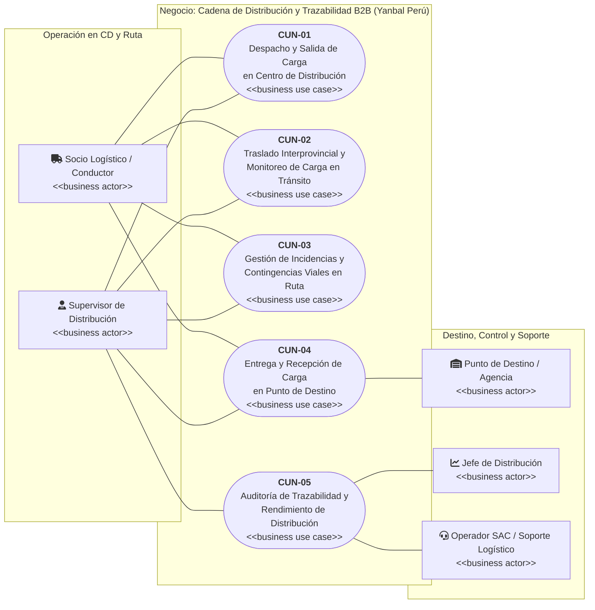
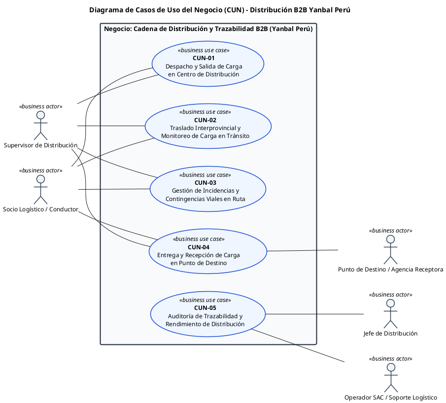

# Diagrama General de Casos de Uso del Negocio (CUN) — Y-Trace Yanbal

> [!WARNING]
> **Nota de Control de Versiones (H-14):** Este archivo `diagrama.md` actúa como una copia de referencia visual del modelo. Cualquier modificación en los requerimientos, actores o casos de uso debe realizarse prioritariamente en los documentos consolidados (`00_INDICE_Y_MODELO_GENERAL_CUN.md`, `01_ACTORES_DEL_NEGOCIO.md`, etc.) para evitar desincronizaciones.

> **Archivo:** `diagrama.md`  
> **Proyecto:** Sistema Web y Móvil para la Gestión y Trazabilidad de Despachos y Entregas de Yanbal Perú (Y-Trace)  
> **Metodología:** RUP (Sesión 4 UTP / Arquitectura Empresarial)  
> **Contenido:** Código PlantUML optimizado para Visual Paradigm + Diagrama interactivo nativo para Obsidian.

---

## 1. Visualización Nativa en Obsidian (Mermaid)

Este diagrama se renderiza de forma nativa e interactiva directamente en Obsidian sin necesidad de plugins externos:

---

## 2. Código PlantUML Oficial (Para Importar o Dibujar en Visual Paradigm)

Copia el siguiente bloque completo para importarlo en **Visual Paradigm** o en cualquier visor de PlantUML:

---

## 3. Guía de Uso en Visual Paradigm

1. **En Visual Paradigm Community Edition:**
   - Ve a **Tools** $\rightarrow$ **PlantUML** (o abre un **Use Case Diagram** en blanco).
   - Si lo dibujas a mano:
     - Crea los **5 actores** y asígnales el estereotipo `business actor`.
     - Crea el recuadro **System Boundary** con el nombre: `Negocio: Cadena de Distribución y Trazabilidad B2B (Yanbal Perú)`.
     - Dibuja los **5 óvalos** dentro y asígnales el estereotipo `business use case` (VP dibujará automáticamente la línea diagonal interior).
     - Une con líneas de **Association** (sólidas, sin flechas).
2. **Exportar:**
   - **Project** $\rightarrow$ **Export** $\rightarrow$ **Active Diagram as Image (PNG/SVG)** a 300 DPI para tu entrega.

