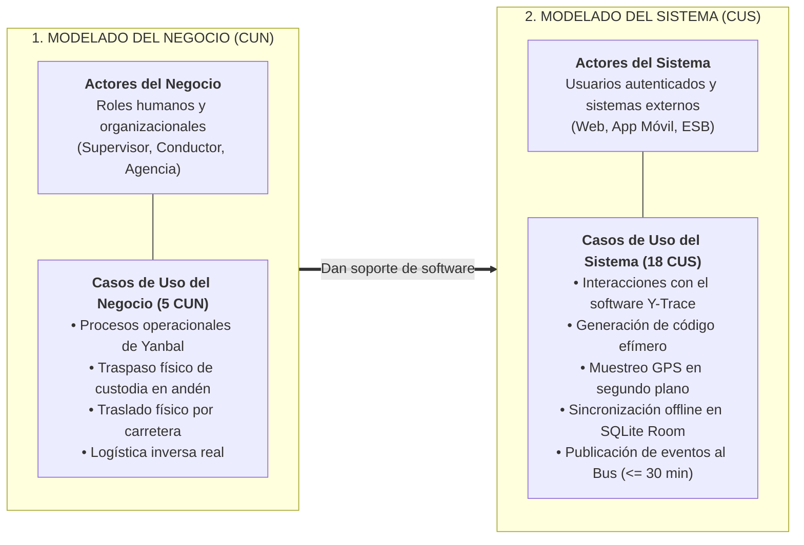
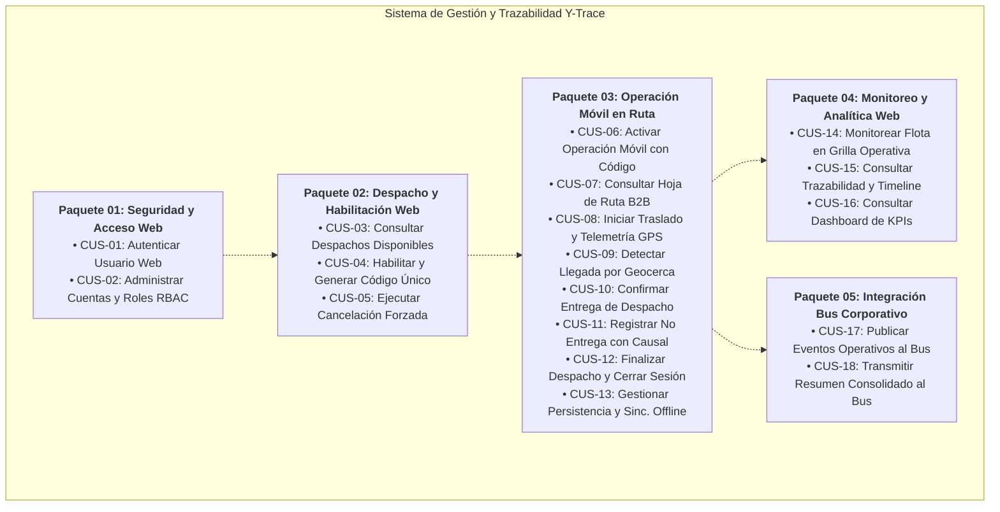

# Modelo de Casos de Uso del Sistema (CUS): Y-Trace

> **Carpeta:** `Diagrama de Casos de Uso/`  
> **Documento:** `00_INDICE_Y_MODELO_GENERAL_CUS.md`  
> **Curso:** Diseño e Implementación de Arquitectura Empresarial (UTP) — Entregable APF1 (Semanas 6 - 7)  
> **Proyecto:** Sistema Web y Móvil para la Gestión y Trazabilidad de Despachos y Entregas de Yanbal Perú (Y-Trace)  
> **Entregable Oficial:** Capítulo 3.3, numeral 6 de la Guía Oficial de Propuesta de Proyecto Final  
> **Estándar:** UML 2.5 / RUP (Sesión 8 — Plantilla Oficial de Casos de Uso UTP)  
> **Estado:** [CONSOLIDADO OFICIAL — COBERTURA TOTAL DE 28 RF Y 22 RNF]

---

## 1. Propósito y Demarcación Metodológica: CUN vs. CUS

En la metodología **Rational Unified Process (RUP)** y las directrices de Arquitectura Empresarial de la UTP, existe una distinción fundamental entre el modelado de negocio y el modelado de software:

* **El Diagrama de Casos de Uso del Negocio (CUN):** Modela *qué hace la empresa Yanbal* en su operación de distribución independiente de la tecnología.
* **El Diagrama de Casos de Uso del Sistema (CUS):** Modela *los servicios funcionales concretos que el software Y-Trace brinda a sus usuarios y sistemas conectados* a través de su plataforma Web y App Nativa Android.

---

## 2. Catálogo de Actores del Sistema (Software)

En el nivel de software bajo el estándar **UML 2.5**, los actores representan entidades externas al sistema que interactúan con sus fronteras (usuarios humanos autenticados o sistemas externos). Los componentes internos del software (como la aplicación móvil o el backend de Y-Trace) no se modelan como actores:

| Actor del Sistema | Tipo | Plataforma / Canal | Rol e Interacción en el Software Y-Trace |
| :--- | :---: | :---: | :--- |
| **Administrador Principal** | Humano | Plataforma Web | Gestiona la seguridad centralizada, el ciclo de vida de usuarios web, la asignación de roles RBAC y audita la bitácora administrativa inmutable (`RNF022`). |
| **Supervisor de Distribución** | Humano | Plataforma Web | Consulta despachos disponibles en andén, habilita el seguimiento generando el código efímero de 8 caracteres (`RF008`), cancela forzosamente seguimientos ante siniestros (`RF009`) y monitorea la flota. |
| **Socio Logístico / Conductor** | Humano | App Nativa Android | Vincula el viaje mediante código temporal (`RF010`), consulta la hoja de ruta B2B (`RF012`), confirma inicio de ruta (`RF013`), registra entrega o rechazo en destino (`RF016`/`RF017`) y finaliza el despacho (`RF018`). |
| **Operador SAC / Soporte Logístico** | Humano | Plataforma Web | Consulta el timeline forense e historial unificado de trazabilidad de despachos con tiempo de respuesta inferior a 2.0 segundos (`RF023`, `RNF015`) para absolver reclamos de clientes. |
| **Jefe de Distribución** | Humano | Plataforma Web | Supervisa la flota en tiempo real en la grilla operativa (`RF022`), analiza el dashboard gerencial de KPIs logísticos (Lead Times, OTIF) y exporta reportes consolidados en formato Excel (`RF024`). |
| **Bus de Integración Corporativo** | Sistema Externo | API REST / JSON Canónico | Middleware receptor externo (ESB de Yanbal) que consume los eventos de cambio de estado en SLA $\le 30$ minutos (`RF025`) y el resumen digital consolidado de trazabilidad al cierre (`RF026`). |

> **Nota de Delimitación UML 2.5:**
> * La **App Nativa Android** y el **Backend Y-Trace** son componentes de software constitutivos del sistema en desarrollo (*System Boundary*) y no actores externos.
> * Las funciones como detección por geocerca (`CUS-09`), sincronización offline en SQLite Room (`CUS-13`), reintentos y encolamiento a DLQ son comportamientos internos automatizados ejecutados por la propia plataforma.

---

## 3. Organización Modular de Casos de Uso en Paquetes

Los **18 Casos de Uso del Sistema (CUS)** cubren integralmente los **28 Requerimientos Funcionales (RF001 a RF028)** y se estructuran en **5 paquetes funcionales**:

---

## 4. Matriz Maestra de Trazabilidad Cruzada (18 CUS, 28 RF, 22 RNF)

Esta matriz certifica que **el 100% de los Requerimientos Funcionales (RF001–RF028) y No Funcionales (RNF001–RNF022)** se encuentran rigurosamente mapeados en los 18 Casos de Uso del Sistema:

| Código CUS | Nombre del Caso de Uso del Sistema | Paquete | Actores Principales | Relación con Negocio (CUN) | Requerimientos Funcionales (RF) | Requerimientos No Funcionales (RNF) |
| :---: | :--- | :---: | :--- | :---: | :---: | :---: |
| **CUS-01** | Autenticar Usuario en Plataforma Web | P01 | Administrador Principal, Supervisor, Jefe de Distribución, Operador SAC | **Transversal** *(Soporte de Autenticación a CUN-01..05)* | `RF001`, `RF005` | `RNF001`, `RNF002`, `RNF003`, `RNF004`, `RNF016`, `RNF021` |
| **CUS-02** | Administrar Cuentas de Usuarios y Roles RBAC | P01 | Administrador Principal | **Transversal** *(Gobernanza y RBAC para CUN-01..05)* | `RF002`, `RF003`, `RF004`, `RF006` | `RNF001`, `RNF002`, `RNF003`, `RNF016`, `RNF021`, `RNF022` |
| **CUS-03** | Consultar Despachos Disponibles para Seguimiento | P02 | Supervisor de Distribución | CUN-01 | `RF007` | `RNF001`, `RNF002`, `RNF010`, `RNF016`, `RNF021` |
| **CUS-04** | Habilitar Seguimiento y Generar Código Único | P02 | Supervisor de Distribución | CUN-01 | `RF008`, `RF028` | `RNF001`, `RNF002`, `RNF004`, `RNF005`, `RNF010`, `RNF016`, `RNF021` |
| **CUS-05** | Ejecutar Cancelación Forzada del Seguimiento | P02 | Supervisor de Distribución | CUN-03 | `RF009`, `RF028` | `RNF001`, `RNF002`, `RNF004`, `RNF005`, `RNF006`, `RNF010`, `RNF016`, `RNF021` |
| **CUS-06** | Activar Operación Móvil con Código Temporal | P03 | Socio Logístico / Conductor | CUN-01 | `RF010`, `RF011`, `RF027` | `RNF001`, `RNF004`, `RNF007`, `RNF014`, `RNF016` |
| **CUS-07** | Consultar Hoja de Ruta y Destino B2B | P03 | Socio Logístico / Conductor | CUN-01, CUN-02 | `RF012` | `RNF007`, `RNF014`, `RNF016` |
| **CUS-08** | Iniciar Traslado y Transmitir Telemetría GPS en Ruta | P03 | Socio Logístico / Conductor | CUN-02 | `RF013`, `RF014` | `RNF005`, `RNF007`, `RNF008`, `RNF009`, `RNF011`, `RNF016`, `RNF020` |
| **CUS-09** | Detectar Llegada a Geocerca de Destino | P03 | No aplica *(Comportamiento automatizado interno)* | CUN-04 | `RF015` | `RNF005`, `RNF007`, `RNF016`, `RNF020` |
| **CUS-10** | Confirmar Entrega de Despacho en Destino | P03 | Socio Logístico / Conductor | CUN-04 | `RF016` | `RNF005`, `RNF007`, `RNF014`, `RNF016`, `RNF020` |
| **CUS-11** | Registrar No Entrega en Destino con Causal | P03 | Socio Logístico / Conductor | CUN-04 | `RF017` | `RNF005`, `RNF007`, `RNF014`, `RNF016`, `RNF020` |
| **CUS-12** | Finalizar Despacho y Cerrar Sesión Móvil | P03 | Socio Logístico / Conductor | CUN-04 | `RF018`, `RF028` | `RNF004`, `RNF005`, `RNF007`, `RNF014`, `RNF016` |
| **CUS-13** | Gestionar Persistencia y Sincronización Offline FIFO | P03 | No aplica *(Comportamiento automatizado interno)* | CUN-02 | `RF019`, `RF020`, `RF021` | `RNF008`, `RNF009`, `RNF012`, `RNF013`, `RNF016` |
| **CUS-14** | Monitorear Flota en Grilla Operativa Web | P04 | Supervisor de Distribución, Jefe de Distribución | CUN-02 | `RF022` | `RNF010`, `RNF011`, `RNF016`, `RNF021` |
| **CUS-15** | Consultar Trazabilidad y Resumen del Despacho | P04 | Supervisor de Distribución, Operador SAC, Jefe | CUN-05 | `RF023` | `RNF015`, `RNF016`, `RNF018`, `RNF021` |
| **CUS-16** | Consultar Dashboard de KPIs y Exportar Reporte | P04 | Jefe de Distribución | CUN-05 | `RF024` | `RNF010`, `RNF015`, `RNF016`, `RNF021` |
| **CUS-17** | Publicar Eventos Operativos al Bus Corporativo | P05 | Bus de Integración Corporativo *(Sistema Externo)* | CUN-02, 03, 04 | `RF025` | `RNF005`, `RNF006` ($\le 30\text{ min}$), `RNF013`, `RNF017` |
| **CUS-18** | Transmitir Resumen Consolidado al Bus Corporativo | P05 | Bus de Integración Corporativo *(Sistema Externo)* | CUN-03, CUN-04 | `RF026` | `RNF005`, `RNF006`, `RNF013`, `RNF017`, `RNF018` |

> **Nota Metodológica de Demarcación Transversal (P01 vs. CUN):**
> Los casos de uso `CUS-01` y `CUS-02` (Paquete 01) se clasifican como **servicios de software transversales** que proveen autenticación, control de acceso RBAC y auditoría administrativa a los colaboradores en todas las etapas operativas. No constituyen actividades del negocio logístico de Yanbal por sí mismos (el negocio no "despacha autenticación"), sino mecanismos de seguridad habilitadores para operar los CUN-01 a CUN-05 dentro de la plataforma.

---

## 5. Diagrama General de Casos de Uso del Sistema (PlantUML)

```plantuml
@startuml Diagrama_General_CUS_YTrace
title Diagrama General de Casos de Uso del Sistema (CUS) - Y-Trace
skinparam packageStyle rectangle
skinparam shadowing false
skinparam defaultFontName Arial
skinparam defaultFontSize 11
skinparam actorStyle awesome

skinparam usecase {
    BackgroundColor #F8FAFC
    BorderColor #1E293B
    BorderThickness 1.5
}

actor "Administrador Principal" as ADM #1E293B
actor "Supervisor de Distribución" as SUP #0284C7
actor "Socio Logístico / Conductor" as COND #16A34A
actor "Operador SAC" as SAC #9333EA
actor "Jefe de Distribución" as JEFE #D97706
actor "Bus de Integración Corporativo" as ESB <<Sistema Externo>> #DC2626

rectangle "Plataforma Y-Trace (Web & Móvil)" {

    package "P01: Seguridad y Acceso Web" {
        usecase "CUS-01: Autenticar Usuario en Plataforma Web" as UC01
        usecase "CUS-02: Administrar Cuentas de Usuarios y Roles RBAC" as UC02
    }

    package "P02: Despacho y Habilitación Web" {
        usecase "CUS-03: Consultar Despachos Disponibles para Seguimiento" as UC03
        usecase "CUS-04: Habilitar Seguimiento y Generar Código Único" as UC04
        usecase "CUS-05: Ejecutar Cancelación Forzada del Seguimiento" as UC05
    }

    package "P03: Operación Móvil en Ruta" {
        usecase "CUS-06: Activar Operación Móvil con Código Temporal" as UC06
        usecase "CUS-07: Consultar Hoja de Ruta y Destino B2B" as UC07
        usecase "CUS-08: Iniciar Traslado y Telemetría GPS en Ruta" as UC08
        usecase "CUS-09: Detectar Llegada a Geocerca de Destino\n<<automatizado>>" as UC09
        usecase "CUS-10: Confirmar Entrega de Despacho en Destino" as UC10
        usecase "CUS-11: Registrar No Entrega en Destino con Causal" as UC11
        usecase "CUS-12: Finalizar Despacho y Cerrar Sesión Móvil" as UC12
        usecase "CUS-13: Gestionar Sincronización Offline FIFO\n<<automatizado>>" as UC13
    }

    package "P04: Monitoreo y Analítica Web" {
        usecase "CUS-14: Monitorear Flota en Grilla Operativa Web" as UC14
        usecase "CUS-15: Consultar Trazabilidad y Resumen del Despacho" as UC15
        usecase "CUS-16: Consultar Dashboard de KPIs y Exportar Reporte" as UC16
    }

    package "P05: Integración Bus Corporativo" {
        usecase "CUS-17: Publicar Eventos Operativos al Bus (SLA <= 30 min)\n<<automatizado>>" as UC17
        usecase "CUS-18: Transmitir Resumen Consolidado al Bus\n<<automatizado>>" as UC18
    }
}

' Relaciones de Actores Web con CUS
ADM --> UC01
ADM --> UC02

SUP --> UC01
SUP --> UC03
SUP --> UC04
SUP --> UC05
SUP --> UC14
SUP --> UC15

JEFE --> UC01
JEFE --> UC14
JEFE --> UC15
JEFE --> UC16

SAC --> UC01
SAC --> UC15

' Relaciones del Conductor con CUS Móvil
COND --> UC06
COND --> UC07
COND --> UC08
COND --> UC10
COND --> UC11
COND --> UC12

' Interacción hacia el Bus Corporativo
UC17 --> ESB
UC18 --> ESB

@enduml
```

---

### 5.1 Trazabilidad y Disparo de Eventos hacia el Bus Corporativo

Para preservar el rigor metodológico del estándar **UML 2.5**, se eliminaron del diagrama general estereotipos no estándar como `<<trigger>>` y `<<precede>>`. La correlación operativa y el disparo asíncrono de eventos de integración hacia el Bus corporativo se detallan en la siguiente matriz explicativa:

| Caso de Uso Emisor | Evento de Negocio Generado | Caso de Uso de Integración Disparado | Payload Publicado hacia el Bus | SLA de Integración |
| :--- | :---: | :---: | :--- | :---: |
| **CUS-08** (Iniciar Traslado) | `EN_RUTA` | **CUS-17** (Publicar Eventos) | Evento JSON canónico de salida con coordenadas atómicas | $\le 30\text{ minutos}$ |
| **CUS-09** (Detectar Geocerca) | `EN_DESTINO` | **CUS-17** (Publicar Eventos) | Evento JSON canónico de arribo por geocerca verificada | $\le 30\text{ minutos}$ |
| **CUS-10** (Confirmar Entrega) | `ENTREGADO` | **CUS-17** (Publicar Eventos) | Evento JSON canónico de recepción conforme en destino | $\le 30\text{ minutos}$ |
| **CUS-11** (Registrar No Entrega) | `NO_ENTREGADO` | **CUS-17** (Publicar Eventos) | Evento JSON canónico de rechazo con causal tipificada | $\le 30\text{ minutos}$ |
| **CUS-05** (Cancelación Forzada) | `DESPACHO_CANCELADO` | **CUS-17** (Publicar Eventos) | Evento JSON canónico de cancelación con motivo justificado | $\le 30\text{ minutos}$ |
| **CUS-12** (Finalizar Despacho) | `FINALIZADO` | **CUS-18** (Transmitir Resumen) | Expediente digital consolidado con Lead Time, ruta y hash SHA-256 | Transmisión al cierre |
| **CUS-05** (Cancelación Forzada) | `DESPACHO_CANCELADO` | **CUS-18** (Transmitir Resumen) | Expediente digital de corte con hitos registrados hasta la interrupción | Transmisión al cierre |

---

## 6. Mapa de Documentos de esta Carpeta

Cada documento contiene las **Fichas Técnicas Oficiales Estandarizadas (formato UTP Sesión 8)** con sus flujos normales, flujos alternativos, precondiciones, postcondiciones y requerimientos no funcionales especificados:

1. **[[01_PAQUETE_SEGURIDAD_Y_ACCESO_WEB]]**: CUS-01 y CUS-02 (Separación de los cuatro actores web, gobierno de identidades, RBAC, auditoría y accesibilidad WCAG 2.1 AA).
2. **[[02_PAQUETE_DESPACHO_Y_HABILITACION_WEB]]**: CUS-03, CUS-04 y CUS-05 (Consulta de despachos en andén, código efímero de 8 caracteres, cancelación forzada y revocación de sesiones).
3. **[[03_PAQUETE_OPERACION_MOVIL_RUTA]]**: CUS-06 al CUS-13 (Activación móvil, telemetría periódica cada 10 min, detección interna por geocerca, entrega/rechazo consciente, cierre de sesión y sincronización offline en SQLite Room).
4. **[[04_PAQUETE_MONITOREO_Y_ANALITICA_WEB]]**: CUS-14, CUS-15 y CUS-16 (Torre de Control en vivo con cálculo de antigüedad sin alarmas falsas, buscador forense de trazas $<2.0\text{ s}$ y dashboard gerencial con exportación a Excel).
5. **[[05_PAQUETE_INTEGRACION_BUS_CORPORATIVO]]**: CUS-17 y CUS-18 (Publicación de eventos en SLA $\le 30$ min, transmisión de resúmenes consolidados y resiliencia interna con backoff exponencial y DLQ hacia el Bus de Integración).
