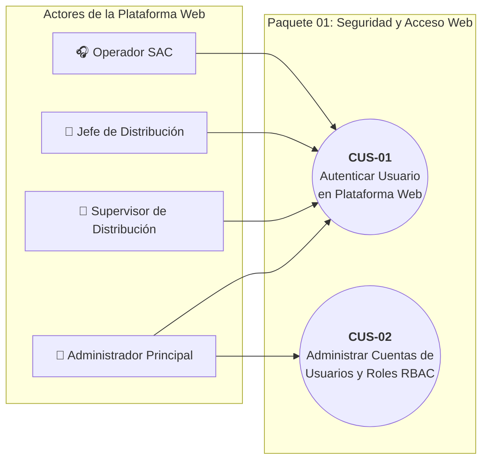
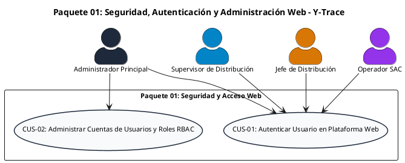

# Paquete 01: Seguridad, Autenticación y Administración Web (CUS)

> **Carpeta:** `Diagrama de Casos de Uso/`  
> **Documento:** `01_PAQUETE_SEGURIDAD_Y_ACCESO_WEB.md`  
> **Curso:** Diseño e Implementación de Arquitectura Empresarial (UTP) — Entregable APF1 (Semanas 6 - 7)  
> **Proyecto:** Sistema Web y Móvil para la Gestión y Trazabilidad de Despachos y Entregas de Yanbal Perú (Y-Trace)  
> **Estándar:** UML 2.5 / RUP (Sesión 8 — Plantilla Oficial de Casos de Uso UTP)  
> **Requerimientos Asociados:** RF001, RF002, RF003, RF004, RF005, RF006 | RNF001, RNF002, RNF003, RNF004, RNF016, RNF021, RNF022

---

## 1. Diagrama de Casos de Uso del Paquete

### 1.1 Diagrama Visual Interactivo (Mermaid)

### 1.2 Código Oficial PlantUML

---

## 2. Fichas Técnicas Estandarizadas de Casos de Uso (Formato UTP)

### Ficha Técnica: CUS-01 — Autenticar Usuario en Plataforma Web

| Campo | Detalle de la Especificación |
| :--- | :--- |
| **Código y Nombre:** | `CUS-01 - Autenticar Usuario en Plataforma Web` |
| **Actores:** | `Administrador Principal`, `Supervisor de Distribución`, `Jefe de Distribución`, `Operador SAC`. |
| **Descripción:** | Proceso mediante el cual los cuatro colaboradores autorizados de la empresa acceden a la plataforma Web de Y-Trace validando sus credenciales personales (correo y contraseña), estableciendo una sesión protegida con expiración automática. |
| **Precondiciones:** | 1. El usuario debe poseer una cuenta activa registrada previamente en el sistema.   2. El navegador web debe soportar comunicación cifrada bajo protocolo TLS 1.3. |
| **Flujo Normal:** | **1.** El usuario ingresa a la URL de la plataforma Web de Y-Trace.   **2.** El sistema presenta el formulario de inicio de sesión solicitando correo corporativo y contraseña.   **3.** El usuario ingresa sus credenciales y pulsa el botón *"Iniciar Sesión"*.   **4.** El sistema valida que los campos no estén vacíos y aplica la función criptográfica BCrypt sobre la contraseña introducida.   **5.** El sistema verifica la coincidencia contra el hash y salt almacenados en la base de datos segura.   **6.** El sistema comprueba que la cuenta esté en estado activo y recupera el rol RBAC asignado.   **7.** El sistema genera un token de sesión seguro (con expiración por inactividad de 15 minutos).   **8.** El sistema redirige al usuario al panel principal (*Dashboard*) correspondiente a los privilegios de su rol. |
| **Flujos Alternativos:** | **4.1. Formato de credenciales inválido:** Si el correo no tiene estructura corporativa válida, el sistema bloquea el envío y resalta el campo con mensaje de advertencia.   **5.1. Credenciales erróneas:**   &nbsp;&nbsp;&nbsp;&nbsp;5.1.1. El sistema rechaza el acceso e incrementa en 1 el contador de intentos fallidos.   &nbsp;&nbsp;&nbsp;&nbsp;5.1.2. Muestra el mensaje: *"Credenciales inválidas. Verifique sus datos"*.   &nbsp;&nbsp;&nbsp;&nbsp;5.1.3. Si el contador alcanza 5 intentos fallidos consecutivos, el sistema suspende temporalmente la cuenta por 30 minutos y registra el evento en la bitácora de seguridad.   **6.1. Cuenta suspendida o inactiva:** Si la cuenta se encuentra desactivada, el sistema deniega el acceso y muestra: *"Usuario inactivo. Contacte al Administrador"*.   **7.1. Cierre de sesión por inactividad:** Si transcurren 15 minutos continuos sin interacción en la interfaz web, el sistema destruye el token de sesión y redirige a la pantalla de login con el mensaje *"Sesión expirada por inactividad"*. |
| **Postcondiciones:** | El usuario obtiene acceso a las vistas y funciones operativas asignadas estrictamente a su rol, registrándose el evento de inicio de sesión exitoso con estampa de tiempo y dirección IP de origen. |
| **Requerimientos Funcionales:** | **RF001** (Autenticación Web), **RF005** (Control del ciclo de vida de sesiones web). |
| **Requerimientos No Funcionales:** | • **RNF001 (Seguridad de Acceso):** 100% de peticiones a rutas web protegidas sin token válido son rechazadas con código HTTP 401/403.   • **RNF002 (Autorización Estricta RBAC):** La interfaz y los endpoints restringen estrictamente las vistas según el rol autenticado.   • **RNF003 (Gestión de Credenciales):** Contraseñas cifradas mediante BCrypt con factor de costo $\ge 12$ y transmisión exclusiva bajo TLS 1.3.   • **RNF004 (Gobernanza de Sesiones):** Expiración automática por inactividad a los 15 minutos en terminales web.   • **RNF016 (Compatibilidad de Plataforma Cliente):** Consola web compatible con navegadores de escritorio modernos (Chrome 90+, Edge 90+, Firefox 88+).   • **RNF021 (Accesibilidad Web WCAG 2.1 AA):** Plataforma web construida bajo estándares de accesibilidad WCAG 2.1 nivel AA (contraste $\ge 4.5:1$, navegación por teclado y semántica accesible). |

---

### Ficha Técnica: CUS-02 — Administrar Cuentas de Usuarios y Roles RBAC

| Campo | Detalle de la Especificación |
| :--- | :--- |
| **Código y Nombre:** | `CUS-02 - Administrar Cuentas de Usuarios y Roles RBAC` |
| **Actores:** | `Administrador Principal`. |
| **Descripción:** | Proceso que permite al Administrador del Sistema crear nuevos usuarios web, modificar sus datos, cambiar sus roles asignados (RBAC), suspender o desactivar cuentas, registrando cada cambio en una bitácora inmutable de auditoría interna. |
| **Precondiciones:** | 1. El Administrador Principal debe haber iniciado sesión exitosamente con su rol correspondiente.   2. El sistema debe tener activo el repositorio de roles institucionales (`Administrador Principal`, `Supervisor de Distribución`, `Jefe de Distribución`, `Operador SAC`). |
| **Flujo Normal:** | **1.** El Administrador accede al menú de *"Administración de Usuarios y Accesos"*.   **2.** El sistema muestra la grilla con el listado completo de colaboradores registrados, su correo, nombre, rol asignado, estado (Activo/Inactivo) y fecha de último acceso.   **3.** El Administrador selecciona la opción deseada: *Crear Usuario*, *Editar Datos*, *Cambiar Rol* o *Desactivar Cuenta*.   **4.** Para una nueva cuenta: el Administrador ingresa nombre completo, correo corporativo Yanbal, asigna uno de los 4 roles predefinidos y define la contraseña inicial temporal.   **5.** El sistema valida la unicidad del correo electrónico y la robustez de la contraseña.   **6.** El sistema genera el registro del usuario con la contraseña hasheada con BCrypt ($\text{costo} \ge 12$).   **7.** El sistema registra de manera inmediata e inmutable la acción en la bitácora interna de auditoría (quién creó a quién, rol asignado, fecha y hora atómica).   **8.** El sistema emite mensaje de confirmación y actualiza la grilla de usuarios. |
| **Flujos Alternativos:** | **4.1. Modificación de rol existente:**   &nbsp;&nbsp;&nbsp;&nbsp;4.1.1. El Administrador selecciona un usuario existente y modifica su rol asignado.   &nbsp;&nbsp;&nbsp;&nbsp;4.1.2. El sistema actualiza el registro, revoca forzosamente cualquier sesión activa del usuario para forzar reautenticación con el nuevo rol (*kill session*) y genera la traza en la bitácora de auditoría.   **5.1. Correo corporativo duplicado:** Si el correo ingresado ya existe en la base de datos, el sistema detiene la operación y emite el mensaje: *"El correo corporativo ya se encuentra registrado en el sistema"*.   **5.2. Contraseña débil:** Si la contraseña no cumple las políticas de longitud y complejidad mínima, el sistema resalta los requisitos incumplidos.   **6.1. Desactivación o bloqueo de cuenta:** Si un colaborador es desvinculado, el Administrador marca el estado como *Inactivo*; el sistema destruye inmediatamente cualquier sesión activa y bloquea accesos futuros. |
| **Postcondiciones:** | La cuenta de usuario y sus permisos de acceso quedan actualizados en el sistema; se almacena el registro inmutable en la bitácora de auditoría interna sin posibilidad de borrado. |
| **Requerimientos Funcionales:** | **RF002** (Gestión de cuentas web), **RF003** (Asignación y modificación de roles), **RF004** (Control de acceso RBAC en endpoints), **RF006** (Registro de bitácora inmutable). |
| **Requerimientos No Funcionales:** | • **RNF001 (Seguridad de Acceso):** Control estricto de acceso en capa de servicio y base de datos.   • **RNF002 (Autorización Estricta):** Cero tolerancia a elevación horizontal o vertical de privilegios no autorizados.   • **RNF003 (Gestión de Credenciales):** Almacenamiento seguro con BCrypt (factor $\ge 12$).   • **RNF016 (Compatibilidad Web):** Consola operativa compatible con navegadores de escritorio estándar.   • **RNF021 (Accesibilidad Web WCAG 2.1 AA):** Estándar de contraste y navegación en consola administrativa.   • **RNF022 (Auditoría Administrativa Inmutable):** 100% de operaciones administrativas críticas son persistidas en bitácora *append-only* (solo inserción, prohibido `UPDATE` o `DELETE`). |
