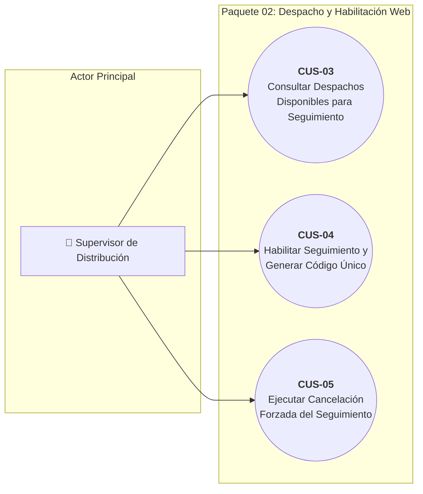
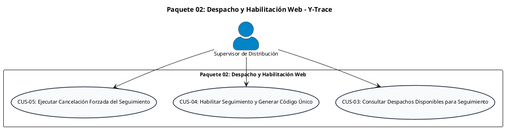

# Paquete 02: Despacho y Habilitación Web (CUS)

> **Carpeta:** `Diagrama de Casos de Uso/`  
> **Documento:** `02_PAQUETE_DESPACHO_Y_HABILITACION_WEB.md`  
> **Curso:** Diseño e Implementación de Arquitectura Empresarial (UTP) — Entregable APF1 (Semanas 6 - 7)  
> **Proyecto:** Sistema Web y Móvil para la Gestión y Trazabilidad de Despachos y Entregas de Yanbal Perú (Y-Trace)  
> **Estándar:** UML 2.5 / RUP (Sesión 8 — Plantilla Oficial de Casos de Uso UTP)  
> **Requerimientos Asociados:** RF007, RF008, RF009, RF028 | RNF001, RNF002, RNF004, RNF005, RNF006, RNF010, RNF016, RNF021

---

## 1. Diagrama de Casos de Uso del Paquete

### 1.1 Diagrama Visual Interactivo (Mermaid)

> **Nota de Conformidad UML 2.5:**
> 1. Se eliminaron estereotipos no estándar como `<<precede>>`. La secuencia operativa (consultar antes de habilitar) se modela mediante precondiciones en las fichas técnicas.
> 2. La invalidación del código y revocación de la sesión móvil forman parte del comportamiento atómico de `CUS-04` y `CUS-05` (en cumplimiento de `RF028`), evitando crear casos de uso artificiales.

---

### 1.2 Código Oficial PlantUML

---

## 2. Fichas Técnicas Estandarizadas de Casos de Uso (Formato UTP)

### Ficha Técnica: CUS-03 — Consultar Despachos Disponibles para Seguimiento

| Campo | Detalle de la Especificación |
| :--- | :--- |
| **Código y Nombre:** | `CUS-03 - Consultar Despachos Disponibles para Seguimiento` |
| **Actores:** | `Supervisor de Distribución`. |
| **Descripción:** | Proceso mediante el cual el Supervisor consulta y filtra la lista de despachos completos ya existentes, recibidos desde los sistemas externos de Yanbal (SPY/WMS) y que se encuentran en estado `DISPONIBLE_PARA_SEGUIMIENTO` en andén. |
| **Precondiciones:** | 1. El Supervisor de Distribución debe estar autenticado con sesión web activa.   2. Deben existir órdenes consolidadas transmitidas por el Bus corporativo desde SPY/WMS hacia la base de datos de Y-Trace. |
| **Flujo Normal:** | **1.** El Supervisor ingresa al módulo de *"Despachos en Andén"* en la plataforma Web.   **2.** El sistema consulta y despliega la grilla de despachos con estado `DISPONIBLE_PARA_SEGUIMIENTO`.   **3.** Para cada despacho, el sistema muestra: código de despacho, punto de destino departamental, dirección física de llegada, cantidad de bultos y horario planificado de salida.   **4.** El Supervisor aplica filtros por destino (departamento/agencia), fecha planificada o rango horario.   **5.** El sistema filtra instantáneamente los resultados en pantalla en menos de 500 ms.   **6.** El Supervisor selecciona el despacho sobre el cual realizará la inspección física y posterior habilitación. |
| **Flujos Alternativos:** | **2.1. No existen despachos disponibles:** Si no hay despachos en cola, el sistema presenta el estado vacío informativo: *"No se registran despachos pendientes de habilitación en este momento"*, manteniendo un botón de refresco manual.   **4.1. Filtros sin coincidencias:** Si los criterios de búsqueda ingresados no devuelven registros, el sistema muestra el mensaje: *"No se encontraron despachos con los criterios especificados"* y permite limpiar los filtros con un clic. |
| **Postcondiciones:** | El Supervisor visualiza la información fidedigna del despacho seleccionado y queda facultado para generar el código de habilitación (`CUS-04`). El sistema no altera el estado del despacho durante la consulta. |
| **Requerimientos Funcionales:** | **RF007** (Consulta y filtrado de despachos disponibles). |
| **Requerimientos No Funcionales:** | • **RNF001 (Seguridad en Control de Acceso):** 100% de peticiones sin token web válido son rechazadas con HTTP 401.   • **RNF002 (Autorización Estricta RBAC):** Vista y endpoints restringidos al rol Supervisor de Distribución.   • **RNF010 (Disponibilidad Operativa Web):** Grilla operativa disponible con uptime $\ge 99.5\%$.   • **RNF016 (Compatibilidad de Plataforma Cliente):** Despliegue validado en navegadores web de escritorio estándar (Chrome 90+, Edge 90+, Firefox 88+).   • **RNF021 (Accesibilidad Web WCAG 2.1 AA):** Ratios de contraste $\ge 4.5:1$ en grillas tabulares y navegación accesible por teclado. |

---

### Ficha Técnica: CUS-04 — Habilitar Seguimiento y Generar Código Único de Activación

| Campo | Detalle de la Especificación |
| :--- | :--- |
| **Código y Nombre:** | `CUS-04 - Habilitar Seguimiento y Generar Código Único de Activación` |
| **Actores:** | `Supervisor de Distribución`. |
| **Descripción:** | Proceso en el cual el Supervisor, tras verificar físicamente la carga consolidada en andén de CD Lurín, solicita al sistema la emisión de un Código Único de Activación efímero de 8 caracteres alfanuméricos para vincular el despacho con el conductor del socio logístico. |
| **Precondiciones:** | 1. El Supervisor de Distribución debe estar autenticado en la plataforma Web.   2. El despacho seleccionado debe encontrarse en estado estricto `DISPONIBLE_PARA_SEGUIMIENTO`.   3. No debe existir un código previamente activo o vigente para dicho despacho. |
| **Flujo Normal:** | **1.** El Supervisor visualiza el detalle del despacho verificado en andén y presiona el botón *"Habilitar Seguimiento"*.   **2.** El sistema valida que el despacho esté en estado `DISPONIBLE_PARA_SEGUIMIENTO` y no tenga bloqueos administrativos.   **3.** El sistema genera un código alfanumérico pseudoaleatorio criptoseguro de 8 caracteres (alfabeto no ambiguo, excluyendo caracteres confusos como `0`, `O`, `1`, `I`).   **4.** El sistema asigna al código una ventana de expiración temporal de 120 minutos (2 horas) a partir del momento de emisión.   **5.** El sistema registra el hito interno de control previo (`HABILITACION_SEGUIMIENTO`) y transiciona el despacho al estado `HABILITADO`.   **6.** El sistema muestra en pantalla el código generado en formato legible de alta visibilidad, junto con el contador regresivo de expiración y la opción de impresión del comprobante de andén.   **7.** El Supervisor entrega presencialmente el código impreso o verbalmente al conductor del socio logístico en andén. |
| **Flujos Alternativos:** | **2.1. Despacho no elegible:** Si el despacho ya fue habilitado previamente o se encuentra en estado cancelado, el sistema bloquea la generación y emite el mensaje: *"El despacho no se encuentra en estado elegible para habilitación"*.   **4.1. Expiración del código sin consumo:** Si transcurren los 120 minutos sin que el conductor active la App Móvil:   &nbsp;&nbsp;&nbsp;&nbsp;4.1.1. El código pasa automáticamente a estado `EXPIRADO`.   &nbsp;&nbsp;&nbsp;&nbsp;4.1.2. El despacho permanece en espera en la plataforma Web.   &nbsp;&nbsp;&nbsp;&nbsp;4.1.3. El Supervisor verifica presencialmente el motivo del retraso y genera un nuevo código mediante este mismo caso de uso.   **4.2. Bloqueo por 5 intentos fallidos (RF027):** Si el código fue bloqueado por intentos erróneos reiterados en la app móvil, el sistema invalida el código (`BLOQUEADO`); el Supervisor puede generar un nuevo código tras verificar presencialmente la identidad del conductor en andén. |
| **Postcondiciones:** | El despacho transiciona a `HABILITADO`. Se almacena el código activo en base de datos con estampa de tiempo, fecha de expiración y contador de intentos en cero. El código queda listo para consumo en la App Nativa. *(Nota: El hito interno de control previo no se publica al Bus de Integración)*. |
| **Requerimientos Funcionales:** | **RF008** (Generación de código único de activación), **RF028** (Unicidad, vigencia y caducidad del código). |
| **Requerimientos No Funcionales:** | • **RNF001 (Seguridad en Control de Acceso):** Autenticación web obligatoria para emisión de credenciales.   • **RNF002 (Autorización Estricta RBAC):** Facultad exclusiva del rol Supervisor de Distribución.   • **RNF004 (Gobernanza y Caducidad de Códigos):** Unicidad activa del código (solo 1 código vigente por despacho a la vez) con caducidad en 120 minutos.   • **RNF005 (Inmutabilidad del Hito):** El registro del hito interno de habilitación queda protegido contra modificaciones.   • **RNF010 (Disponibilidad Web):** Generación de código disponible con uptime $\ge 99.5\%$.   • **RNF016 (Compatibilidad Web):** Despliegue accesible en navegadores web de escritorio.   • **RNF021 (Accesibilidad Web WCAG 2.1 AA):** Despliegue de código en tipografía monoespaciada de alto contraste. |

---

### Ficha Técnica: CUS-05 — Ejecutar Cancelación Forzada del Seguimiento

| Campo | Detalle de la Especificación |
| :--- | :--- |
| **Código y Nombre:** | `CUS-05 - Ejecutar Cancelación Forzada del Seguimiento` |
| **Actores:** | `Supervisor de Distribución`. |
| **Descripción:** | Proceso administrativo y de control mediante el cual el Supervisor cancela forzosamente el seguimiento de un despacho desde la plataforma Web ante contingencias externas insalvables comunicadas fuera del sistema (vía telefónica externa), deteniendo la telemetría, invalidando el código y revocando la sesión móvil. |
| **Precondiciones:** | 1. El Supervisor de Distribución debe estar autenticado con credenciales activas.   2. El despacho debe encontrarse en estado activo de seguimiento (`HABILITADO`, `EN_RUTA` o `EN_DESTINO`).   3. Se ha recibido una comunicación externa que justifica formalmente la interrupción definitiva del traslado. |
| **Flujo Normal:** | **1.** El Supervisor localiza el despacho afectado en la grilla operativa y pulsa la opción *"Cancelar Seguimiento de Despacho"*.   **2.** El sistema presenta una ventana modal de confirmación obligatoria advirtiendo el carácter irrevocable de la acción.   **3.** El Supervisor selecciona el motivo justificado de la lista tipificada (Siniestro vial grave, Avería mecánica insalvable, Bloqueo de carretera por fuerza mayor, Decisión comercial externa) e introduce una justificación en texto de al menos 15 caracteres.   **4.** El Supervisor introduce su contraseña o confirma la acción consciente.   **5.** El sistema registra el evento operativo inmutable `DESPACHO_CANCELADO` con fecha, hora, usuario responsable y motivo.   **6.** El sistema transiciona el estado del despacho a `DESPACHO_CANCELADO`.   **7.** El sistema invalida inmediatamente el código de activación (`REVOCADO`) y revoca la sesión operativa móvil activa (*kill session*).   **8.** El sistema envía la orden de cierre a la App Móvil del conductor, retornándola a su pantalla inicial de ingreso de código y cesando el muestreo GPS.   **9.** El sistema dispara la publicación del evento `DESPACHO_CANCELADO` hacia la cola del Bus de Integración (`CUS-17`) dentro del SLA $\le 30$ minutos.   **10.** El sistema muestra mensaje de confirmación en la consola del Supervisor y actualiza el semáforo del despacho a color gris. |
| **Flujos Alternativos:** | **2.1. Despacho en estado terminal:** Si el despacho ya se encuentra en `FINALIZADO` o `DESPACHO_CANCELADO`, el sistema deshabilita la opción y muestra: *"No es posible cancelar un despacho finalizado o previamente cancelado"*.   **3.1. Justificación insuficiente:** Si el campo de motivo no cumple con la longitud mínima requerida, el sistema impide pulsar *"Confirmar Cancelación"* y resalta el requerimiento.   **8.1. Conductor offline al momento de la cancelación:** Si la unidad vehicular se encuentra en zona sin cobertura celular, la sesión móvil se revoca en el backend; tan pronto el dispositivo recupere señal de red e intente transmitir telemetría, el endpoint rechazará la petición con HTTP 401/403, forzando el cierre local de la app y el cese definitivo del GPS. |
| **Postcondiciones:** | El despacho queda cerrado definitivamente bajo el estado inmutable `DESPACHO_CANCELADO`. Las credenciales temporales y la sesión móvil quedan extinguidas de forma irrevocable. Se programa la publicación del evento de cancelación al Bus corporativo (`CUS-17`) y la emisión del resumen de trazabilidad (`CUS-18`). |
| **Requerimientos Funcionales:** | **RF009** (Cancelación forzada del seguimiento del despacho), **RF028** (Revocación automática de validez de código y sesión). |
| **Requerimientos No Funcionales:** | • **RNF001 (Seguridad en Control de Acceso):** Acción restringida bajo autenticación estricta.   • **RNF002 (Autorización Estricta RBAC):** Exclusivo para el rol Supervisor de Distribución.   • **RNF004 (Gobernanza de Sesiones):** Revocación atómica e inmediata de la sesión móvil y del código en $< 5$ segundos.   • **RNF005 (Inmutabilidad de Eventos):** El evento `DESPACHO_CANCELADO` se almacena como registro *append-only* inalterable.   • **RNF006 (Latencia hacia el Bus):** Publicación del evento hacia el Bus corporativo dentro de un tiempo $\le 30$ minutos.   • **RNF010 (Disponibilidad Web):** Módulo de cancelación disponible con uptime $\ge 99.5\%$.   • **RNF016 (Compatibilidad Web):** Consola operativa compatible con navegadores de escritorio.   • **RNF021 (Accesibilidad Web WCAG 2.1 AA):** Cuadro de diálogo modal accesible por teclado con foco atrapado. |
