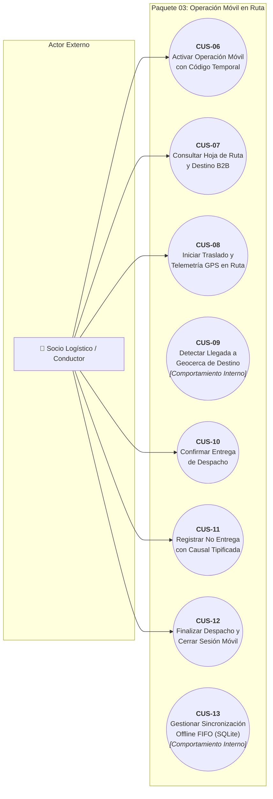

# Paquete 03: Operación Móvil en Ruta (CUS)

> **Carpeta:** `Diagrama de Casos de Uso/`  
> **Documento:** `03_PAQUETE_OPERACION_MOVIL_RUTA.md`  
> **Curso:** Diseño e Implementación de Arquitectura Empresarial (UTP) — Entregable APF1 (Semanas 6 - 7)  
> **Proyecto:** Sistema Web y Móvil para la Gestión y Trazabilidad de Despachos y Entregas de Yanbal Perú (Y-Trace)  
> **Estándar:** UML 2.5 / RUP (Sesión 8 — Plantilla Oficial de Casos de Uso UTP)  
> **Requerimientos Asociados:** RF010, RF011, RF012, RF013, RF014, RF015, RF016, RF017, RF018, RF019, RF020, RF021, RF027, RF028 | RNF001, RNF004, RNF005, RNF007, RNF008, RNF009, RNF011, RNF012, RNF013, RNF014, RNF016, RNF020

---

## 1. Diagrama de Casos de Uso del Paquete

### 1.1 Diagrama Visual Interactivo (Mermaid)

> **Nota de Conformidad UML 2.5:**
> 1. **Actor Externo Único:** En estricto apego al estándar UML 2.5, el único actor externo del paquete es el **Socio Logístico / Conductor**. La aplicación móvil (`App Nativa Android`) forma parte de la frontera del sistema en desarrollo (*System Boundary*) y no constituye un actor externo.
> 2. **Comportamiento Interno Automatizado:** `CUS-09` (Detección de Geocerca) y `CUS-13` (Persistencia y Sincronización Offline) representan comportamientos internos automatizados del sistema móvil ejecutados en segundo plano (*Background/Foreground Services*), sin intervención de actores externos.
> 3. **Ausencia de Relaciones Artificiales:** Se eliminaron dependencias no estándar como `<<precede>>` y relaciones `<<include>>` artificiales que pretendían reflejar secuencia temporal o ejecución técnica en segundo plano (entre CUS-06→CUS-07, CUS-08→CUS-13 y CUS-12→CUS-13). La secuencia cronológica, las precondiciones de activación y la verificación de vaciado de cola se especifican de forma rigurosa en las Fichas Técnicas del caso de uso.

---

### 1.2 Código Oficial PlantUML

```plantuml
@startuml Diagrama_CUS_P03_Operacion_Movil
title Paquete 03: Operación Móvil en Ruta - Y-Trace
skinparam packageStyle rectangle
skinparam shadowing false
skinparam defaultFontName Arial
skinparam defaultFontSize 11
skinparam actorStyle awesome

skinparam usecase {
    BackgroundColor #F8FAFC
    BorderColor #1E293B
    BorderThickness 1.5
}

actor "Socio Logístico / Conductor" as COND #16A34A

rectangle "Paquete 03: Operación Móvil en Ruta" {
    usecase "CUS-06: Activar Operación Móvil con Código Temporal" as UC06
    usecase "CUS-07: Consultar Hoja de Ruta y Destino B2B" as UC07
    usecase "CUS-08: Iniciar Traslado y Telemetría GPS en Ruta" as UC08
    usecase "CUS-09: Detectar Llegada a Geocerca de Destino\n<<automatizado>>" as UC09
    usecase "CUS-10: Confirmar Entrega de Despacho" as UC10
    usecase "CUS-11: Registrar No Entrega con Causal Tipificada" as UC11
    usecase "CUS-12: Finalizar Despacho y Cerrar Sesión Móvil" as UC12
    usecase "CUS-13: Gestionar Sincronización Offline FIFO\n<<automatizado>>" as UC13
}

' Interacciones del Conductor con los Casos de Uso
COND --> UC06
COND --> UC07
COND --> UC08
COND --> UC10
COND --> UC11
COND --> UC12

note right of UC09
  Proceso interno automatizado ejecutado
  en segundo plano al aproximarse
  al radio de la geocerca configurada.
end note

note bottom of UC13
  Servicio interno de persistencia Room y
  sincronización FIFO ejecutado automáticamente
  según estado de conectividad celular.
end note
@enduml
```

---

## 2. Fichas Técnicas Estandarizadas de Casos de Uso (Formato UTP)

### Ficha Técnica: CUS-06 — Activar Operación Móvil con Código Temporal

| Campo | Detalle de la Especificación |
| :--- | :--- |
| **Código y Nombre:** | `CUS-06 - Activar Operación Móvil con Código Temporal` |
| **Actores:** | `Socio Logístico / Conductor`. |
| **Descripción:** | Proceso mediante el cual el conductor introduce el Código Único de Activación de 8 caracteres en la App Nativa Android en el andén de CD Lurín para vincular su smartphone con el despacho físico, validando la vigencia del código y estableciendo una sesión operativa persistente sin requerir usuario corporativo ni contraseñas permanentes. |
| **Precondiciones:** | 1. El conductor debe contar con la App Nativa Y-Trace instalada en un smartphone con Android 8.0 o superior y GPS habilitado (`RNF016`).   2. El Supervisor de Distribución debe haber generado el Código de Activación vigente (`CUS-04`).   3. El dispositivo móvil debe contar con conectividad inicial a Internet en andén. |
| **Flujo Normal:** | **1.** El conductor abre la App Nativa Y-Trace, visualizando la pantalla inicial limpia de activación.   **2.** El conductor digita el Código Único de 8 caracteres alfanuméricos recibido del Supervisor y pulsa *"Vincular Despacho"*.   **3.** La App envía la solicitud al backend mediante petición cifrada TLS 1.3.   **4.** El backend valida que el código exista, se encuentre en estado `VIGENTE`, no esté expirado y el despacho esté en estado `HABILITADO`.   **5.** El backend transiciona el estado del código a `CONSUMIDO`.   **6.** El backend emite un token de sesión operativa persistente vinculado al identificador de la unidad vehicular, conductor y despacho.   **7.** La App almacena el token y la información del despacho en su base de datos local SQLite (Room).   **8.** La App transiciona de inmediato a la pantalla principal de la Hoja de Ruta (`CUS-07`) en menos de 500 ms. |
| **Flujos Alternativos:** | **4.1. Código inexistente o erróneo:**   &nbsp;&nbsp;&nbsp;&nbsp;4.1.1. El backend rechaza el código e incrementa en 1 el contador de intentos fallidos.   &nbsp;&nbsp;&nbsp;&nbsp;4.1.2. Muestra en la app: *"Código de activación incorrecto. Intentos restantes: X"*.   &nbsp;&nbsp;&nbsp;&nbsp;4.1.3. **Bloqueo tras 5 intentos fallidos (RF027):** Si se registra el 5.º intento fallido consecutivo, el backend invalida el código de forma irrevocable (`BLOQUEADO`), bloquea la pantalla de la app y muestra: *"Código bloqueado por seguridad. Acérquese al Supervisor de andén para verificación presencial"*. No se emiten alertas automáticas.   **4.2. Código expirado (> 120 minutos):** Si transcurrió la ventana de 2 horas sin activación, el sistema rechaza el código y muestra: *"Código expirado. Solicite un nuevo código al Supervisor en andén"*.   **4.3. Dispositivo sin GPS activo:** Si el conductor tiene apagado el receptor GPS, la app solicita activar la ubicación de alta precisión antes de permitir el ingreso del código. |
| **Postcondiciones:** | La App queda vinculada al despacho mediante una sesión móvil persistente; el código pasa a `CONSUMIDO` y los datos iniciales de la hoja de ruta se replican localmente en SQLite. |
| **Requerimientos Funcionales:** | **RF010** (Activación móvil mediante código), **RF011** (Sesión operativa persistente), **RF027** (Bloqueo tras 5 intentos fallidos). |
| **Requerimientos No Funcionales:** | • **RNF001 (Seguridad en Control de Acceso):** Bloqueo estricto de peticiones sin token operativo válido.   • **RNF004 (Gobernanza de Sesiones):** Sesión operativa vinculada unívocamente al viaje con supervivencia ante caídas de señal.   • **RNF007 (Tiempo de Respuesta):** Transición de pantalla de activación en $< 500$ ms.   • **RNF014 (Usabilidad de Campo):** Entrada simplificada mediante teclado alfanumérico accesible.   • **RNF016 (Compatibilidad de Plataforma Cliente):** Certificación nativa para Android 8.0 Oreo o superior (API Level 26+). |

---

### Ficha Técnica: CUS-07 — Consultar Hoja de Ruta y Destino B2B

| Campo | Detalle de la Especificación |
| :--- | :--- |
| **Código y Nombre:** | `CUS-07 - Consultar Hoja de Ruta y Destino B2B` |
| **Actores:** | `Socio Logístico / Conductor`. |
| **Descripción:** | Proceso mediante el cual el conductor consulta en la App Nativa los datos logísticos indispensables del traslado: código de despacho, punto de destino de distribución, dirección física de llegada, cantidad de bultos, observaciones operativas de ruta y estado actual, limitándose a la gestión B2B intercentros sin datos residenciales B2C, inventarios de producto ni ventas. |
| **Precondiciones:** | 1. El conductor debe contar con una sesión móvil activa vinculada al despacho (`CUS-06`).   2. Los datos del despacho deben estar persistidos en el almacenamiento local SQLite (Room) del smartphone. |
| **Flujo Normal:** | **1.** Tras la activación o al reabrir la app, el sistema despliega la pantalla de Hoja de Ruta B2B.   **2.** El sistema presenta: Código de Despacho (ej. `D-2026-001`), Agencia/Punto de Distribución de Destino (ej. *Agencia Arequipa*), Dirección formal de llegada, Cantidad consolidada de bultos (ej. 25 cajas), Observaciones de transporte y el Estado actual del despacho.   **3.** El conductor verifica los datos contra la guía de remisión física y prepara el inicio del traslado. |
| **Flujos Alternativos:** | **1.1. Consulta fuera de cobertura (Offline):** Si el conductor consulta la pantalla en zonas sin cobertura celular en carretera, la app lee directamente los datos desde la base de datos local SQLite (Room), garantizando disponibilidad al 100% sin depender de conexión a Internet. |
| **Postcondiciones:** | El conductor dispone de la información oficial del punto de llegada y la carga en su terminal móvil en todo momento del viaje. |
| **Requerimientos Funcionales:** | **RF012** (Visualización de información del despacho y destino B2B). |
| **Requerimientos No Funcionales:** | • **RNF007 (Tiempo de Respuesta):** Carga instantánea de la vista en menos de 200 ms desde SQLite local.   • **RNF014 (Usabilidad y Ergonomía):** Interfaz limpia estructurada en tarjetas de alto contraste legible bajo luz solar directa en cabina.   • **RNF016 (Compatibilidad de Plataforma Cliente):** Despliegue optimizado en smartphones Android 8.0+. |

---

### Ficha Técnica: CUS-08 — Iniciar Traslado y Transmitir Telemetría GPS en Ruta

| Campo | Detalle de la Especificación |
| :--- | :--- |
| **Código y Nombre:** | `CUS-08 - Iniciar Traslado y Transmitir Telemetría GPS en Ruta` |
| **Actores:** | `Socio Logístico / Conductor`. |
| **Descripción:** | Proceso en el cual el conductor confirma la partida física de CD Lurín pulsando el botón consciente *"Iniciar Despacho"*, registrando el hito atómico de salida (`EN_RUTA`) y activando el comportamiento interno del sistema que captura periódicamente coordenadas GPS cada 10 minutos para auditar la traza troncal. |
| **Precondiciones:** | 1. La sesión móvil debe estar activa y el despacho en estado `HABILITADO`.   2. El conductor debe encontrarse físicamente en la unidad vehicular listo para salir de CD Lurín.   3. El GPS del dispositivo debe estar encendido y con señal satelital fijada. |
| **Flujo Normal:** | **1.** El conductor presiona el botón *"Iniciar Despacho"* en la pantalla de la Hoja de Ruta.   **2.** La App captura atómicamente la marca temporal (`captured_at`), latitud, longitud y precisión satelital del momento exacto de partida.   **3.** La App genera el evento operativo inmutable `EN_RUTA` y actualiza el estado local del despacho a `EN_RUTA`.   **4.** La App envía el evento al backend de Y-Trace.   **5.** El backend actualiza el estado del despacho a `EN_RUTA` y encola la publicación del evento hacia el Bus corporativo (`CUS-17`).   **6.** La App inicia un servicio de ejecución continua en segundo plano (*Foreground Service* con notificación persistente de Android).   **7.** Cada 10 minutos exactos, el servicio captura la posición satelital del vehículo (latitud, longitud, precisión en metros) y genera un evento `GPS_TRACKING`.   **8.** Si existe conectividad de red, la App transmite el paquete de telemetría al endpoint de ingesta; si no hay red, lo almacena localmente en SQLite (`CUS-13`). |
| **Flujos Alternativos:** | **2.1. Precisión GPS deficiente en andén:** Si la precisión satelital es mayor a 50 metros (baja exactitud), la app aguarda hasta 10 segundos para afinar la señal antes de sellar la coordenada.   **4.1. Pérdida de cobertura al iniciar:** Si la salida ocurre sin señal de red móvil, la app almacena el evento `EN_RUTA` en la base de datos local SQLite y muestra el indicador amarillo de eventos pendientes (`CUS-13`), garantizando que la partida no se bloquee por falta de Internet.   **7.1. Suspensión accidental de la app por ahorro de memoria:** Gracias al Foreground Service persistente, el sistema operativo Android mantiene y reinicia el servicio en segundo plano de manera transparente. |
| **Postcondiciones:** | El despacho queda formalmente en estado `EN_RUTA` tanto en móvil como en backend; se inicia la captura periódica de telemetría GPS cada 10 minutos y se programa la publicación del evento `EN_RUTA` al Bus corporativo dentro del SLA de 30 minutos. |
| **Requerimientos Funcionales:** | **RF013** (Registro de hito de salida e inicio de traslado), **RF014** (Muestreo periódico de coordenadas en ruta). |
| **Requerimientos No Funcionales:** | • **RNF005 (Inmutabilidad e Integridad):** Coordenadas y marcas temporales strictly append-only, sin alteración retrospectiva.   • **RNF007 (Tiempo de Respuesta):** Retroalimentación táctil inmediata en pantalla en $< 500$ ms.   • **RNF008 (Consumo de Batería):** Consumo energético acumulado $\le 15\%$ en jornada típica de 8 horas.   • **RNF009 (Consumo de Datos):** Payloads comprimidos en JSON liviano con consumo total inferior a 50 MB diarios (sin fotos ni multimedia).   • **RNF011 (Escalabilidad Concurrente):** El backend soporta al menos 500 conductores enviando telemetría en paralelo.   • **RNF016 (Compatibilidad Android):** Foreground Service nativo compatible con Android 8.0+.   • **RNF020 (Precisión Satelital):** Precisión satelital esperada $\le 50$ metros bajo cielo abierto. |

---

### Ficha Técnica: CUS-09 — Detectar Llegada a Geocerca de Destino

| Campo | Detalle de la Especificación |
| :--- | :--- |
| **Código y Nombre:** | `CUS-09 - Detectar Llegada a Geocerca de Destino` |
| **Actores:** | No aplica — comportamiento automatizado interno del sistema. |
| **Descripción:** | Proceso automatizado del sistema móvil mediante el cual la App Nativa detecta la entrada de la unidad vehicular dentro del radio configurado de la geocerca perimétrica del punto de destino (agencia o almacén secundario), transicionando el estado a `EN_DESTINO` y habilitando en la interfaz táctil los controles de resolución de entrega. |
| **Precondiciones:** | 1. El despacho debe encontrarse en estado `EN_RUTA`.   2. Las coordenadas geográficas del destino (latitud, longitud) y el radio perimétrico (ej. 500 metros) deben estar configurados en el despacho.   3. El servicio GPS en segundo plano debe estar activo. |
| **Flujo Normal:** | **1.** Durante el avance de la unidad, el servicio GPS calcula periódicamente la distancia euclidiana/haversine entre la posición actual del vehículo y las coordenadas objetivo del destino.   **2.** La App detecta que la distancia calculada es menor o igual al radio de geocerca perimétrica configurado (ej. $\le 500\text{ m}$).   **3.** La App registra atómicamente el evento operativo inmutable `LLEGADA` con fecha, hora exacta y coordenadas GPS de entrada.   **4.** La App transiciona el estado del despacho a `EN_DESTINO`.   **5.** La App emite una alerta sonora y visual en el smartphone notificando al conductor: *"Ha ingresado al perímetro de destino. Puede proceder con la entrega física"*.   **6.** La App habilita en la interfaz táctil los botones de resolución de entrega (*"Confirmar Entrega"* y *"Registrar No Entrega"*).   **7.** La App transmite el evento `EN_DESTINO` al backend de Y-Trace (o lo encola si no hay red), disparando su publicación hacia el Bus corporativo (`CUS-17`). |
| **Flujos Alternativos:** | **2.1. Degradación temporal de señal satelital en zona urbana:** Si la señal satelital disminuye al aproximarse a destino, la app fusiona datos de triangulación celular/Wi-Fi para validar el ingreso al radio perimétrico.   **7.1. Ausencia de señal de datos al arribar:** Si la agencia receptora carece de cobertura celular, el evento `LLEGADA` (`EN_DESTINO`) se resguarda en SQLite y la interfaz se desbloquea localmente de inmediato, permitiendo al conductor resolver la entrega sin verse bloqueado por falta de red. |
| **Postcondiciones:** | El despacho queda en estado `EN_DESTINO`. Acredita la presencia física del vehículo en el punto de destino; no confirma por sí sola la entrega de la carga ni altera la custodia física hasta la acción consciente del conductor (`CUS-10` o `CUS-11`). |
| **Requerimientos Funcionales:** | **RF015** (Registro de llegada a destino por geocerca perimétrica). |
| **Requerimientos No Funcionales:** | • **RNF005 (Inmutabilidad):** Registro de llegada strictly append-only.   • **RNF007 (Tiempo de Respuesta):** Detección y desbloqueo de interfaz en $< 500$ ms tras cruzar la geocerca.   • **RNF016 (Compatibilidad de Plataforma Cliente):** Algoritmo geodésico ejecutado en Android 8.0+.   • **RNF020 (Precisión Mínima de Geolocalización):** Verificación matemática contra lectura GPS con accuracy $\le 50$ metros. |

---

### Ficha Técnica: CUS-10 — Confirmar Entrega de Despacho en Destino

| Campo | Detalle de la Especificación |
| :--- | :--- |
| **Código y Nombre:** | `CUS-10 - Confirmar Entrega de Despacho en Destino` |
| **Actores:** | `Socio Logístico / Conductor`. |
| **Descripción:** | Proceso mediante el cual el conductor, una vez descargados y verificados los bultos en destino, registra de forma manual y consciente la entrega conforme de la carga completa en la App Nativa, capturando estampa temporal y ubicación GPS atómica sin requerir fotografías ni comprobantes multimedia (*cero fotos / cero POD*). |
| **Precondiciones:** | 1. El despacho debe encontrarse obligatoriamente en estado `EN_DESTINO` (geocerca verificada en `CUS-09`).   2. La descarga física y cotejo contra la guía de remisión física debe haberse completado con el personal de la agencia. |
| **Flujo Normal:** | **1.** El conductor presiona el botón habilitado *"Confirmar Entrega Conforme"*.   **2.** La App muestra un cuadro de diálogo de confirmación solicitando ratificar que la totalidad de bultos fueron recepcionados a satisfacción.   **3.** El conductor introduce opcionalmente el nombre del receptor en agencia y presiona *"Confirmar Recepción"*.   **4.** La App captura atómicamente la marca de tiempo exacta (`captured_at`), latitud, longitud y precisión satelital de la confirmación.   **5.** La App genera el evento operativo inmutable `ENTREGA` y transiciona el despacho al estado `ENTREGADO`.   **6.** La App deshabilita permanentemente los botones de entrega para impedir registros dobles o contradictorios.   **7.** La App transmite el evento al backend de Y-Trace (o lo encola localmente en SQLite si está offline).   **8.** El backend registra el estado `ENTREGADO` y programa la publicación del evento hacia el Bus corporativo (`CUS-17`) dentro de los 30 minutos de SLA.   **9.** La App habilita el botón para proceder a la finalización y cierre del despacho (`CUS-12`). |
| **Flujos Alternativos:** | **1.1. Intento de confirmación fuera de destino:** Si el conductor intenta pulsar el botón antes de que el sistema haya detectado la geocerca de destino (`EN_RUTA`), la opción permanece bloqueada en pantalla con el mensaje: *"Debe encontrarse en el punto de destino para registrar la entrega"*.   **7.1. Operación en modo Offline:** Si la confirmación se efectúa en un almacén subterráneo o sin cobertura, la app la persiste en SQLite con su estampa atómica original; el indicador de estado local refleja 1 transacción pendiente de sincronización. |
| **Postcondiciones:** | El despacho queda registrado con éxito como `ENTREGADO`. Se genera el registro estructurado de la entrega; no se admiten ni exigen fotografías ni firmas digitales (*cero fotos / cero POD*). |
| **Requerimientos Funcionales:** | **RF016** (Confirmación de recepción / entrega conforme de despacho). |
| **Requerimientos No Funcionales:** | • **RNF005 (Inmutabilidad):** Cero posibilidad de modificar o anular el registro de entrega una vez confirmado.   • **RNF007 (Tiempo de Respuesta):** Confirmación táctil y retroalimentación en menos de 500 ms.   • **RNF014 (Usabilidad y Ergonomía en Campo):** Flujo completado en un máximo de 3 toques con botones $\ge 48\times 48$ dp.   • **RNF016 (Compatibilidad Android):** Operatividad validada en Android 8.0+.   • **RNF020 (Precisión Satelital):** Coordenada atómica de confirmación respaldada con accuracy $\le 50$ metros. |

---

### Ficha Técnica: CUS-11 — Registrar No Entrega en Destino con Causal Tipificada

| Campo | Detalle de la Especificación |
| :--- | :--- |
| **Código y Nombre:** | `CUS-11 - Registrar No Entrega en Destino con Causal Tipificada` |
| **Actores:** | `Socio Logístico / Conductor`. |
| **Descripción:** | Proceso en el cual el conductor registra el rechazo o imposibilidad física de entrega del despacho en destino, seleccionando obligatoriamente una causal estructurada de la lista oficial, capturando coordenadas GPS y fecha/hora atómica sin capturar fotografías. |
| **Precondiciones:** | 1. El despacho debe encontrarse en estado `EN_DESTINO` (geocerca verificada en `CUS-09`).   2. Debe existir un impedimento operativo comprobado en el punto de destino. |
| **Flujo Normal:** | **1.** El conductor presiona el botón *"Registrar No Entrega / Rechazo"*.   **2.** La App despliega el formulario modal de causales tipificadas obligatorias:   &nbsp;&nbsp;&nbsp;&nbsp;a) *Punto de distribución cerrado o sin personal.*   &nbsp;&nbsp;&nbsp;&nbsp;b) *Rechazo por discrepancia física de bultos o precintos.*   &nbsp;&nbsp;&nbsp;&nbsp;c) *Acceso bloqueado o infraestructura inhabilitada.*   &nbsp;&nbsp;&nbsp;&nbsp;d) *Fuerza mayor / Emergencia local.*   **3.** El conductor selecciona la causal correspondiente e introduce un texto breve de detalle explicativo (mínimo 10 caracteres).   **4.** El conductor pulsa *"Confirmar No Entrega"*.   **5.** La App captura atómicamente la posición satelital GPS, marca temporal y genera el evento inmutable `NO_ENTREGA`.   **6.** El despacho transiciona al estado `NO_ENTREGADO`.   **7.** La App inhabilita opciones de entrega y transmite o encola el evento hacia el backend.   **8.** El backend agenda la publicación del evento `NO_ENTREGADO` al Bus corporativo (`CUS-17`) en $\le 30$ minutos.   **9.** La App habilita el botón de cierre operativo del despacho (`CUS-12`). |
| **Flujos Alternativos:** | **3.1. Omisión de causal o detalle insuficiente:** Si el conductor no selecciona causal o no ingresa el texto mínimo de detalle, la app impide continuar y resalta los campos obligatorios.   **7.1. Persistencia offline:** Si no hay red celular, el registro se almacena en SQLite manteniendo intacta la estampa temporal de ocurrencia para sincronización posterior. |
| **Postcondiciones:** | El despacho queda en estado `NO_ENTREGADO` con su causal tipificada. La carga permanece bajo custodia del transportista para la activación de los procesos operativos de retorno (Logística Inversa) fuera del software. |
| **Requerimientos Funcionales:** | **RF017** (Registro de despacho no entregado o rechazado con causal estructurada). |
| **Requerimientos No Funcionales:** | • **RNF005 (Inmutabilidad):** Causal y coordenadas inmutables en bitácora operativa append-only.   • **RNF007 (Tiempo de Respuesta):** Retroalimentación táctil local en $< 500$ ms.   • **RNF014 (Usabilidad y Ergonomía en Campo):** Formulario ergonómico resuelto en máximo 3 toques con lista tipificada.   • **RNF016 (Compatibilidad Android):** Soporte en dispositivos Android 8.0+.   • **RNF020 (Precisión Satelital):** Coordenada de rechazo auditada con accuracy $\le 50$ metros. |

---

### Ficha Técnica: CUS-12 — Finalizar Despacho y Cerrar Sesión Móvil

| Campo | Detalle de la Especificación |
| :--- | :--- |
| **Código y Nombre:** | `CUS-12 - Finalizar Despacho y Cerrar Sesión Móvil` |
| **Actores:** | `Socio Logístico / Conductor`. |
| **Descripción:** | Proceso mediante el cual el conductor concluye formalmente el seguimiento operativo del despacho una vez resuelta la entrega (`ENTREGADO` o `NO_ENTREGADO`) y verificado que no existan eventos pendientes en la cola local de sincronización, transicionando a `FINALIZADO`, extinguiendo las credenciales temporales, cesando el GPS y retornando la app a su pantalla inicial. |
| **Precondiciones:** | 1. El despacho debe estar en estado terminal de entrega: `ENTREGADO` o `NO_ENTREGADO`.   2. La cola local de sincronización offline en SQLite (Room) debe estar completamente vacía (contador en cero). |
| **Flujo Normal:** | **1.** El conductor presiona el botón *"Finalizar Despacho"*.   **2.** La App verifica el estado de la cola local de persistencia SQLite (`CUS-13`).   **3.** Al constatar que no hay eventos ni coordenadas pendientes de transmisión (cola vacía / indicador verde), la app muestra diálogo de confirmación de cierre definitivo.   **4.** El conductor confirma el cierre del viaje.   **5.** La App captura la marca temporal de cierre, genera el evento inmutable `CIERRE` y envía la notificación de finalización al backend.   **6.** El backend transiciona el despacho al estado definitivo `FINALIZADO`.   **7.** El backend revoca de forma inmediata e irrevocable el código de activación (`RF028`) y destruye la sesión móvil activa.   **8.** El backend dispara la transmisión del resumen consolidado de trazabilidad hacia el Bus corporativo (`CUS-18`).   **9.** La App detiene inmediatamente el Foreground Service de telemetría GPS en segundo plano y purga el token de sesión local.   **10.** La App retorna de forma automática a la pantalla inicial limpia de ingreso de código de activación, quedando lista para una futura operación independiente. |
| **Flujos Alternativos:** | **2.1. Bloqueo por eventos pendientes en cola (Cola no vacía):**   &nbsp;&nbsp;&nbsp;&nbsp;2.1.1. Si existen registros retenidos en SQLite por sincronizar, el sistema bloquea el botón *"Finalizar Despacho"*.   &nbsp;&nbsp;&nbsp;&nbsp;2.1.2. Muestra el mensaje de advertencia: *"Existen transacciones pendientes de sincronización (Cola: X). Conéctese a una red móvil o Wi-Fi para vaciar la cola antes de finalizar"*.   &nbsp;&nbsp;&nbsp;&nbsp;2.1.3. Tan pronto el servicio interno culmina la sincronización FIFO con el backend y la cola llega a cero, el botón se desbloquea automáticamente.   **7.1. Pérdida de red durante la llamada de cierre:** Si la orden de finalización no alcanza el servidor de inmediato, la app reintenta mediante backoff exponencial; al confirmar recepción, destruye la sesión local. |
| **Postcondiciones:** | El despacho queda en estado `FINALIZADO` en toda la plataforma. La sesión operativa móvil y el código de activación quedan extinguidos permanentemente; el smartphone del transportista deja de emitir telemetría GPS. |
| **Requerimientos Funcionales:** | **RF018** (Finalización y cierre del seguimiento del despacho), **RF028** (Revocación automática de validez de código y sesión). |
| **Requerimientos No Funcionales:** | • **RNF004 (Gobernanza de Sesiones):** Extinción inmediata de credenciales temporales y cese definitivo de telemetría en $< 5$ segundos.   • **RNF005 (Inmutabilidad):** Cierre irreversible; no se admiten reaperturas operativas.   • **RNF007 (Tiempo de Respuesta):** Transición a pantalla inicial limpia en $< 500$ ms.   • **RNF014 (Usabilidad y Validación):** Validación estricta de cola vacía antes de autorizar el cierre.   • **RNF016 (Compatibilidad Android):** Cese limpio de servicios en segundo plano en Android 8.0+. |

---

### Ficha Técnica: CUS-13 — Gestionar Persistencia y Sincronización Offline FIFO

| Campo | Detalle de la Especificación |
| :--- | :--- |
| **Código y Nombre:** | `CUS-13 - Gestionar Persistencia y Sincronización Offline FIFO` |
| **Actores:** | No aplica — comportamiento automatizado interno del sistema. |
| **Descripción:** | Proceso automatizado del sistema móvil que resguarda localmente en una base de datos SQLite (Room) hasta 500 coordenadas GPS y eventos de estado cuando la unidad transita por zonas sin cobertura celular en carretera nacional, y sincroniza automáticamente los datos en orden cronológico estricto (FIFO) hacia el backend al recuperar señal de red, informando visualmente al conductor mediante un indicador de semáforo. |
| **Precondiciones:** | 1. La App Nativa debe tener inicializada la base de datos local SQLite (Room) con cifrado en reposo.   2. El despacho debe estar activo (`EN_RUTA` o `EN_DESTINO`). |
| **Flujo Normal:** | **1.** Un evento operativo o coordenada GPS periódica es generado por el sistema.   **2.** El módulo interno de red detecta ausencia de conectividad celular o falla en la respuesta HTTP del backend.   **3.** La App inserta el registro transaccional en la tabla local de eventos pendientes de SQLite con su marca de tiempo atómica original (`captured_at`) y correlativo autoincremental.   **4.** La App actualiza el indicador visual en pantalla a color amarillo (*"Modo Offline: X eventos retenidos"*).   **5.** El servicio de monitoreo de red detecta el restablecimiento de la conexión celular (3G/4G/5G o Wi-Fi).   **6.** La App activa el proceso de sincronización por lotes en orden cronológico estricto (*First In, First Out — FIFO*).   **7.** El backend procesa el lote aplicando validación de idempotencia (descartando duplicados mediante el identificador único del evento y conservando el `captured_at` original).   **8.** Al recibir confirmación HTTP 200/201 del backend, la app elimina los registros sincronizados de la base de datos local SQLite.   **9.** El contador de cola desciende hasta cero y el indicador visual retorna al color verde (*"Sincronizado / Al día"*). |
| **Flujos Alternativos:** | **2.1. Conexión estable disponible:** Si hay buena cobertura, el evento se envía directamente al backend y se confirma en $< 500$ ms; se registra en SQLite únicamente como histórico local depurable.   **7.1. Error parcial en la transmisión del lote:** Si la señal se interrumpe a mitad de la subida, la app interrumpe la transacción y mantiene en SQLite los registros no confirmados, reanudando la sincronización FIFO desde el último punto seguro al recuperar señal. |
| **Postcondiciones:** | Los eventos y coordenadas generados en zonas oscuras de la carretera se integran íntegramente al servidor central sin pérdida de información, manteniendo intacta la estampa cronológica del suceso. |
| **Requerimientos Funcionales:** | **RF019** (Almacenamiento local offline en SQLite Room), **RF020** (Sincronización automática FIFO al recuperar red), **RF021** (Indicador visual de estado de sincronización local). |
| **Requerimientos No Funcionales:** | • **RNF008 (Consumo Energético):** Gestión de red optimizada para no drenar batería en reconexiones cíclicas.   • **RNF009 (Consumo de Datos):** Empaquetamiento y compresión en lotes livianos ($< 50$ MB diarios).   • **RNF012 (Capacidad de Persistencia Local Offline):** Búfer local con capacidad para al menos 500 eventos sin degradación de rendimiento.   • **RNF013 (Idempotencia y Garantía de Entrega):** El endpoint de ingesta procesa envíos repetidos basados en UUIDv4 sin duplicar coordenadas ni eventos en base de datos.   • **RNF016 (Compatibilidad de Plataforma Cliente):** Persistencia implementada mediante Room / SQLite sobre Android 8.0+. |
