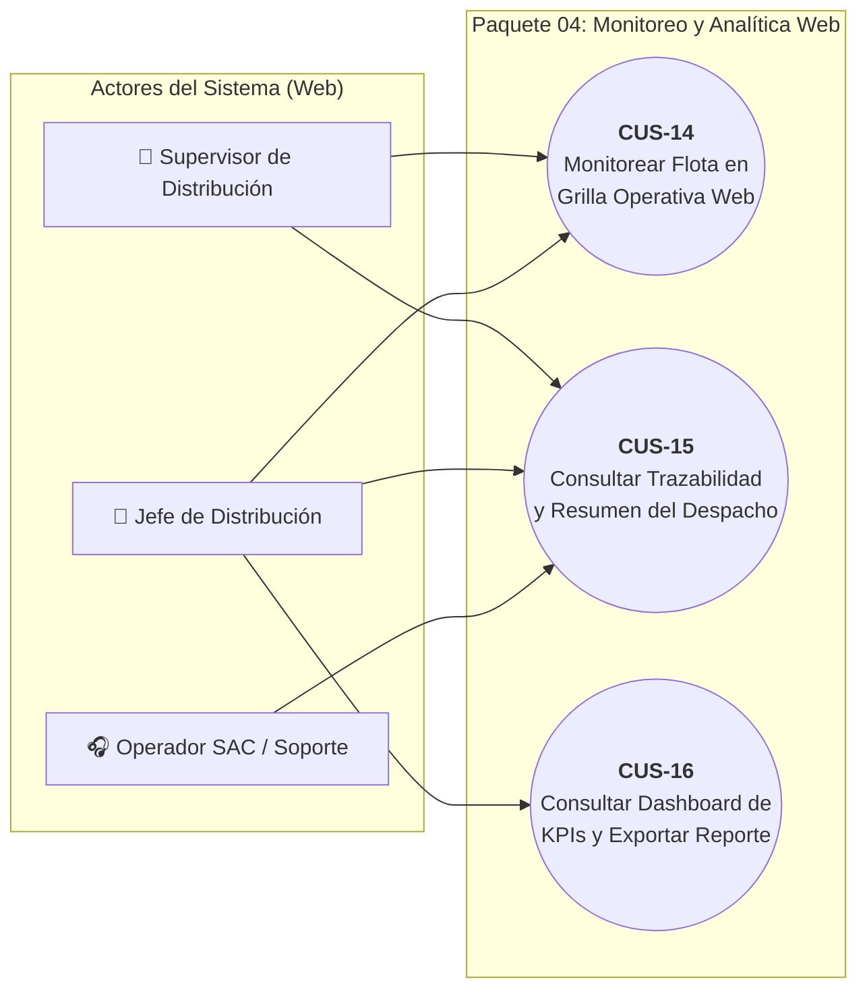
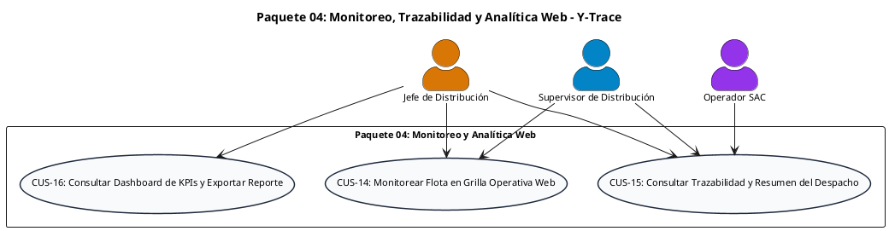

# Paquete 04: Monitoreo, Trazabilidad y Analítica Web (CUS)

> **Carpeta:** `Diagrama de Casos de Uso/`  
> **Documento:** `04_PAQUETE_MONITOREO_Y_ANALITICA_WEB.md`  
> **Curso:** Diseño e Implementación de Arquitectura Empresarial (UTP) — Entregable APF1 (Semanas 6 - 7)  
> **Proyecto:** Sistema Web y Móvil para la Gestión y Trazabilidad de Despachos y Entregas de Yanbal Perú (Y-Trace)  
> **Estándar:** UML 2.5 / RUP (Sesión 8 — Plantilla Oficial de Casos de Uso UTP)  
> **Requerimientos Asociados:** RF022, RF023, RF024 | RNF010, RNF011, RNF015, RNF016, RNF018, RNF021

---

## 1. Diagrama de Casos de Uso del Paquete

### 1.1 Diagrama Visual Interactivo (Mermaid)

---

### 1.2 Código Oficial PlantUML

---

## 2. Fichas Técnicas Estandarizadas de Casos de Uso (Formato UTP)

### Ficha Técnica: CUS-14 — Monitorear Flota en Grilla Operativa Web

| Campo | Detalle de la Especificación |
| :--- | :--- |
| **Código y Nombre:** | `CUS-14 - Monitorear Flota en Grilla Operativa Web` |
| **Actores:** | `Supervisor de Distribución`, `Jefe de Distribución`. |
| **Descripción:** | Proceso que provee a la Torre de Control de Yanbal una grilla tabular operativa de monitoreo en tiempo real, visualizando para cada despacho activo: código de despacho, placa del vehículo, conductor, destino departamental, estado operativo con semáforo cromático, última coordenada GPS registrada y tiempo transcurrido desde el último reporte (antigüedad de telemetría). |
| **Precondiciones:** | 1. El usuario debe estar autenticado con rol de Supervisor de Distribución o Jefe de Distribución.   2. Deben existir despachos activos en seguimiento (`EN_RUTA` o `EN_DESTINO`). |
| **Flujo Normal:** | **1.** El usuario accede a la vista de *"Torre de Control / Monitoreo en Vivo"* en la plataforma Web.   **2.** El sistema consulta y despliega la grilla operativa con actualización periódica automática cada 60 segundos.   **3.** Para cada despacho en tránsito, el sistema presenta:   &nbsp;&nbsp;&nbsp;&nbsp;a) Código de Despacho y Placa de la unidad pesada.   &nbsp;&nbsp;&nbsp;&nbsp;b) Empresa del socio logístico y nombre del conductor.   &nbsp;&nbsp;&nbsp;&nbsp;c) Destino departamental y cantidad consolidada de bultos.   &nbsp;&nbsp;&nbsp;&nbsp;d) **Semáforo operativo de estado:** Verde (`EN_RUTA`), Amarillo (`EN_DESTINO`), Gris (`FINALIZADO`/`DESPACHO_CANCELADO`).   &nbsp;&nbsp;&nbsp;&nbsp;e) Última coordenada satelital GPS conocida (latitud, longitud).   &nbsp;&nbsp;&nbsp;&nbsp;f) Hora del último reporte recibido y cálculo de antigüedad en minutos (ej. *"Hace 8 min"*, *"Hace 25 min"*).   **4.** El usuario filtra por socio logístico, departamento de destino o busca por placa vehicular / código de despacho.   **5.** El sistema filtra los registros en pantalla en menos de 300 ms sin recargar la página completa.   **6.** El usuario puede hacer clic en un despacho para saltar directamente a su línea de tiempo detallada (`CUS-15`). |
| **Flujos Alternativos:** | **2.1. Despliegue de antigüedad de reporte:** El sistema calcula de forma continua la diferencia temporal entre la hora actual del servidor y la marca temporal de la última telemetría GPS recibida (`captured_at`), mostrando el tiempo transcurrido en minutos en la columna de antigüedad con fines de supervisión informativa de la frescura del dato, sin generar alarmas ni alertas automáticas de interrupción (conforme al alcance estricto de RF022).   **4.1. Búsqueda sin coincidencias:** Si los filtros aplicados no coinciden con unidades activas, la grilla muestra: *"No se registran despachos activos bajo los criterios seleccionados"*. |
| **Postcondiciones:** | El Supervisor y Jefe de Distribución obtienen visibilidad integral y oportuna de la posición y estado de la flota troncal sin depender de llamadas telefónicas manuales. |
| **Requerimientos Funcionales:** | **RF022** (Monitoreo operativo de flota en Torre de Control Web). |
| **Requerimientos No Funcionales:** | • **RNF010 (Disponibilidad Operativa Web):** Uptime del panel de monitoreo $\ge 99.5\%$ en horario de distribución (06:00 a 21:00 h).   • **RNF011 (Capacidad y Escalabilidad Concurrente):** Capacidad de desplegar al menos 500 despachos activos concurrentes sin degradación de interfaz ($< 10\%$).   • **RNF016 (Compatibilidad de Plataforma Cliente Web):** Consola operativa compatible con navegadores de escritorio estándar (Google Chrome 90+, Microsoft Edge 90+, Mozilla Firefox 88+).   • **RNF021 (Accesibilidad Web WCAG 2.1 AA):** Contraste mínimo $\ge 4.5:1$ en tablas, navegación por teclado y soporte para lectores de pantalla. |

---

### Ficha Técnica: CUS-15 — Consultar Trazabilidad y Resumen del Despacho

| Campo | Detalle de la Especificación |
| :--- | :--- |
| **Código y Nombre:** | `CUS-15 - Consultar Trazabilidad y Resumen del Despacho` |
| **Actores:** | `Supervisor de Distribución`, `Operador SAC / Soporte Logístico`, `Jefe de Distribución`. |
| **Descripción:** | Proceso mediante el cual el personal operativo o de atención al cliente consulta la traza histórica certificada y unificada de un despacho mediante su código o placa, visualizando el timeline cronológico completo de hitos, coordenadas GPS, duraciones de traslado y resultado final en menos de 2.0 segundos, resolviendo el desfase informativo ante reclamos de clientes. |
| **Precondiciones:** | 1. El usuario debe estar autenticado con rol de Supervisor, Operador SAC o Jefe de Distribución.   2. El despacho consultado debe existir en el repositorio de auditoría de Y-Trace. |
| **Flujo Normal:** | **1.** El Operador SAC, Supervisor o Jefe ingresa al módulo de *"Consulta de Trazabilidad e Historial"*.   **2.** El usuario ingresa el Código de Despacho (ej. `D-2026-001`) o la Placa del Vehículo en la barra de búsqueda indexada y pulsa *"Buscar"*.   **3.** El sistema consulta los índices B-Tree optimizados en base de datos y recupera la totalidad de la traza en un tiempo inferior a 2.0 segundos (`RNF015`).   **4.** El sistema presenta la ficha consolidada del despacho dividida en dos secciones:   &nbsp;&nbsp;&nbsp;&nbsp;a) **Encabezado Resumen:** Origen, destino, bultos, transportista, estado final (`FINALIZADO` / `DESPACHO_CANCELADO`), duración total del viaje y fecha/hora de resolución.   &nbsp;&nbsp;&nbsp;&nbsp;b) **Línea de Tiempo Forense (Timeline Cronológico):** Secuencia inmutable paso a paso con fecha, hora exacta, evento (`HABILITACION_SEGUIMIENTO`, `EN_RUTA`, puntos `GPS_TRACKING` en ruta, `EN_DESTINO`, `ENTREGADO` / `NO_ENTREGADO` con causal, `CIERRE` o `CANCELACION` con motivo justificado) y coordenadas GPS atómicas.   **5.** El Operador SAC utiliza la información certera para responder de inmediato la consulta o reclamo del cliente/consultora sin necesidad de realizar llamadas telefónicas a distribución. |
| **Flujos Alternativos:** | **2.1. Despacho no encontrado:** Si el código ingresado no existe en el sistema, la plataforma muestra: *"No se encontró ningún despacho con el identificador ingresado. Verifique el dato"*.   **4.1. Despacho cancelado forzosamente:** Si el despacho fue cancelado en carretera (`RF009`), el timeline muestra en rojo el evento `DESPACHO_CANCELADO`, detallando el motivo registrado por el Supervisor y las coordenadas del último punto antes de la interrupción.   **4.2. Despacho rechazado en destino:** Si la entrega no fue conforme (`RF017`), el sistema muestra la causal tipificada de rechazo y el detalle registrado por el conductor en destino. |
| **Postcondiciones:** | El usuario obtiene una respuesta certera e inmutable del estado y recorrido del pedido en tiempo real, respaldada por datos estructurados y estampas atómicas sin archivos multimedia (*cero fotos / cero POD*). |
| **Requerimientos Funcionales:** | **RF023** (Consulta de trazabilidad y resumen del despacho). |
| **Requerimientos No Funcionales:** | • **RNF015 (Tiempo de Respuesta en Consulta de Trazabilidad):** Recuperación y despliegue del historial completo en $< 2.0$ segundos bajo base de datos indexada sobre al menos 1,000,000 de registros.   • **RNF016 (Compatibilidad de Plataforma Cliente):** Visualización sin distorsiones en navegadores web de escritorio estándar.   • **RNF018 (Retención y Eliminación de Registros Operativos):** Histórico de trazabilidad disponible para consulta en línea por el plazo corporativo de 24 meses.   • **RNF021 (Accesibilidad Web WCAG 2.1 AA):** Timeline accesible con estructura semántica para lectores de pantalla y navegación por teclado. |

---

### Ficha Técnica: CUS-16 — Consultar Dashboard de KPIs y Exportar Reporte Ejecutivo

| Campo | Detalle de la Especificación |
| :--- | :--- |
| **Código y Nombre:** | `CUS-16 - Consultar Dashboard de KPIs y Exportar Reporte Ejecutivo` |
| **Actores:** | `Jefe de Distribución`. |
| **Descripción:** | Proceso analítico mediante el cual la Jefatura de Distribución visualiza indicadores clave de desempeño logístico (Lead Time de traslado, tasa de puntualidad, tasa de entregas conformes y tasa de cancelaciones) filtrando por socio logístico o período, y genera la exportación del reporte ejecutivo exclusivamente en formato Excel (`.xlsx`). |
| **Precondiciones:** | 1. El usuario debe estar autenticado con rol de Jefe de Distribución.   2. Deben existir despachos finalizados o cancelados en el período analizado. |
| **Flujo Normal:** | **1.** El Jefe de Distribución accede al módulo de *"Dashboard Gerencial de KPIs"*.   **2.** El sistema procesa y presenta las tarjetas métricas consolidadas:   &nbsp;&nbsp;&nbsp;&nbsp;a) **Lead Time Promedio de Traslado:** Tiempo medio transcurrido entre `EN_RUTA` y `EN_DESTINO` por ruta departamental.   &nbsp;&nbsp;&nbsp;&nbsp;b) **Tasa de Entregas Conformes (OTIF B2B):** Porcentaje de despachos con resultado `ENTREGADO` frente al total despachado.   &nbsp;&nbsp;&nbsp;&nbsp;c) **Tasa de No Entregas / Rechazos:** Porcentaje de despachos `NO_ENTREGADO` categorizados por causal.   &nbsp;&nbsp;&nbsp;&nbsp;d) **Métrica de Cancelaciones Forzadas:** Contabilización separada de despachos en `DESPACHO_CANCELADO` (excluidos del cálculo de Lead Time regular).   &nbsp;&nbsp;&nbsp;&nbsp;e) **Ranking de Desempeño por Empresa Transportista:** Comparativa de cumplimiento por proveedor logístico.   **3.** El usuario define filtros por rango de fechas (mes/campaña), socio logístico o departamento de destino.   **4.** El sistema recalcula y actualiza los gráficos y tablas en pantalla en menos de 2.0 segundos.   **5.** El usuario pulsa el botón *"Exportar Reporte a Excel"*.   **6.** El sistema genera un libro de cálculo en formato nativo `.xlsx` estructurado con pestañas de resumen gerencial y detalle fila por fila de los despachos analizados.   **7.** El navegador inicia la descarga directa del archivo Excel generado. |
| **Flujos Alternativos:** | **3.1. Rango de fechas sin operaciones:** Si el período seleccionado no contiene despachos cerrados, el dashboard muestra las métricas en cero con la leyenda: *"No se registran despachos cerrados en el rango de fechas seleccionado"*.   **5.1. Solicitud de exportación masiva (> 10,000 registros):** El sistema procesa la exportación mediante streaming asíncrono para evitar agotar la memoria del servidor, habilitando la descarga al completarse. |
| **Postcondiciones:** | La Jefatura de Distribución dispone de métricas cuantitativas objetivas para la evaluación contractual de los socios logísticos y descarga el archivo Excel oficial para auditorías y comités de gestión. |
| **Requerimientos Funcionales:** | **RF024** (Cálculo y despliegue de KPIs de cumplimiento logístico). |
| **Requerimientos No Funcionales:** | • **RNF010 (Disponibilidad Operativa Web):** Plataforma analítica disponible de 06:00 a 21:00 h con uptime $\ge 99.5\%$.   • **RNF015 (Tiempo de Respuesta en Consulta Analítica):** Agregación de métricas de hasta 50,000 despachos en $< 2.0$ segundos.   • **RNF016 (Compatibilidad de Plataforma Cliente):** Despliegue responsivo de gráficos y tablas en navegadores web de escritorio estándar.   • **RNF021 (Accesibilidad Web WCAG 2.1 AA):** Paleta de colores de gráficos con contraste suficiente ($\ge 3:1$) y tablas accesibles. |
