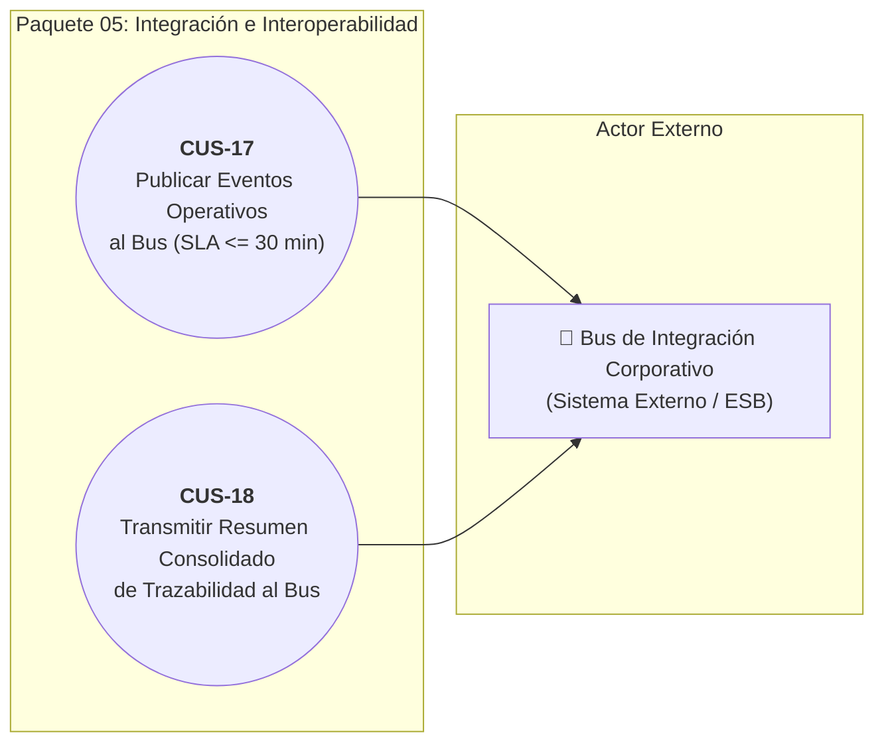
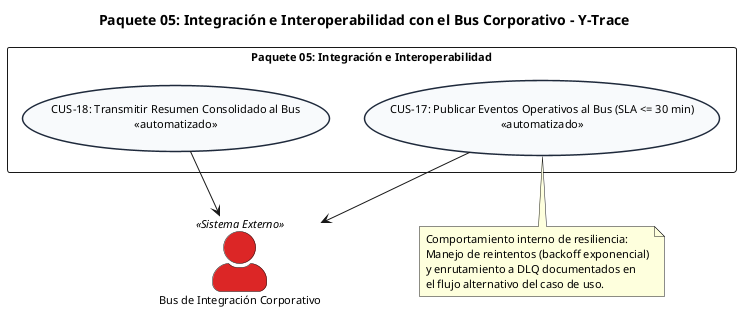

# Paquete 05: Integración e Interoperabilidad con el Bus Corporativo (CUS)

> **Carpeta:** `Diagrama de Casos de Uso/`  
> **Documento:** `05_PAQUETE_INTEGRACION_BUS_CORPORATIVO.md`  
> **Curso:** Diseño e Implementación de Arquitectura Empresarial (UTP) — Entregable APF1 (Semanas 6 - 7)  
> **Proyecto:** Sistema Web y Móvil para la Gestión y Trazabilidad de Despachos y Entregas de Yanbal Perú (Y-Trace)  
> **Estándar:** UML 2.5 / RUP (Sesión 8 — Plantilla Oficial de Casos de Uso UTP)  
> **Requerimientos Asociados:** RF025, RF026 | RNF005, RNF006, RNF013, RNF017, RNF018

---

## 1. Diagrama de Casos de Uso del Paquete

### 1.1 Diagrama Visual Interactivo (Mermaid)

> **Nota de Conformidad UML 2.5:**
> 1. **Frontera del Sistema vs. Actor:** El backend de Y-Trace es el sistema en desarrollo (*System Boundary*), por lo que no se modela como actor. El único actor externo es el **Bus de Integración Corporativo**, que actúa como sistema receptor externo de los mensajes de integración.
> 2. **Comportamiento Interno de Resiliencia (DLQ y Reintentos):** La política de reintentos con retroceso exponencial (*Exponential Backoff*) y la derivación a la cola de mensajes no entregados (*Dead Letter Queue — DLQ*) constituyen comportamientos internos de resiliencia del sistema ante caídas del Bus y se especifican formalmente dentro de los flujos alternativos de `CUS-17` y `CUS-18`, evitando crear casos de uso artificiales fuera del estándar.

---

### 1.2 Código Oficial PlantUML

---

## 2. Fichas Técnicas Estandarizadas de Casos de Uso (Formato UTP)

### Ficha Técnica: CUS-17 — Publicar Eventos Operativos de Despacho al Bus Corporativo

| Campo | Detalle de la Especificación |
| :--- | :--- |
| **Código y Nombre:** | `CUS-17 - Publicar Eventos Operativos de Despacho al Bus Corporativo` |
| **Actores:** | `Bus de Integración Corporativo (Sistema Externo)`.   *(Iniciado internamente de forma automatizada por el Sistema Y-Trace ante inserción de eventos elegibles)*. |
| **Descripción:** | Proceso automatizado mediante el cual el sistema Y-Trace formatea y publica hacia el Bus de Integración de Yanbal los eventos de estado e hitos operativos canónicos (`EN_RUTA`, `EN_DESTINO`, `ENTREGADO`, `NO_ENTREGADO`, `DESPACHO_CANCELADO`) en formato JSON estandarizado, garantizando un tiempo máximo de entrega menor o igual a 30 minutos desde su registro en el backend, resolviendo el desfase informativo actual del negocio (PR-03 / PR-04). |
| **Precondiciones:** | 1. El backend de Y-Trace debe haber persistido con éxito un evento operativo de despacho elegible.   2. El canal de comunicación seguro (mTLS / TLS 1.3 con API Gateway o cola de mensajería del Bus) debe estar configurado.   *(Nota: El hito interno de control previo `HABILITACION_SEGUIMIENTO` no se publica al Bus)*. |
| **Flujo Normal:** | **1.** El sistema backend detecta la inserción de un nuevo evento operativo elegible para publicación:   &nbsp;&nbsp;&nbsp;&nbsp;• `EN_RUTA` (Hito de salida de andén y partida de la unidad).   &nbsp;&nbsp;&nbsp;&nbsp;• `EN_DESTINO` (Llegada física certificada por geocerca).   &nbsp;&nbsp;&nbsp;&nbsp;• `ENTREGADO` (Conformidad consciente manual de recepción).   &nbsp;&nbsp;&nbsp;&nbsp;• `NO_ENTREGADO` (Rechazo o entrega fallida con causal estructurada).   &nbsp;&nbsp;&nbsp;&nbsp;• `DESPACHO_CANCELADO` (Cancelación forzada ejecutada por el Supervisor).   **2.** El módulo de integración recupera el evento y genera el payload JSON canónico validándolo contra el esquema oficial (`RNF017`).   **3.** El payload incluye obligatoriamente: identificador de mensaje unívoco (`message_id` UUIDv4), código de despacho (`codigo_despacho`), tipo de evento, fecha/hora atómica de captura (`captured_at`), coordenadas satelitales (latitud, longitud), identificador del transportista y causal/motivo si corresponde.   **4.** El sistema encola el mensaje en la cola transaccional de salida de Y-Trace.   **5.** El despachador de eventos transmite el mensaje al Bus de Integración mediante protocolo seguro HTTPS/REST.   **6.** El Bus corporativo procesa el evento y retorna acuse de recibo conforme (código HTTP 200/202).   **7.** El sistema registra el acuse de recibo y la estampa de tiempo de entrega al Bus, verificando que el tiempo transcurrido desde la captura del evento sea menor o igual a 30 minutos (`RNF006`).   **8.** Los sistemas corporativos de Yanbal (SAP R/3, Maya, Drivin/ENSDY) consumen el evento desde el Bus y actualizan sus estados sincronizados. |
| **Flujos Alternativos:** | **6.1. Indisponibilidad o timeout en el Bus corporativo (Comportamiento Interno de Reintentos y DLQ):**   &nbsp;&nbsp;&nbsp;&nbsp;6.1.1. Si el Bus no responde o emite error HTTP 5xx, el sistema retiene el mensaje en su cola interna de salida.   &nbsp;&nbsp;&nbsp;&nbsp;6.1.2. El sistema aplica política interna de reintentos automáticos con retroceso exponencial (*Exponential Backoff con Jitter*) a los 1, 3, 5 y 10 minutos.   &nbsp;&nbsp;&nbsp;&nbsp;6.1.3. Tras agotar 5 reintentos fallidos sin superar el SLA global de 30 minutos, el sistema transfiere el mensaje a una cola de mensajes no entregados (*Dead Letter Queue — DLQ*) y registra una alerta en la bitácora técnica de integración.   **6.2. Envío duplicado por reintento de red:** El payload contiene un identificador universal único inmutable (`message_id` UUIDv4); si el Bus procesa un mensaje repetido, lo identifica de forma idempotente sin alterar los sistemas externos (`RNF013`). |
| **Postcondiciones:** | El evento operativo queda aceptado formalmente por el Bus corporativo con acuse de recibo registrado en la bitácora de auditoría de Y-Trace; la información del estado se propaga a los sistemas corporativos dentro del SLA de 30 minutos. |
| **Requerimientos Funcionales:** | **RF025** (Publicación de eventos de despacho al Bus de Integración). |
| **Requerimientos No Funcionales:** | • **RNF005 (Inmutabilidad e Integridad de Eventos):** Payloads JSON emitidos estrictamente basados en eventos append-only.   • **RNF006 (Latencia Máxima hacia el Bus):** 100% de los eventos aceptados por el Bus dentro de un SLA $\le 30$ minutos desde la recepción en backend.   • **RNF013 (Idempotencia y Garantía de Entrega):** Soporte de claves de idempotencia UUIDv4 para evitar duplicados en la integración.   • **RNF017 (Estandarización de Formatos de Intercambio JSON Canónico):** Payloads estructurados en JSON conforme al esquema canónico establecido para interoperabilidad con el Bus corporativo bajo codificación UTF-8. |

---

### Ficha Técnica: CUS-18 — Transmitir Resumen Consolidado de Trazabilidad al Bus Corporativo

| Campo | Detalle de la Especificación |
| :--- | :--- |
| **Código y Nombre:** | `CUS-18 - Transmitir Resumen Consolidado de Trazabilidad al Bus Corporativo` |
| **Actores:** | `Bus de Integración Corporativo (Sistema Externo)`.   *(Iniciado internamente de forma automatizada por el Sistema Y-Trace al culminar el ciclo de vida del despacho)*. |
| **Descripción:** | Proceso automatizado mediante el cual el backend de Y-Trace compila y transmite al Bus de Integración el expediente digital completo y estructurado de la trazabilidad del despacho una vez que este ha alcanzado un estado terminal (`FINALIZADO` o `DESPACHO_CANCELADO`), proveyendo a los sistemas centrales de Yanbal los datos finales necesarios para sus procesos posteriores de liquidación de transporte, conciliación administrativa o auditoría patrimonial en SAP R/3, sin que Y-Trace ejecute liquidaciones económicas ni documentales. |
| **Precondiciones:** | 1. El despacho debe encontrarse en estado definitivo e inmutable: `FINALIZADO` (`CUS-12`) o `DESPACHO_CANCELADO` (`CUS-05`).   2. Todos los eventos individuales del ciclo de vida del despacho deben haber sido persistidos en el backend. |
| **Flujo Normal:** | **1.** El sistema detecta la transición del despacho a `FINALIZADO` o `DESPACHO_CANCELADO`.   **2.** El motor de integración recopila todos los hitos y métricas del ciclo de vida del despacho:   &nbsp;&nbsp;&nbsp;&nbsp;a) Metadatos: Código de despacho, orden de origen, fecha/hora de habilitación.   &nbsp;&nbsp;&nbsp;&nbsp;b) Salida: Fecha, hora y coordenada atómica de partida de CD Lurín (`EN_RUTA`).   &nbsp;&nbsp;&nbsp;&nbsp;c) Recorrido: Cantidad total de coordenadas GPS registradas, distancia total recorrida y tiempo total de tránsito (Lead Time).   &nbsp;&nbsp;&nbsp;&nbsp;d) Llegada: Fecha, hora y validación de ingreso a geocerca de destino (`EN_DESTINO`).   &nbsp;&nbsp;&nbsp;&nbsp;e) Resolución: Estado final (`ENTREGADO` con fecha/hora o `NO_ENTREGADO` con causal tipificada y detalle, o `DESPACHO_CANCELADO` con motivo justificado y usuario responsable).   &nbsp;&nbsp;&nbsp;&nbsp;f) Cierre: Fecha y hora de extinción formal de sesión.   **3.** El sistema compila la estructura canónica del resumen en formato JSON consolidado y firma digitalmente el payload con hash SHA-256 para certificar integridad.   **4.** El sistema transmite el expediente estructurado hacia el endpoint asignado en el Bus de Integración.   **5.** El Bus corporativo valida el esquema, almacena el resumen y emite confirmación de recepción satisfactoria (HTTP 200 OK).   **6.** El sistema registra la confirmación en la bitácora de integraciones con fecha, hora y código de transacción externo.   **7.** El Bus distribuye el resumen consolidado hacia SAP R/3 y los módulos de finanzas para que estos ejecuten, en sus propios sistemas, la conciliación y liquidación del transportista. |
| **Flujos Alternativos:** | **5.1. Caída temporal del Bus al cierre (Comportamiento Interno de Reintentos):** El resumen consolidado queda resguardado en la base de datos de Y-Trace con bandera de sincronización pendiente; el servicio interno de integración reintenta el envío de forma asíncrona mediante retroceso exponencial hasta obtener confirmación de recepción.   **5.2. Despacho cancelado forzosamente:** El resumen incluye exclusivamente los hitos acontecidos hasta el momento de la interrupción, omitiendo arribo y entrega, e incorporando el motivo de cancelación y la última coordenada transmitida. |
| **Postcondiciones:** | El expediente completo de trazabilidad del despacho queda entregado y respaldado en el Bus corporativo para consumo de los sistemas centrales de Yanbal; Y-Trace retiene la copia inmutable en su repositorio histórico por 24 meses (`RNF018`). |
| **Requerimientos Funcionales:** | **RF026** (Envío de resumen de trazabilidad del despacho al Bus de Integración). |
| **Requerimientos No Funcionales:** | • **RNF005 (Inmutabilidad e Integridad de Eventos):** Resumen consolidado certificado mediante hash SHA-256 contra alteraciones.   • **RNF006 (Latencia Máxima hacia el Bus):** Transmisión oportuna del expediente terminal hacia el Bus corporativo.   • **RNF013 (Idempotencia y Garantía de Entrega):** Capacidad de retransmisión segura sin duplicar cierres en el ERP central.   • **RNF017 (Estandarización de Formatos de Intercambio JSON Canónico):** Expediente estructurado conforme a la especificación JSON canónica del Bus corporativo.   • **RNF018 (Retención y Eliminación de Registros Operativos):** Expediente digital resguardado por política corporativa de 24 meses en Y-Trace. |
