Esta sería una versión más sólida para tu entrega:

```plantuml
@startuml Diagrama_Objetos_Y_Trace

title Diagrama de Objetos — Y-Trace
caption Instancia de una operación de despacho y trazabilidad

skinparam shadowing false
skinparam defaultFontName Arial
skinparam defaultFontSize 11
skinparam objectAttributeIconSize 0
skinparam linetype ortho
skinparam nodesep 40
skinparam ranksep 45

' =========================================================
' PROVEEDOR DE TRANSPORTE
' =========================================================

object "transportista01 : EmpresaTransportista" as transportista01 {
    ruc = "XXXXXXXXXXX"
    razon_social = "Transportista Ejemplo S.A.C."
}

object "vehiculo01 : Vehiculo" as vehiculo01 {
    placa = "ABC-123"
}

object "conductor01 : Conductor" as conductor01 {
    dni = "XXXXXXXX"
    nombres = "Juan"
    apellidos = "Pérez"
}

' =========================================================
' DESPACHO
' =========================================================

object "despacho01 : Despacho" as despacho01 {
    codigo_despacho = "D-2026-001"
    origen = "CD Lurín"
    destino = "Destino de ejemplo"
    cantidad_bultos = 25
    estado_operativo = EN_RUTA
    fecha_creacion = "17/09/2026 08:00"
}

' =========================================================
' CÓDIGO DE ACTIVACIÓN
' =========================================================

object "codigo01 : CodigoActivacion" as codigo01 {
    codigo_alfanumerico = "YT-8K4P2"
    fecha_expiracion = "17/09/2026 10:00"
    intentos_fallidos = 0
    estado = CONSUMIDO
}

' =========================================================
' EVENTOS
' =========================================================

object "evento01 : EventoOperativo" as evento01 {
    tipo_evento = SALIDA
    fecha_hora = "17/09/2026 08:15"
    latitud = -12.045
    longitud = -76.925
    nivel_precision = 8.5
}

object "evento02 : EventoOperativo" as evento02 {
    tipo_evento = GPS_TRACKING
    fecha_hora = "17/09/2026 08:30"
    latitud = -12.050
    longitud = -76.910
    nivel_precision = 7.2
}

object "evento03 : EventoOperativo" as evento03 {
    tipo_evento = GPS_TRACKING
    fecha_hora = "17/09/2026 09:15"
    latitud = -12.065
    longitud = -77.000
    nivel_precision = 6.9
}

' =========================================================
' ENTREGA
' =========================================================

object "entrega01 : Entrega" as entrega01 {
    fecha_llegada = "17/09/2026 09:45"
    fecha_confirmacion = null
    estado = PENDIENTE
}

' =========================================================
' INCIDENCIA
' =========================================================

object "incidencia01 : Incidencia" as incidencia01 {
    tipo_incidencia = BLOQUEO_VIAL
    descripcion = "Demora por bloqueo de vía"
    fecha_hora = "17/09/2026 09:00"
    latitud = -12.070
    longitud = -77.020
}

' =========================================================
' EVIDENCIA
' =========================================================

object "evidencia01 : EvidenciaFotografica" as evidencia01 {
    url_cloud_storage = "cloud://evidencia/001"
    tipo_evidencia = CARGA_RECHAZADA
    fecha_hora_captura = "17/09/2026 09:02"
}

' =========================================================
' USUARIO WEB
' =========================================================

object "usuario01 : UsuarioWeb" as usuario01 {
    username = "supervisor01"
    nombres_apellidos = "Supervisor de Operaciones"
    rol = SUPERVISOR
}

' =========================================================
' RELACIONES
' =========================================================

' Recursos proporcionados por el transportista
transportista01 o-- vehiculo01 : dispone de
transportista01 o-- conductor01 : dispone de

' Recursos asignados al despacho
despacho01 --> vehiculo01 : utiliza
despacho01 --> conductor01 : asigna

' Activación del despacho
despacho01 *-- codigo01 : habilita

' Trazabilidad
despacho01 *-- evento01 : registra
despacho01 *-- evento02 : registra
despacho01 *-- evento03 : registra

' Resultado
despacho01 *-- entrega01 : contiene

' Incidencia
despacho01 *-- incidencia01 : registra

' Evidencia
incidencia01 o-- evidencia01 : tiene

' Gestión desde la web
usuario01 --> despacho01 : gestiona / consulta

' =========================================================
' NOTAS
' =========================================================

note top of transportista01
Proveedor / empresa transportista
que participa en la operación.
No implica propiedad de Yanbal.
end note

note right of despacho01
Instancia concreta de un despacho
en estado EN_RUTA.
end note

note right of codigo01
Código utilizado correctamente.
Por ser de un solo uso:
CONSUMIDO.
end note

note bottom of evento02
Registro de posición GPS
durante el recorrido.
end note

note right of entrega01
Llegada registrada.
La confirmación final
todavía está pendiente.
end note

@enduml
```



La estructura conceptual queda así:

```text
                 ┌──────────────────────────────┐
                 │ EmpresaTransportista         │
                 │ transportista01              │
                 └──────────────┬───────────────┘
                                │
                    ┌───────────┴───────────┐
                    ▼                       ▼
             ┌─────────────┐        ┌─────────────┐
             │ vehiculo01  │        │ conductor01 │
             └──────┬──────┘        └──────┬──────┘
                    │                      │
                    └──────────┬───────────┘
                               ▼
                     ┌─────────────────┐
                     │   despacho01    │
                     │   D-2026-001    │
                     └───────┬─────────┘
                             │
          ┌──────────────────┼─────────────────────┐
          ▼                  ▼                     ▼
   ┌─────────────┐   ┌───────────────┐    ┌───────────────┐
   │ codigo01    │   │ evento01..03  │    │ incidencia01  │
   └─────────────┘   └───────────────┘    └───────┬───────┘
                                                  │
                                                  ▼
                                         ┌────────────────┐
                                         │ evidencia01    │
                                         └────────────────┘

                             │
                             ▼
                      ┌──────────────┐
                      │  entrega01   │
                      └──────────────┘

        usuario01 ────────────────> despacho01
```
