# Diagrama de Objetos — Y-Trace

## 1. Información del documento

**Proyecto:** Sistema Web y Móvil para la Gestión y Trazabilidad de Despachos y Entregas de Yanbal Perú  
**Sistema:** Y-Trace  
**Modelo UML:** Diagrama de Objetos  
**Nivel:** Instancias del dominio  
**Propósito:** Representar una situación concreta de una operación de despacho y trazabilidad.

---

## 2. Propósito del Diagrama de Objetos

El **Diagrama de Objetos** representa una fotografía de una situación concreta del sistema en un momento determinado.

A diferencia del **Diagrama de Clases**, que describe las estructuras generales del dominio, el Diagrama de Objetos muestra **instancias concretas de esas clases**, identificadas mediante nombres de objetos y acompañadas de valores específicos en sus atributos.

En Y-Trace, el diagrama permite demostrar cómo las entidades identificadas en el modelo de dominio se encuentran relacionadas durante una operación concreta de despacho.

La instancia representada contempla:

- Una empresa transportista participante.
- Un vehículo asignado.
- Un conductor asignado.
- Un despacho en ejecución.
- Un código de activación utilizado.
- Varios eventos de trazabilidad.
- Una entrega con llegada registrada.
- Una incidencia ocurrida durante el recorrido.
- Una evidencia fotográfica asociada.
- Un usuario web que consulta o gestiona el despacho.

---

## 3. ¿Por qué se utiliza un Diagrama de Objetos en Y-Trace?

El Diagrama de Objetos permite validar que el **Modelo de Dominio** puede representarse mediante instancias concretas.

El Diagrama de Clases responde principalmente a:

> ¿Qué entidades existen y cómo se relacionan?

Mientras que el Diagrama de Objetos responde a:

> ¿Cómo se ven esas entidades en una situación concreta?

Por ejemplo, una clase general:

```text
Despacho
- codigo_despacho
- estado_operativo
- fecha_creacion
```

se representa en un escenario concreto como:

```text
despacho01 : Despacho
- codigo_despacho = "D-2026-001"
- estado_operativo = EN_RUTA
- fecha_creacion = "17/09/2026 08:00"
```

Por esta razón, este diagrama es útil dentro del modelado UML del proyecto: permite mostrar una instancia verificable del proceso sin entrar todavía en detalles de implementación técnica.

---

## 4. Diagrama de Objetos

La versión base proporcionada para el proyecto es la siguiente:

Esta sería una versión más sólida para tu entrega:

```plantuml
@startuml Diagrama_Objetos_Y_Trace

title Diagrama de Objetos — Y-Trace
caption Instancia de una operación de despacho y trazabilidad

skinparam shadowing false
skinparam defaultFontName Arial
skinparam defaultFontSize 11
skinparam objectAttributeIconSize 0
skinparam linetype ortho
skinparam nodesep 40
skinparam ranksep 45

' =========================================================
' PROVEEDOR DE TRANSPORTE
' =========================================================

object "transportista01 : EmpresaTransportista" as transportista01 {
    ruc = "XXXXXXXXXXX"
    razon_social = "Transportista Ejemplo S.A.C."
}

object "vehiculo01 : Vehiculo" as vehiculo01 {
    placa = "ABC-123"
}

object "conductor01 : Conductor" as conductor01 {
    dni = "XXXXXXXX"
    nombres = "Juan"
    apellidos = "Pérez"
}

' =========================================================
' DESPACHO
' =========================================================

object "despacho01 : Despacho" as despacho01 {
    codigo_despacho = "D-2026-001"
    origen = "CD Lurín"
    destino = "Destino de ejemplo"
    cantidad_bultos = 25
    estado_operativo = EN_RUTA
    fecha_creacion = "17/09/2026 08:00"
}

' =========================================================
' CÓDIGO DE ACTIVACIÓN
' =========================================================

object "codigo01 : CodigoActivacion" as codigo01 {
    codigo_alfanumerico = "YT-8K4P2"
    fecha_expiracion = "17/09/2026 10:00"
    intentos_fallidos = 0
    estado = CONSUMIDO
}

' =========================================================
' EVENTOS
' =========================================================

object "evento01 : EventoOperativo" as evento01 {
    tipo_evento = SALIDA
    fecha_hora = "17/09/2026 08:15"
    latitud = -12.045
    longitud = -76.925
    nivel_precision = 8.5
}

object "evento02 : EventoOperativo" as evento02 {
    tipo_evento = GPS_TRACKING
    fecha_hora = "17/09/2026 08:30"
    latitud = -12.050
    longitud = -76.910
    nivel_precision = 7.2
}

object "evento03 : EventoOperativo" as evento03 {
    tipo_evento = GPS_TRACKING
    fecha_hora = "17/09/2026 09:15"
    latitud = -12.065
    longitud = -77.000
    nivel_precision = 6.9
}

' =========================================================
' ENTREGA
' =========================================================

object "entrega01 : Entrega" as entrega01 {
    fecha_llegada = "17/09/2026 09:45"
    fecha_confirmacion = null
    estado = PENDIENTE
}

' =========================================================
' INCIDENCIA
' =========================================================

object "incidencia01 : Incidencia" as incidencia01 {
    tipo_incidencia = BLOQUEO_VIAL
    descripcion = "Demora por bloqueo de vía"
    fecha_hora = "17/09/2026 09:00"
    latitud = -12.070
    longitud = -77.020
}

' =========================================================
' EVIDENCIA
' =========================================================

object "evidencia01 : EvidenciaFotografica" as evidencia01 {
    url_cloud_storage = "cloud://evidencia/001"
    tipo_evidencia = CARGA_RECHAZADA
    fecha_hora_captura = "17/09/2026 09:02"
}

' =========================================================
' USUARIO WEB
' =========================================================

object "usuario01 : UsuarioWeb" as usuario01 {
    username = "supervisor01"
    nombres_apellidos = "Supervisor de Operaciones"
    rol = SUPERVISOR
}

' =========================================================
' RELACIONES
' =========================================================

' Recursos proporcionados por el transportista
transportista01 o-- vehiculo01 : dispone de
transportista01 o-- conductor01 : dispone de

' Recursos asignados al despacho
despacho01 --> vehiculo01 : utiliza
despacho01 --> conductor01 : asigna

' Activación del despacho
despacho01 *-- codigo01 : habilita

' Trazabilidad
despacho01 *-- evento01 : registra
despacho01 *-- evento02 : registra
despacho01 *-- evento03 : registra

' Resultado
despacho01 *-- entrega01 : contiene

' Incidencia
despacho01 *-- incidencia01 : registra

' Evidencia
incidencia01 o-- evidencia01 : tiene

' Gestión desde la web
usuario01 --> despacho01 : gestiona / consulta

' =========================================================
' NOTAS
' =========================================================

note top of transportista01
Proveedor / empresa transportista
que participa en la operación.
No implica propiedad de Yanbal.
end note

note right of despacho01
Instancia concreta de un despacho
en estado EN_RUTA.
end note

note right of codigo01
Código utilizado correctamente.
Por ser de un solo uso:
CONSUMIDO.
end note

note bottom of evento02
Registro de posición GPS
durante el recorrido.
end note

note right of entrega01
Llegada registrada.
La confirmación final
todavía está pendiente.
end note

@enduml
```



La estructura conceptual queda así:

```text
                 ┌──────────────────────────────┐
                 │ EmpresaTransportista         │
                 │ transportista01              │
                 └──────────────┬───────────────┘
                                │
                    ┌───────────┴───────────┐
                    ▼                       ▼
             ┌─────────────┐        ┌─────────────┐
             │ vehiculo01  │        │ conductor01 │
             └──────┬──────┘        └──────┬──────┘
                    │                      │
                    └──────────┬───────────┘
                               ▼
                     ┌─────────────────┐
                     │   despacho01    │
                     │   D-2026-001    │
                     └───────┬─────────┘
                             │
          ┌──────────────────┼─────────────────────┐
          ▼                  ▼                     ▼
   ┌─────────────┐   ┌───────────────┐    ┌───────────────┐
   │ codigo01    │   │ evento01..03  │    │ incidencia01  │
   └─────────────┘   └───────────────┘    └───────┬───────┘
                                                  │
                                                  ▼
                                         ┌────────────────┐
                                         │ evidencia01    │
                                         └────────────────┘

                             │
                             ▼
                      ┌──────────────┐
                      │  entrega01   │
                      └──────────────┘

        usuario01 ────────────────> despacho01
```


---

## 5. Lectura general del escenario

El diagrama representa una instancia concreta de una operación de despacho.

La lectura del escenario es:

```text
EmpresaTransportista
        │
        ├── dispone de → Vehiculo
        │
        └── dispone de → Conductor
                              │
                              ▼
                         Despacho
                              │
          ┌───────────────────┼─────────────────────┐
          ▼                   ▼                     ▼
   CódigoActivacion      EventoOperativo        Incidencia
                                                    │
                                                    ▼
                                         EvidenciaFotografica

                         Despacho
                            │
                            ▼
                         Entrega

UsuarioWeb ───────────────→ Despacho
```

El `Despacho` es el objeto central porque concentra la operación que se desea rastrear.

---

## 6. Explicación de los objetos

### 6.1 `transportista01 : EmpresaTransportista`

Es una instancia concreta de `EmpresaTransportista`.

Representa a la empresa transportista que participa en la operación.

Atributos del ejemplo:

```text
ruc = "XXXXXXXXXXX"
razon_social = "Transportista Ejemplo S.A.C."
```

Los datos son ficticios y se utilizan únicamente para representar una instancia UML.

La relación:

```plantuml
transportista01 o-- vehiculo01 : dispone de
```

indica que el transportista dispone del vehículo utilizado.

Esto no significa que el vehículo sea necesariamente propiedad de Yanbal.

---

### 6.2 `vehiculo01 : Vehiculo`

Es una instancia concreta de la clase `Vehiculo`.

```text
placa = "ABC-123"
```

Su función dentro del escenario es representar el vehículo utilizado para ejecutar el despacho.

Relación:

```plantuml
despacho01 --> vehiculo01 : utiliza
```

Esto significa que el despacho utiliza ese vehículo.

---

### 6.3 `conductor01 : Conductor`

Representa al conductor asignado a la operación.

```text
dni = "XXXXXXXX"
nombres = "Juan"
apellidos = "Pérez"
```

La relación:

```plantuml
despacho01 --> conductor01 : asigna
```

indica que el conductor fue asignado al despacho.

---

### 6.4 `despacho01 : Despacho`

Es el **objeto principal del escenario**.

Representa una operación concreta de Y-Trace:

```text
codigo_despacho = "D-2026-001"
origen = "CD Lurín"
destino = "Destino de ejemplo"
cantidad_bultos = 25
estado_operativo = EN_RUTA
fecha_creacion = "17/09/2026 08:00"
```

A partir de este objeto se relacionan los elementos principales de la trazabilidad:

- Código de activación.
- Eventos operativos.
- Entrega.
- Incidencias.
- Vehículo.
- Conductor.

---

### 6.5 `codigo01 : CodigoActivacion`

Representa el código usado para habilitar la operación desde la aplicación móvil.

```text
codigo_alfanumerico = "YT-8K4P2"
fecha_expiracion = "17/09/2026 10:00"
intentos_fallidos = 0
estado = CONSUMIDO
```

El estado `CONSUMIDO` representa que el código ya fue utilizado correctamente.

La relación:

```plantuml
despacho01 *-- codigo01 : habilita
```

relaciona el código con la operación del despacho.

Además, el modelo mantiene la regla de que el código es de **un solo uso**.

---

## 7. Eventos de trazabilidad

Los objetos `evento01`, `evento02` y `evento03` son tres instancias diferentes de `EventoOperativo`.

### `evento01 : EventoOperativo`

```text
tipo_evento = SALIDA
fecha_hora = "17/09/2026 08:15"
```

Representa el registro de salida.

### `evento02 : EventoOperativo`

```text
tipo_evento = GPS_TRACKING
fecha_hora = "17/09/2026 08:30"
```

Representa una posición GPS durante el recorrido.

### `evento03 : EventoOperativo`

```text
tipo_evento = GPS_TRACKING
fecha_hora = "17/09/2026 09:15"
```

Representa una segunda posición GPS posterior.

De esta manera, el mismo despacho puede acumular varios eventos durante su ejecución.

Las relaciones utilizadas son:

```plantuml
despacho01 *-- evento01 : registra
despacho01 *-- evento02 : registra
despacho01 *-- evento03 : registra
```

Esto permite representar la evolución temporal de la operación.

---

## 8. `entrega01 : Entrega`

Representa el resultado de la operación en el destino.

```text
fecha_llegada = "17/09/2026 09:45"
fecha_confirmacion = null
estado = PENDIENTE
```

La instancia indica que la llegada ya fue registrada, pero la confirmación final todavía no se ha producido.

Esto permite representar dos momentos diferentes:

```text
Llegada al destino
        ↓
Confirmación de entrega
```

La relación:

```plantuml
despacho01 *-- entrega01 : contiene
```

indica que la entrega forma parte del despacho representado.

---

## 9. `incidencia01 : Incidencia`

Representa una incidencia ocurrida durante el recorrido.

```text
tipo_incidencia = BLOQUEO_VIAL
descripcion = "Demora por bloqueo de vía"
fecha_hora = "17/09/2026 09:00"
```

También conserva la ubicación geográfica del hecho.

La relación:

```plantuml
despacho01 *-- incidencia01 : registra
```

permite asociar la incidencia directamente con el despacho.

---

## 10. `evidencia01 : EvidenciaFotografica`

Representa una fotografía almacenada como evidencia.

```text
url_cloud_storage = "cloud://evidencia/001"
tipo_evidencia = CARGA_RECHAZADA
fecha_hora_captura = "17/09/2026 09:02"
```

La relación:

```plantuml
incidencia01 o-- evidencia01 : tiene
```

indica que la incidencia puede contar con evidencia fotográfica.

### Observación de consistencia

El ejemplo combina:

```text
tipo_incidencia = BLOQUEO_VIAL
tipo_evidencia = CARGA_RECHAZADA
```

Esta combinación se utiliza como ejemplo de instanciación UML y **no debe interpretarse como un caso real del negocio** hasta validar esa correspondencia contra la matriz de requerimientos.

Para una entrega definitiva, el tipo de evidencia debe corresponder a un caso realmente contemplado por Y-Trace.

---

## 11. `usuario01 : UsuarioWeb`

Representa a un usuario interno que utiliza la plataforma web.

```text
username = "supervisor01"
nombres_apellidos = "Supervisor de Operaciones"
rol = SUPERVISOR
```

La relación:

```plantuml
usuario01 --> despacho01 : gestiona / consulta
```

representa la interacción del usuario con la operación desde la Torre de Control.

---

## 12. Significado de las relaciones UML utilizadas

### 12.1 Agregación `o--`

La relación de agregación se representa mediante:

```plantuml
o--
```

En el diagrama aparece, por ejemplo:

```plantuml
transportista01 o-- vehiculo01 : dispone de
```

Su finalidad es representar una relación de "dispone de" entre el transportista y los recursos de transporte.

También se utiliza en:

```plantuml
incidencia01 o-- evidencia01 : tiene
```

para mostrar que una incidencia puede tener evidencias asociadas.

---

### 12.2 Composición `*--`

La composición se representa con:

```plantuml
*--
```

En el escenario se utiliza para los elementos que se consideran parte de la operación representada.

Ejemplos:

```plantuml
despacho01 *-- codigo01
despacho01 *-- evento01
despacho01 *-- entrega01
despacho01 *-- incidencia01
```

Esto ayuda a visualizar qué elementos están vinculados directamente con la instancia del despacho.

---

### 12.3 Asociación dirigida `-->`

La flecha:

```plantuml
-->
```

se utiliza para mostrar una relación dirigida o una acción/uso entre los objetos.

Ejemplos:

```plantuml
despacho01 --> vehiculo01 : utiliza
despacho01 --> conductor01 : asigna
usuario01 --> despacho01 : gestiona / consulta
```

Las etiquetas de las flechas indican el significado de cada relación.

---

## 13. ¿Qué representa cada dirección de las flechas?

Las direcciones pueden interpretarse así:

```text
transportista01 → vehiculo01
```

El transportista dispone del vehículo.

```text
despacho01 → vehiculo01
```

El despacho utiliza el vehículo.

```text
despacho01 → conductor01
```

El despacho tiene asignado al conductor.

```text
despacho01 → codigo01
```

El despacho queda habilitado mediante el código.

```text
despacho01 → evento01/evento02/evento03
```

El despacho registra los eventos de trazabilidad.

```text
despacho01 → entrega01
```

El despacho contiene el registro de entrega.

```text
despacho01 → incidencia01
```

El despacho registra la incidencia.

```text
incidencia01 → evidencia01
```

La incidencia tiene una evidencia asociada.

```text
usuario01 → despacho01
```

El usuario web consulta o gestiona el despacho.

---

## 14. Diferencia frente al Diagrama de Clases

Esta distinción debe mantenerse en la documentación de UML.

| Diagrama de Clases | Diagrama de Objetos |
|---|---|
| Representa clases. | Representa objetos/instancias. |
| Define la estructura general. | Muestra una situación concreta. |
| Usa nombres como `Despacho`. | Usa nombres como `despacho01 : Despacho`. |
| Describe atributos generales. | Muestra valores de atributos. |
| Describe relaciones generales. | Muestra relaciones entre instancias. |
| Puede representar todo el dominio. | Representa un escenario específico. |

Ejemplo:

```text
CLASE

Despacho
- codigo_despacho
- estado_operativo
- fecha_creacion
```

frente a:

```text
OBJETO

despacho01 : Despacho
- codigo_despacho = "D-2026-001"
- estado_operativo = EN_RUTA
- fecha_creacion = "17/09/2026 08:00"
```

---

## 15. Relación con el proceso de Y-Trace

El escenario representado puede vincularse con el flujo funcional de Y-Trace:

```text
Asignación de transporte
        ↓
Asignación de vehículo y conductor
        ↓
Generación / utilización del código
        ↓
Activación de la operación
        ↓
Salida
        ↓
Seguimiento GPS
        ↓
Registro de incidencias
        ↓
Llegada al destino
        ↓
Entrega
        ↓
Confirmación
        ↓
Consulta desde la Torre de Control
```

El Diagrama de Objetos muestra una instancia de ese proceso a través de objetos relacionados.

---

## 16. Alcance del modelo

El diagrama se concentra en la trazabilidad de los despachos y entregas.

No representa como objetos del dominio:

- Inventario.
- Catálogo de productos.
- Marketplace.
- Implementación interna de SAP R/3.
- Implementación interna de SPY.
- Implementación interna de Maya.
- Controladores REST.
- Servicios de Spring Boot.
- Repositorios.
- Tablas físicas de PostgreSQL.
- JWT como objeto del dominio.
- Huella del dispositivo.
- IMEI.
- Biometría.

Estos elementos corresponden a otros niveles de arquitectura o se encuentran fuera del alcance definido para el modelo de dominio.

---

## 17. Consideraciones sobre los datos utilizados

Los datos como:

```text
D-2026-001
ABC-123
YT-8K4P2
Juan Pérez
```

son **valores ilustrativos** para demostrar cómo se representan las instancias en UML.

No deben presentarse como datos reales de Yanbal.

De igual forma, los campos `origen`, `destino` y `cantidad_bultos` deben conservarse únicamente si la documentación funcional y la matriz de requerimientos los respaldan.

---

## 18. Justificación para la documentación académica

El Diagrama de Objetos complementa el Modelo de Dominio porque transforma la estructura conceptual en una situación concreta.

Su utilidad dentro del proyecto es:

1. Evidenciar la instanciación de las entidades del dominio.
2. Mostrar valores concretos asociados a una operación.
3. Visualizar las relaciones entre los participantes del proceso.
4. Representar temporalmente una situación de ejecución del despacho.
5. Facilitar la validación de consistencia entre el Modelo de Dominio y el proceso operativo.
6. Servir como apoyo para los siguientes niveles de análisis y diseño.

No sustituye al Diagrama de Clases; ambos modelos cumplen funciones diferentes y complementarias.

---

## 19. Resumen visual

```text
                 EmpresaTransportista
                         │
              ┌──────────┴──────────┐
              ▼                     ▼
          Vehiculo              Conductor
              │                     │
              └──────────┬──────────┘
                         ▼
                  ┌───────────────┐
                  │   Despacho    │
                  │ D-2026-001    │
                  │   EN_RUTA     │
                  └───────┬───────┘
                          │
        ┌─────────────────┼───────────────────┐
        ▼                 ▼                   ▼
 CodigoActivacion   EventoOperativo      Incidencia
     CONSUMIDO        SALIDA/GPS             │
                                              ▼
                                     EvidenciaFotografica

                          │
                          ▼
                       Entrega

                 UsuarioWeb
                     │
                     └──────────────→ Despacho
```

---

## 20. Conclusión

El **Diagrama de Objetos de Y-Trace** representa una instancia concreta de una operación de despacho y muestra cómo se relacionan el transportista, vehículo, conductor, despacho, código de activación, eventos de trazabilidad, entrega, incidencia, evidencia y usuario web.

El elemento central es la instancia `despacho01 : Despacho`, sobre la cual se concentran los registros necesarios para seguir la operación.

La finalidad del diagrama dentro del proyecto es demostrar, mediante objetos y valores concretos, cómo el modelo conceptual del dominio puede materializarse en un escenario operativo de Y-Trace.

Antes de considerar el diagrama definitivo para la entrega, deben validarse especialmente los atributos que no estén expresamente respaldados por la matriz de requerimientos y la correspondencia entre tipos de incidencia y tipos de evidencia.
