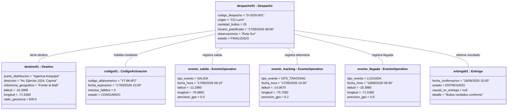

# Diagrama de Objetos - Nivel Dominio (Y-Trace)

## 1. Justificación: "El Porqué" de este Diagrama

### El problema de los diagramas anteriores
Los diagramas de objetos iniciales instanciaban clases como `Conductor`, `Vehiculo`, `EmpresaTransportista` y `UsuarioWeb`. Sin embargo, en el **Diagrama de Clases de Nivel Dominio**, la Sección 9 indica explícitamente que estos elementos **quedan fuera del dominio** (son actores externos o datos de contexto porque Y-Trace no es un sistema de gestión de flotas, sino de trazabilidad de la carga). 

En la notación UML estricta, un Diagrama de Objetos es una "fotografía" o instancia directa del Diagrama de Clases. **No se pueden instanciar objetos de clases que no han sido declaradas previamente en el modelo de clases.**

### La solución de este nuevo diagrama
Este diagrama corrige el error metodológico instanciando **exclusivamente** las 5 clases nucleares que sí existen en el Dominio (`Despacho`, `Destino`, `CodigoActivacion`, `EventoOperativo`, y `Entrega`). 

Además, escenifica un momento realista de la operación: un despacho interprovincial que completó su ciclo de vida (`FINALIZADO`), que utilizó su código (`CONSUMIDO`), que registró telemetría GPS periódica y su llegada en destino, y que finalmente fue `ENTREGADO` conforme.

---

## 2. Diagrama Visual Interactivo en Obsidian (Mermaid)

---

## 3. Código Oficial PlantUML

```plantuml
@startuml Diagrama_Objetos_Dominio_YTrace

title Diagrama de Objetos - Nivel Dominio (Y-Trace)
caption Vista de un despacho interprovincial completado con entrega conforme

skinparam shadowing false
skinparam defaultFontName Arial
skinparam defaultFontSize 11
skinparam objectAttributeIconSize 0
skinparam linetype ortho
skinparam nodesep 50
skinparam ranksep 50

' 1. El Aggregate Root (El Despacho)
object "despacho01 : Despacho" as despacho01 {
    codigo_despacho = "D-2026-001"
    origen = "CD Lurín"
    cantidad_bultos = 25
    horario_planificado = "17/09/2026 08:00"
    observaciones = "Ruta Sur"
    estado = FINALIZADO
}

' 2. El Destino
object "destino01 : Destino" as destino01 {
    punto_distribucion = "Agencia Arequipa"
    direccion = "Av. Ejército 1024, Cayma"
    referencia_geografica = "Frente al Mall"
    latitud = -16.3988
    longitud = -71.5369
    radio_geocerca = 500.0
}

' 3. El Código utilizado
object "codigo01 : CodigoActivacion" as codigo01 {
    codigo_alfanumerico = "YT-8K4P2"
    fecha_expiracion = "17/09/2026 10:00"
    intentos_fallidos = 0
    estado = CONSUMIDO
}

' 4. Evento operativo 1 (La Salida)
object "evento_salida : EventoOperativo" as evento_salida {
    tipo_evento = SALIDA
    fecha_hora = "17/09/2026 08:15"
    latitud = -12.298
    longitud = -76.885
    precision_gps = 5.0
}

' 5. Evento operativo 2 (Telemetría GPS en ruta)
object "evento_tracking : EventoOperativo" as evento_tracking {
    tipo_evento = GPS_TRACKING
    fecha_hora = "17/09/2026 14:30"
    latitud = -14.067
    longitud = -75.728
    precision_gps = 6.2
}

' 6. Evento operativo 3 (Llegada a Geocerca de destino)
object "evento_llegada : EventoOperativo" as evento_llegada {
    tipo_evento = LLEGADA
    fecha_hora = "18/09/2026 09:45"
    latitud = -16.3985
    longitud = -71.5365
    precision_gps = 4.8
}

' 7. El resultado final de recepción
object "entrega01 : Entrega" as entrega01 {
    fecha_confirmacion = "18/09/2026 10:00"
    estado = ENTREGADO
    causal_no_entrega = null
    detalle = "Bultos recibidos conforme en agencia"
}

' --- RELACIONES EXACTAS DEL MODELO DE DOMINIO ---

despacho01 *-- destino01 : tiene destino
despacho01 *-- codigo01 : habilita seguimiento mediante
despacho01 *-- evento_salida : registra
despacho01 *-- evento_tracking : registra
despacho01 *-- evento_llegada : registra
despacho01 *-- entrega01 : obtiene resultado

@enduml
```

## 4. Lectura de las Relaciones e Instancias

* **El Despacho (`despacho01`):** Es la instancia principal (*Aggregate Root*) del que parten los enlaces del grafo de objetos.
* **El Destino (`destino01`):** Instancia única vinculada al despacho, situada en la Agencia Arequipa (Cayma) con radio de geocerca perimétrica de 500 metros.
* **El Código de Activación (`codigo01`):** Instancia de código efímero de 8 caracteres que fue consumido exitosamente (`CONSUMIDO`) dentro de su ventana de vigencia de 2 horas.
* **Los Eventos Operativos (`evento_salida`, `evento_tracking`, `evento_llegada`):** Tres instancias cronológicas inmutables que acreditan la salida física de CD Lurín (08:15), un punto intermedio de telemetría en carretera (14:30) y el arribo verificado a la geocerca de destino (09:45 del día siguiente).
* **El Resultado de Entrega (`entrega01`):** Instancia final que formaliza la recepción conforme de los 25 bultos (`ENTREGADO`).

---

## 5. Matriz de Conformidad Estricta: Clases del Dominio vs. Objetos Instanciados

Esta matriz certifica la validez matemática y conceptual del Diagrama de Objetos frente al Diagrama de Clases de Nivel Dominio:

| Clase de Dominio | Objeto Instanciado | Atributos Poblados | Estado / Tipo Asignado | Conformidad con el Modelo |
| :--- | :--- | :--- | :--- | :---: |
| **`Despacho`** | `despacho01` | `codigo_despacho`, `origen`, `cantidad_bultos`, `horario_planificado`, `observaciones`, `estado` | `estado = FINALIZADO` | 100% |
| **`Destino`** | `destino01` | `punto_distribucion`, `direccion`, `referencia_geografica`, `latitud`, `longitud`, `radio_geocerca` | `radio_geocerca = 500.0` | 100% |
| **`CodigoActivacion`** | `codigo01` | `codigo_alfanumerico`, `fecha_expiracion`, `intentos_fallidos`, `estado` | `estado = CONSUMIDO` | 100% |
| **`EventoOperativo`** | `evento_salida` `evento_tracking` `evento_llegada` | `tipo_evento`, `fecha_hora`, `latitud`, `longitud`, `precision_gps` | `SALIDA` `GPS_TRACKING` `LLEGADA` | 100% |
| **`Entrega`** | `entrega01` | `fecha_confirmacion`, `estado`, `causal_no_entrega`, `detalle` | `estado = ENTREGADO` `causal = null` | 100% |
