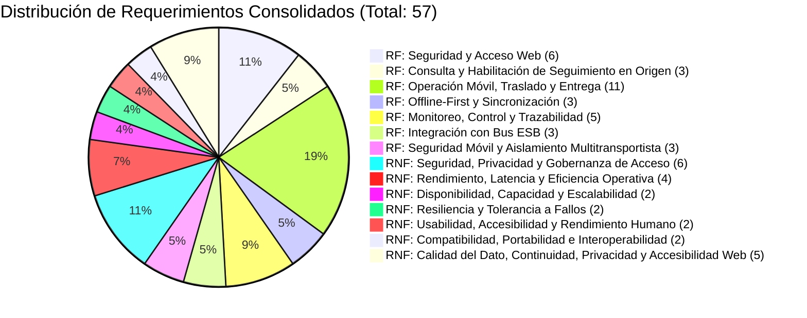

# Matriz Maestra Consolidada de Requerimientos: Y-Trace

> **Carpeta:** `detalles`  
> **Documento:** `01_MATRIZ_DE_REQUERIMIENTOS.md`  
> **Proyecto Oficial:** Sistema Web y Móvil para la Gestión y Trazabilidad de Despachos y Entregas de Yanbal Perú (Y-Trace)  
> **Propósito:** Registro maestro consolidado, clasificado y priorizado de todos los Requerimientos Funcionales (RF) y Requerimientos No Funcionales (RNF) del sistema Y-Trace bajo el alcance oficial de distribución completa entre puntos de distribución (B2B).  
> **Estado:** [CONSOLIDADO OFICIAL — ALCANCE B2B PUNTO A PUNTO]  
>  
> 🔗 **Documentos de Detalle y Análisis Crítico:**  
> - Especificación en detalle de RFs: [[02_REQUERIMIENTOS_FUNCIONALES]]  
> - Especificación en detalle de RNFs: [[03_REQUERIMIENTOS_NO_FUNCIONALES]]  
> - Resumen Operativo y Trazabilidad: [[04_RESUMEN_OPERATIVO_Y_TRAZABILIDAD_REQUERIMIENTOS]]  
> - Nodo Central del Grafo: [[MAPA_MAESTRO_DEL_PROYECTO]]  
> - Marco de Seguridad y Acceso: [[Acceso_Y_Seguridad]]  

---

## 1. Estructura y Metodología de la Matriz

Esta matriz actúa como la **única fuente oficial de requerimientos** de Y-Trace. Ha sido elaborada a partir del análisis riguroso de la documentación del proyecto, delimitando de manera estricta la frontera del sistema frente a los sistemas existentes de Yanbal Perú ([[SAP_R3]], [[SPY]], [[Maya]], [[SAP_Commerce]], [[Driving]], [[NSDG]], [[Salesforce]], [[Bus_Integracion]]).

### 1.1 Convenciones de Identificación y Delimitación de Alcance
* **Requerimientos Funcionales (RF):** Identificadores secuenciales estrictamente correlativos desde `RF001` hasta `RF034` (34 RF activos en total, sin saltos ni números faltantes, tras retirar del alcance RF008, RF010, RF026 y RF037). Responden a la pregunta: *¿Qué debe hacer Y-Trace?* (servicios, comportamientos y flujos operativos de distribución completa punto a punto).
* **Requerimientos No Funcionales (RNF):** Identificadores secuenciales desde `RNF001` hasta `RNF023`. Responden a la pregunta: *¿Cómo debe funcionar Y-Trace o qué condición/restricción debe cumplir?* (atributos de calidad de software bajo la norma ISO/IEC 25010: seguridad, rendimiento, disponibilidad, resiliencia, usabilidad, interoperabilidad).
* **Delimitación de Alcance Funcional (B2B Punto a Punto):** El alcance del sistema está centrado estrictamente en **despachos de distribución completa entre puntos de distribución** (Origen CD Lurín → Despacho Completo → Traslado → Punto de Destino → Confirmación de Llegada/Entrega → Evidencias → Cierre). Se excluyen taxativamente los procesos de reparto domiciliario minorista (B2C), entrega a consultoras residenciales, familiares, parentescos y DNI residencial.
* **Delimitación de Plataforma Móvil (Exclusividad Android):** La aplicación móvil de Y-Trace está destinada **exclusivamente a dispositivos con sistema operativo Android** (versión 8.0 Oreo o superior con Google Chrome v90+). La captura de ubicación GPS se realizará mediante los servicios de geolocalización disponibles en Android. **No se contempla compatibilidad con iOS en el alcance del proyecto.**

### 1.2 Leyenda de Estados de Certeza
* **Confirmado:** Respaldado explícitamente por entrevistas oficiales (Ing. Joao Condorpusa, Encargado de Distribución) o documentación corporativa validada.
* **Derivado:** Deducido lógicamente a partir de las necesidades del negocio, arquitectura de procesos TO-BE y reglas del sistema.
* **Pendiente de validación:** Aspecto identificado que requiere confirmación de parámetros técnicos específicos con TI u Operaciones de Yanbal (ej. protocolo híbrido de llegada/entrega y SLA formal RPO/RTO; el límite de integración de 30 minutos ya está definido).

---

## 2. Matriz Maestra Unificada de Requerimientos

| Casos de Prueba                                                                              |  ID Req.   |     Tipo     | Descripción del Requerimiento                                                                                                                                                                                                                                                                                                       | Objetivo de Negocio                                                                                                                    | Módulo del Sistema                                   |         Estado          | Prioridad | Responsable                          | Fuente / Respaldo                                               | Comentarios                                                                                                                                                                                                         |
| -------------------------------------------------------------------------------------------- | :--------: | :----------: | ----------------------------------------------------------------------------------------------------------------------------------------------------------------------------------------------------------------------------------------------------------------------------------------------------------------------------------- | -------------------------------------------------------------------------------------------------------------------------------------- | ---------------------------------------------------- | :---------------------: | :-------: | ------------------------------------ | --------------------------------------------------------------- | ------------------------------------------------------------------------------------------------------------------------------------------------------------------------------------------------------------------- |
| CP-AUTH-01 (Login exitoso y credenciales erróneas)                                           | **RF001**  |  Funcional   | Permitir el acceso a la plataforma Web a usuarios autorizados de Yanbal mediante validación de credenciales (usuario y contraseña).                                                                                                                                                                                                 | Proteger el acceso a la gestión operativa y configuración del sistema.                                                                 | Módulo de Seguridad y Acceso Web                     |       Confirmado        |   Alta    | Administrador Principal              | [[Acceso_Y_Seguridad]] [[Usuarios_Web]]                      | Requiere HTTPS/TLS 1.3 y hash seguro.                                                                                                                                                                               |
| CP-USR-01 (Ciclo de vida de usuario web)                                                     | **RF002**  |  Funcional   | Permitir al Administrador Principal crear, editar, activar, suspender y desactivar cuentas de usuarios para la plataforma Web.                                                                                                                                                                                                      | Garantizar la gobernanza centralizada de identidades autorizadas.                                                                      | Módulo de Administración de Usuarios                 |       Confirmado        |   Alta    | Administrador Principal              | [[Acceso_Y_Seguridad]] [[Funciones_Web]]                     | Exclusivo del Administrador Principal; no operable por supervisores.                                                                                                                                                |
| CP-ROL-01 (Asignación y cambio de roles)                                                     | **RF003**  |  Funcional   | Permitir al Administrador Principal asignar y modificar los roles de acceso web (`Administrador Principal`, `Supervisor de Distribución`, `Jefe de Distribución`, `Operador SAC`).                                                                                                                                                  | Aplicar segregación de funciones según responsabilidad institucional.                                                                  | Módulo de Administración de Usuarios                 |       Confirmado        |   Alta    | Administrador Principal              | [[Acceso_Y_Seguridad]] [[Usuarios_Web]]                      | Basado en el principio de mínimo privilegio.                                                                                                                                                                        |
| CP-RBAC-01 (Intento de acceso a rutas no autorizadas)                                        | **RF004**  |  Funcional   | Restringir la navegación, menús y ejecución de operaciones en la plataforma Web según el rol asignado al usuario autenticado (RBAC).                                                                                                                                                                                                | Evitar acciones operativas o de configuración por personal no facultado.                                                               | Módulo de Seguridad y Acceso Web                     |       Confirmado        |   Alta    | Administrador Principal / Sistema    | [[Acceso_Y_Seguridad]] [[Componentes_Aplicacion]]            | Validación en front-end y reforzada en cada endpoint del backend.                                                                                                                                                   |
| CP-SES-01 (Expiración de sesión por inactividad)                                             | **RF005**  |  Funcional   | Controlar el ciclo de vida de la sesión web, soportando cierre manual, expiración por inactividad y revocación forzada (*kill session*).                                                                                                                                                                                            | Prevenir el uso indebido de sesiones activas en terminales desatendidas.                                                               | Módulo de Seguridad y Acceso Web                     |       Confirmado        |   Media   | Administrador Principal              | [[Acceso_Y_Seguridad]] [[Usuarios_Web]]                      | Tiempo de inactividad establecido preliminarmente en 15 minutos.                                                                                                                                                    |
| CP-AUD-01 (Generación de log ante cambio de rol)                                             | **RF006**  |  Funcional   | Registrar en una bitácora inmutable las acciones administrativas críticas (altas, bajas, cambios de rol, bloqueos e intentos fallidos).                                                                                                                                                                                             | Proveer trazabilidad de auditoría para seguridad de la información.                                                                    | Módulo de Auditoría y Seguridad                      |       Confirmado        |   Media   | Administrador Principal              | [[Acceso_Y_Seguridad]] [[Funciones_Web]]                     | Solo lectura para fines de auditoría informática.                                                                                                                                                                   |
| CP-DESP-01 (Consulta y filtrado de despachos en andén)                                       | **RF007**  |  Funcional   | Permitir al Supervisor de Distribución consultar y filtrar la lista de despachos completos ya existentes, recibidos desde sistemas externos y disponibles para iniciar su seguimiento hacia puntos de destino.                                                                                                                      | Proveer visibilidad de los despachos existentes que están disponibles para iniciar su seguimiento, sin crear ni programar el despacho. | Módulo de Consulta y Habilitación de Seguimiento     |       Confirmado        |   Alta    | Supervisor de Distribución           | [[Funciones_Web]] [[Flujo_Web]] [[SPY]]                   | Los despachos provienen de los sistemas corporativos vía Bus. Y-Trace solo los consulta y los habilita para seguimiento; no gestiona picking ni planificación logística.                                            |
| CP-COD-01 (Generación y recuperación controlada de código)                                   | **RF008**  |  Funcional   | Generar automáticamente un Código Único de Activación alfanumérico para habilitar el seguimiento y, ante contingencia de dispositivo durante un despacho `EN_RUTA`, permitir un código de recuperación de un solo uso bajo autorización del Supervisor.                                                                             | Controlar la habilitación segura de la app móvil y recuperar la operación sin perder trazabilidad.                                     | Módulo de Códigos y Activación                       |       Confirmado        |   Alta    | Supervisor de Distribución / Sistema | [[Acceso_Y_Seguridad]] [[Flujo_Principal]]                   | El código normal no cambia a `EN_RUTA`; el código de recuperación sustituye el token del dispositivo anterior sin crear un nuevo despacho.                                                                          |
| CP-DESP-04 (Cierre forzado en contingencia)                                                  | **RF009**  |  Funcional   | Permitir al Supervisor de Distribución forzar administrativamente el cierre de un despacho con causa justificada en bitácora.                                                                                                                                                                                                       | Resolver viajes interrumpidos por siniestro total o fuerza mayor.                                                                      | Módulo de Consulta y Habilitación de Seguimiento     |       Confirmado        |   Media   | Supervisor de Distribución           | [[Ciclo_De_Vida_Del_Despacho]] [[Funciones_Web]]             | Requiere ingreso de motivo explícito en bitácora inmutable.                                                                                                                                                         |
| CP-MOB-01 (Activación normal y recuperación autorizada)                                      | **RF010**  |  Funcional   | Permitir al conductor activar el despacho mediante Código de Activación en la PWA Android; en contingencia de dispositivo, aceptar un código de recuperación autorizado para el mismo despacho `EN_RUTA`.                                                                                                                           | Simplificar la adopción del transportista tercero y recuperar la operación sin reiniciar el viaje.                                     | Módulo Móvil de Activación (PWA Android)             |       Confirmado        |   Alta    | Conductor                            | [[Acceso_Y_Seguridad]] [[Funciones_Movil]]                   | El flujo normal exige despacho existente y elegible para seguimiento; el flujo de recuperación solo admite un código emitido por Supervisor para `EN_RUTA`.                                                         |
| CP-MOB-02 (Sesión operativa y recuperación de dispositivo)                                   | **RF011**  |  Funcional   | Establecer y mantener una sesión operativa móvil local vinculada al despacho, vehículo, conductor y dispositivo Android, permitiendo su sustitución controlada ante contingencia sin alterar el histórico.                                                                                                                          | Asociar de manera unívoca cada coordenada y evento al viaje correcto y mantener continuidad operativa.                                 | Módulo Móvil de Activación (PWA Android)             |       Confirmado        |   Alta    | Sistema Backend / PWA                | [[Acceso_Y_Seguridad]] [[Funciones_Movil]]                   | La sesión caduca al concluir o cancelar; una recuperación autorizada revoca el token anterior y emite uno nuevo para el mismo despacho.                                                                             |
| CP-MOB-03 (Visualización de datos de despacho y destino)                                     | **RF012**  |  Funcional   | Presentar al conductor en la PWA la información operativa del despacho: código de despacho, punto de destino de distribución, dirección de llegada, observaciones de ruta y estado.                                                                                                                                                 | Guiar la ejecución física del traslado intercentros sin sobrecargar datos comerciales.                                                 | Módulo Móvil de Ruta (PWA Android)                   |       Confirmado        |   Alta    | Conductor                            | [[Funciones_Movil]] [[Despacho_Como_Unidad_Logistica]]       | No expone datos de consultoras individuales ni clientes residenciales.                                                                                                                                              |
| CP-MOB-04 (Cambio de estado a EN_RUTA e inicio de GPS)                                       | **RF013**  |  Funcional   | Permitir al conductor registrar el inicio del traslado mediante el botón "Iniciar Despacho", cambiando el estado a `EN_RUTA` solo si la sesión es válida y existe previamente el hito interno de control previo.                                                                                                                    | Marcar el hito formal de salida física de la carga desde el CD Lurín.                                                                  | Módulo Móvil de Ruta (PWA Android)                   |       Confirmado        |   Alta    | Conductor                            | [[Flujo_Conductor]] [[Ciclo_De_Vida_Del_Despacho]]           | La activación mediante RF010 y la sesión válida son condiciones previas; al iniciar, dispara GPS y notificación al Bus.                                                                                             |
| CP-GPS-01 (Muestreo periódico de coordenadas en ruta)                                        | **RF014**  |  Funcional   | Capturar periódicamente coordenadas GPS en segundo plano desde el dispositivo Android durante el estado EN_RUTA.                                                                                                                                                                                                                    | Proveer la traza histórica y última ubicación estimada de la unidad en ruta.                                                           | Módulo Móvil de Telemetría GPS                       |       Confirmado        |   Alta    | Sistema Móvil / Conductor            | [[Funcionamiento_GPS]] [[Restricciones_Tecnicas]]            | Muestreo operativo optimizado cada 10 minutos durante `EN_RUTA`; eventos críticos y cambios de estado se capturan de inmediato.                                                                                     |
| CP-ENT-01 (Registro de llegada a destino por geocerca o manual)                              | **RF015**  |  Funcional   | Registrar el arribo físico al punto de distribución mediante detección automática de geocerca (o botón "Llegué a Destino"), transicionando a EN_DESTINO con captura atómica de fecha, hora y GPS. No confirma entrega.                                                                                                              | Auditar la llegada física en destino sirviendo la coordenada GPS como evidencia geoespacial directa.                                   | Módulo Móvil de Llegada (PWA Android)                |       Confirmado        |   Alta    | Conductor                            | [[Eventos_E_Incidencias]] [[Funciones_Movil]]                | Geocerca/botón solo acredita EN_DESTINO (arribo físico). No valida entrega ni reemplaza la confirmación (RN-PV-01).                                                                                                 |
| CP-ENT-02 (Registro de entrega y recepción conforme de despacho)                             | **RF016**  |  Funcional   | Permitir al conductor registrar manualmente la confirmación de entrega y recepción del despacho completo en el punto de destino, transicionando a `ENTREGADO` con fecha, hora y ubicación GPS; la fotografía es complementaria y opcional.                                                                                          | Formalizar la entrega de la carga completa en el punto de destino sin fricción.                                                        | Módulo Móvil de Entrega (PWA Android)                |       Confirmado        |   Alta    | Conductor                            | [[Despacho_Como_Unidad_Logistica]] [[Funciones_Movil]]       | Genera el evento inmutable `ENTREGADO`. La acción manual es obligatoria; la fotografía nunca bloquea la operación.                                                                                                  |
| CP-ENT-03 (Registro de despacho no entregado o rechazado con motivo)                         | **RF017**  |  Funcional   | Permitir al conductor registrar la no entrega o rechazo del despacho en destino ante impedimentos operativos tipificados, registrando causal, estampa y GPS (estado NO_ENTREGADO).                                                                                                                                                  | Sustentar técnicamente los motivos de no recepción del despacho en el punto de destino.                                                | Módulo Móvil de Entrega (PWA Android)                |       Confirmado        |   Alta    | Conductor                            | [[Eventos_E_Incidencias]] [[Funciones_Movil]]                | Causales: Destino cerrado, rechazo formal de carga, acceso bloqueado. Foto de respaldo opcional (RF018).                                                                                                            |
| CP-EVI-01 (Gestión de evidencias operativas y fotografía complementaria opcional)            | **RF018**  |  Funcional   | Permitir al conductor registrar y asociar evidencias al despacho y sus eventos operativos; la fotografía constituye una evidencia complementaria opcional y nunca bloquea la operación.                                                                                                                                             | Garantizar trazabilidad de los eventos y disponer de respaldo adicional cuando las condiciones operativas lo permitan.                 | Módulo Móvil de Evidencias (PWA Android)             |       Confirmado        |   Alta    | Conductor / Sistema                  | [[Restricciones_Tecnicas]] [[Definicion_Solucion]]           | Evidencia base: evento, fecha/hora, despacho, sesión/actor y GPS cuando esté disponible; foto opcional en `ENTREGADO`, `NO_ENTREGADO` e incidencias.                                                                |
| CP-INC-01 (Envío de reporte de incidencia en ruta)                                           | **RF019**  |  Funcional   | Permitir al conductor reportar siniestros o percances viales tipificados en ruta, registrando descripción, fotografía opcional y coordenadas GPS inmediatas.                                                                                                                                                                        | Alertar oportunamente contingencias que comprometen el traslado de la carga.                                                           | Módulo Móvil de Incidencias (PWA Android)            |       Confirmado        |   Alta    | Conductor                            | [[Eventos_E_Incidencias]] [[Funciones_Movil]]                | Tipos: Falla mecánica, accidente, bloqueo de vía, asalto, clima adverso.                                                                                                                                            |
| CP-MOB-05 (Cierre de despacho y finalización de sesión operativa)                            | **RF020**  |  Funcional   | Permitir al conductor finalizar el despacho tras resolver la entrega en destino y vaciar la cola local de sincronización, pasando a FINALIZADO y revocando la sesión.                                                                                                                                                               | Liquidar formalmente la hoja de traslado y cesar la emisión de datos del móvil.                                                        | Módulo Móvil de Cierre (PWA Android)                 |       Confirmado        |   Alta    | Conductor                            | [[Ciclo_De_Vida_Del_Despacho]] [[Flujo_Conductor]]           | El estado pasa a `FINALIZADO` y el token de sesión móvil es revocado de inmediato.                                                                                                                                  |
| CP-OFF-01 (Operación completa en modo avión y guardado local)                                | **RF021**  |  Funcional   | Almacenar localmente en el dispositivo Android estados, coordenadas GPS, incidencias y fotos opcionales cuando se interrumpa la cobertura celular (Offline).                                                                                                                                                                        | Garantizar la operación ininterrumpida en carreteras interprovinciales o zonas sin conectividad.                                       | Módulo Móvil de Persistencia Local                   |       Confirmado        |   Alta    | Sistema Móvil / PWA                  | [[Offline_First]] [[Restricciones_Tecnicas]]                 | Implementado mediante almacenamiento local IndexedDB en Android.                                                                                                                                                    |
| CP-OFF-02 (Sincronización automática al recuperar red)                                       | **RF022**  |  Funcional   | Sincronizar automáticamente en orden cronológico (FIFO) los eventos y telemetría retenidos localmente tan pronto se restablezca la conexión de red.                                                                                                                                                                                 | Evitar pérdida de datos y actualizar el backend sin intervención manual.                                                               | Módulo Móvil de Sincronización                       |       Confirmado        |   Alta    | Sistema Móvil / Service Worker       | [[Offline_First]] [[Componentes_Aplicacion]]                 | Conserva el timestamp original del hecho (`captured_at`).                                                                                                                                                           |
| CP-OFF-03 (Actualización de contador de cola local)                                          | **RF023**  |  Funcional   | Presentar al conductor un indicador visual del estado de sincronización (verde: al día; amarillo: contador de transacciones pendientes en cola).                                                                                                                                                                                    | Brindar retroalimentación visual sobre la persistencia y subida de datos.                                                              | Módulo Móvil de Sincronización                       |       Confirmado        |   Media   | Conductor                            | [[Offline_First]] [[Funciones_Movil]]                        | Impide finalizar despacho si restan eventos por transmitir.                                                                                                                                                         |
| CP-MON-01 (Consulta de avance y detalle de despachos)                                        | **RF024**  |  Funcional   | Permitir al Supervisor y Jefe consultar el detalle de despachos activos, tiempos de traslado origen-destino, permanencia y estado general mediante una grilla operativa con semaforización visual.                                                                                                                                  | Habilitar el control operacional y seguimiento de tiempos de ciclo de viaje de la flota en tiempo real.                                | Módulo Web de Monitoreo de Despachos                 |       Confirmado        |   Alta    | Supervisor / Jefe de Distribución    | [[Funciones_Web]] [[Proceso_TOBE]]                           | Filtros por fecha, transportista, conductor, placa, origen y destino. Estados: Verde (en ruta), Amarillo (en destino), Rojo (incidencia).                                                                           |
| CP-EVI-02 (Visualización de evidencias y enlace a Cloud Storage)                             | **RF025**  |  Funcional   | Permitir la visualización y consulta de evidencias de entrega del despacho (GPS, timestamp y enlace seguro a fotografía de respaldo en Cloud Storage).                                                                                                                                                                              | Sustentar la entrega y recepción de la carga ante auditorías logísticas.                                                               | Módulo Web de Auditoría de Entregas                  |       Confirmado        |   Alta    | Supervisor / Jefe de Distribución    | [[Funciones_Web]] [[Despacho_Como_Unidad_Logistica]]         | Acceso controlado a URLs firmadas temporales (15 min).                                                                                                                                                              |
| CP-INC-02 (Recepción de alerta de incidencias y ventana operativa de 60 min en destino)      | **RF026**  |  Funcional   | Emitir alertas visuales/sonoras inmediatas ante incidencias en ruta y por ventana operativa de 60 min en `EN_DESTINO` sin confirmación de entrega (RN-PV-01), habilitando al Supervisor auxilio o cierre forzado (RF009).                                                                                                           | Alertar oportunamente contingencias viales y demoras críticas en destino para pronta acción.                                           | Módulo Web de Gestión de Incidencias                 |       Confirmado        |   Alta    | Supervisor de Distribución           | [[Funciones_Web]] [[Flujo_Web]]                              | RF026 está confirmado como requerimiento funcional. La ventana operativa de 60 minutos en `EN_DESTINO` constituye una condición de implementación sujeta a la ratificación de RN-PV-01.                             |
| CP-TRAC-01 (Búsqueda por despacho y visualización de timeline)                               | **RF027**  |  Funcional   | Proveer un buscador rápido por código de despacho o unidad vehicular que presente la cronología completa del traslado y evidencias asociadas.                                                                                                                                                                                       | Resolver consultas operativas de distribución y seguimiento en el primer contacto.                                                     | Módulo Web de Consulta de Trazabilidad               |       Confirmado        |   Alta    | Supervisor / SAC / Jefe              | [[Funciones_Web]] [[Flujo_Web]]                              | Cronología: disponibilidad para seguimiento, activación, salida, paso en ruta, llegada, resultado de entrega, cierre y, cuando corresponda, cancelación informada externamente.                                     |
| CP-KPI-01 (Cálculo y despliegue de KPIs de cumplimiento)                                     | **RF028**  |  Funcional   | Presentar un tablero ejecutivo de indicadores logísticos con métricas de tiempos de traslado (Lead Time), tasa de entregas conformes y latencia, permitiendo consultar y filtrar la información mediante los criterios disponibles en la vista operativa y exportar los resultados en formato Excel.                                | Permitir el análisis estratégico del servicio, evaluación de transporte y exportación de reportes.                                     | Módulo Web de Indicadores (Dashboard)                |       Confirmado        |   Media   | Jefe de Distribución / Gerencia      | [[Funciones_Web]] [[Oportunidad_de_Mejora]]                  | Evaluación por empresa transportista y período; los cancelados se excluyen de Lead Time y puntualidad y se contabilizan en una métrica separada de cancelación. Exportación exclusivamente en Excel.                |
| CP-INT-01 (Generación y envío de payload JSON al Bus)                                        | **RF029**  |  Funcional   | Publicar al Bus de Integración los eventos de estado e hitos administrativos definidos para interoperabilidad (`EN_RUTA`, `EN_DESTINO`, `ENTREGADO`, `NO_ENTREGADO`, `DESPACHO_CANCELADO`; el hito interno de control previo se conserva como evento interno de auditoría y no se publica por RF029) en formato JSON estandarizado. | Mantener sincronizados los sistemas centrales con los hitos relevantes del despacho y evitar pérdida de información operativa.         | Módulo Backend de Integración (ESB)                  |       Confirmado        |   Alta    | Sistema Backend / Bus de Integración | [[Bus_Integracion]] [[Integracion_Bus_Eventos]]              | El hito interno de control previo es un registro interno de habilitación del seguimiento y no forma parte de los eventos publicados por RF029; una cancelación externa puede integrarse como evento administrativo. |
| CP-INT-02 (Publicación de evento de siniestro vial al ESB)                                   | **RF030**  |  Funcional   | Publicar notificaciones de incidencias graves en ruta hacia el Bus de Integración para conocimiento preventivo de sistemas adyacentes.                                                                                                                                                                                              | Notificar a áreas operativas sobre retrasos forzados o siniestros en carretera.                                                        | Módulo Backend de Integración (ESB)                  |       Confirmado        |   Media   | Sistema Backend / Bus de Integración | [[Integracion_Bus_Eventos]] [[Eventos_E_Incidencias]]        | Permite anticipar acciones de mitigación logística y atención.                                                                                                                                                      |
| CP-INT-03 (Envío de resumen de trazabilidad del despacho)                                    | **RF031**  |  Funcional   | Transmitir al Bus de Integración un resumen consolidado de la trazabilidad del despacho tras su finalización formal, sin ejecutar liquidación económica ni logística.                                                                                                                                                               | Proporcionar a los sistemas externos la información final de seguimiento necesaria para sus procesos posteriores.                      | Módulo Backend de Integración (ESB)                  |       Confirmado        |   Media   | Sistema Backend / Bus de Integración | [[Integracion_Bus_Eventos]] [[Ciclo_De_Vida_Del_Despacho]]   | Entrega información consolidada de trazabilidad; cualquier liquidación o conciliación posterior corresponde a sistemas externos.                                                                                    |
| CP-MOB-SEC-01 (Bloqueo tras 5 intentos fallidos de activación móvil)                         | **RF032**  |  Funcional   | Limitar los intentos fallidos de ingreso del código de activación móvil (RF010) a un máximo de 5 intentos, bloqueando e invalidando el código al registrar el quinto fallo consecutivo y alertando al Supervisor.                                                                                                                   | Prevenir ataques de fuerza bruta sobre el espacio de códigos alfanuméricos de 8 caracteres.                                            | Módulo Móvil de Activación (PWA) + Backend           |       Confirmado        |   Alta    | Conductor / Supervisor / Sistema     | [[RF008]] [[RF010]] [[Acceso_Y_Seguridad]]                | Cierra la asimetría de seguridad frente al bloqueo web de 5 intentos de RF001.                                                                                                                                      |
| CP-COD-02 (Revocación inmediata de código y sesión al finalizar o cancelar)                  | **RF033**  |  Funcional   | Asignar unicidad activa al Código de Activación y revocar automáticamente su validez y la de la sesión operativa tan pronto el despacho pase a `FINALIZADO` o `CANCELADO`.                                                                                                                                                          | Reducir la ventana de exposición y asegurar que el código no permanezca habilitado tras el cierre o cancelación.                       | Módulo de Códigos y Activación                       |       Confirmado        |   Alta    | Supervisor / Sistema Backend         | [[RF008]] [[Acceso_Y_Seguridad]]                             | Revocación inmediata al finalizar o cancelar; la sesión solo existe si el código llegó a ser activado.                                                                                                              |
| CP-RBAC-02 (Aislamiento de datos entre empresas transportistas)                              | **RF034**  |  Funcional   | Restringir la visibilidad de despachos, conductores, rutas y evidencias a los Supervisores y Jefes según la(s) empresa(s) de transporte asignadas (aislamiento multitransportista).                                                                                                                                                 | Evitar que una empresa transportista tercera visualice operaciones de empresas competidoras.                                           | Módulo de Administración de Usuarios + Seguridad Web |        Derivado         |   Alta    | Administrador Principal / Sistema    | [[RF003]] [[RF004]] [[Acceso_Y_Seguridad]]                | Ver RN-PV-05: pendiente confirmar con Operaciones si el modelo de flota es exclusivo por transportista o mixto.                                                                                                     |
| CP-RNF-SEC-01 (Intento de inyección de telemetría sin token)                                 | **RNF001** | No Funcional | Seguridad de Acceso: El sistema debe impedir accesos no autorizados a la web y bloquear transmisiones móviles sin sesión operativa autorizada.                                                                                                                                                                                      | Evitar intrusiones, suplantaciones e inyección de datos falsos.                                                                        | Seguridad y Control de Acceso                        |       Confirmado        |   Alta    | Arquitectura / Seguridad TI          | [[Acceso_Y_Seguridad]] [[Restricciones_Tecnicas]]            | Métrica: 100% de peticiones no autorizadas rechazadas (HTTP 401/403).                                                                                                                                               |
| CP-RNF-SEC-02 (Intento de ejecución de acción fuera del rol asignado)                        | **RNF002** | No Funcional | Autorización Estricta (RBAC): El 100% de operaciones ejecutadas por usuarios web deben corresponder estrictamente a su rol asignado.                                                                                                                                                                                                | Garantizar la segregación de funciones y principio de mínimo privilegio.                                                               | Seguridad y Autorización                             |       Confirmado        |   Alta    | Arquitectura / Seguridad TI          | [[Acceso_Y_Seguridad]] [[Usuarios_Web]]                      | Métrica: Cero tolerancia a elevación de privilegios no concedidos (HTTP 403 Forbidden).                                                                                                                             |
| CP-RNF-SEC-03 (Verificación de hash en BD e inspección de red)                               | **RNF003** | No Funcional | Protección y Gestión de Credenciales Web: Las contraseñas de los usuarios de la plataforma Web deben almacenarse mediante BCrypt con factor de costo >= 12, utilizando el mecanismo de hash y salt correspondiente, y transmitirse exclusivamente a través de canales cifrados mediante TLS 1.3.                                    | Proteger las credenciales de los colaboradores de Yanbal contra ataques de fuerza bruta, compromiso de BD e interceptación.            | Seguridad y Gestión de Credenciales                  |       Confirmado        |   Alta    | Arquitectura / Seguridad TI          | [[Acceso_Y_Seguridad]] [[Requerimientos_No_Funcionales]]     | Prohibido el almacenamiento en texto plano o transmisión sin TLS 1.3. Mecanismo único: hash con BCrypt (costo >= 12). Cero Azure AD.                                                                                |
| CP-RNF-SEC-04 (Comprobación de expiración y revocación de sesión)                            | **RNF004** | No Funcional | Gobernanza de Sesiones: Expiración por inactividad a los 15 min en web; revocación inmediata de la sesión móvil al finalizar o cancelar el despacho.                                                                                                                                                                                | Prevenir el secuestro de sesiones en terminales desatendidas o celulares.                                                              | Seguridad y Gestión de Sesiones                      |       Confirmado        |   Alta    | Arquitectura / Seguridad TI          | [[Acceso_Y_Seguridad]] [[Requerimientos_No_Funcionales]]     | Tokens firmados criptográficamente con tiempo de vida finito.                                                                                                                                                       |
| CP-RNF-SEC-05 (Validación de expiración de URL prefirmada)                                   | **RNF005** | No Funcional | Protección de Evidencias en Almacenamiento Externo: Las fotografías de respaldo en Cloud Storage deben cifrarse en reposo (AES-256) con acceso vía URLs firmadas temporales (15 min).                                                                                                                                               | Salvaguardar la privacidad de las evidencias operativas y evitar fugas de información.                                                 | Privacidad y Almacenamiento Seguro                   |       Confirmado        |   Alta    | Arquitectura / Legal Yanbal          | [[Acceso_Y_Seguridad]] [[Restricciones_Tecnicas]]            | Métrica: Cero exposición pública de URIs de evidencias en buckets externos.                                                                                                                                         |
| CP-RNF-INT-01 (Intento de alteración de coordenadas y timestamps)                            | **RNF006** | No Funcional | Integridad e Inmutabilidad: Los registros de eventos de despacho, incluidos los hitos administrativos `DESPACHO_CANCELADO` cuando sea informado por un sistema externo, y las coordenadas GPS no deben ser modificables ni editables una vez capturados.                                                                            | Garantizar la validez legal y técnica de las evidencias de auditoría operativa.                                                        | Integridad de Datos                                  |       Confirmado        |   Alta    | Arquitectura / Backend               | [[Reglas_De_Integridad]] [[Entidades_Principales]]           | Métrica: Base de datos relacional con restricciones de solo anexión.                                                                                                                                                |
| CP-RNF-PERF-01 (Medición de latencia de eventos hacia el Bus)                                | **RNF007** | No Funcional | Latencia de Sincronización: El Bus de Integración debe aceptar cada evento elegible dentro de un máximo de 30 minutos desde su recepción en el backend.                                                                                                                                                                             | Resolver el problema central del negocio (desfase actual de 2 horas).                                                                  | Rendimiento e Integración                            |       Confirmado        |   Alta    | Arquitectura / Conectividad          | [[Oportunidad_de_Mejora]] [[Problematica_Validada]]          | Métrica: el 100% de los eventos elegibles para integración deben ser aceptados por el Bus en `<= 30 min` desde su recepción en el backend; solo existe el SLA definido de 30 minutos como máximo.                   |
| CP-RNF-PERF-02 (Prueba de carga local y latencia de interfaz)                                | **RNF008** | No Funcional | Tiempo de Respuesta en PWA: Las operaciones locales del conductor (guardar evento, fotografiar) deben responder en menos de 500 ms.                                                                                                                                                                                                 | Brindar agilidad al transportista y evitar fricciones en ruta.                                                                         | Rendimiento y Usabilidad                             |       Confirmado        |   Alta    | Desarrollo Frontend Móvil            | [[Restricciones_Tecnicas]] [[Requerimientos_No_Funcionales]] | Métrica: Transición de pantalla y confirmación táctil < 500 ms.                                                                                                                                                     |
| CP-RNF-EFF-01 (Monitoreo de drenaje de batería durante jornada)                              | **RNF009** | No Funcional | Eficiencia de Batería: La telemetría GPS en segundo plano y la sincronización no deben consumir más del 15% de la batería en 8 horas en Android.                                                                                                                                                                                    | Facilitar la adopción en smartphones de transportistas terceros.                                                                       | Eficiencia Energética                                |       Confirmado        |   Media   | Desarrollo Frontend Móvil            | [[Funcionamiento_GPS]] [[Restricciones_Tecnicas]]            | Métrica: Consumo <= 15% en batería estándar de 4000 mAh en 8 h en Android.                                                                                                                                          |
| CP-RNF-EFF-02 (Medición de consumo de datos celulares en ruta)                               | **RNF010** | No Funcional | Consumo de Datos Móviles: El tráfico de telemetría y eventos de la PWA no debe superar los 50 MB diarios por dispositivo móvil.                                                                                                                                                                                                     | Garantizar viabilidad económica para conductores que usan planes propios.                                                              | Eficiencia de Red                                    |       Confirmado        |   Media   | Desarrollo Frontend Móvil            | [[Funcionamiento_GPS]] [[Restricciones_Tecnicas]]            | Métrica: Compresión de payloads JSON y redimensionamiento de fotos.                                                                                                                                                 |
| CP-RNF-REL-01 (Monitoreo de uptime en horario operativo)                                     | **RNF011** | No Funcional | Disponibilidad del Servicio: La plataforma Web y la API de ingesta deben mantener una disponibilidad mínima del 99.5% de 06:00 a 21:00 h.                                                                                                                                                                                           | Asegurar la continuidad ininterrumpida de las operaciones de despacho y traslado.                                                      | Disponibilidad y Confiabilidad                       |       Confirmado        |   Alta    | Infraestructura y Operaciones TI     | [[Restricciones_Tecnicas]] [[Requerimientos_No_Funcionales]] | Métrica: Disponibilidad >= 99.5% durante la ventana operativa; sobre una base de 390 h/mes, equivale a un máximo de 1.95 h (aprox. 1 h 57 min) de indisponibilidad no programada al mes.                            |
| CP-RNF-SCA-01 (Pruebas de estrés de 500 conexiones concurrentes)                             | **RNF012** | No Funcional | Capacidad y Escalabilidad Concurrente: Soportar al menos 500 conductores transmitiendo telemetría en paralelo y 50,000 eventos diarios.                                                                                                                                                                                             | Cubrir la demanda logística de las campañas comerciales pico de Yanbal.                                                                | Escalabilidad y Capacidad                            |       Confirmado        |   Alta    | Arquitectura / Backend               | [[Restricciones_Tecnicas]] [[Requerimientos_No_Funcionales]] | Métrica: Degradación de latencia de API < 10% bajo carga máxima (500 conductores y 50,000 eventos diarios).                                                                                                         |
| CP-RNF-RES-01 (Llenado de almacenamiento local con 500 eventos)                              | **RNF013** | No Funcional | Resiliencia de Persistencia Offline: La PWA debe ser capaz de almacenar al menos 500 eventos operativos en IndexedDB sin degradación; las fotografías, cuando existan, se gestionan como adjuntos independientes.                                                                                                                   | Soportar rutas interprovinciales o zonas rurales con cero cobertura.                                                                   | Resiliencia y Tolerancia a Fallos                    |       Confirmado        |   Alta    | Desarrollo Frontend Móvil            | [[Offline_First]] [[Restricciones_Tecnicas]]                 | Métrica: Integridad de 500 registros retenidos y subidos con éxito.                                                                                                                                                 |
| CP-RNF-INT-02 (Envío duplicado intencional de eventos y validación)                          | **RNF014** | No Funcional | Idempotencia en Sincronización: El endpoint de ingesta debe procesar múltiples envíos de un mismo evento sin duplicar información.                                                                                                                                                                                                  | Proteger la coherencia ante reintentos de red inestable en carreteras.                                                                 | Confiabilidad e Integridad                           |       Confirmado        |   Alta    | Arquitectura / Backend               | [[Offline_First]] [[Componentes_Aplicacion]]                 | Métrica: Validación basada en UUIDs únicos generados en el móvil.                                                                                                                                                   |
| CP-RNF-USA-01 (Pruebas de usabilidad con usuarios transportistas)                            | **RNF015** | No Funcional | Usabilidad Operativa en Campo: La interfaz del conductor debe permitir completar cualquier acción crítica en un máximo de 3 toques.                                                                                                                                                                                                 | Reducir distracciones al volante y simplificar la gestión en cabina y andén.                                                           | Usabilidad y Ergonomía Móvil                         |       Confirmado        |   Media   | Diseño UI/UX Móvil                   | [[Funciones_Movil]] [[Flujo_Conductor]]                      | Métrica: Botones de mínimo 48x48 dp y contraste visual para sol intenso.                                                                                                                                            |
| CP-RNF-PERF-03 (Búsqueda indexada sobre tabla de 1 millón de registros)                      | **RNF016** | No Funcional | Tiempo de Respuesta en Consulta de Trazabilidad: El buscador por código de despacho o unidad en la web debe desplegar la cronología en menos de 2 s.                                                                                                                                                                                | Permitir al operador responder o validar el estado del viaje de inmediato.                                                             | Rendimiento y Eficiencia                             |       Confirmado        |   Alta    | Base de Datos / Backend              | [[Funciones_Web]] [[Flujo_Web]]                              | Métrica: Tiempo de renderizado final en pantalla < 2.0 segundos.                                                                                                                                                    |
| CP-RNF-COMP-01 (Pruebas de ejecución en Android 8.0+ y validación de restricción de alcance) | **RNF017** | No Funcional | Compatibilidad Exclusiva con Plataforma Android: La aplicación móvil debe operar exclusivamente en Google Chrome para Android (versión 8.0+ / Chrome v90+) como PWA. Los servicios de geolocalización se tomarán de Android. No se contempla soporte para iOS ni navegadores de Apple en el alcance.                                | Concentrar el esfuerzo de ingeniería en la flota estándar Android de los transportistas de Yanbal.                                     | Compatibilidad y Plataforma Móvil                    |       Confirmado        |   Alta    | Desarrollo Frontend Móvil            | [[Restricciones_Tecnicas]] [[Funciones_Movil]]               | Métrica: 100% de operatividad en Android; soporte iOS explícitamente excluido.                                                                                                                                      |
| CP-RNF-INT-03 (Validación de esquemas JSON Schema contra ESB)                                | **RNF018** | No Funcional | Estandarización de Intercambio: Los eventos de integración se estructuran mediante payloads JSON conforme al esquema canónico definido para la interoperabilidad con codificación UTF-8.                                                                                                                                            | Garantizar la interoperabilidad fluida con el middleware corporativo.                                                                  | Interoperabilidad de Sistemas                        |       Confirmado        |   Alta    | Arquitectura / Integraciones         | [[Bus_Integracion]] [[Integracion_Bus_Eventos]]              | Métrica: Cumplimiento de esquemas canónicos definidos por Yanbal. Se mantiene como precisión técnica de interoperabilidad.                                                                                          |
| CP-RNF-LEG-01 (Ejecución de job de purga y anonimización de evidencias históricas)           | **RNF019** | No Funcional | Retención y Eliminación de Evidencias y Registros: Conservar evidencias operativas (fotos, logs) por el plazo de retención corporativo (24 meses, preliminar) y eliminarlas o anonimizarlas automáticamente al vencer dicho plazo.                                                                                                  | Cumplir con los principios de proporcionalidad y gobernanza de datos de Yanbal.                                                        | Privacidad y Cumplimiento Legal                      | Pendiente de validación |   Alta    | Arquitectura / Legal Yanbal          | [[Acceso_Y_Seguridad]] [[RNF005]]                            | Ver RN-PV-04: mecanismo de purga confirmado; el valor de 24 meses debe ser ratificado formalmente por Legal Yanbal.                                                                                                 |
| CP-RNF-DIS-01 (Simulacro de restauración de contingencia con medición de RPO/RTO)            | **RNF020** | No Funcional | Recuperación ante Desastres (RPO/RTO): El sistema debe cumplir con un RPO <= 15 minutos y un RTO <= 4 horas ante una caída total de infraestructura.                                                                                                                                                                                | Minimizar el impacto operativo y la pérdida de transacciones logísticas ante desastres.                                                | Disponibilidad y Continuidad                         | Pendiente de validación |   Alta    | Infraestructura y Operaciones TI     | [[Restricciones_Tecnicas]] [[RNF011]]                        | Ver RN-PV-02: valores de RPO/RTO son propuesta de arquitectura, pendientes de SLA formal con TI de Yanbal.                                                                                                          |
| CP-RNF-GEO-01 (Verificación de precisión satelital y bandera de baja confiabilidad)          | **RNF021** | No Funcional | Precisión Mínima de Geolocalización en Android: Las coordenadas GPS capturadas en Android deben tener una precisión reportada <= 50 metros; lecturas con menor precisión deben marcarse como de "baja confiabilidad" sin ser descartadas.                                                                                           | Asegurar la calidad y confiabilidad del dato geoespacial capturado en campo.                                                           | Calidad del Dato y Rendimiento                       |       Confirmado        |   Media   | Desarrollo Frontend Móvil / Backend  | [[Funcionamiento_GPS]] [[RF015]]                             | Métrica: 90% de lecturas con accuracy <= 50 m en condiciones de cielo abierto en Android.                                                                                                                           |
| CP-RNF-ACC-01 (Auditoría automatizada Lighthouse/axe con puntaje >= 90)                      | **RNF022** | No Funcional | Accesibilidad Web (WCAG 2.1 Nivel AA): La plataforma Web (Supervisor, Jefe de Distribución, Operador SAC) debe cumplir con el estándar WCAG 2.1 Nivel AA en contraste, navegación por teclado y etiquetado semántico.                                                                                                               | Garantizar accesibilidad e inclusión en el uso de la consola web corporativa.                                                          | Usabilidad y Accesibilidad Web                       | Pendiente de validación |   Media   | Desarrollo Frontend Web              | [[Funciones_Web]] [[RNF015]]                                 | Ver RN-PV-03: alcance técnico definido; pendiente de aprobación de presupuesto/cronograma por Yanbal.                                                                                                               |
| CP-RNF-INT-04 (Intento de alteración o borrado directo en tabla de bitácora)                 | **RNF023** | No Funcional | Inmutabilidad de la Bitácora de Auditoría Administrativa: Los registros de la bitácora administrativa web (RF006) deben almacenarse bajo modelo append-only, prohibiendo operaciones UPDATE y DELETE a nivel de motor de base de datos.                                                                                              | Garantizar la integridad pericial, no repudiación y auditoría forense de acciones privilegiadas.                                       | Integridad y Seguridad                               |       Confirmado        |   Alta    | Arquitectura / Base de Datos         | [[RF006]] [[RNF006]]                                         | Métrica: 100% de rechazo a nivel DB (triggers/permisos) ante intentos de UPDATE/DELETE.                                                                                                                             |

---

## 3. Resumen Cuantitativo de la Matriz

* **Total de Requerimientos Funcionales (RF):** 34 (RF001 a RF034, estrictamente correlativos, sin saltos ni números faltantes).
* **Total de Requerimientos No Funcionales (RNF):** 23 (RNF001 a RNF023).
* **Total General de Requerimientos Consolidados:** 57 (34 RF activos + 23 RNF).
* **Alcance Funcional:** Despachos de distribución completa entre puntos de distribución (B2B Punto a Punto).
* **Alcance de Plataforma Móvil:** Exclusivo para Android (Android 8.0+, Google Chrome v90+; iOS no soportado).

---

## 4. Exclusiones Explícitas del Alcance (Frontera del Sistema)

Para garantizar la absoluta integridad conceptual y operativa de Y-Trace, se delimitan formalmente en esta sección las exclusiones taxativas del proyecto:

1. **No reparto domiciliario minorista (B2C):** Y-Trace no realiza ni gestiona distribución de última milla hacia consumidores finales ni viviendas particulares.
2. **No entrega a consultoras/familiares con DNI residencial:** Queda formalmente excluida toda captura de vínculos de parentesco, DNI residencial de personas naturales y firmas de recepción en hogares particulares.
3. **No gestión de despachos unitarios — solo despachos de carga completa punto a punto:** El alcance operacional está restringido estrictamente a despachos de carga completa intercentros (Centro de Distribución Lurín → Punto de Distribución / Agencias receptoras). No incluye gestión de stock, preparación de pedidos, picking ni distribución de bultos unitarios sueltos.
4. **No soporte iOS:** La aplicación móvil para conductores está desarrollada y homologada de manera exclusiva sobre la plataforma Android (versión 8.0 Oreo o superior con Google Chrome v90+). Queda expresamente fuera de alcance el soporte, desarrollo o compatibilidad con el ecosistema iOS / Apple.
5. **No gestión logística upstream:** Y-Trace no crea, programa, asigna, prepara, libera ni cancela logísticamente los despachos. Recibe despachos existentes desde sistemas/procesos externos y concentra su funcionalidad en seguimiento, trazabilidad, evidencias, incidencias, monitoreo e integración de eventos.
