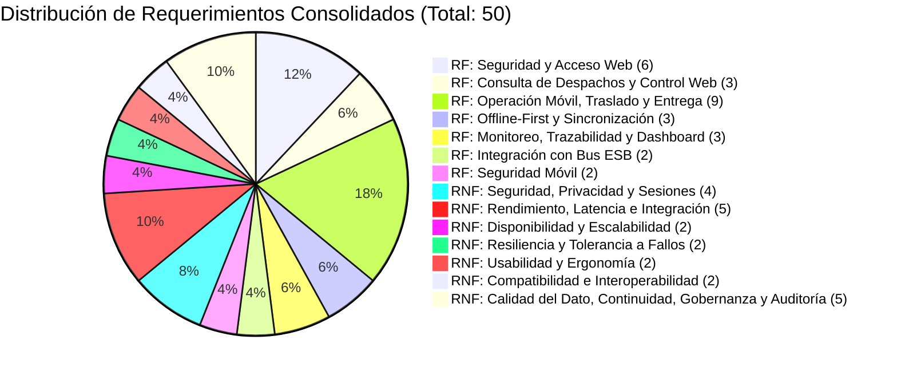

# Matriz Maestra Consolidada de Requerimientos: Y-Trace

> **Carpeta:** `detalles`  
> **Documento:** `01_MATRIZ_DE_REQUERIMIENTOS.md`  
> **Proyecto Oficial:** Sistema Web y Móvil para la Gestión y Trazabilidad de Despachos y Entregas de Yanbal Perú (Y-Trace)  
> **Propósito:** Registro maestro consolidado, clasificado y priorizado de todos los Requerimientos Funcionales (RF) y Requerimientos No Funcionales (RNF) del sistema Y-Trace bajo el alcance oficial de distribución completa entre puntos de distribución (B2B).  
> **Estado:** [CONSOLIDADO OFICIAL — ALCANCE B2B PUNTO A PUNTO CONGELADO]  
>  
> 🔗 **Documentos de Detalle y Análisis Crítico:**  
> - Especificación en detalle de RFs: [[02_REQUERIMIENTOS_FUNCIONALES]]  
> - Especificación en detalle de RNFs: [[03_REQUERIMIENTOS_NO_FUNCIONALES]]  
> - Resumen Operativo y Trazabilidad: [[04_RESUMEN_OPERATIVO_Y_TRAZABILIDAD_REQUERIMIENTOS]]  
> - Nodo Central del Grafo: [[MAPA_MAESTRO_DEL_PROYECTO]]  
> - Marco de Seguridad y Acceso: [[Acceso_Y_Seguridad]]  

---

## 1. Estructura y Metodología de la Matriz

Esta matriz actúa como la **única fuente oficial de requerimientos** de Y-Trace. Ha sido elaborada a partir del análisis riguroso de la arquitectura y la operativa del proyecto, delimitando de manera estricta la frontera del sistema frente a los sistemas existentes de Yanbal Perú ([[SAP_R3]], [[SPY]], [[Maya]], [[SAP_Commerce]], [[Driving]], [[NSDG]], [[Salesforce]], [[Bus_Integracion]]).

### 1.1 Convenciones de Identificación y Delimitación de Alcance
* **Requerimientos Funcionales (RF):** Identificadores secuenciales estrictamente correlativos desde `RF001` hasta `RF028` (28 RF activos en total, sin saltos ni números faltantes, tras depurar los RF históricos de incidencias, fotografías y aislamiento multi-tenant, y unificar la trazabilidad en `RF023`). Responden a la pregunta: *¿Qué debe hacer Y-Trace?* (servicios, comportamientos y flujos operativos de distribución completa punto a punto).
* **Requerimientos No Funcionales (RNF):** Identificadores secuenciales estrictamente correlativos desde `RNF001` hasta `RNF022` (22 RNF activos en total). Responden a la pregunta: *¿Cómo debe funcionar Y-Trace o qué condición/restricción debe cumplir?* (atributos de calidad de software bajo la norma ISO/IEC 25010: seguridad, rendimiento, disponibilidad, resiliencia, usabilidad, interoperabilidad).
* **Delimitación de Alcance Funcional (B2B Punto a Punto):** El alcance del sistema está centrado estrictamente en **despachos de distribución completa entre puntos de distribución** (Origen CD Lurín → Despacho Completo → Traslado → Punto de Destino → Confirmación de Llegada por Geocerca → Confirmación Manual de Entrega/No Entrega → Trazabilidad → Cierre). Se excluyen taxativamente los procesos de reparto domiciliario minorista (B2C), entrega a consultoras residenciales, familiares, parentescos, DNI residencial, registro y gestión de incidencias dentro del aplicativo, captura de fotografías/POD multimedia, creación o planificación de despachos en origen y aislamiento multi-tenant por empresa transportista.
* **Delimitación de Plataforma Móvil (Exclusividad Android Nativa):** La aplicación móvil de Y-Trace está destinada **exclusivamente a dispositivos con sistema operativo Android** (versión 8.0 Oreo o superior) implementada como App Nativa. La captura de ubicación GPS se realizará mediante los servicios de geolocalización disponibles en Android. **No se contempla compatibilidad con iOS ni formato PWA en el alcance del proyecto.**

### 1.2 Leyenda de Estados de Certeza
* **Confirmado:** Respaldado explícitamente por entrevistas oficiales (Ing. Joao Condorpusa, Encargado de Distribución), reglas de negocio validadas o definiciones corporativas del proyecto.
* **Propuesta Técnica:** Parámetro cuantitativo o de diseño de ingeniería de software propuesto por la arquitectura para garantizar el atributo de calidad o rendimiento (ej. timeout de inactividad, consumo de batería, umbral de precisión GPS, límites de interfaz).
* **Pendiente de validación:** Parámetro técnico, legal o presupuestal que requiere ratificación formal de SLA o aprobación contractual con TI, Legal u Operaciones de Yanbal (ej. disponibilidad 99.5%, plazo legal de retención de 24 meses, RPO/RTO ante desastres, estándar WCAG 2.1 AA).

---

## 2. Matriz Maestra Unificada de Requerimientos

| Casos de Prueba                                                         |  ID Req.   |     Tipo     | Descripción del Requerimiento                                                                                                                                                                                                                                                                                                                                                                                                               | Objetivo de Negocio                                                                                                                         | Módulo del Sistema                                   |         Estado          | Prioridad | Responsable                             | Fuente / Respaldo                                               | Comentarios                                                                                                                                                                                      |
| ----------------------------------------------------------------------- | :--------: | :----------: | ------------------------------------------------------------------------------------------------------------------------------------------------------------------------------------------------------------------------------------------------------------------------------------------------------------------------------------------------------------------------------------------------------------------------------------------- | ------------------------------------------------------------------------------------------------------------------------------------------- | ---------------------------------------------------- | :---------------------: | :-------: | --------------------------------------- | --------------------------------------------------------------- | ------------------------------------------------------------------------------------------------------------------------------------------------------------------------------------------------ |
| CP-AUTH-01 (Login exitoso y credenciales erróneas)                      | **RF001**  |  Funcional   | Permitir el acceso a la plataforma Web a usuarios autorizados de Yanbal mediante validación de credenciales (usuario y contraseña).                                                                                                                                                                                                                                                                                                         | Proteger el acceso a la gestión operativa y configuración del sistema.                                                                      | Módulo de Seguridad y Acceso Web                     |       Confirmado        |   Alta    | Administrador Principal                 | [[Acceso_Y_Seguridad]] [[Usuarios_Web]]                      | Requiere HTTPS/TLS 1.3 y hash seguro.                                                                                                                                                            |
| CP-USR-01 (Ciclo de vida de usuario web)                                | **RF002**  |  Funcional   | Permitir al Administrador Principal crear, editar, activar, suspender y desactivar cuentas de usuarios para la plataforma Web.                                                                                                                                                                                                                                                                                                              | Garantizar la gobernanza centralizada de identidades autorizadas.                                                                           | Módulo de Administración de Usuarios                 |       Confirmado        |   Alta    | Administrador Principal                 | [[Acceso_Y_Seguridad]] [[Funciones_Web]]                     | Exclusivo del Administrador Principal; no operable por supervisores.                                                                                                                             |
| CP-ROL-01 (Asignación y cambio de roles)                                | **RF003**  |  Funcional   | Permitir al Administrador Principal asignar y modificar los roles de acceso web (`Administrador Principal`, `Supervisor de Distribución`, `Jefe de Distribución`, `Operador SAC`).                                                                                                                                                                                                                                                          | Aplicar segregación de funciones según responsabilidad institucional.                                                                       | Módulo de Administración de Usuarios                 |       Confirmado        |   Alta    | Administrador Principal                 | [[Acceso_Y_Seguridad]] [[Usuarios_Web]]                      | Basado en el principio de mínimo privilegio.                                                                                                                                                     |
| CP-RBAC-01 (Intento de acceso a rutas no autorizadas)                   | **RF004**  |  Funcional   | Restringir la navegación, menús y ejecución de operaciones en la plataforma Web según el rol asignado al usuario autenticado (RBAC).                                                                                                                                                                                                                                                                                                        | Evitar acciones operativas o de configuración por personal no facultado.                                                                    | Módulo de Seguridad y Acceso Web                     |       Confirmado        |   Alta    | Administrador Principal / Sistema       | [[Acceso_Y_Seguridad]] [[Componentes_Aplicacion]]            | Validación en front-end y reforzada en cada endpoint del backend.                                                                                                                                |
| CP-SES-01 (Expiración de sesión por inactividad)                        | **RF005**  |  Funcional   | Controlar el ciclo de vida de la sesión web, soportando cierre manual, expiración por inactividad y revocación forzada (*kill session*).                                                                                                                                                                                                                                                                                                    | Prevenir el uso indebido de sesiones activas en terminales desatendidas.                                                                    | Módulo de Seguridad y Acceso Web                     |       Confirmado        |   Media   | Administrador Principal                 | [[Acceso_Y_Seguridad]] [[Usuarios_Web]]                      | Tiempo de inactividad establecido preliminarmente en 15 minutos.                                                                                                                                 |
| CP-AUD-01 (Generación de log ante cambio de rol)                        | **RF006**  |  Funcional   | Registrar en una bitácora inmutable las acciones administrativas críticas (altas, bajas, cambios de rol, bloqueos e intentos fallidos).                                                                                                                                                                                                                                                                                                     | Proveer trazabilidad de auditoría para seguridad de la información.                                                                         | Módulo de Auditoría y Seguridad                      |       Confirmado        |   Media   | Administrador Principal                 | [[Acceso_Y_Seguridad]] [[Funciones_Web]]                     | Solo lectura para fines de auditoría informática.                                                                                                                                                |
| CP-DESP-01 (Consulta y filtrado de despachos disponibles)               | **RF007**  |  Funcional   | Permitir al Supervisor de Distribución consultar y filtrar la lista de despachos completos ya existentes, recibidos desde sistemas externos (SPY/WMS) y disponibles para iniciar su seguimiento hacia puntos de destino.                                                                                                                                                                                                                    | Proveer visibilidad de los despachos existentes disponibles para seguimiento, sin crear ni programar despachos ni gestionar cargas físicas. | Módulo de Consulta de Despachos Disponibles          |       Confirmado        |   Alta    | Supervisor de Distribución              | [[Funciones_Web]] [[Flujo_Web]] [[SPY]]                   | Los despachos provienen de los sistemas corporativos vía Bus. Y-Trace solo los consulta y los habilita para seguimiento; no gestiona picking ni planificación logística.                         |
| CP-COD-01 (Generación de código único de activación)                    | **RF008**  |  Funcional   | Generar automáticamente un Código Único de Activación alfanumérico de 8 caracteres para habilitar el seguimiento del despacho por parte del transportista.                                                                                                                                                                                                                                                                                  | Controlar la habilitación segura de la app móvil y vincular de forma unívoca el despacho con el conductor en andén.                         | Módulo de Códigos y Activación                       |       Confirmado        |   Alta    | Supervisor de Distribución / Sistema    | [[Acceso_Y_Seguridad]] [[Flujo_Principal]]                   | Código efímero; el código normal no cambia a `EN_RUTA`; requiere acción consciente del conductor.                                                                                                |
| CP-DESP-04 (Cancelación forzada del seguimiento del despacho)           | **RF009**  |  Funcional   | Permitir al Supervisor de Distribución ejecutar la cancelación forzada del seguimiento del despacho desde la Web ante contingencia externa comunicada fuera del sistema (vía telefónica externa), registrando motivo mínimo justificado, transicionando a `DESPACHO_CANCELADO`, deteniendo el tracking GPS, revocando la sesión móvil, invalidando el código de activación y retornando la App móvil a su pantalla inicial. Genera el evento `DESPACHO_CANCELADO`, cuya publicación al Bus corresponde a [[RF025]]. | Proveer una función de control operativo para cerrar administrativamente el seguimiento ante contingencias externas insalvables.            | Módulo de Consulta y Habilitación de Seguimiento     |       Confirmado        |   Media   | Supervisor de Distribución              | [[Ciclo_De_Vida_Del_Despacho]] [[Funciones_Web]]             | La contingencia se comunica fuera de Y-Trace. El sistema ejecuta y registra la cancelación técnica; la publicación hacia el Bus corporativo externo corresponde a RF025.          |
| CP-MOB-01 (Activación móvil mediante código único)                      | **RF010**  |  Funcional   | Permitir al conductor activar el seguimiento del despacho mediante el ingreso del Código de Activación en la App Nativa Android.                                                                                                                                                                                                                                                                                                            | Simplificar la adopción del transportista tercero sin exigir credenciales corporativas ni contraseñas complejas.                            | Módulo Móvil de Activación (App Nativa Android)      |       Confirmado        |   Alta    | Conductor                               | [[Acceso_Y_Seguridad]] [[Funciones_Movil]]                   | Exige despacho existente y elegible para seguimiento; vincula el dispositivo al viaje.                                                                                                           |
| CP-MOB-02 (Establecimiento y mantenimiento de sesión operativa móvil)   | **RF011**  |  Funcional   | Establecer y mantener una sesión operativa móvil persistente vinculada al despacho, vehículo, conductor y dispositivo Android, garantizando que sobreviva a caídas de señal y reconecte automáticamente sin volver a solicitar el código.                                                                                                                                                                                                   | Asociar de manera unívoca cada coordenada y evento al viaje y mantener la continuidad operativa sin fricción en carretera.                  | Módulo Móvil de Activación (App Nativa Android)      |       Confirmado        |   Alta    | Sistema Backend / App Nativa            | [[Acceso_Y_Seguridad]] [[Funciones_Movil]]                   | La sesión caduca de inmediato al concluir (`FINALIZADO`) o cancelar (`DESPACHO_CANCELADO`).                                                                                                      |
| CP-MOB-03 (Visualización de información del despacho y destino)         | **RF012**  |  Funcional   | Presentar al conductor en la App Nativa la información operativa del despacho: código de despacho, punto de destino de distribución, dirección física de llegada, cantidad de bultos, observaciones operativas de ruta y estado, limitándose estrictamente a la gestión de traslado B2B sin introducir inventario, catálogo de productos, ventas ni datos residenciales B2C. | Guiar la ejecución física del traslado intercentros sin sobrecargar datos comerciales.                                                      | Módulo Móvil de Ruta (App Nativa Android)            |       Confirmado        |   Alta    | Conductor                               | [[Funciones_Movil]] [[Despacho_Como_Unidad_Logistica]]       | Almacenado localmente en SQLite; limitado a datos operativos de traslado B2B. No gestiona inventario, catálogo, picking ni ventas B2C.                          |
| CP-MOB-04 (Registro de hito de salida e inicio de traslado EN_RUTA)     | **RF013**  |  Funcional   | Registrar el hito formal de salida física del CD Lurín e inicio del traslado cuando el conductor pulsa "Iniciar Despacho", capturando atómicamente fecha, hora y coordenadas GPS iniciales, transicionando a `EN_RUTA` y activando la telemetría periódica GPS en segundo plano. Genera el evento `EN_RUTA`, cuya publicación al Bus corresponde a [[RF025]].                                                                        | Certificar el momento exacto de partida física de la carga y habilitar el rastreo continuo de la unidad.                                     | Módulo Móvil de Ruta (App Nativa Android)            |       Confirmado        |   Alta    | Conductor                               | [[Flujo_Conductor]] [[Ciclo_De_Vida_Del_Despacho]]           | Registra fecha, hora y ubicación atómica de salida; dispara telemetría periódica. La publicación al Bus corresponde a RF025.                                                                     |
| CP-GPS-01 (Muestreo periódico de coordenadas en ruta)                   | **RF014**  |  Funcional   | Capturar periódicamente coordenadas GPS en segundo plano desde el dispositivo Android durante el estado `EN_RUTA` (cada 10 minutos).                                                                                                                                                                                                                                                                                                        | Proveer la traza histórica y última ubicación estimada de la unidad en ruta.                                                                | Módulo Móvil de Telemetría GPS                       |       Confirmado        |   Alta    | Sistema Móvil / Conductor               | [[Funcionamiento_GPS]] [[Restricciones_Tecnicas]]            | Muestreo en segundo plano optimizado exclusivamente en estado `EN_RUTA`.                                                                                                                         |
| CP-ENT-01 (Registro de llegada a destino por geocerca)                  | **RF015**  |  Funcional   | Registrar automáticamente el arribo físico al punto de distribución mediante la detección de entrada al radio configurado de la geocerca perimétrica, transicionando a `EN_DESTINO` con captura atómica de fecha, hora y ubicación GPS.                                                                                                                                                                                                  | Auditar la llegada física en destino sirviendo la coordenada GPS como respaldo geoespacial directo; no confirma la entrega.                 | Módulo Móvil de Llegada (App Nativa Android)         |       Confirmado        |   Alta    | Conductor / Sistema Móvil               | [[Eventos_E_Incidencias]] [[Funciones_Movil]]                | Detección 100% automática por geocerca perimétrica. Acredita arribo físico (`EN_DESTINO`); no confirma la entrega ni requiere botón manual de respaldo.         |
| CP-ENT-02 (Confirmación de recepción / entrega conforme de despacho)    | **RF016**  |  Funcional   | Permitir al conductor registrar manualmente la confirmación de entrega y recepción del despacho completo en el punto de destino (habilitado tras `EN_DESTINO`), transicionando a `ENTREGADO` con captura atómica de fecha, hora y ubicación GPS.                                                                                                                                                                                            | Formalizar la entrega de la carga completa en el punto de destino de forma consciente y verificable sin archivos multimedia.                | Módulo Móvil de Entrega (App Nativa Android)         |       Confirmado        |   Alta    | Conductor                               | [[Despacho_Como_Unidad_Logistica]] [[Funciones_Movil]]       | Genera el evento inmutable `ENTREGADO`. La acción manual es obligatoria; no requiere ni admite fotografías ni POD.                                                                               |
| CP-ENT-03 (Registro de despacho no entregado o rechazado con causal)    | **RF017**  |  Funcional   | Permitir al conductor registrar la no entrega o rechazo del despacho en destino ante impedimentos operativos tipificados, registrando causal estructurada, estampa temporal y GPS (estado `NO_ENTREGADO`).                                                                                                                                                                                                                                  | Sustentar técnicamente los motivos de no recepción del despacho en el punto de destino sin archivos multimedia.                             | Módulo Móvil de Entrega (App Nativa Android)         |       Confirmado        |   Alta    | Conductor                               | [[Eventos_E_Incidencias]] [[Funciones_Movil]]                | Causales tipificadas: Punto cerrado, rechazo de carga, acceso bloqueado, fuerza mayor. Sin fotografías.                                                                                          |
| CP-MOB-05 (Finalización y cierre del seguimiento del despacho)          | **RF018**  |  Funcional   | Permitir al conductor finalizar formalmente el seguimiento del despacho tras registrar el resultado de entrega (`ENTREGADO` o `NO_ENTREGADO`) y verificar que la cola local de sincronización esté vacía, transicionando a `FINALIZADO`, cesando la telemetría GPS, revocando la sesión móvil e invalidando el código de activación.                                                                                                    | Concluir formalmente el seguimiento operativo del despacho y extinguir las credenciales temporales, garantizando el cese de transmisión GPS.  | Módulo Móvil de Cierre (App Nativa Android)          |       Confirmado        |   Alta    | Conductor                               | [[Ciclo_De_Vida_Del_Despacho]] [[Flujo_Conductor]]           | Cierra el seguimiento operativo; no liquida fletes ni documentos físicos (procesos ajenos a Y-Trace). Retorna la app a la pantalla inicial.                                                      |
| CP-OFF-01 (Almacenamiento local offline en dispositivo Android)         | **RF019**  |  Funcional   | Almacenar localmente en la base de datos SQLite (Room) del dispositivo Android coordenadas GPS y eventos de estado cuando se interrumpa la cobertura celular (Offline).                                                                                                                                                                                                                                                                     | Garantizar la operación ininterrumpida en carreteras interprovinciales o zonas sin conectividad sin almacenar fotos ni adjuntos.            | Módulo Móvil de Persistencia Local                   |       Confirmado        |   Alta    | Sistema Móvil / App Nativa              | [[Offline_First]] [[Restricciones_Tecnicas]]                 | Persistencia estructurada local en SQLite (Room) para telemetría y eventos.                                                                                                                      |
| CP-OFF-02 (Sincronización automática al recuperar red)                  | **RF020**  |  Funcional   | Sincronizar automáticamente en orden cronológico (FIFO) los eventos y telemetría retenidos localmente tan pronto se restablezca la conexión de red.                                                                                                                                                                                                                                                                                         | Evitar pérdida de datos y actualizar el backend sin intervención manual.                                                                    | Módulo Móvil de Sincronización                       |       Confirmado        |   Alta    | Sistema Móvil / Foreground Service      | [[Offline_First]] [[Componentes_Aplicacion]]                 | Conserva el timestamp original del hecho (`captured_at`); backend idempotente.                                                                                                                   |
| CP-OFF-03 (Indicador visual de estado de sincronización local)          | **RF021**  |  Funcional   | Presentar al conductor un indicador visual del estado de sincronización (verde: al día; amarillo: contador de transacciones pendientes en cola).                                                                                                                                                                                                                                                                                            | Brindar retroalimentación visual sobre la persistencia y subida de datos.                                                                   | Módulo Móvil de Sincronización                       |       Confirmado        |   Media   | Conductor                               | [[Offline_First]] [[Funciones_Movil]]                        | Impide finalizar despacho si restan eventos por transmitir.                                                                                                                                      |
| CP-MON-01 (Monitoreo operativo de flota en Torre de Control Web)        | **RF022**  |  Funcional   | Proveer una grilla operativa de monitoreo en tiempo real para Supervisores y Jefatura, visualizando para cada despacho: código de despacho, placa del vehículo, conductor, destino, estado operativo con semáforo (Verde: `EN_RUTA`, Amarillo: `EN_DESTINO`, Gris: `FINALIZADO`/`DESPACHO_CANCELADO`), última coordenada GPS, hora de última actualización y tiempo transcurrido desde el último reporte (antigüedad de telemetría).     | Habilitar el control operacional y supervisión activa de la flota en tiempo real con datos de ubicación y frescura del reporte.             | Módulo Web de Monitoreo de Despachos                 |       Confirmado        |   Alta    | Supervisor / Jefe de Distribución       | [[Funciones_Web]] [[Proceso_TOBE]]                           | Permite filtrar por estado, destino y transportista. Sin capas cartográficas pesadas ni estados de incidencia.                                                                                    |
| CP-TRAC-01 (Consulta de trazabilidad y resumen del despacho)            | **RF023**  |  Funcional   | Permitir consultar el seguimiento completo de un despacho mediante su código de despacho o placa vehicular, mostrando los principales eventos operativos, coordenadas GPS registradas, cambios de estado, fechas y horas, duración de los hitos y recorrido realizado, incluyendo el resultado final o la cancelación forzada del seguimiento cuando corresponda.                                                                           | Proveer visibilidad unificada de la trazabilidad y ciclo de vida completo del despacho en un solo punto de consulta sin duplicidad.         | Módulo Web de Consulta de Trazabilidad               |       Confirmado        |   Alta    | Supervisor / SAC / Jefe de Distribución | [[Funciones_Web]] [[Flujo_Web]]                              | Requerimiento unificado. Sin utilizar el término "evidencias" ni archivos multimedia; despliegue inmediato en pantalla (< 2 s).                                                                  |
| CP-KPI-01 (Cálculo y despliegue de KPIs de cumplimiento)                | **RF024**  |  Funcional   | Presentar un tablero ejecutivo de indicadores logísticos con métricas de tiempos de traslado (Lead Time), tasa de entregas conformes y latencia, permitiendo consultar y filtrar la información mediante los criterios disponibles en la vista operativa y exportar los resultados exclusivamente en formato Excel.                                                                                                                         | Permitir el análisis estratégico del servicio, evaluación de transporte y exportación de reportes.                                          | Módulo Web de Indicadores (Dashboard)                |       Confirmado        |   Media   | Jefe de Distribución / Gerencia         | [[Funciones_Web]] [[Oportunidad_de_Mejora]]                  | Evaluación por empresa transportista y período; los cancelados se excluyen de Lead Time y puntualidad y se contabilizan en métrica separada de cancelación. Exportación exclusivamente en Excel. |
| CP-INT-01 (Publicación de eventos de despacho al Bus de Integración)    | **RF025**  |  Funcional   | Publicar al Bus de Integración los eventos de estado e hitos operativos definidos para interoperabilidad (`EN_RUTA`, `EN_DESTINO`, `ENTREGADO`, `NO_ENTREGADO`, `DESPACHO_CANCELADO`) en formato JSON canónico estandarizado.                                                                                                                                                                                                               | Mantener sincronizados los sistemas centrales con los hitos relevantes del despacho dentro del SLA $\le$ 30 min.                            | Módulo Backend de Integración (ESB)                  |       Confirmado        |   Alta    | Sistema Backend / Bus de Integración    | [[Bus_Integracion]] [[Integracion_Bus_Eventos]]              | Concentra de forma única la publicación de eventos operativos hacia el Bus corporativo (SLA <= 30 min). El hito interno de control previo no se publica.                                         |
| CP-INT-03 (Envío de resumen de trazabilidad del despacho al Bus)        | **RF026**  |  Funcional   | Transmitir al Bus de Integración un resumen consolidado de la trazabilidad del despacho tras su finalización formal (`FINALIZADO` o `DESPACHO_CANCELADO`), sin ejecutar liquidación económica ni logística.                                                                                                                                                                                                                                 | Proporcionar a los sistemas externos la información final de seguimiento necesaria para sus procesos posteriores.                           | Módulo Backend de Integración (ESB)                  |       Confirmado        |   Media   | Sistema Backend / Bus de Integración    | [[Integracion_Bus_Eventos]] [[Ciclo_De_Vida_Del_Despacho]]   | Entrega información consolidada de trazabilidad; cualquier liquidación o conciliación posterior corresponde a sistemas externos.                                                                 |
| CP-MOB-SEC-01 (Bloqueo tras 5 intentos fallidos de activación móvil)    | **RF027**  |  Funcional   | Limitar los intentos fallidos de ingreso del código de activación móvil a un máximo de 5 intentos consecutivos, bloqueando e invalidando el código de forma irrevocable al registrar el quinto fallo.                                                                                                                                                                                                                                        | Prevenir ataques de fuerza bruta sobre el espacio de códigos alfanuméricos de 8 caracteres.                                                 | Módulo Móvil de Activación (App Nativa) + Backend    |       Confirmado        |   Alta    | Conductor / Sistema Backend             | [[RF008]] [[RF010]] [[Acceso_Y_Seguridad]]                | Bloqueo estricto por fuerza bruta; el despacho queda en espera de nueva habilitación si corresponde. Sin envío de alertas al Supervisor.                                                          |
| CP-COD-02 (Unicidad, vigencia y caducidad del código de activación)     | **RF028**  |  Funcional   | Asignar unicidad activa al Código de Activación y revocar automáticamente su validez y la de la sesión operativa tan pronto el despacho pase a `FINALIZADO` o `DESPACHO_CANCELADO`.                                                                                                                                                                                                                                                         | Reducir la ventana de exposición y asegurar que el código no permanezca habilitado tras el cierre o cancelación.                            | Módulo de Códigos y Activación                       |       Confirmado        |   Alta    | Supervisor / Sistema Backend            | [[RF008]] [[Acceso_Y_Seguridad]]                             | Revocación inmediata al finalizar o cancelar; la sesión solo existe si el código llegó a ser activado.                                                                                           |
| CP-RNF-SEC-01 (Intento de inyección de telemetría sin token)            | **RNF001** | No Funcional | Seguridad de Acceso: El sistema debe impedir accesos no autorizados a la web y bloquear transmisiones móviles sin sesión operativa autorizada.                                                                                                                                                                                                                                                                                              | Evitar intrusiones, suplantaciones e inyección de datos falsos.                                                                             | Seguridad y Control de Acceso                        |       Confirmado        |   Alta    | Arquitectura / Seguridad TI             | [[Acceso_Y_Seguridad]] [[Restricciones_Tecnicas]]            | Métrica: 100% de peticiones no autorizadas rechazadas (HTTP 401/403).                                                                                                                            |
| CP-RNF-SEC-02 (Intento de ejecución de acción fuera del rol asignado)   | **RNF002** | No Funcional | Autorización Estricta (RBAC): El 100% de operaciones ejecutadas por usuarios web deben corresponder estrictamente a su rol asignado.                                                                                                                                                                                                                                                                                                        | Garantizar la segregación de funciones y principio de mínimo privilegio.                                                                    | Seguridad y Autorización                             |       Confirmado        |   Alta    | Arquitectura / Seguridad TI             | [[Acceso_Y_Seguridad]] [[Usuarios_Web]]                      | Métrica: Cero tolerancia a elevación de privilegios no concedidos (HTTP 403 Forbidden).                                                                                                          |
| CP-RNF-SEC-03 (Verificación de hash en BD e inspección de red)          | **RNF003** | No Funcional | Protección y Gestión de Credenciales Web: Las contraseñas de los usuarios de la plataforma Web deben almacenarse mediante BCrypt con factor de costo >= 12, utilizando el mecanismo de hash y salt correspondiente, y transmitirse exclusivamente a través de canales cifrados mediante TLS 1.3.                                                                                                                                            | Proteger las credenciales de los colaboradores de Yanbal contra ataques de fuerza bruta, compromiso de BD e interceptación.                 | Seguridad y Gestión de Credenciales                  |       Confirmado        |   Alta    | Arquitectura / Seguridad TI             | [[Acceso_Y_Seguridad]] [[Requerimientos_No_Funcionales]]     | Métrica: 100% contraseñas con hash BCrypt (costo >= 12) y salt criptoseguro; 100% tráfico web bajo TLS 1.3. Decisión arquitectónica: autenticación local sin Azure AD.                           |
| CP-RNF-SEC-04 (Comprobación de expiración y revocación de sesión)       | **RNF004** | No Funcional | Gobernanza de Sesiones: Expiración por inactividad a los 15 min en web (propuesta técnica); revocación inmediata de la sesión móvil al finalizar o cancelar el despacho.                                                                                                                                                                                                                                                                    | Prevenir el secuestro de sesiones en terminales desatendidas o celulares.                                                                   | Seguridad y Gestión de Sesiones                      |    Propuesta Técnica    |   Alta    | Arquitectura / Seguridad TI             | [[Acceso_Y_Seguridad]] [[Requerimientos_No_Funcionales]]     | Tokens firmados criptográficamente con tiempo de vida finito. Umbral de 15 min sujeto a validación operativa.                                                     |
| CP-RNF-INT-01 (Intento de alteración de coordenadas o eventos)          | **RNF005** | No Funcional | Inmutabilidad e Integridad de Eventos y Telemetría Operativa: Todos los registros de coordenadas GPS satelitales y eventos operativos del despacho (`DESPACHO_CANCELADO`, `EN_RUTA`, `EN_DESTINO`, `ENTREGADO`, `NO_ENTREGADO`) persistidos en el backend deben ser estrictamente inmutables (append-only), prohibiendo modificaciones o eliminaciones durante su ciclo de vida; la única eliminación física permitida corresponde a la purga administrativa automatizada por vencimiento de retención ([[RNF018]]). | Garantizar la fidelidad técnica y jurídica de la traza de auditoría de transporte ante controversias con empresas transportistas.         | Integridad de Datos y Telemetría Operativa           |       Confirmado        |   Alta    | Arquitectura / Base de Datos            | [[Reglas_De_Integridad]] [[Acceso_Y_Seguridad]]              | Cero operaciones de UPDATE o DELETE por usuarios/apps sobre tablas operativas. Armonizado con el ciclo de vida de retención de RNF018. Separado de auditoría administrativa (RNF022). |
| CP-RNF-PERF-01 (Medición de latencia de eventos hacia el Bus)           | **RNF006** | No Funcional | Latencia de Sincronización hacia el Bus Corporativo: El Bus de Integración debe aceptar cada evento elegible dentro de un máximo de 30 minutos desde su recepción e incorporación a la cola en el backend de Y-Trace.                                                                                                                                                                                                                       | Resolver el problema central del negocio (desfase actual de 2 horas).                                                                       | Rendimiento e Integración                            |       Confirmado        |   Alta    | Arquitectura / Conectividad             | [[Oportunidad_de_Mejora]] [[Problematica_Validada]]          | Métrica: 100% de los eventos elegibles aceptados por el Bus en `<= 30 min` desde su recepción en el backend; SLA único confirmado de 30 minutos.                 |
| CP-RNF-PERF-02 (Prueba de carga local y latencia de interfaz)           | **RNF007** | No Funcional | Tiempo de Respuesta en App Nativa: Las operaciones locales del conductor (guardar evento, confirmar hito) deben responder en menos de 500 ms.                                                                                                                                                                                                                                                                                               | Brindar agilidad al transportista y evitar fricciones en ruta sin capturas pesadas de fotos.                                                | Rendimiento y Usabilidad                             |    Propuesta Técnica    |   Alta    | Desarrollo Frontend Móvil               | [[Restricciones_Tecnicas]] [[Requerimientos_No_Funcionales]] | Métrica: Transición de pantalla y confirmación táctil < 500 ms. Propuesta de diseño para experiencia fluida.                                                      |
| CP-RNF-EFF-01 (Monitoreo de drenaje de batería durante jornada)         | **RNF008** | No Funcional | Eficiencia de Batería: La telemetría GPS en segundo plano y la sincronización no deben consumir más del 15% de la batería en 8 horas en Android.                                                                                                                                                                                                                                                                                            | Facilitar la adopción en smartphones de transportistas terceros.                                                                            | Eficiencia Energética                                |    Propuesta Técnica    |   Media   | Desarrollo Frontend Móvil               | [[Funcionamiento_GPS]] [[Restricciones_Tecnicas]]            | Métrica: Consumo <= 15% en batería estándar de 4000 mAh en 8 h en Android. Parámetro propuesto por arquitectura móvil.                                            |
| CP-RNF-EFF-02 (Medición de consumo de datos celulares en ruta)          | **RNF009** | No Funcional | Consumo de Datos Móviles: El tráfico de telemetría y eventos de la App Nativa no debe superar los 50 MB diarios por dispositivo móvil.                                                                                                                                                                                                                                                                                                      | Garantizar viabilidad económica para conductores que usan planes propios sin sobrecarga de imágenes.                                        | Eficiencia de Red                                    |    Propuesta Técnica    |   Media   | Desarrollo Frontend Móvil               | [[Funcionamiento_GPS]] [[Restricciones_Tecnicas]]            | Métrica: Compresión de payloads JSON; sin archivos multimedia. Límite propuesto por ingeniería de software.                                                       |
| CP-RNF-REL-01 (Monitoreo de uptime en horario operativo)                | **RNF010** | No Funcional | Disponibilidad del Servicio: La plataforma Web y la API de ingesta deben mantener una disponibilidad mínima del 99.5% de 06:00 a 21:00 h.                                                                                                                                                                                                                                                                                                   | Asegurar la continuidad ininterrumpida de las operaciones de despacho y traslado.                                                           | Disponibilidad y Confiabilidad                       | Pendiente de validación |   Alta    | Infraestructura y Operaciones TI        | [[Restricciones_Tecnicas]] [[Requerimientos_No_Funcionales]] | Métrica preliminar: Disponibilidad >= 99.5% en ventana operativa. Sujeto a ratificación de SLA formal de infraestructura cloud con TI Yanbal.                    |
| CP-RNF-SCA-01 (Pruebas de estrés de 500 conexiones concurrentes)        | **RNF011** | No Funcional | Capacidad y Escalabilidad Concurrente: Soportar al menos 500 conductores transmitiendo telemetría en paralelo y 50,000 eventos diarios.                                                                                                                                                                                                                                                                                                     | Cubrir la demanda logística de las campañas comerciales pico de Yanbal.                                                                     | Escalabilidad y Capacidad                            |    Propuesta Técnica    |   Alta    | Arquitectura / Backend                  | [[Restricciones_Tecnicas]] [[Requerimientos_No_Funcionales]] | Métrica propuesta por arquitectura: Degradación de latencia de API < 10% bajo carga máxima (500 conductores y 50,000 eventos diarios).                           |
| CP-RNF-RES-01 (Llenado de almacenamiento local con 500 eventos)         | **RNF012** | No Funcional | Resiliencia de Persistencia Offline: La App Nativa debe ser capaz de almacenar al menos 500 eventos operativos y puntos GPS en SQLite (Room) sin degradación.                                                                                                                                                                                                                                                                               | Soportar rutas interprovinciales o zonas rurales con cero cobertura sin almacenar fotos ni adjuntos pesados.                                | Resiliencia y Tolerancia a Fallos                    |    Propuesta Técnica    |   Alta    | Desarrollo Frontend Móvil               | [[Offline_First]] [[Restricciones_Tecnicas]]                 | Capacidad propuesta de búfer local: Integridad de 500 registros retenidos y sincronizados en orden FIFO.                                                          |
| CP-RNF-INT-02 (Envío duplicado intencional de eventos y validación)     | **RNF013** | No Funcional | Idempotencia en Sincronización: El endpoint de ingesta debe procesar múltiples envíos de un mismo evento sin duplicar información.                                                                                                                                                                                                                                                                                                          | Proteger la coherencia ante reintentos de red inestable en carreteras.                                                                      | Confiabilidad e Integridad                           |       Confirmado        |   Alta    | Arquitectura / Backend                  | [[Offline_First]] [[Componentes_Aplicacion]]                 | Métrica: Validación basada en UUIDs únicos generados en el móvil. Regla de negocio confirmada.                                                                    |
| CP-RNF-USA-01 (Pruebas de usabilidad con usuarios transportistas)       | **RNF014** | No Funcional | Usabilidad Operativa en Campo: La interfaz del conductor debe permitir completar cualquier acción crítica en un máximo de 3 toques.                                                                                                                                                                                                                                                                                                         | Reducir distracciones al volante y simplificar la gestión en cabina y andén sin formularios de incidencias.                                 | Usabilidad y Ergonomía Móvil                         |    Propuesta Técnica    |   Media   | Diseño UI/UX Móvil                      | [[Funciones_Movil]] [[Flujo_Conductor]]                      | Criterio de diseño propuesto: Botones de mínimo 48x48 dp y flujo simplificado a 3 toques.                                                                         |
| CP-RNF-PERF-03 (Búsqueda indexada sobre tabla de histórico)             | **RNF015** | No Funcional | Tiempo de Respuesta en Consulta de Trazabilidad: La consulta por código de despacho o unidad en la web (`RF023`) debe desplegar la cronología en menos de 2 s.                                                                                                                                                                                                                                                                              | Permitir al operador responder o validar el estado del viaje de inmediato.                                                                  | Rendimiento y Eficiencia                             |    Propuesta Técnica    |   Alta    | Base de Datos / Backend                 | [[Funciones_Web]] [[Flujo_Web]]                              | Propuesta técnica de rendimiento: Renderizado final en pantalla < 2.0 segundos mediante índices optimizados.                                                      |
| CP-RNF-COMP-01 (Compatibilidad de App Android y Navegador Web)          | **RNF016** | No Funcional | Compatibilidad de Plataforma Cliente (Móvil Android y Web): La aplicación móvil debe operar exclusivamente como App Nativa Android 8.0+ con servicios nativos de geolocalización (iOS y PWA excluidos); la consola web de gestión debe ser compatible con navegadores de escritorio modernos (Chrome, Edge, Firefox) bajo estándares HTML5/ECMAScript 2020+. | Asegurar soporte nativo en la flota de smartphones de transportistas y acceso universal sin plugins para la supervisión web.               | Compatibilidad y Plataformas Cliente                 |       Confirmado        |   Alta    | Desarrollo Frontend Móvil y Web         | [[Restricciones_Tecnicas]] [[Funciones_Movil]]               | Móvil: 100% operatividad en Android 8.0+ nativo (sin iOS ni PWA). Web: 100% compatibilidad en Chrome 90+, Edge 90+, Firefox 88+ de escritorio.                  |
| CP-RNF-INT-03 (Validación de esquemas JSON Schema contra ESB)           | **RNF017** | No Funcional | Estandarización de Intercambio: Los eventos de integración se estructuran mediante payloads JSON conforme al esquema canónico definido para la interoperabilidad con codificación UTF-8.                                                                                                                                                                                                                                                    | Garantizar la interoperabilidad fluida con el middleware corporativo.                                                                       | Interoperabilidad de Sistemas                        |       Confirmado        |   Alta    | Arquitectura / Integraciones            | [[Bus_Integracion]] [[Integracion_Bus_Eventos]]              | Métrica: Cumplimiento de esquemas canónicos definidos por Yanbal. Estándar corporativo confirmado.                                                                |
| CP-RNF-LEG-01 (Ejecución de job de purga de registros históricos)       | **RNF018** | No Funcional | Retención y Eliminación de Registros Operativos: Conservar eventos operativos y telemetría GPS durante el período de retención legal/corporativo definido por Yanbal (propuesta preliminar: 24 meses), ejecutando su eliminación o anonimización física automatizada al vencer dicho plazo como única excepción programada a la inmutabilidad transaccional de [[RNF005]]. | Cumplir con los principios de proporcionalidad y gobernanza de datos de Yanbal sin almacenamiento de imágenes.                              | Privacidad y Cumplimiento Legal                      | Pendiente de validación |   Alta    | Arquitectura / Legal Yanbal             | [[Acceso_Y_Seguridad]] [[RNF005]]                            | Mecanismo de purga programada confirmado; el plazo de 24 meses es propuesta preliminar pendiente de ratificación formal por Legal Yanbal. Armonizado con RNF005. |
| CP-RNF-DIS-01 (Simulacro de restauración de contingencia RPO/RTO)       | **RNF019** | No Funcional | Recuperación ante Desastres (RPO/RTO): El sistema debe cumplir con un RPO <= 15 minutos y un RTO <= 4 horas ante una caída total de infraestructura.                                                                                                                                                                                                                                                                                        | Minimizar el impacto operativo y la pérdida de transacciones logísticas ante desastres.                                                     | Disponibilidad y Continuidad                         | Pendiente de validación |   Alta    | Infraestructura y Operaciones TI        | [[Restricciones_Tecnicas]] [[RNF010]]                        | Valores de RPO/RTO son propuesta de arquitectura técnica, pendientes de SLA formal con Operaciones TI de Yanbal.                                                 |
| CP-RNF-GEO-01 (Verificación de precisión satelital y calidad)           | **RNF020** | No Funcional | Precisión Mínima de Geolocalización en Android: Las coordenadas GPS capturadas en Android deben tener una precisión reportada <= 50 metros; lecturas con menor precisión deben marcarse como de "baja confiabilidad" sin ser descartadas.                                                                                                                                                                                                   | Asegurar la calidad y confiabilidad del dato geoespacial capturado en campo.                                                                | Calidad del Dato y Rendimiento                       |    Propuesta Técnica    |   Media   | Desarrollo Frontend Móvil / Backend     | [[Funcionamiento_GPS]] [[RF015]]                             | Umbral técnico propuesto: 90% de lecturas con accuracy <= 50 m en condiciones de cielo abierto en Android.                                                       |
| CP-RNF-ACC-01 (Auditoría automatizada Lighthouse/axe con puntaje >= 90) | **RNF021** | No Funcional | Accesibilidad Web (WCAG 2.1 Nivel AA): La plataforma Web (Supervisor, Jefe de Distribución, Operador SAC) debe cumplir con el estándar WCAG 2.1 Nivel AA en contraste, navegación por teclado y etiquetado semántico.                                                                                                                                                                                                                       | Garantizar accesibilidad e inclusión en el uso de la consola web corporativa sin pantallas de incidencias.                                  | Usabilidad y Accesibilidad Web                       | Pendiente de validación |   Media   | Desarrollo Frontend Web                 | [[Funciones_Web]] [[RNF014]]                                 | Alcance técnico propuesto; pendiente de priorización de presupuesto/cronograma formal con Yanbal.                                                                 |
| CP-RNF-INT-04 (Intento de alteración o borrado directo en bitácora)     | **RNF022** | No Funcional | Inmutabilidad de la Bitácora de Auditoría Administrativa: Los registros de la bitácora administrativa web ([[RF006]]) deben almacenarse bajo modelo estrictamente append-only, prohibiendo operaciones UPDATE y DELETE a nivel de motor de base de datos para garantizar no repudio y trazabilidad forense.                                                                                                                              | Garantizar la integridad pericial, no repudiación y auditoría forense de acciones privilegiadas de usuarios web.                            | Integridad y Auditoría Administrativa                |       Confirmado        |   Alta    | Arquitectura / Base de Datos            | [[RF006]] [[RNF005]]                                         | Métrica: 100% de rechazo a nivel DB (triggers/permisos) ante intentos de UPDATE/DELETE en bitácora de seguridad. Separado de eventos operativos ([[RNF005]]).   |

---

## 3. Resumen Cuantitativo de la Matriz

* **Total de Requerimientos Funcionales (RF):** 28 (RF001 a RF028, estrictamente correlativos, sin saltos ni números faltantes).
* **Total de Requerimientos No Funcionales (RNF):** 22 (RNF001 a RNF022, estrictamente correlativos).
* **Total General de Requerimientos Consolidados:** 50 (28 RF activos + 22 RNF).
* **Alcance Funcional:** Despachos de distribución completa entre puntos de distribución (B2B Punto a Punto).
* **Alcance de Plataforma Móvil:** Exclusivo para Android Nativa (Android 8.0+; iOS y formato PWA no soportados).

---

## 4. Exclusiones Explícitas del Alcance (Frontera del Sistema)

Para garantizar la absoluta integridad conceptual y operativa de Y-Trace, se delimitan formalmente en esta sección las exclusiones taxativas del proyecto:

1. **No reparto domiciliario minorista (B2C):** Y-Trace no realiza ni gestiona distribución de última milla hacia consumidores finales ni viviendas particulares.
2. **No entrega a consultoras/familiares con DNI residencial:** Queda formalmente excluida toda captura de vínculos de parentesco, DNI residencial de personas naturales y firmas de recepción en hogares particulares.
3. **No gestión de despachos unitarios — solo despachos de carga completa punto a punto:** El alcance operacional está restringido estrictamente a despachos de carga completa intercentros (Centro de Distribución Lurín → Punto de Distribución / Agencias receptoras). No incluye gestión de stock, preparación de pedidos, picking ni distribución de bultos unitarios sueltos.
4. **No soporte iOS ni PWA:** La aplicación móvil para conductores está desarrollada y homologada de manera exclusiva sobre la plataforma Android (versión 8.0 Oreo o superior) como App Nativa. Queda expresamente fuera de alcance el soporte para iOS / Apple y la modalidad de navegador web progresivo (PWA).
5. **No gestión de incidencias dentro de Y-Trace:** Y-Trace no dispone de botones "Reportar Incidencia", formularios móviles, tipificación en ruta, captura de percances viales ni módulo web de incidencias, ni transiciona a estados como `CON_INCIDENCIA`. Toda contingencia (averías, accidentes, bloqueos) se canaliza al 100% fuera del sistema mediante llamadas telefónicas u operativas externas de Yanbal. La única acción del sistema ante contingencias insalvables es la ejecución de la **Cancelación Forzada del Seguimiento (`RF009`)** desde la consola Web por el Supervisor.
6. **No captura ni almacenamiento de fotografías, imágenes o POD:** La trazabilidad de entrega se fundamenta exclusivamente en datos estructurados verificables (coordenadas GPS satelitales, marcas de tiempo inmutables `captured_at`, estados y causales tipificadas). Se excluye el uso de cámaras, subida de fotografías, comprobantes de entrega multimedia (POD) y servicios de Object Storage.
7. **No gestión logística upstream:** Y-Trace no crea, programa, asigna, prepara, libera ni cancela logísticamente los despachos. Recibe despachos ya existentes desde sistemas corporativos externos (SPY/WMS) y concentra su funcionalidad exclusivamente en seguimiento, telemetría, trazabilidad y publicación de eventos hacia el Bus.
8. **No aislamiento multi-tenant por empresa transportista:** Y-Trace no es una plataforma multi-tenant con segregación de datos por empresa transportista ni perfiles externos para contratistas. Los transportistas no interactúan con la plataforma Web (solo conductores usan códigos efímeros en la App Nativa); la consola Web es de uso exclusivo del personal interno de Yanbal (Supervisores, Jefatura, SAC, Administrador), quienes supervisan la totalidad de las operaciones. El análisis comparativo de transportistas se realiza como dimensión analítica de consulta y exportación en el Tablero de Indicadores (`RF024`).
