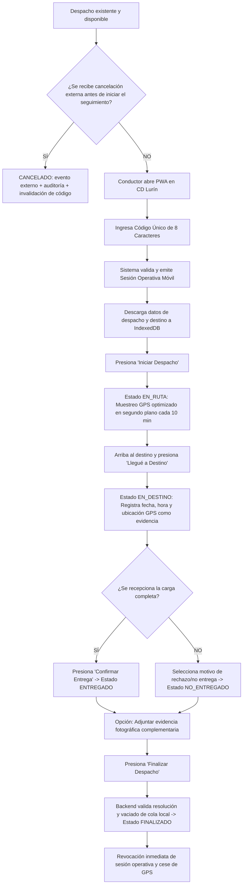

# Resumen Operativo de la Plataforma Web, Aplicación Móvil y Trazabilidad con Requerimientos: Y-Trace

> **Carpeta:** `detalles`  
> **Documento:** `04_RESUMEN_OPERATIVO_Y_TRAZABILIDAD_REQUERIMIENTOS.md`  
> **Proyecto Oficial:** Sistema Web y Móvil para la Gestión y Trazabilidad de Despachos y Entregas de Yanbal Perú (Y-Trace)  
> **Propósito:** Explicación técnica y funcional exhaustiva sobre cómo funciona la plataforma Web, cómo opera la aplicación móvil PWA en Android del conductor, qué roles intervienen en cada punto, cuál es el flujo operativo integral extremo a extremo (*end-to-end*) bajo el alcance de **despachos de distribución completa entre puntos de distribución (B2B)**, y su correspondencia y comparación formal con los 34 Requerimientos Funcionales (RF) activos y 23 Requerimientos No Funcionales (RNF) del sistema (57 requerimientos activos en total; numeración correlativa RF001 a RF034 tras la exclusión de RF026 y RF037, además de los históricos RF008 y RF010).  
>  
> 🔗 **Documentos Relacionados del Proyecto:**  
> - [[01_MATRIZ_DE_REQUERIMIENTOS]] — Matriz maestra unificada (57 requerimientos activos)  
> - [[02_REQUERIMIENTOS_FUNCIONALES]] — Especificación técnica detallada de los RF activos (RF001 a RF034)  
> - [[03_REQUERIMIENTOS_NO_FUNCIONALES]] — Especificación técnica detallada de RNF001 a RNF023  
> - [[Acceso_Y_Seguridad]] — Directriz rectora de acceso dual y gobernanza de credenciales  
> - [[MAPA_MAESTRO_DEL_PROYECTO]] — Nodo central del grafo de conocimiento  

---

## 1. Cómo Funcionará la Plataforma Web de Y-Trace

### 1.1 Naturaleza y Propósito Arquitectónico
La plataforma Web de **Y-Trace** es una aplicación enriquecida Single Page Application (SPA construida en React / TypeScript o JavaScript moderno) diseñada para operar en estaciones de trabajo y navegadores corporativos de escritorio y tabletas dentro de la red institucional de Yanbal.

Actúa como la **Torre de Control Logístico y Módulo Central de Administración** del sistema, centralizando el monitoreo y seguimiento operativo de despachos basado en la última telemetría GPS disponible de los vehículos en carretera mediante una grilla operativa con semaforización visual, la consulta de despachos ya existentes y disponibles para seguimiento desde el Centro de Distribución hacia agencias y puntos de distribución, la generación de códigos de activación efímeros para habilitar el seguimiento del conductor, la recepción instantánea de alertas de incidencias en ruta vía WebSockets y la atención ágil de consultas de trazabilidad operacional.

Y-Trace se concentra exclusivamente en el seguimiento y trazabilidad de despachos ya existentes. No crea, programa, asigna, prepara, libera ni cancela logísticamente los despachos; esas actividades corresponden a sistemas y procesos externos.

### 1.2 Mecanismo de Acceso y Seguridad Perimetral
A diferencia de la aplicación del conductor, la plataforma Web **requiere obligatoriamente autenticación tradicional basada en credenciales** (`Usuario + Contraseña`), respaldada por:
* **Canales Cifrados:** Comunicación exclusiva bajo protocolo HTTPS sobre TLS 1.3 ([[RNF003]]).
* **Protección de Credenciales Web:** Autenticación web mediante usuario y contraseña, con contraseñas almacenadas usando BCrypt con factor de costo >= 12 y comunicación protegida mediante TLS 1.3 ([[RNF003]]).
* **Control de Acceso Basado en Roles (RBAC):** Restricción estricta de menús, vistas, APIs y operaciones según el rol institucional asignado ([[RF004]], [[RNF002]]).
* **Gobernanza de Sesiones:** Emisión de tokens de acceso firmados (JWT), expiración forzada por inactividad a los **15 minutos** y capacidad de revocación remota (*kill session*) ante extravío o sospecha de vulneración ([[RF005]], [[RNF004]]).
* **Bitácora Inmutable de Auditoría:** Registro no modificable (*append-only* en BD) de todos los inicios de sesión, intentos fallidos, cambios de roles, cierres administrativos y consultas de auditoría ([[RF006]], [[RNF023]]).

### 1.3 Roles que Intervienen en la Plataforma Web

```
┌──────────────────────────────────────────────────────────────────────────────────┐
│                           ROLES DE LA PLATAFORMA WEB                             │
├──────────────────────┬──────────────────────┬──────────────────┬─────────────────┤
│ Administrador        │ Supervisor de        │ Jefe de          │ Operador SAC /  │
│ Principal            │ Distribución         │ Distribución     │ Monitoreo       │
│ (Gobernanza y        │ (Torre de Control y  │ (Control de KPIs │ (Trazabilidad y │
│  Seguridad RBAC)     │  Operación Diaria)   │  y Auditoría)    │  Soporte)       │
└──────────────────────┴──────────────────────┴──────────────────┴─────────────────┘
```

#### 1. Administrador Principal del Sistema
* **Responsabilidad:** Gobernanza absoluta de la seguridad informática, cuentas y perfiles de usuarios de la plataforma Y-Trace.
* **Funciones Clave:**
  - Alta, edición, suspensión y desactivación de cuentas web autorizadas ([[RF002]]).
  - Asignación y revocación de roles RBAC bajo el principio de mínimo privilegio ([[RF003]]).
  - Consulta y exportación de la bitácora inmutable de auditoría web ([[RF006]]).
  - Supervisión y control de intentos de activación móvil bloqueados tras 5 fallos consecutivos ([[RF032]]).
* **Segregación de Funciones:** No tiene privilegios para crear despachos operativos ni asignar vehículos a rutas (evita colusión y fraude).

#### 2. Supervisor de Distribución
* **Responsabilidad:** Control de la operación diaria de traslado de carga desde el Centro de Distribución (CD Lurín).
* **Funciones Clave:**
  - Visualización de cargas preparadas puestas a disposición por el WMS SPY en el andén de salida ([[RF007]]).
  - **Consulta de despachos disponibles para seguimiento:** Visualiza los despachos ya existentes y preparados por los sistemas externos, puestos a disposición para iniciar su seguimiento ([[RF007]]).
  - **Generación y Gestión de Códigos Únicos de Activación:** Genera un Código de Activación efímero de 8 caracteres alfanuméricos asociado al despacho existente y lo entrega al conductor para activar la PWA ([[RF008]]).
  - **Monitoreo y Grilla Operativa de Despachos en Vivo (Torre de Control):** Visualiza la flota y el avance de los viajes en una grilla operativa con semaforización según la última telemetría GPS disponible ([[RF024]]):
    - 🟢 *Verde:* Vehículo en ruta de traslado emitiendo telemetría normal (`EN_RUTA`).
    - 🟡 *Amarillo:* Vehículo arribado al punto de distribución (`EN_DESTINO`).
    - 🔴 *Rojo:* Vehículo detenido con incidencia crítica activa en carretera (`CON_INCIDENCIA`).
  - **Atención Inmediata de Incidencias:** Recibe alertas sonoras y visuales emergentes ante averías mecánicas, accidentes, asaltos o bloqueos viales reportados desde la PWA ([[RF026]]); coordina auxilio vial y registra notas de contingencia.
  - Cierre administrativo forzado del seguimiento de un viaje ya iniciado en casos de fuerza mayor comprobada ([[RF009]]).

#### 3. Jefe de Distribución / Analista de Logística
* **Responsabilidad:** Gestión estratégica del nivel de servicio de transporte, cumplimiento de contratos de transportistas y evaluación de indicadores logísticos.
* **Funciones Clave:**
  - **Tablero de Indicadores Logísticos (Dashboard ejecutivo):** Visualización de métricas consolidadas de tiempos de traslado (*Lead Time*), tasa de entregas conformes y latencia ([[RF028]]), con exclusión de despachos cancelados en Lead Time y contabilizados en una métrica separada de cancelación, y exportación de reportes exclusivamente en formato Excel.
  - **Monitoreo de SLA de Integración:** Control del tiempo transcurrido desde la recepción del evento en backend hasta su aceptación por el Bus corporativo (SLA: máximo 30 minutos, [[RNF007]]).
  - Auditoría del desempeño comparativo entre las distintas empresas transportistas contratadas por Yanbal ([[RF034]]).

#### 4. Operador SAC / Soporte Logístico
* **Responsabilidad:** Atención y resolución de consultas operativas sobre el estado y ubicación de las cargas en tránsito.
* **Funciones Clave:**
  - **Buscador de Trazabilidad Rápida:** Consulta instantánea por código alfanumérico de despacho o placa vehicular ([[RF027]]).
  - **Línea de Tiempo del Traslado:** Visualización del historial cronológico completo (disponibilidad para seguimiento, activación, salida del CD, hitos de paso en ruta, llegada a destino, resultado de entrega y cierre); si fue cancelado antes de la salida, muestra `CANCELADO`, causal, actor y fecha/hora.
  - **Consulta de Evidencias:** Acceso a la evidencia geoespacial certificada (coordenadas GPS de arribo) y enlace seguro temporal a fotografías de respaldo en Cloud Storage si fueron capturadas ([[RF025]], [[RNF005]]).
  - Cierra consultas y valida recepciones sin fricciones ni llamadas a ciegas a los conductores.

---

## 2. Cómo Funcionará la Aplicación Móvil (PWA Android del Conductor)

### 2.1 Naturaleza y Portabilidad Tecnológica: Exclusividad Android
La aplicación móvil de **Y-Trace** está implementada como una **Progressive Web App (PWA)** construida con HTML5, JavaScript moderno, Service Workers y la API de Geolocalización de Android, orientada exclusivamente a dispositivos móviles con sistema operativo Android.

* **Cero Fricción de Despliegue:** No requiere descarga ni instalación desde Google Play Store. Los conductores acceden mediante un enlace web seguro (URL corta o escaneo de código QR en el andén de Lurín) y pueden añadir el acceso directo a la pantalla de inicio de su teléfono.
* **Compatibilidad Exclusiva Android:** Diseñada y homologada estrictamente para Google Chrome sobre Android (versión 8.0 Oreo o superior con Google Chrome v90+, [[RNF017]]). La captura de ubicación GPS se realiza mediante los servicios nativos de geolocalización disponibles en Android. **No se contempla compatibilidad con iOS ni con navegadores del ecosistema Apple en el alcance del proyecto.**
* **Cero Costo en Hardware Dedicado:** Aprovecha los smartphones estándar Android de los transportistas terceros contratados por Yanbal, prescindiendo de cajas negras GPS vehiculares costosas de homologar.

### 2.2 Mecanismo de Acceso y Seguridad Operativa: CERO Contraseñas
La aplicación móvil **prohíbe el uso de cuentas de usuario permanentes y contraseñas tradicionales**. Su acceso y habilitación se gobierna mediante el siguiente protocolo de seguridad:
1. **Código Único de Activación:** Al momento de la estiba en el CD Lurín, el conductor recibe un código alfanumérico efímero de **8 caracteres** (ej. `TRC-82F4`), generado de manera única al habilitar su seguimiento ([[RF008]]).
2. **Validación de Identidad Operativa:** El conductor abre la PWA e ingresa dicho Código de Activación. En el flujo normal, el backend valida que el despacho exista, sea elegible para seguimiento y que el código no haya sido consumido ([[RF010]]).
3. **Control Anti-Fuerza Bruta:** El sistema limita los intentos fallidos a un máximo de 5; al registrarse el quinto intento fallido consecutivo, bloquea e invalida el código; el sexto y posteriores son rechazados, generando alerta al Supervisor ([[RF032]]).
4. **Vinculación de Dispositivo y Emisión de Sesión:** El sistema genera una huella del dispositivo Android y emite un token de sesión operativa temporal. Ante contingencia de dispositivo durante `EN_RUTA`, el Supervisor puede emitir un Código de Activación de recuperación de un solo uso; el token anterior se revoca y el nuevo dispositivo se asocia al mismo despacho sin alterar el histórico ([[RF008]], [[RF010]], [[RF011]]).
5. **Descarga de Datos del Despacho:** La PWA descarga la información operativa del despacho y del punto de destino a la base de datos local del navegador (IndexedDB) y queda lista para operar en carretera ([[RF012]]).
6. **Revocación Inmediata al Cierre:** Una vez que el despacho concluye y pasa a estado `FINALIZADO`, el backend revoca de forma inmediata el token de sesión y el código deja de ser válido. La PWA elimina los datos locales temporales y **queda totalmente inhabilitada para transmitir telemetría o registrar eventos posteriores** ([[RF020]], [[RF033]], **Condición Mandatoria de Transmisión**).

### 2.3 Arquitectura Offline-First y Resiliencia en Carreteras
La geografía peruana presenta túneles, tramos desérticos y carreteras interprovinciales con nula cobertura celular. Y-Trace implementa una arquitectura desacoplada:
* **Persistencia Local Inmediata (IndexedDB):** Cada acción del conductor (presionar *"Iniciar Despacho"*, *"Llegué a Destino"*, confirmar entrega, reportar incidencia o tomar foto opcional) se guarda instantáneamente en la base de datos local del teléfono en **menos de 500 ms** ([[RF021]], [[RNF008]]), sin esperar confirmación del servidor.
* **Patrón Outbox y Sincronización en Segundo Plano:** Las transacciones se encolan localmente en orden cronológico estricto (FIFO). Un Service Worker vigila la conectividad y, cuando detecta señal activa (Wi-Fi, 4G o 5G), envía lotes ordenados por despacho mediante `POST /api/v1/sync/batch`; el backend los procesa secuencialmente e idempotentemente antes de confirmar su eliminación de la cola ([[RF022]], [[RNF014]]).
* **Semáforo Visual de Sincronización:** La interfaz del conductor muestra un indicador permanente ([[RF023]]):
  - 🟢 *Icono Verde:* Todas las transacciones han sido sincronizadas con éxito con el servidor central.
  - 🟡 *Icono Amarillo con Contador:* Indica el número de eventos y fotos retenidos localmente a la espera de señal celular (ej. *"Cola: 2 pendientes"*).
* **Gestión de Evidencias Operativas:** Cada evento relevante conserva una evidencia base con tipo de evento, fecha/hora, despacho, actor o sesión y ubicación GPS cuando esté disponible. La fotografía es complementaria y opcional ([[RF018]]); cuando se captura, la PWA la comprime localmente y la envía a Cloud Storage, guardando en BD únicamente su referencia segura.

### 2.4 Modelo de Evidencias durante la Operación

Y-Trace trata la evidencia como un conjunto de datos operativos. En `EN_DESTINO`, `ENTREGADO`, `NO_ENTREGADO` e incidencias se conserva el evento con su fecha/hora, despacho, sesión o actor y ubicación GPS cuando esté disponible. La fotografía es una evidencia complementaria opcional y nunca bloquea el registro.

En una incidencia grave, como un choque o una avería que inutilice el dispositivo, la ausencia de fotografía no invalida la lógica del evento: el sistema no debe exigir una captura fotográfica para considerar válido un reporte ya registrado con los datos operativos disponibles.

### 2.4 Ciclo Operativo de la App Móvil en Ruta y Destino



---

## 3. Flujo Operativo y de Datos End-to-End Integrado

El funcionamiento articulado entre la plataforma Web, la app móvil y los sistemas corporativos de Yanbal se desarrolla a lo largo de **8 etapas consecutivas**:

```
+───────────────────────────────────────────────────────────────────────────────────────────────────+
│                                 FLUJO INTEGRADO EXTREMO A EXTREMO                                 │
+───────────────────┬───────────────────┬───────────────────┬───────────────────┬───────────────────+
│ 1. Preparación    │ 2. Disponibilidad │ 3. Activación     │ 4. Traslado en    │ 5. Arribo y       │
│    externa        │    para tracking  │    PWA Android    │    Control GPS)   │    y Evidencias   │
│   (WMS SPY CD)    │    (Web Supervisor│    (PWA Android)  │    Control GPS)   │    (GPS + evidencia complementaria)   │
+───────────────────┴───────────────────┴───────────────────┴───────────────────┴───────────────────+
                                                                          │
                                                                          ▼
                                        +───────────────────┬───────────────────┬───────────────────+
                                        │ 6. Sincronización │ 7. Cierre de Viaje│ 8. Explotación    │
                                        │    Bus ESB (SLA 30m)│    y Revocación   │    Trazabilidad   │
                                        │ (SAP/Salesforce)  │    de Sesión PWA  │    (Sin reclamos) │
                                        +───────────────────┴───────────────────┴───────────────────+
```

### Etapa 1: Planificación y Preparación Upstream
* El Centro de Distribución de Yanbal en Lurín finaliza la preparación y consolidación de la carga en bultos y pallets en el sistema **SPY**.
* El TMS corporativo (**Driving**) define la ruta troncal y el punto de destino de distribución.
* La carga preparada queda disponible en andén de salida y es reportada a Y-Trace mediante el Bus de Integración ([[RF007]]).

### Etapa 2: Consulta y Habilitación del Seguimiento en Portal Web
* El **Supervisor de Distribución** accede a la plataforma Web autenticándose con su usuario corporativo y contraseña (RBAC, [[RF001]]).
* En el módulo de seguimiento, el Supervisor consulta los despachos ya existentes y disponibles para seguimiento, recibidos desde los sistemas corporativos ([[RF007]]).
* Al seleccionar un despacho existente y elegible para seguimiento, el Supervisor solicita la generación del **Código Único de Activación**. El backend registra el hito interno de control previo, genera el código de 8 caracteres y lo asocia al despacho ([[RF008]]). Este hito habilita únicamente el seguimiento en Y-Trace; no representa autorización logística de salida.
* Y-Trace consulta los despachos existentes, pero no los crea, programa, asigna ni cancela logísticamente. Si un sistema externo informa una cancelación, Y-Trace incorpora el evento a la trazabilidad y revoca el código y la sesión cuando corresponda ([[RF029]], [[RF033]]).
* El **Supervisor genera el Código Único de Activación** asociado al despacho disponible para seguimiento y lo entrega al conductor ([[RF008]]).
* Y-Trace no asigna conductor ni vehículo como parte de la planificación logística; utiliza la información recibida desde los sistemas externos para asociar correctamente los eventos de seguimiento al despacho.

### Etapa 3: Handoff y Activación Móvil en el Centro de Distribución
* El Supervisor entrega física o verbalmente el código al conductor durante el control de andén en Lurín.
* El **Conductor** abre la PWA de Y-Trace en su smartphone Android e ingresa el código ([[RF010]]).
* El backend valida el código, la elegibilidad del despacho para seguimiento y el límite de intentos fallidos ([[RF032]]); genera la huella del dispositivo, emite el token de sesión operativa temporal ([[RF011]]) y descarga los datos del despacho y punto de destino a IndexedDB ([[RF012]]).

### Etapa 4: Traslado en Ruta y Supervisión en Torre de Control
* Con la carga asegurada en el camión, el conductor pulsa *"Iniciar Despacho"*, transicionando el estado a `EN_RUTA` ([[RF013]]).
* La PWA activa la captura periódica de coordenadas GPS en segundo plano cada 10 minutos durante `EN_RUTA` ([[RF014]]).
* Cada paquete de telemetría generado por el muestreo operativo viaja con el token de sesión activa hacia el backend.
* En la plataforma Web, el **Supervisor** visualiza el avance del despacho en color verde en la grilla operativa según la última telemetría GPS disponible ([[RF024]]).
* En paralelo, el backend notifica al Bus corporativo el evento `EN_RUTA` ([[RF029]]).

### Etapa 5: Llegada al Destino y Confirmación de Entrega (Regla Híbrida)
* **Arribo Físico (`EN_DESTINO`):** Al ingresar a la geocerca perimétrica de la agencia o punto de distribución (o mediante botón manual *"Llegué a Destino"* en la PWA), el despacho transiciona a `EN_DESTINO` ([[RF015]]). El sistema registra atómicamente fecha, hora y coordenadas GPS como evidencia geoespacial directa de presencia física. **Este evento NO confirma la entrega de la carga.**
* **Confirmación Manual de Entrega (`ENTREGADO`):** Requiere la acción manual consciente del conductor pulsando *"Confirmar Entrega"* ([[RF016]]) y el registro de la evidencia operativa. La evidencia fotográfica de la carga o comprobante de recepción es complementaria y opcional ([[RF018]]); cuando existe, se aloja en Cloud Storage y se vincula mediante una referencia segura en BD.
* **No Entrega / Rechazo (`NO_ENTREGADO`):** Si el punto de destino está cerrado o se rechaza la carga, el conductor selecciona la causal tipificada correspondiente ([[RF017]]), registrando fecha/hora y ubicación GPS cuando estén disponibles. La evidencia fotográfica complementaria es opcional ([[RF018]]).
* **Ventana de 60 Minutos y Alerta Automática:** Si transcurren 60 minutos en `EN_DESTINO` sin confirmación de entrega (o rechazo), el sistema podrá disparar una alerta automática visual y sonora en la Torre de Control Web ([[RF026]]), **sujeta a la ratificación de la ventana operativa de 60 minutos establecida en RN-PV-01**. El Supervisor podrá contactar al conductor o ejecutar el cierre administrativo forzado justificado con causal tipificada en bitácora inmutable ([[RF009]]), de acuerdo con la regla que finalmente sea ratificada.

* **Retorno de carga rechazada:** Cuando un despacho termina en `NO_ENTREGADO`, Y-Trace no extiende el seguimiento del despacho original hacia un retorno. Si Operaciones requiere regresar la carga al origen, el retorno se gestiona como un nuevo despacho de retorno originado por el proceso corporativo correspondiente; Y-Trace puede rastrear ese nuevo despacho una vez que sea incorporado al sistema. Esto evita convertir el proyecto en un módulo de logística inversa.

### Definición operativa del SLA central de 30 minutos

Para evitar interpretaciones distintas entre requerimientos, arquitectura y pruebas, Y-Trace utiliza una única regla para la integración con el Bus: **30 minutos como máximo**. El cronómetro inicia cuando el evento llega al backend de Y-Trace; desde ese momento el mensaje debe ser aceptado por el Bus dentro del límite de 30 minutos.

El valor de **30 minutos** gobierna únicamente la integración con el Bus una vez que el backend ha recibido el evento. No es un intervalo de captura GPS ni una frecuencia fija de envío. El GPS utiliza el muestreo operativo optimizado de RF014 y los eventos críticos se registran inmediatamente; el sistema no genera datos artificiales para completar cuotas.

Cuando el teléfono esté sin cobertura, los eventos permanecen en la cola local; la ausencia de red no se transforma artificialmente en registros repetitivos. Al recuperar conectividad, el backend recibe los eventos y aplica el SLA de 30 minutos para su propagación al Bus.

### Etapa 6: Sincronización y Propagación al Ecosistema Yanbal
* El backend recibe los eventos operativos y administrativos y emite mensajes JSON canónicos estandarizados hacia el **Bus de Integración de Yanbal** ([[RF029]], [[RNF018]]). Los despachos `CANCELADO` generan el evento administrativo de cancelación para integración y no continúan al flujo de recorrido. RF031 se utiliza para despachos que alcanzan `FINALIZADO` mediante RF020 o RF009.
* El Bus recibe y acepta cada evento elegible dentro del SLA único de máximo 30 minutos desde la recepción del evento en el backend; la indisponibilidad de red del dispositivo se gestiona mediante almacenamiento offline y no genera registros repetitivos ([[RNF007]]):
  - En **SAP R/3 / ERP**: Se actualiza el hito de transporte para conciliación logística.
  - En **Salesforce / Sistemas de Trazabilidad**: Se registra el arribo conforme y la recepción en el punto de destino.

### Etapa 7: Cierre del Despacho y Revocación de Sesión
* Resuelta la entrega y vaciada la cola local de sincronización, el conductor presiona *"Finalizar Despacho"* en la PWA ([[RF020]]).
* El backend valida que el despacho se encuentre resuelto (`ENTREGADO` o `NO_ENTREGADO`) y cambia el estado a `FINALIZADO`.
* **Revocación Inmediata de Sesión:** El servidor revoca el token de sesión móvil y caduca el código de activación ([[RF033]]). La PWA purga los datos temporales del viaje de IndexedDB y apaga los sensores de geolocalización, quedando bloqueada para emitir más datos hasta recibir un nuevo código en una jornada posterior (**Condición Mandatoria de Transmisión**).

### Etapa 8: Explotación Post-Entrega en Trazabilidad y Gerencia
* Ante cualquier consulta operativa o auditoría, el **Operador o Supervisor** ingresa el código de despacho en el buscador web de Y-Trace ([[RF027]]).
* En menos de 2 segundos ([[RNF016]]) visualiza la cronología completa: disponibilidad para seguimiento, activación, salida del CD, traza satelital en carretera, llegada a destino, resultado de entrega y cierre; si el despacho fue cancelado antes de la salida, muestra `CANCELADO`, causal, actor y fecha/hora de la cancelación, además de la invalidación del código.
* Al cierre del período, el **Jefe de Distribución** analiza en su tablero web ([[RF028]]) los indicadores logísticos de tiempos de traslado (*Lead Time*), entregas conformes y latencia por empresa transportista y período, pudiendo consultar, filtrar y exportar los reportes exclusivamente en formato Excel.

---

## 4. Matriz de Trazabilidad y Comparación con Requerimientos Funcionales (RF001 a RF034)

A continuación se compara y mapea cada funcionalidad y componente del flujo operativo contra los **34 Requerimientos Funcionales activos**:

| Módulo / Fase del Flujo | Requerimiento Funcional | Código | Cómo se Implementa en la Operación Web o Móvil |
|---|---|:---:|---|
| **Seguridad Web** | Autenticación de Usuarios Web | **RF001** | Personal Yanbal inicia sesión en Portal Web con usuario y contraseña corporativa sobre HTTPS/TLS 1.3. |
| **Seguridad Web** | Gestión de Usuarios Web | **RF002** | El Administrador Principal gestiona altas, bajas y suspensiones de cuentas de operadores web. |
| **Seguridad Web** | Asignación de Roles Web | **RF003** | El Administrador Principal asocia roles (`Admin`, `Supervisor`, `Jefe`, `SAC`) a cada usuario web. |
| **Seguridad Web** | Control de Acceso Basado en Roles (RBAC)| **RF004** | Los menús y endpoints se ocultan y bloquean según el rol activo del usuario autenticado. |
| **Seguridad Web** | Gestión del Ciclo de Vida de Sesión Web | **RF005** | La sesión web expira automáticamente a los 15 minutos de inactividad o mediante cierre manual. |
| **Seguridad Web** | Bitácora de Auditoría de Acciones Web | **RF006** | Registro inmutable *append-only* de transacciones administrativas críticas en base de datos. |
| **Gestión Despachos** | Consulta de Cargas en Andén CD Origen | **RF007** | El Supervisor filtra cargas completas preparadas por SPY listas para despacho en el CD Lurín. |
| **Gestión Despachos** | Generación de Código Único de Activación | **RF008** | El backend genera el Código de Activación de 8 caracteres para un despacho existente y elegible para seguimiento; el código se entrega al conductor para activar la PWA. |
| **Gestión Despachos** | Cierre Administrativo Forzado | **RF009** | El Supervisor fuerza el cierre con causa justificada en bitácora ante contingencia mayor o siniestro. |
| **Operación Móvil PWA**| Activación Móvil por Código Único | **RF010** | El Conductor digita el Código de Activación de 8 caracteres en la PWA en Android; el backend exige un despacho existente y elegible para seguimiento, con el hito interno de control previo registrado mediante RF008. |
| **Operación Móvil PWA**| Sesión Operativa Móvil vinculada a Viaje| **RF011** | La PWA y el backend establecen un token efímero que vincula el dispositivo Android con el viaje activo. |
| **Operación Móvil PWA**| Visualización de Información del Despacho| **RF012** | La PWA presenta el código de despacho, punto de destino de distribución, dirección y observaciones. |
| **Operación Móvil PWA**| Registro de Inicio de Traslado | **RF013** | El Conductor pulsa *"Iniciar Despacho"* con una sesión móvil válida; cambia a `EN_RUTA` e inicia la captura periódica de GPS. |
| **Operación Móvil PWA**| Telemetría GPS Periódica en Ruta | **RF014** | Muestreo en segundo plano cada 10 minutos durante `EN_RUTA` condicionado al viaje activo en Android. |
| **Operación Móvil PWA**| Registro de Arribo a Destino (EN_DESTINO)| **RF015** | Geocerca automática (o botón manual) registra llegada física con fecha, hora y GPS. No confirma entrega. |
| **Operación Móvil PWA**| Confirmación de Entrega del Despacho | **RF016** | Acción manual del conductor y registro de evidencia operativa; la foto es opcional (RF018), transicionando a `ENTREGADO`. |
| **Operación Móvil PWA**| Registro de No Entrega o Rechazo | **RF017** | Selección de causal tipificada (local cerrado, rechazo) con estampa y GPS cuando esté disponible, generando `NO_ENTREGADO`. |
| **Operación Móvil PWA**| Gestión de Evidencias Operativas | **RF018** | Registra la evidencia base de cada evento; la fotografía es complementaria y opcional y, cuando existe, se almacena en Cloud Storage con referencia segura en BD. |
| **Operación Móvil PWA**| Reporte de Incidencias en Ruta | **RF019** | Registro de averías, accidentes o bloqueos viales con estampa, descripción y coordenadas GPS inmediatas. |
| **Operación Móvil PWA**| Finalización del Seguimiento del Despacho | **RF020** | Concluye la jornada tras resolver la entrega en destino y vaciar la cola, revocando la sesión móvil. |
| **Offline y Resiliencia**| Persistencia Local Offline (IndexedDB) | **RF021** | Almacena estados, coordenadas y fotos opcionales en el móvil cuando no hay señal de datos celulares. |
| **Offline y Resiliencia**| Sincronización Automática en Segundo Plano| **RF022** | El Service Worker transmite las transacciones encoladas por despacho mediante lotes ordenados cronológicamente; el backend procesa cada lote de forma secuencial e idempotente antes de confirmar su eliminación de la cola ([[RF022]]). |
| **Offline y Resiliencia**| Semáforo Visual de Cola de Sincronización| **RF023** | Indicador en la PWA: verde si está al día, amarillo con contador de eventos pendientes de subida. |
| **Monitoreo y Control**| Consulta y Seguimiento de Despachos | **RF024** | Grilla operativa web con tiempos de traslado, avance y estado general de despachos entre sedes con semaforización visual. |
| **Monitoreo y Control**| Consulta y Auditoría de Evidencias POD | **RF025** | Visualización en la web de evidencia GPS de entrega y enlace seguro temporal a foto en Cloud Storage. |
| **Monitoreo y Control**| Gestión y Atención de Alertas de Incidencias en Ruta y Timeout en Destino | **RF026** | Alertas visuales y sonoras en plataforma Web ante incidencias en ruta y ventana de 60 min en destino (condición de implementación sujeta a RN-PV-01). |
| **Trazabilidad** | Búsqueda Rápida de Trazabilidad | **RF027** | Buscador por código de despacho o placa para visualizar la cronología completa, incluidos despachos `CANCELADO`, con causal, actor y fecha/hora de cancelación. |
| **Indicadores y KPIs** | Indicadores y Reportes de Gestión | **RF028** | Tablero ejecutivo de indicadores logísticos (Lead Time, entregas conformes y latencia) con filtros operativos y exportación a Excel; cancelados excluidos de Lead Time. |
| **Integración ESB** | Publicación de Eventos de Despacho al Bus| **RF029** | Publicación JSON de `EN_RUTA`, `EN_DESTINO`, `ENTREGADO`, `NO_ENTREGADO` y `DESPACHO_CANCELADO`; hito interno de control previo permanece como hito interno de auditoría y no se publica por RF029. |
| **Integración ESB** | Notificación de Incidencias Graves al Bus | **RF030** | Publicación de eventos de avería o siniestro hacia el Bus para conocimiento de áreas operativas. |
| **Integración ESB** | Transmisión del Resumen Final de Trazabilidad al Bus| **RF031** | Envío del consolidado final de seguimiento al Bus de Yanbal para los procesos posteriores de los sistemas externos. |
| **Seguridad Móvil** | Control de Intentos y Bloqueo de Código de Activación Móvil| **RF032** | Limita a 5 los intentos fallidos de activación móvil, invalidando el código y alertando al Supervisor. |
| **Seguridad Móvil** | Unicidad y Caducidad de Código Móvil | **RF033** | Garantiza unicidad activa y revoca validez de código y sesión tan pronto el despacho finaliza o se cancela. |
| **Seguridad Web** | Segmentación Multitransportista de Datos| **RF034** | Restringe la visibilidad de despachos, conductores y evidencias según la empresa de transporte asignada. |

---

## 5. Matriz de Trazabilidad y Comparación con Requerimientos No Funcionales (RNF001 a RNF023)

A continuación se compara el diseño de la plataforma Web y la app móvil frente a las **23 restricciones de calidad de software (ISO/IEC 25010)**:

| Categoría de Calidad | Requerimiento No Funcional | Código | Mecanismo Arquitectónico de Cumplimiento | Métrica o Criterio de Aceptación |
|---|---|:---:|---|---|
| **Seguridad** | Seguridad de Acceso y Control Perimetral | **RNF001** | Autenticación web obligatoria y rechazo estricto de payloads móviles sin token de sesión operativa válido vinculados a despachos activos (**Condición Mandatoria de Transmisión**). | 100% de peticiones no autorizadas rechazadas con HTTP 401/403. |
| **Seguridad** | Autorización Estricta (RBAC) | **RNF002** | Filtrado de navegación en front-end reforzado con validación de roles en cada endpoint del API Gateway. | Cero tolerancia a elevación horizontal o vertical de privilegios. |
| **Seguridad** | Protección y Gestión de Credenciales Web | **RNF003** | Almacenamiento mediante BCrypt con factor de costo >= 12 (mecanismo de hash y salt); transmisión exclusiva bajo TLS 1.3. | Todas las contraseñas con BCrypt (costo >= 12); sin texto plano ni canales no cifrados. |
| **Seguridad** | Gobernanza de Sesiones y Revocación | **RNF004** | Expiración por inactividad a los 15 min en web; revocación inmediata de la sesión móvil al finalizar el despacho. | Sesión móvil revocada de inmediato al marcar `FINALIZADO`. |
| **Seguridad** | Protección de Evidencias en Cloud Storage | **RNF005** | Cifrado en reposo (AES-256) de fotos en Cloud Storage; acceso web mediante URLs firmadas temporales (15 min). | Ningún bucket con permisos de lectura pública expuestos. |
| **Integridad** | Inmutabilidad de Evidencias y Eventos | **RNF006** | Tabla de eventos de despacho basada en modelo *Append-Only* (solo inserción); prohibido el UPDATE o DELETE. | Coordenadas y timestamps satelitales inalterables. |
| **Rendimiento** | Latencia de Sincronización al Bus | **RNF007** | Cola asíncrona de eventos hacia el Bus ESB. Publicación y aceptación por el Bus dentro de un máximo de 30 min desde la recepción del evento en backend. No existe un objetivo independiente inferior. | 100% de los eventos elegibles aceptados por el Bus dentro del SLA de 30 min. |
| **Rendimiento** | Tiempo de Respuesta en Interfaz Móvil | **RNF008** | Guardado local optimizado en IndexedDB antes de la transmisión de red; interfaz desacoplada de la latencia celular. | Confirmación de acción en pantalla móvil en < 500 ms. |
| **Eficiencia** | Consumo Eficiente de Batería Móvil | **RNF009** | Muestreo optimizado de geolocalización cada 10 minutos únicamente durante el estado `EN_RUTA`, con captura inmediata de eventos operativos críticos. | Consumo menor al 15% de batería en jornada de 8 horas en Android. |
| **Eficiencia** | Optimización de Consumo de Datos Móviles | **RNF010** | Compresión local de fotografías en la PWA y envío de payloads JSON minificados hacia el backend. | Tráfico celular total menor a 50 MB diarios por transportista. |
| **Disponibilidad** | Disponibilidad Operativa del Servicio | **RNF011** | Backend desacoplado en contenedores Docker/Kubernetes con réplicas sin estado y balanceador de carga. | Disponibilidad >= 99.5% de lunes a sábado de 06:00 a 21:00 h. |
| **Escalabilidad** | Capacidad y Escalabilidad Concurrente | **RNF012** | Procesamiento concurrente de 500 conductores en paralelo y 50,000 eventos diarios, con degradación de latencia de API < 10%. | Soporte garantizado de 500 conductores en paralelo y 50k eventos/día con degradación < 10%. |
| **Resiliencia** | Resiliencia y Tolerancia Offline en Móvil | **RNF013** | Almacenamiento local en IndexedDB dimensionado para retener al menos 500 eventos operativos; las fotografías se manejan como adjuntos independientes. | Capacidad local garantizada de al menos 500 eventos. |
| **Confiabilidad** | Idempotencia en Sincronización de Datos | **RNF014** | Identificadores únicos UUIDv4 generados en el móvil utilizados como clave de idempotencia transaccional en backend. | Cero duplicación de transacciones ante reintentos de red inestable. |
| **Usabilidad** | Ergonomía y Usabilidad Operativa en Campo| **RNF015** | Diseño UI/UX móvil con botones táctiles de mínimo 48x48 dp, alto contraste para sol intenso y máximo 3 toques. | Completar cualquier registro de llegada o entrega en <= 3 toques. |
| **Rendimiento** | Tiempo de Respuesta en Consulta Trazabilidad| **RNF016** | Índices B-Tree optimizados en PostgreSQL por `codigo_despacho` y `placa_vehiculo` en la base de datos. | Despliegue de línea de tiempo y evidencias en pantalla < 2.0 s. |
| **Compatibilidad** | Compatibilidad Exclusiva con Android (PWA)| **RNF017** | Ejecución exclusiva en Google Chrome para Android (v8.0+ / Chrome v90+) utilizando servicios nativos de geolocalización de Android. Exclusión formal de iOS. | Operatividad al 100% en Android; soporte iOS formalmente fuera de alcance. |
| **Interoperabilidad**| Formato Canónico de Intercambio (JSON) | **RNF018** | Precisión técnica: eventos estructurados mediante payloads JSON conforme al esquema canónico para interoperabilidad con el Bus. | Validación de estructura JSON canónica en eventos publicados hacia el Bus. |
| **Gobernanza** | Retención y Eliminación de Evidencias | **RNF019** | Job programado de purga y archivado de evidencias y datos operativos al cumplir 24 meses. | 100% de registros > 24 meses purgados o archivados en ciclo automático. |
| **Continuidad** | Recuperación ante Desastres (RPO y RTO) | **RNF020** | Replicación continua de base de datos y snapshots multizona con conmutación hacia infraestructura secundaria. | RPO <= 15 minutos; RTO <= 4 horas en simulacro validado. |
| **Calidad del Dato**| Precisión Mínima de Geolocalización Android| **RNF021** | Validación del radio de precisión satelital en Android (accuracy <= 50 m); lecturas con menor precisión marcadas como de baja confiabilidad. | 90% con accuracy <= 50 m; lecturas imprecisas señalizadas sin descarte. |
| **Accesibilidad** | Accesibilidad Web (WCAG 2.1 Nivel AA) | **RNF022** | Contraste >= 4.5:1, navegación completa por teclado y semántica HTML5 accesible en plataforma web corporativa. | Puntaje Lighthouse/axe >= 90 en consola web corporativa. |
| **Integridad** | Inmutabilidad de Bitácora Administrativa | **RNF023** | Modelo append-only estricto en tablas de auditoría (RF006), rechazando sentencias UPDATE y DELETE a nivel de base de datos. | 100% de intentos de modificación o borrado bloqueados por motor de BD. |

---

## 6. Reglas de Negocio Pendientes de Validación

Conforme a la metodología arquitectónica del proyecto, aquellos parámetros y directrices que requieren confirmación formal con las áreas de negocio de Yanbal se aíslan explícitamente para no contaminar los requerimientos funcionales cerrados:

> [!IMPORTANT]
> **RN-PV-01: Protocolo Híbrido de Llegada, Confirmación de Entrega y Ventana de Alerta en Destino**  
> * **Descripción de la Regla Híbrida Definida:**
>   1. **Detección Automática por Geocerca (`EN_DESTINO`):** El ingreso del vehículo al perímetro geográfico del punto de destino cambia automáticamente el estado del despacho a `EN_DESTINO` (con fallback manual mediante botón en PWA), registrando fecha, hora y coordenadas GPS como evidencia directa de llegada física. **Este evento NO confirma la entrega de la carga.**
>   2. **Confirmación Manual de Entrega (`ENTREGADO`):** La entrega formal requiere la acción manual del conductor en la PWA pulsando "Confirmar Entrega" ([[RF016]]). El sistema registra la evidencia operativa del evento y permite adjuntar una evidencia fotográfica complementaria opcional ([[RF018]]).
>   3. **Ventana de 60 Minutos sin Confirmación:** Si transcurren 60 minutos desde que el despacho pasó a `EN_DESTINO` sin que el conductor confirme la entrega (`ENTREGADO` o `NO_ENTREGADO`), el sistema dispara una alerta automática visual y sonora al Supervisor en la Torre de Control Web (mismo mecanismo de notificación inmediata de [[RF026]]). El Supervisor contacta al conductor o, en casos de contingencia o fuerza mayor comprobada, ejecuta el cierre administrativo forzado con registro de motivo tipificado en bitácora inmutable ([[RF009]]).
>   4. **Revocación de Código y Sesión:** Al culminar formalmente el despacho (`FINALIZADO` vía conductor [[RF020]] o Supervisor [[RF009]]) o recibirse una cancelación externa (`CANCELADO`), se revoca de inmediato la vigencia del Código de Activación; si existe sesión operativa, también se revoca el token ([[RF033]]).
> * **Estado:** **Pendiente de Validación con Operaciones de Yanbal.**  
> * **Aspectos por Definir / Ratificar:** El SLA de integración de 30 minutos queda definido como criterio del proyecto. La ventana operativa de 60 minutos para permanencia en destino se mantiene separada del SLA de integración y su ratificación institucional continúa bajo RN-PV-01.  
> * **Impacto Técnico y Articulación:** La lógica técnica queda articulada con [[RF009]], [[RF015]], [[RF016]], [[RF018]], [[RF020]], [[RF026]] y [[RF033]]; la pendiente de validación no invalida esos RF, sino que afecta el parámetro operativo de 60 minutos.

> [!IMPORTANT]
> **RN-PV-02: SLA de Recuperación ante Desastres (RPO/RTO) — [[RNF020]]**
> * **Descripción:** Los valores RPO <= 15 min / RTO <= 4 h son una propuesta técnica de arquitectura, no un SLA acordado formalmente.
> * **Estado:** **Pendiente de Validación con Infraestructura/TI de Yanbal.**
> * **Aspectos por Definir:** Confirmar si esos umbrales son aceptables para el negocio o si existe ya una política corporativa de continuidad que Y-Trace deba heredar en su lugar.
> * **Impacto Técnico:** Condiciona la topología de base de datos (réplicas multizona) y la frecuencia de snapshots; cambiar el valor después de construida la arquitectura tiene costo de rediseño.

> [!IMPORTANT]
> **RN-PV-03: Presupuesto y Alcance de Accesibilidad Web WCAG 2.1 AA — [[RNF022]]**
> * **Descripción:** El estándar técnico y su forma de medición ya están definidos, pero la accesibilidad WCAG no fue un requisito solicitado originalmente por el área usuaria.
> * **Estado:** **Pendiente de Aprobación de Negocio (presupuesto y cronograma).**
> * **Aspectos por Definir:** Confirmar si Yanbal aprueba el esfuerzo adicional de diseño/desarrollo que implica cumplir WCAG 2.1 AA desde el inicio, o si se posterga a una fase 2.

> [!IMPORTANT]
> **RN-PV-04: Plazo Exacto de Retención de Evidencias — [[RNF019]]**
> * **Descripción:** El mecanismo de purga/anonimización automática está confirmado como necesidad funcional; el valor de 24 meses usado es una cifra preliminar de referencia.
> * **Estado:** **Pendiente de Ratificación Formal con Legal Yanbal.**
> * **Aspectos por Definir:** Confirmar el plazo exacto según la política de protección de datos personales vigente en Yanbal (Ley N° 29733) antes de fijarlo como parámetro productivo del job de purga.

> [!IMPORTANT]
> **RN-PV-05: Modelo de Aislamiento Multitransportista — [[RF034]]**
> * **Descripción:** El mecanismo técnico de filtrado está basado estrictamente en la(s) empresa(s) de transporte asignadas (`empresa_transportista_id`).
> * **Estado:** **Pendiente de Validación con Operaciones de Yanbal.**
> * **Aspectos por Definir:** Confirmar el modelo comercial y las reglas de asignación con las empresas de transporte tercerizadas con el área de Operaciones de Yanbal.

---

## 7. Conclusión y Síntesis de la Comparación

La comparación demuestra una **alineación funcional y documental consolidada** entre el modelo operativo de Y-Trace y su matriz de especificación consolidada (57 requerimientos activos: 34 RF y 23 RNF):

1. **La Web** cumple con la totalidad de los requerimientos de gobernanza de seguridad (**RF001 - RF006**), consulta y habilitación del seguimiento de despachos existentes en origen (**RF007, RF008 y RF009**), seguimiento y monitoreo en grilla operativa en vivo (**RF024**), auditoría de evidencias en Cloud Storage (**RF025**), atención inmediata de incidencias en ruta y timeout de destino (**RF026**), búsqueda rápida de trazabilidad de despachos (**RF027**) y tablero ejecutivo de indicadores logísticos (**RF028**), garantizando los atributos de rendimiento (**RNF016**), seguridad RBAC (**RNF002**), disponibilidad (**RNF011**) e inmutabilidad de bitácora (**RNF023**). El protocolo híbrido de llegada y ventana operativa de 60 min (**RN-PV-01**), el aislamiento multitransportista (**RF034**, **RN-PV-05**), la recuperación ante desastres (**RNF020**, **RN-PV-02**), la accesibilidad WCAG 2.1 AA (**RNF022**, **RN-PV-03**) y el plazo exacto de retención de evidencias (**RNF019**, **RN-PV-04**) quedan **diseñados a nivel técnico pero formalmente catalogados como pendientes de validación de negocio/TI**, por lo que se mantienen bajo gobernanza controlada.
2. **La App Móvil (PWA Android)** hace viable el traslado seguro en carretera (**RF010 - RF020**) bajo un modelo sin contraseñas basado en códigos efímeros con bloqueo anti-fuerza bruta (**RF032, RF033**), evidencia geoespacial directa de llegada (`EN_DESTINO`, **RF015**), confirmación manual de entrega de carga completa (**RF016**), evidencia operativa con fotografía complementaria opcional en Cloud Storage (**RF018**) y sesiones operativas efímeras (**Acceso Móvil sin Contraseñas, Condición Mandatoria de Transmisión**), respaldado por una arquitectura *Offline-First* con IndexedDB y Background Sync (**RF021 - RF023**), cumpliendo los atributos de ergonomía en cabina (**RNF015**), calidad del dato GPS en Android (**RNF021**), bajo consumo de batería y datos (**RNF009, RNF010**), respuesta ultrarrápida (**RNF008**), tolerancia a fallos (**RNF013, RNF014**) y compatibilidad exclusiva con Android (**RNF017**).
3. **El Ecosistema Corporativo de Yanbal** recibe oportunamente los eventos de despacho a través del Bus de Integración (**RF029 - RF031**), resolviendo de manera definitiva el desfase de 2 horas y manteniendo un **SLA único de integración al Bus: 30 minutos como máximo**, garantizando interoperabilidad (**RNF018**) y auditabilidad legal y técnica inalterable (**RNF006, RNF007, RNF023**).

---

## 8. Exclusiones Explícitas del Alcance (Frontera del Sistema)

Para asegurar la coherencia arquitectónica y evitar desvíos funcionales, se consolidan en esta sección las exclusiones explícitas del sistema Y-Trace:

1. **No reparto domiciliario minorista (B2C):** Y-Trace no atiende distribución capilar a cliente final, hogares particulares ni cobranza contra entrega.
2. **No entrega a consultoras/familiares con DNI residencial:** Queda formalmente excluida toda captura de vínculos de parentesco, DNI residencial de personas naturales y firmas de recepción en domicilios familiares.
3. **No gestión de despachos unitarios — solo despachos de carga completa punto a punto:** La operación cubre exclusivamente traslados de carga completa intercentros (Centro de Distribución Lurín → Punto de Distribución / Agencia receptora). No incluye picking, preparación de pedidos, stock ni bultos unitarios sueltos.
4. **No soporte iOS:** La aplicación móvil para conductores opera exclusivamente sobre dispositivos Android (versión 8.0 Oreo o superior con Google Chrome v90+). El ecosistema iOS / Apple queda formalmente fuera del alcance del proyecto.
5. **No monitoreo cartográfico satelital sobre mapa interactivo (excluido RF026):** Se eliminó expresamente el mapa interactivo del alcance; la supervisión de avance de flota y tiempos de ciclo se realiza a través de la grilla operativa con semaforización visual de despachos (RF024).
6. **No bitácora de auditoría de intentos de activación móvil (excluido RF037):** Se eliminó expresamente el registro especializado de auditoría móvil; el control de seguridad perimetral se basa en la invalidación y bloqueo por 5 intentos fallidos (RF032) y la bitácora administrativa web (RF006).
