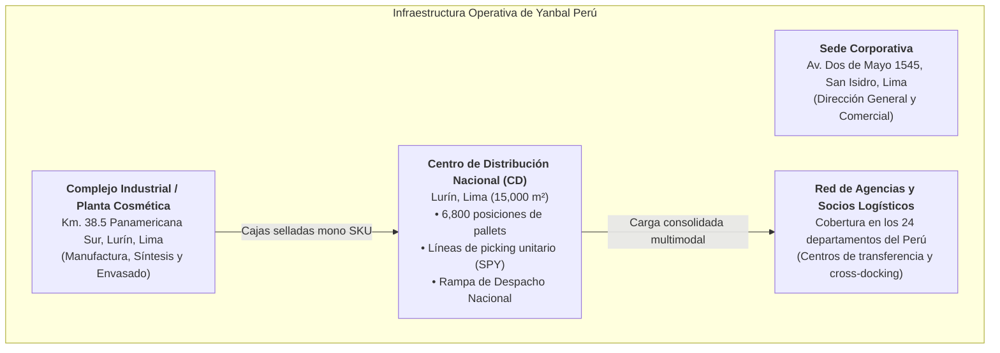
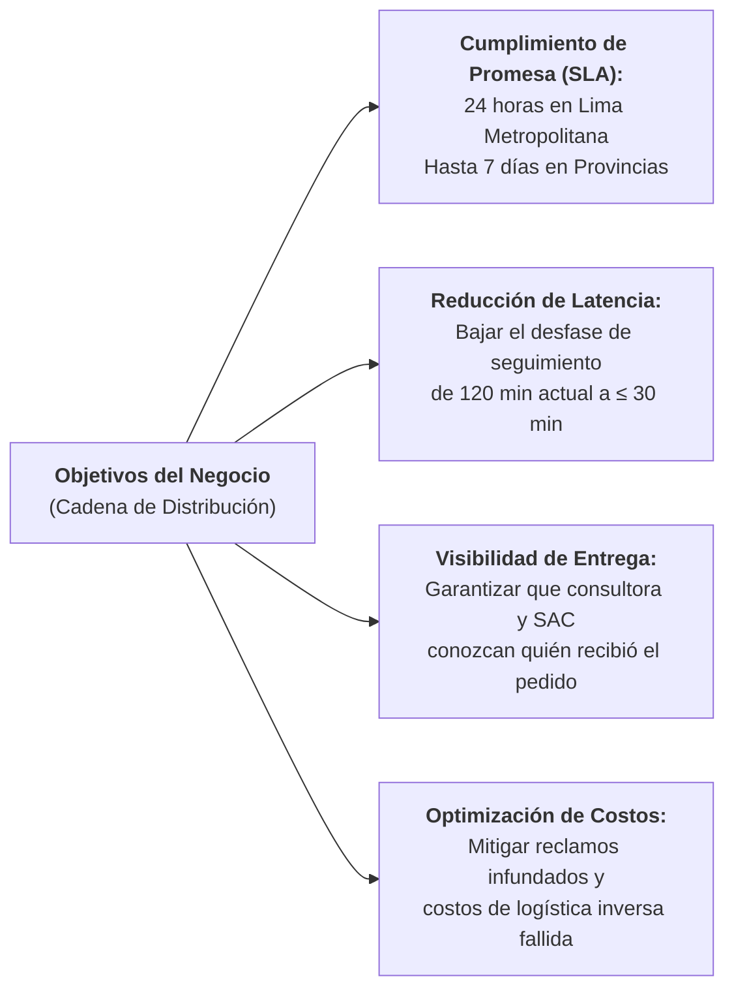
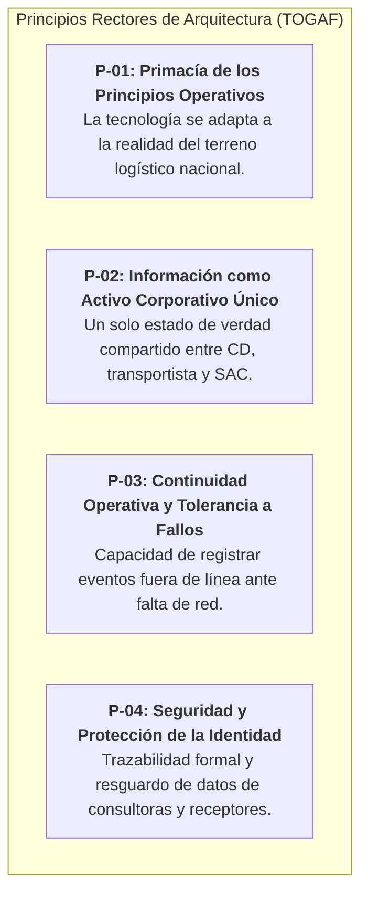

# Capítulo 1: Fase Preliminar — Entorno del Negocio y Principios Arquitectónicos (TOGAF)

> **Marco de Referencia:** TOGAF Standard — *Preliminary Phase: Framework and Principles*  
> **Entregable Oficial:** APF1 (Semana 6-7, UTP) — Sección 3.2 de la Guía Oficial  
> **Alcance del Caso:** Cadena de Suministro, Distribución y Trazabilidad Nacional de Yanbal Perú

---

## 1.1. Identificación y Datos Generales de la Empresa

| Campo Institucional | Detalle Oficial de la Organización |
|:---|:---|
| **Razón Social** | **UNIQUE S.A.** |
| **Nombre Comercial** | **YANBAL / YANBAL PERÚ** |
| **RUC** | **20100102458** |
| **Sector / Rubro Económico** | Fabricación y Comercialización de Cosméticos, Perfumería, Cuidado Personal y Joyería Fina. |
| **Modelo Comercial Primario** | Venta Directa por Catálogo y E-Commerce multinivel apoyado en una red nacional de **Consultoras y Directores Independientes**. |
| **Responsable Logístico en Estudio** | **Ing. Joao Condorpusa Mendoza** (Líder del Área de Distribución y Transporte de Yanbal Perú). |

---

## 1.2. Ubicación y Sedes Operativas

La operación logística y productiva de Yanbal en el Perú articula instalaciones fabriles, corporativas y de distribución estratégica:

1. **Centro de Distribución Nacional (CD Lurín):**  
   Instalación central de 15,000 m² equipada con más de 6,800 posiciones de pallets para productos terminados bajo SAP R3. Es el corazón operativo donde se realiza la desconsolidación de cajas máster mono SKU, el armado de pedidos unitarios por volumetría en 8 formatos de caja (guiado por el sistema SPY) y la transferencia física a los operadores de transporte en muelle.
2. **Planta Industrial de Manufactura:**  
   Ubicada en Lurín, dedicada a la formulación físico-química, manufactura y envasado de cosméticos y fragancias con trazabilidad desde origen mediante Códigos de Unidad de Acondicionamiento (UA).
3. **Planta de Joyería Fina:**  
   Instalación especializada para el diseño y fabricación de bijouterie de alta gama bajo estrictos protocolos de seguridad patrimonial.
4. **Red de Distribución y Hubs Regionales:**  
   Infraestructura operada mediante socios logísticos terceros (Olva Courier, Urbano Express, Scharff y operadores fluviales/aéreos) que conectan el CD central con los 24 departamentos del territorio peruano.

---

## 1.3. Antecedentes y Evolución del Modelo Operacional

- **Fundación y Trayectoria:** Fundada en Lima en 1967 por Fernando Belmont, Yanbal se consolidó como una corporación multinacional de belleza con presencia en 9 países de América y Europa.
- **Evolución del Modelo de Distribución:** Históricamente, la entrega de pedidos dependía de esquemas tradicionales agrupados por directoras de zona. Con la digitalización de la venta (incorporación de la plataforma móvil comercial *Maya* y *SAP Commerce*), el volumen de pedidos unitarios directos hacia consultoras y consumidoras finales creció de forma exponencial.
- **Complejidad Logística Actual:** Atender a una fuerza de ventas distribuida en ciudades principales, cabeceras de provincia y distritos de difícil acceso geográfico demandó la adopción de una red de transporte multimodal (terrestre, bimodal fluvial y aérea) sujeta a un riguroso compromiso de plazos (*lead times*).

---

## 1.4. Misión y Visión Corporativa

### Visión
> *«Ser la empresa de belleza y cuidado personal más reconocida por transformar vidas y empoderar a las personas a través de productos de alta calidad, innovación sostenible y una experiencia digital y logística de excelencia.»*

### Misión
> *«Ofrecer a nuestras consultoras y clientes productos de belleza y joyería con los más altos estándares internacionales, impulsando el desarrollo integral de las personas a través de la venta directa, apoyados por una cadena de suministro ágil, confiable y tecnológicamente integrada.»*

---

## 1.5. Objetivos Estratégicos y Fundamentos del Negocio

1. **Objetivo Estratégico Comercial:** Mantener la promesa de servicio pactada con las consultoras: entrega en **24 horas en Lima Metropolitana** y en un rango de **hasta 7 días en provincias**, sin quiebres de servicio.
2. **Objetivo Operativo de Trazabilidad:** Reducir la brecha de sincronización de tracking entre los registros en campo y los sistemas corporativos, transformando el desfase actual de **hasta 2 horas (120 minutos)** en una actualización con un rango permisible **menor a 30 minutos** (o en simultáneo).
3. **Objetivo de Eficiencia en Atención al Cliente:** Eliminar la sobrecarga en el Centro de Contacto (Salesforce CRM) ocasionada por falsos reportes de no-entrega, asegurando la captura y exposición oportuna de la identidad del **personal o persona autorizada** que recibió físicamente la carga en la sede o agencia de destino.
4. **Propuesta de Valor de la Cadena:** Garantizar la integridad física del producto (en envases frágiles de fragancias y cajas termo-controladas de droguería) y la certidumbre total de entrega de extremo a extremo.

---

## 1.6. Principios de Arquitectura Empresarial (TOGAF Preliminary Phase)

Conforme a las recomendaciones de TOGAF, se establecen los siguientes principios rectores que gobernarán el diseño arquitectónico de la solución:

| ID | Principio | Declaración | Razón de Negocio | Implicancia Técnica |
|:---:|:---|:---|:---|:---|
| **P-01** | **Primacía del Terreno Logístico** | Las aplicaciones deben funcionar con simplicidad y eficiencia bajo la dinámica física de muelle y ruta. | Los operarios y transportistas requieren herramientas ágiles que no frenen la carga física. | Interfaces móviles intuitivas con escaneado rápido y flujos mínimos de clics (`RNF-07`). |
| **P-02** | **Única Fuente de Verdad** | Cada pedido posee una única línea de tiempo de estados compartida entre todos los canales. | Discrepancias entre Salesforce, portal web y transportistas generan desconfianza y reclamos (`PR-04`). | Integración desacoplada mediante APIs/ESB corporativo para propagar estados en $\le 30$ min (`RNF-01`). |
| **P-03** | **Tolerancia a Desconexión** | El registro operativo en ruta no debe interrumpirse por falta de cobertura móvil en carreteras o selva. | El transporte multimodal nacional transita por zonas remotas sin conectividad celular. | Almacenamiento local seguro en el dispositivo móvil y sincronización automática al recuperar red (`RNF-03`). |
| **P-04** | **Transparencia en Recepción** | Toda entrega consumada debe certificar formalmente a la persona que recibe físicamente el bulto. | Evitar que recepciones válidas por familiares sean catalogadas como pérdidas o robos (`PR-05`). | Captura obligatoria de nombres, DNI y parentesco del receptor real y exposición inmediata en tracking (`RF-07`, `RF-12`). |

---
