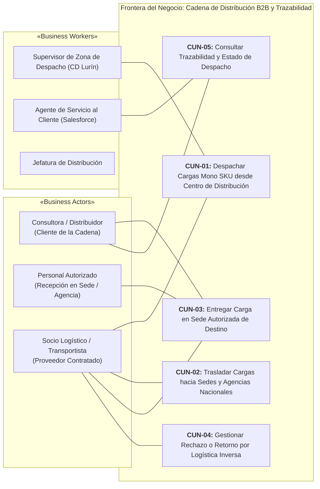

# Documento Consolidado: Avance de Proyecto Final 1 (APF1)

# UNIVERSIDAD TECNOLÓGICA DEL PERÚ
### FACULTAD DE INGENIERÍA
**Carrera Profesional de Ingeniería de Sistemas e Informática**

---

### CURSO:
**DISEÑO E IMPLEMENTACIÓN DE ARQUITECTURA EMPRESARIAL**

---

### ENTREGABLE OFICIAL:
# AVANCE DE PROYECTO FINAL 1 (APF1)
*(Fase Preliminar TOGAF, Gestión de Requerimientos y Modelado UML de Soporte)*

---

### TÍTULO DEL PROYECTO:
## «Diseño de la Arquitectura Empresarial y Sistema de Trazabilidad Integral para la Cadena de Distribución y Transporte Nacional de Yanbal Perú»

---

### EQUIPO DE TRABAJO:

| N° | Apellidos y Nombres | Código de Estudiante | Participación |
|:--:|:--------------------|:--------------------:|:-------------:|
| 1  | [Estudiante 1] | `[Código 1]` | 100% |
| 2  | [Estudiante 2] | `[Código 2]` | 100% |
| 3  | [Estudiante 3] | `[Código 3]` | 100% |
| 4  | [Estudiante 4] | `[Código 4]` | 100% |
| 5  | [Estudiante 5] | `[Código 5]` | 100% |

**Docente Tutor:** [Nombre del Docente Tutor]  
**Lima, Perú — Ciclo 2026**

---

## Índice General del Entregable APF1

1. **Capítulo I: Fase Preliminar — Entorno del Negocio y Principios (TOGAF)**
   - 1.1. Identificación y Datos Generales de la Empresa
   - 1.2. Ubicación y Sedes Operativas
   - 1.3. Antecedentes y Evolución del Modelo Operacional
   - 1.4. Misión y Visión Corporativa
   - 1.5. Objetivos Estratégicos y Fundamentos del Negocio
   - 1.6. Principios Rectores de Arquitectura Empresarial
2. **Capítulo II: Ingeniería de Requerimientos**
   - 2.1. Delimitación y Marco Metodológico
   - 2.2. Matriz Consolidada de Requerimientos Funcionales (RF-01 a RF-12)
   - 2.3. Matriz Consolidada de Requerimientos No Funcionales (RNF-01 a RNF-07)
3. **Capítulo III: Modelado de Procesos y Negocio (AS-IS)**
   - 3.1. Diagrama de Casos de Uso del Negocio (CUN)
   - 3.2. Tabla Oficial de Roles y Actividades del Negocio
   - 3.3. Diagramas de Actividades AS-IS (Flujo General Integrado y Flujo del Problema Crítico)
   - 3.4. Diagrama de Clases (Nivel Dominio)
   - 3.5. Diccionario de Datos del Modelo de Dominio y Matriz de Entidades
   - 3.6. Diagrama de Objetos UML (Snapshot de Instancias en Escenario Real)
4. **Capítulo IV: Modelado de Sistemas de Información (Solución Propuesta)**
   - 4.1. Diagrama General de Casos de Uso del Sistema (CUS)
   - 4.2. Fichas Técnicas Oficiales de Casos de Uso del Sistema
   - 4.3. Diagrama de Clases de Análisis (Modelo RUP Boundary-Control-Entity)
   - 4.4. Diagrama de Clases del Diseño (Modelo Lógico de Software por Capas)
   - 4.5. Diagrama de Contexto y Paquetes de Arquitectura del Sistema Propuesto

---

# Capítulo I: Fase Preliminar — Entorno del Negocio y Principios (TOGAF)

*(Documento fuente detallado: [[01 - Fase Preliminar TOGAF (Entorno y Principios)]])*

### 1.1. Identificación de la Organización
- **Razón Social:** UNIQUE S.A.
- **Nombre Comercial:** YANBAL / YANBAL PERÚ (RUC: 20100102458).
- **Líder Logístico en Estudio:** Ing. Joao Condorpusa Mendoza (Jefe de Distribución Nacional).
- **Modelo de Negocio:** Venta directa por catálogo y comercio digital multinivel articulado sobre una red nacional de consultoras independientes.

### 1.2. Infraestructura y Sedes
- **Centro de Distribución Nacional (Lurín, Lima):** 15,000 m², con 6,800 posiciones de pallets en SAP R3, líneas de picking guiadas por SPY en 8 formatos de cajas y muelle de despacho multimodal nacional (24 departamentos).
- **Planta Industrial (Lurín):** Manufactura y síntesis cosmética, fragancias y joyería fina con codificación de trazabilidad industrial mono SKU (Códigos UA).
- **Sede Corporativa:** Av. Dos de Mayo 1545, San Isidro, Lima.

### 1.3. Misión y Visión
- **Misión:** Ofrecer productos de belleza y bienestar con estándares internacionales, impulsando el desarrollo de consultoras mediante una cadena logística confiable, ágil e integrada.
- **Visión:** Ser la compañía más reconocida por empoderar personas a través de la excelencia de producto y una experiencia digital y logística impecable.

### 1.4. Objetivos y Principios TOGAF
- **Objetivos de la Cadena:** Sostener la promesa de entrega (24h Lima / 7d provincias), reducir el desfase de seguimiento de 120 min a un umbral $\le 30$ min (**RNF-01**) y transparentar la identidad de los receptores alternos (**PR-05**).
- **Principios de Arquitectura:** `P-01` Primacía del Terreno Logístico, `P-02` Única Fuente de Verdad, `P-03` Tolerancia a Desconexión (Offline-First) y `P-04` Transparencia en Recepción.

---

# Capítulo II: Ingeniería de Requerimientos

*(Documentos fuente detallados: [[01 - Matriz Consolidada de Requerimientos]], [[02 - Especificación de Requerimientos Funcionales]], [[03 - Especificación de Requerimientos No Funcionales]])*

### 2.1. Resumen de Requerimientos Funcionales (RF)

| ID | Requerimiento Funcional | Actor Responsable | Prioridad | Problema AS-IS Asociado | CUS Vinculado |
|:---:|:---|:---|:---:|:---|:---:|
| **RF-01** | Clasificación geográfica de pedidos para despacho | Supervisor de Despacho | **Alta** | Canalización territorial en CD | `CUS-01` |
| **RF-02** | Gestión de socio logístico y modalidad de transporte | Supervisor de Despacho | **Alta** | Vinculación multimodal (terrestre, bimodal, aérea) | `CUS-02` |
| **RF-03** | Registro de egreso formal de muelle (Estado 'Despachado') | Supervisor de Despacho | **Alta** | Transferencia física de custodia | `CUS-03` |
| **RF-04** | Gestión y asociación de la promesa de entrega (Lead Time) | Sistema / Supervisor | **Media** | Compromiso de 24h Lima / 7d Provincias | `CUS-04` |
| **RF-05** | Registro de inicio de traslado (Estado 'En Ruta') | Transportista | **Alta** | Falta de control de partida efectiva | `CUS-05` |
| **RF-06** | Registro de confirmación de entrega (Estado 'Entregado') | Transportista | **Alta** | Certificación de recepción en destino | `CUS-06` |
| **RF-07** | Registro de la identidad del receptor real (DNI y vínculo) | Transportista | **Alta** | **PR-05 (Receptor alterno no identificado)** | `CUS-07` |
| **RF-08** | Registro de entrega fallida por incidencias tipificadas | Transportista | **Alta** | Clasificación por retraso, pérdida o daño | `CUS-08` |
| **RF-09** | Registro de orden de retorno de carga (Logística Inversa) | Transportista | **Media** | Retorno documentado de bultos a Lurín | `CUS-09` |
| **RF-10** | Sincronización asíncrona de eventos y estados ($\le 30$ min) | Bus ESB / Central | **Alta** | **PR-03 / PR-04 (Desfase de hasta 2 horas)** | `CUS-10` |
| **RF-11** | Consulta de trazabilidad por N° Pedido o Cód. Consultor | Consultora / Agente SAC | **Alta** | Falta de visibilidad de estados en tiempo útil | `CUS-11` |
| **RF-12** | Visualización transparente del receptor real en consulta | Consultora / Agente SAC | **Alta** | **PR-05 (Reclamos por desconocimiento)** | `CUS-12` |

### 2.2. Resumen de Requerimientos No Funcionales (RNF)

| ID | Nombre del RNF | Categoría | Métrica / Criterio Objetivo |
|:---:|:---|:---|:---|
| **RNF-01** | Latencia de propagación de estados | Rendimiento | Reducción del desfase actual de 120 min a un máximo permisible de **$\le 30$ minutos**. |
| **RNF-02** | Soporte territorial nacional | Cobertura | Cobertura integral en los 24 departamentos y modalidades terrestre, bimodal y aérea. |
| **RNF-03** | Resiliencia ante desconexión | Disponibilidad | Operación offline local en app móvil y sincronización automática al recuperar cobertura. |
| **RNF-04** | Integridad y no repudio | Seguridad | Registro inmutable de DNI, nombres y firma digital de recepción. |
| **RNF-05** | Control de accesos basado en roles | Seguridad | Esquema RBAC (Supervisor CD, Transportista, Agente SAC y Consultora). |
| **RNF-06** | Trazabilidad y auditoría | Confiabilidad | Bitácora temporal inmutable de estampas de tiempo de cada hito. |
| **RNF-07** | Usabilidad en dinámica de muelle y ruta | Ergonomía | Flujo operativo móvil con escaneo rápido y registro en un máximo de 3 pasos. |

---

# Capítulo III: Modelado de Procesos y Negocio (AS-IS)

### 3.1. Casos de Uso del Negocio (CUN)
*(Diagrama PlantUML: [[CUN_Diagrama_General.puml]])*

### 3.2. Tabla Oficial de Roles y Actividades del Negocio
*(Documento fuente detallado: [[02 - Tabla de Roles y Actividades del Negocio]])*

| Rol / Actor del Negocio | Estereotipo RUP | Responsabilidad Operativa en el AS-IS | Actividades AS-IS | CUN Vinculado |
|:---|:---:|:---|:---:|:---:|
| **Consultora / Distribuidor** | «Business Actor» | Destinatario final de la cadena de distribución; consulta seguimiento en portal web experimentando desfases de información. | `ACT-13`, `ACT-14` | `CUN-03`, `CUN-05` |
| **Personal Autorizado (en Sede / Agencia)** | «Business Actor» | Encargado o personal designado en la sede/agencia de destino que recepciona y consigna la entrega física de la carga (**eje de PR-05**). | `ACT-09` | `CUN-03` |
| **Socio Logístico / Transportista** | «Business Actor» | Custodio físico en ruta; ejecuta transporte multimodal y captura registros de entrega o fallas en campo. | `ACT-05` a `ACT-11` | `CUN-01` a `CUN-04` |
| **Supervisor de Zona de Despacho** | «Business Worker» | Operador en CD Lurín; clasifica bultos y pallets por destino, asigna operador/modo y formaliza salida de muelle. | `ACT-01` a `ACT-05` | `CUN-01` |
| **Agente de Servicio al Cliente** | «Business Worker» | Atiende consultas y reclamos en Salesforce CRM padeciendo la falta de visibilidad del receptor real y el desfase de 2h. | `ACT-13`, `ACT-14` | `CUN-05` |
| **Jefatura de Distribución** | «Business Worker» | Supervisa los acuerdos de nivel de servicio (SLA), lead times e incidencias a nivel nacional. | `ACT-04`, `ACT-10` | `CUN-01`, `CUN-04` |

### 3.3. Diagramas de Actividades AS-IS
- **Flujo General Integrado:** [[01_Flujo_General_AS_IS_Integrado.puml]] modela el recorrido secuencial de punta a punta desde la rampa de despacho hasta la consulta final o retorno por logística inversa.
- **Flujo del Problema Crítico:** [[02_Flujo_AS_IS_Problema_Critico_Desfase_Receptor.puml]] demuestra cómo el desfase batch de 2 horas (`PR-03`) sumado a la falta de exposición de los datos de la persona autorizada (`PR-05`) genera reclamos falsos por pérdida de paquetes en el Call Center.

### 3.4. Modelo de Dominio y Diccionario de Datos
*(Diagrama PlantUML: [[Diagrama_Clases_Dominio.puml]] | Documentos: [[01 - Diagrama de Clases de Dominio (Nivel Dominio)]], [[02 - Diccionario de Datos del Modelo de Dominio]])*

El modelo conceptual consta de **16 clases del dominio** articuladas en torno al ciclo de vida de `Pedido`, vinculadas a `Bulto`, `RegistroDespacho`, `Consultora`, `DireccionEntrega`, `SocioLogistico`, `ModalidadTransporte` (especializada en Terrestre, Bimodal y Aérea), `RegistroEntrega`, `Receptor` (especializado en ConsultoraTitular y PersonalAutorizado), `IncidenciaEntrega` y `OrdenRetorno`.

### 3.5. Diagrama de Objetos UML (Snapshot en Escenario Real)
*(Diagrama PlantUML: [[Diagrama_Objetos_Instancias_Escenario_Real.puml]] | Documento: [[04 - Diagrama de Objetos UML (Instancias de Escenario Real)]])*

Modela la instanciación formal de las clases de dominio para un despacho real (`PED-2026-84920`) entregado exitosamente a las 16:45 horas en la Agencia de Distribución / Sede Autorizada Lima Sur (San Borja) al personal autorizado Carlos Torres Flores (Encargado de Recepción en Sede), evidenciando los valores concretos en cada atributo.

---

# Capítulo IV: Modelado de Sistemas de Información (Solución Propuesta)

### 4.1. Diagrama General de Casos de Uso del Sistema (CUS)
*(Diagrama PlantUML: [[CUS_Diagrama_General.puml]])*

Estructurado en 5 subsistemas lógicos que ejecutan los 12 requerimientos funcionales:
- **Subsistema de Despacho:** `CUS-01` Clasificar Pedidos Geográficamente, `CUS-02` Asignar Transportista y Modalidad, `CUS-03` Registrar Salida de Despacho, `CUS-04` Asociar Promesa de Entrega.
- **Subsistema de Transporte y Ruta:** `CUS-05` Registrar Inicio de Traslado.
- **Subsistema de Entrega y Contingencias:** `CUS-06` Registrar Confirmación de Entrega (`<<include>> CUS-07`), `CUS-07` Registrar Identidad del Receptor, `CUS-08` Registrar Entrega Fallida (`<<extend>> CUS-09`), `CUS-09` Registrar Orden de Retorno.
- **Subsistema de Sincronización:** `CUS-10` Sincronizar Estados de Distribución.
- **Subsistema de Consulta y Seguimiento:** `CUS-11` Consultar Trazabilidad (`<<include>> CUS-12`), `CUS-12` Visualizar Receptor Real.

### 4.2. Diagrama de Clases de Análisis (Modelo RUP BCE)
*(Diagramas PlantUML: [[Clases_Analisis_BCE_General.puml]], [[VOPC_Realizacion_CUS.puml]] | Documento: [[01 - Diagrama de Clases de Análisis (Modelo BCE)]])*

Realiza los 12 CUS a través del desacoplamiento en 3 estereotipos:
1. **Boundary (`<<boundary>>`):** Formularios web de despacho CD, pantallas móviles del transportista, endpoint API de sincronización ESB, portal web de consultoras e interfaz de Salesforce CRM.
2. **Control (`<<control>>`):** `CtrlDespacho`, `CtrlTransporteRuta`, `CtrlConfirmacionEntrega`, `CtrlIncidenciaRetorno`, `CtrlSincronizacion` y `CtrlConsultaTracking`.
3. **Entity (`<<entity>>`):** `Pedido`, `Bulto`, `RegistroDespacho`, `DireccionEntrega`, `SocioLogistico`, `RegistroEntrega`, `Receptor`, `IncidenciaEntrega`, `OrdenRetorno` y `EventoTracking`.

### 4.3. Diagrama de Clases del Diseño (Modelo Lógico de Software)
*(Diagrama PlantUML: [[Clases_Diseno_Logico_General.puml]] | Documento: [[01 - Diagrama de Clases de Diseño Lógico]])*

Implementa una arquitectura técnica por capas:
- **Capa de Controladores:** `DespachoController`, `TransporteMobileController`, `EntregaMobileController`, `SincronizacionController`, `ConsultaTrackingController`.
- **Capa de Servicios:** Interfaces `IDespachoService`, `ITransporteService`, `IEntregaService`, `ISincronizacionService`, `IConsultaTrackingService` con sus implementaciones que encapsulan las reglas del negocio.
- **Capa de Entidades Lógicas:** Clases fuertemente tipificadas con operaciones de mutación de estado.
- **Capa de Repositorios (DAO):** Abstracciones de persistencia para base de datos transaccional relacional.

### 4.4. Diagrama de Contexto y Paquetes de Arquitectura
*(Diagrama PlantUML: [[Diagrama_Contexto_Paquetes_Sistema.puml]] | Documento: [[01 - Diagrama de Contexto y Paquetes de Arquitectura]])*

Delimita la frontera del sistema propuesto estructurado en 6 paquetes internos (`pkg_despacho`, `pkg_transporte`, `pkg_entrega`, `pkg_sincronizacion`, `pkg_consulta`, `pkg_seguridad_transversal`) con dependencias dirigidas sin ciclos, gobernando las interfaces externas con los sistemas legados SAP R3, SPY (WMS), Salesforce CRM y el portal Maya.

---

## Conclusiones del Entregable APF1

1. **Alineación Integral con la Rúbrica UTP:** El presente documento y los modelos asociados cubren exhaustivamente la totalidad de los ítems estipulados en la Guía Oficial de Propuesta de Proyecto Final para las Semanas 6 y 7.
2. **Trazabilidad de Extremo a Extremo:** Desde las declaraciones en entrevista del Ing. Joao Condorpusa hasta el diseño lógico de clases y paquetes, cada elemento de software responde directamente a una necesidad o dolor operativo sustentado.
3. **Base Lista para la Fase A y B de TOGAF (APF2):** La estructura aquí formalizada provee el soporte técnico sobre el cual se desarrollará la Visión de Arquitectura (Fase A), la Arquitectura del Negocio y Análisis de Brechas (Fase B) y la Integración UML de Componentes y Secuencia para la Semana 14.

---
