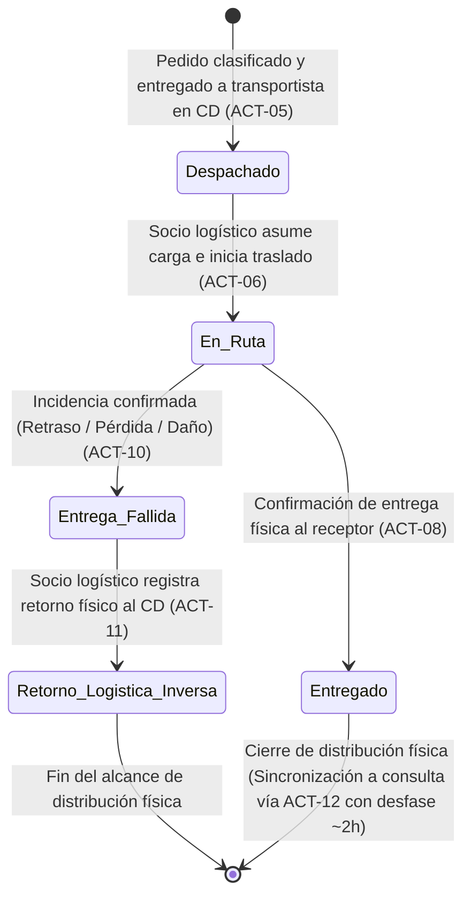
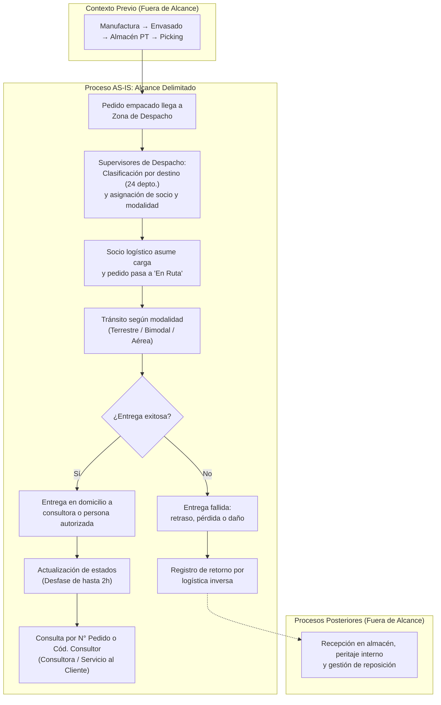

# Proceso Actual (AS-IS): Despacho → Entrega → Consulta

> **Alcance del modelado:** Este documento describe el proceso **tal como funciona actualmente**, desde el momento en que un pedido ingresa a la zona de despacho hasta que el estado de entrega es consultado por el cliente o por servicio al cliente. No se incluyen propuestas de Y-Trace ni de ningún sistema futuro.
>
> **Navegación:** [[02 - Actores relevantes]] | [[03 - Actividades y eventos]] | [[04 - Sistemas e información]] | [[05 - Problemas y desfases]] | [[06 - Evidencia y fuentes]]  
> **Requerimientos asociados:** [[01 - Matriz Consolidada de Requerimientos]] | [[04 - Trazabilidad y Registro de Depuración]]

---

## 1. Contexto Previo (Fuera del Alcance Detallado)

Las siguientes etapas ocurren **antes** del punto de inicio del modelado AS-IS. Se incluyen únicamente como referencia para entender qué llega a la Zona de Despacho y con qué información:

| Etapa previa | Qué ocurre | Resultado que alimenta el despacho |
|---|---|---|
| Manufactura y envasado | Se elaboran los productos y se empaquetan en cajas mono SKU con un Código UA | Cajas identificadas con código de trazabilidad industrial |
| Almacén de PT | Las cajas se almacenan en pallets (6,800 posiciones) bajo control de SAP R3 | Stock clasificado por estado (Libre disposición / Calidad / Bloqueado) |
| Picking unitario en CD | El sistema SPY genera tareas de recolección; se abren cajas máster y se arman pedidos unitarios en 1 de 8 formatos de caja | Pedido consolidado, empacado, con número de pedido asignado y datos comerciales amarrados |

**Lo que llega a la Zona de Despacho:**
- Una caja (formato 1-8) que contiene un pedido consolidado.
- El número de pedido que amarra: nombre del cliente/consultora, dirección de entrega (distrito, provincia, departamento, ciudad principal o alejada), código de consultora y datos comerciales.
- Estado del pedido en ese momento: **"En preparación"** (punto de transición).

> [!NOTE]
> **Fuente:** Entrevista al Ing. Joao Condorpusa, minutos 14:43–17:41. Documentos: [[Transporte y logística]] §2, [[Inventario y almacén]] §3.

---

## 2. Flujo Principal del Proceso AS-IS

El proceso que se modela en detalle tiene **5 etapas secuenciales** y **1 camino alternativo**:

---

### Etapa 1: Despacho y Clasificación

**Qué ocurre actualmente:**
- El pedido ya empacado llega a la **Zona de Despacho** del Centro de Distribución.
- Los **supervisores de despacho** clasifican los pedidos por destino geográfico utilizando la información del número de pedido (dirección, región, provincia, distrito, tipo de ciudad: principal o alejada).
- Se canalizan los envíos para cubrir los 24 departamentos del Perú.
- Se vincula al pedido el **socio logístico de transporte** correspondiente a la ruta.
- Se identifica la **modalidad de envío**: terrestre, bimodal (terrestre + fluvial/lacustre) o aérea, según el destino.
- Se asocia la promesa estimada de entrega según la región de destino (24 horas Lima / hasta 7 días provincias).
- Se entrega formalmente la carga al socio logístico.

**Estado del pedido:** Cambia de "En preparación" a **"Despachado"** (o *"Pedido despachado"*).

**Información que se registra y viaja con el pedido:**
- Socio logístico asignado.
- Modalidad de envío (terrestre, bimodal, aérea).
- Fecha y hora de egreso de despacho.
- Promesa de entrega (24h Lima / hasta 7 días provincias).

> **Fuente:** Entrevista min 17:34–19:30, min 22:38–22:54.

---

### Etapa 2: Transporte y Tránsito (En Ruta)

**Qué ocurre actualmente:**
- El socio logístico carga los pedidos en su vehículo e inicia el traslado físico hacia el destino.
- El estado del pedido cambia a **"En Ruta"** (o *"Pedido en ruta"*).
- Durante el trayecto, el sistema de tracking mantiene al pedido en tránsito sin registro de hitos o checkpoints intermedios específicos en la fuente.

**Tiempos comprometidos (promesa de entrega):**
- **Lima Metropolitana:** promesa de entrega de 24 horas.
- **Provincias:** rango de entrega de hasta 7 días, según lejanía y accesibilidad.

**Modalidades de transporte utilizadas:**

| Modalidad | Cuándo se utiliza |
|---|---|
| Terrestre | Lima, costa y ciudades principales conectadas por red vial |
| Bimodal | Zonas donde se combina tramo terrestre con fluvial o lacustre (selva / zonas ribereñas) |
| Aérea | Destinos distantes o de difícil acceso terrestre (ej. Iquitos) |

**Información que viaja con el pedido:**
- Número de pedido.
- Datos del destinatario (nombre, dirección).
- Datos del socio logístico y modalidad.

> **Fuente:** Entrevista min 19:15–19:53, min 22:38–22:54.

---

### Etapa 3: Entrega al Destinatario

**Qué ocurre actualmente:**
- El socio logístico llega al domicilio de destino y efectúa la entrega física.
- El receptor puede ser:
  - La **consultora/consultor** titular del pedido, o
  - Una **persona autorizada** que se encuentra en el domicilio.
- El socio logístico registra la entrega completada.

**Estado del pedido:** Cambia a **"Entregado"** (o *"Pedido entregado"*).

**Problema crítico en esta etapa:**
- Cuando una persona autorizada recibe el pedido, **no se comunica oportunamente** quién fue el receptor real.
- La consultora titular, al consultar el sistema, todavía ve el pedido como "En ruta" (por el desfase de 2h) o como entregado sin saber quién lo recibió.
- Esto genera **reclamos prematuros por supuesta no-entrega**, cuando el paquete ya fue recibido por un tercero en el domicilio.

> **Fuente:** Entrevista min 24:45–25:01. Documento [[05 - Problemas y desfases]] §PR-05.

---

### Etapa 4: Actualización del Estado en Sistemas

**Qué ocurre actualmente:**
- Después de que el socio logístico confirma la entrega en campo, la actualización viaja hacia las plataformas corporativas para reflejar el cambio.
- Este proceso de sincronización tiene un **desfase promedio de hasta 2 horas**.
- Durante esas 2 horas, el pedido sigue apareciendo como **"En ruta"** en los sistemas de consulta, a pesar de que físicamente ya fue entregado.

**Consecuencia:**
- Se genera una "ventana ciega" de información de hasta 2 horas.
- Servicio al Cliente no puede dar respuestas confiables a las consultoras.
- Se acumulan reclamos innecesarios.

> **Fuente:** Entrevista min 23:19–24:36. Documento [[05 - Problemas y desfases]] §PR-03.

---

### Etapa 5: Consulta y Trazabilidad

**Qué ocurre actualmente:**
- La **consultora/consultor** puede hacer seguimiento de su pedido utilizando:
  - El **Número de Pedido**, o
  - El **Código de Consultor/Cliente**.
- Con esos datos puede consultar en qué estado se encuentra el pedido y su promesa estimada de entrega.
- Si tiene dudas o percibe retrasos, contacta a **Servicio al Cliente**, donde un agente consulta el estado del pedido.

**Limitaciones actuales de la consulta:**
- La información mostrada puede estar desactualizada hasta por 2 horas.
- No se muestra con claridad quién recibió el paquete si fue una persona autorizada.
- El agente de atención ve los mismos datos desfasados y no puede confirmar con certeza si la entrega ya se realizó.

> **Fuente:** Entrevista min 22:03–22:47, min 24:29–24:36.

---

### Camino Alternativo: Entrega Fallida y Logística Inversa

Cuando durante el transporte o en destino ocurre una incidencia confirmada (**retraso, pérdida o daño**):

1. **Se corrobora** la situación con el cliente final afectado.
2. **El socio logístico registra** la incidencia en el sistema como **"Entrega Fallida"** (motivada por retraso, pérdida o daño).
3. **El socio logístico registra el retorno** del pedido hacia el Centro de Distribución a través del flujo de logística inversa.

> [!IMPORTANT]
> **Delimitación de alcance en Logística Inversa:**
> Los procesos posteriores al retorno físico —tales como la evaluación interna en almacén, el peritaje de Control de Calidad y Seguridad Patrimonial, la activación de coberturas de seguros y la preparación de un nuevo pedido de reposición— ocurren dentro del almacén central y **quedan fuera del alcance del proceso de distribución**. La trazabilidad en este proceso concluye formalmente con el **registro del retorno de la carga**.

> **Fuente:** Entrevista min 20:03–20:55.

---

## 3. Diagrama Integrado del Proceso Actual

---

## 4. Resumen de Estados del Pedido en el Alcance AS-IS

| Estado | Momento en que se asigna | Actor que lo registra | Sistema que lo registra |
|---|---|---|---|
| **Despachado** | Al registrar la salida del pedido en zona de despacho y entregarlo al socio logístico | Supervisor de despacho | Driving / NSDG |
| **En Ruta** | Cuando el socio logístico asume la carga y comienza el traslado | Socio logístico | NSDG / Driving |
| **Entregado** | Cuando el receptor (consultora o persona autorizada) recibe el paquete | Socio logístico | NSDG / Driving (con desfase de hasta 2h en sistemas de consulta) |
| **Entrega Fallida** | Cuando ocurre una incidencia que impide la entrega (retraso, daño, pérdida) | Socio logístico | NSDG / Driving |

> [!NOTE]
> Los estados previos (Facturado, En Preparación) pertenecen a las etapas anteriores y no forman parte del modelado detallado de este flujo.
