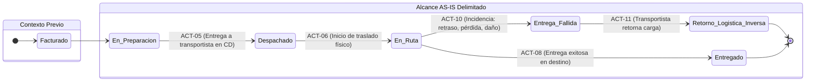

# Actividades y Eventos del Proceso AS-IS

> **Criterio de selección:** Solo se documentan actividades que ocurren **desde el despacho hacia adelante**. Las actividades de producción, almacenamiento y picking se mencionan únicamente como antecedente cuando es necesario entender qué llega al despacho.
>
> **Navegación:** [[01 - Proceso actual]] | [[02 - Actores relevantes]] | [[04 - Sistemas e información]] | [[05 - Problemas y desfases]] | [[06 - Evidencia y fuentes]]  
> **Requerimientos asociados:** [[01 - Matriz Consolidada de Requerimientos]] | [[02 - Especificación de Requerimientos Funcionales]] | [[04 - Trazabilidad y Registro de Depuración]]

---

## 1. Inventario de Actividades del Proceso AS-IS

A continuación se detallan las actividades operativas del proceso delimitado y su correspondencia biunívoca con los requerimientos funcionales del sistema:

### Etapa 1: Despacho y Clasificación

| ID | Actividad Operativa | Actor Responsable | Sistema Utilizado | Entrada | Salida | Correspondencia RF | Evidencia Primaria (`trascrito.text`) |
|:---:|:---|:---|:---|:---|:---|:---:|:---|
| **ACT-01** | Recibir pedidos empacados desde la línea de picking | Supervisor de Despacho | — | Caja empacada con N° de pedido | Pedido físico en zona de despacho | *Entrada al flujo* | Línea 14 (min 17:34) |
| **ACT-02** | Clasificar pedidos por destino geográfico (24 departamentos, provincias, distritos, ciudad principal/alejada) | Supervisor de Despacho | Driving | Datos de dirección asociados al pedido | Pedido clasificado por zona de canalización | [[02 - Especificación de Requerimientos Funcionales#RF-01\|RF-01]] | Líneas 14, 16-17 (min 17:41–19:15) |
| **ACT-03** | Asignar socio logístico y modalidad de transporte (terrestre, bimodal, aérea) según la ruta | Supervisor de Despacho | Driving / NSDG | Destino territorial y proveedores asociados | Datos de transportista y modalidad vinculados | [[02 - Especificación de Requerimientos Funcionales#RF-02\|RF-02]] | Líneas 4, 14, 17-18 (min 1:24, 18:02, 19:15–19:30) |
| **ACT-04** | Asociar promesa estimada de entrega al pedido según destino (24h Lima / hasta 7 días provincias) | Sistema / Supervisor | NSDG / Tracking | Destino geográfico del pedido | Promesa de servicio registrada | [[02 - Especificación de Requerimientos Funcionales#RF-04\|RF-04]] | Líneas 21-22 (min 22:38–22:54) |
| **ACT-05** | Registrar salida de despacho y entrega formal de carga al socio logístico | Supervisor de Despacho | Driving / NSDG | Pedidos clasificados en zona de despacho | Pedido despachado (Estado $\rightarrow$ *"Despachado"*) | [[02 - Especificación de Requerimientos Funcionales#RF-03\|RF-03]] | Línea 18 (min 19:04, 19:44) |

> [!NOTE]
> **Aclaración de depuración:** Se eliminó cualquier referencia a *"manifiesto de carga"* (sistema de registro es Driving/NSDG) y se descartó la actividad de *"pesaje de comprobación"* por carecer de sustento en la entrevista.

---

### Etapa 2: Transporte y Tránsito

| ID | Actividad Operativa | Actor Responsable | Sistema Utilizado | Entrada | Salida | Correspondencia RF | Evidencia Primaria (`trascrito.text`) |
|:---:|:---|:---|:---|:---|:---|:---:|:---|
| **ACT-06** | Registrar inicio de traslado físico del pedido | Socio Logístico | NSDG / Driving | Carga asumida por el transportista | Pedido en tránsito (Estado $\rightarrow$ *"En Ruta"*) | [[02 - Especificación de Requerimientos Funcionales#RF-05\|RF-05]] | Línea 18 (min 19:44–19:53) |
| **ACT-07** | Trasladar pedidos por la ruta asignada según modalidad (terrestre, bimodal o aérea) | Socio Logístico | Unidades de transporte | Pedidos cargados en ruta | Arribo al domicilio o localidad de destino | *Operación física* | Líneas 17-18 (min 19:23–19:30) |

> [!NOTE]
> **Aclaración de depuración:** Se descartó el registro de hitos, garitas o checkpoints intermedios durante el traslado, dado que la fuente solo sustenta la permanencia del pedido en estado macro *"En Ruta"*.

---

### Etapa 3: Entrega y Excepciones en Destino

| ID | Actividad Operativa | Actor Responsable | Sistema Utilizado | Entrada | Salida | Correspondencia RF | Evidencia Primaria (`trascrito.text`) |
|:---:|:---|:---|:---|:---|:---|:---:|:---|
| **ACT-08** | Registrar confirmación de entrega física en destino | Socio Logístico | NSDG | Pedido entregado al receptor en domicilio | Pedido completado (Estado $\rightarrow$ *"Entregado"*) | [[02 - Especificación de Requerimientos Funcionales#RF-06\|RF-06]] | Línea 18 (min 19:53) |
| **ACT-09** | Registrar datos de la persona que recibe el paquete (consultora titular o persona autorizada) | Socio Logístico | NSDG | Identificación del receptor en campo | Identidad del receptor asociada al registro de entrega | [[02 - Especificación de Requerimientos Funcionales#RF-07\|RF-07]] | Línea 25 (min 24:45–25:01) |
| **ACT-10** | Registrar entrega fallida por incidencia tipificada (retraso, pérdida o daño) | Socio Logístico | NSDG / Driving | Incidencia confirmada en ruta o destino | Pedido no entregado (Estado $\rightarrow$ *"Entrega Fallida"*) | [[02 - Especificación de Requerimientos Funcionales#RF-08\|RF-08]] | Línea 19 (min 20:03–20:30) |

> [!NOTE]
> **Aclaración de depuración:** En ACT-10, las causales se restringen estrictamente a **retraso, pérdida y daño**, eliminando motivos no declarados en la entrevista. En ACT-09, se captura si fue titular o persona autorizada sin presuponer campos obligatorios no sustentados.

---

### Camino Alternativo: Logística Inversa

| ID | Actividad Operativa | Actor Responsable | Sistema Utilizado | Entrada | Salida | Correspondencia RF | Evidencia Primaria (`trascrito.text`) |
|:---:|:---|:---|:---|:---|:---|:---:|:---|
| **ACT-11** | Registrar inicio de retorno del pedido hacia el Centro de Distribución por el socio logístico | Socio Logístico | NSDG | Pedido en estado "Entrega Fallida" | Pedido registrado en retorno por logística inversa | [[02 - Especificación de Requerimientos Funcionales#RF-09\|RF-09]] | Líneas 19-20 (min 20:25–20:55) |

> [!IMPORTANT]
> **Aclaración de frontera de alcance:** ACT-11 cierra la trazabilidad en este proceso con el registro del retorno físico de la carga. Las etapas posteriores que ocurren al interior del almacén central (recepción física, peritaje de calidad y seguridad patrimonial, seguros y generación de reposición) quedan **fuera del alcance del proceso de distribución**.

---

### Etapa 4: Sincronización y Actualización

| ID | Actividad Operativa | Actor Responsable | Sistema Utilizado | Entrada | Salida | Correspondencia RF | Evidencia Primaria (`trascrito.text`) |
|:---:|:---|:---|:---|:---|:---|:---:|:---|
| **ACT-12** | Sincronizar y disponibilizar estados de distribución registrados en campo hacia canales de consulta | Sistema (Sincronización) | Sistemas de transporte $\rightarrow$ Consulta | Registros de campo del transportista | Estados actualizados disponibles (con latencia actual de hasta 2h) | [[02 - Especificación de Requerimientos Funcionales#RF-10\|RF-10]] | Líneas 23-24, 33-35 (min 23:19–24:18, 0:49–1:16 p2) |

---

### Etapa 5: Consulta y Trazabilidad

| ID | Actividad Operativa | Actor Responsable | Sistema Utilizado | Entrada | Salida | Correspondencia RF | Evidencia Primaria (`trascrito.text`) |
|:---:|:---|:---|:---|:---|:---|:---:|:---|
| **ACT-13** | Consultar situación y promesa de entrega mediante Número de Pedido o Código de Consultora | Consultora / Agente de Servicio | Canal de tracking / Salesforce | Identificador ingresado (N° Pedido / Cód. Consultor) | Estado actual y promesa de entrega desplegados | [[02 - Especificación de Requerimientos Funcionales#RF-11\|RF-11]] | Líneas 21-22 (min 22:03–22:28) |
| **ACT-14** | Visualizar datos del receptor real en canales de atención y seguimiento | Consultora / Agente de Servicio | Canal de tracking / Salesforce | Consulta de pedido en estado "Entregado" | Identidad de la persona que recibió visible en pantalla | [[02 - Especificación de Requerimientos Funcionales#RF-12\|RF-12]] | Líneas 24-25 (min 24:29–25:01) |

> [!NOTE]
> La gestión interna de reclamos y levantamiento de tickets en CRM (Salesforce) corresponde al área de Servicio al Cliente, externa al alcance de la trazabilidad logística de distribución.

---

## 2. Correspondencia entre Requerimientos y Actividades AS-IS

### 2.1. Matriz de Correspondencia Biunívoca: Requerimientos Funcionales $\longleftrightarrow$ Actividades AS-IS

Cada uno de los 12 Requerimientos Funcionales (RF) posee **exactamente una correspondencia válida y biunívoca** con una actividad operativa del flujo AS-IS:

| Requerimiento Funcional | Actividad AS-IS Correspondiente | Descripción Alineada | Validación de Alcance |
|:---:|:---:|:---|:---:|
| **RF-01** | **ACT-02** | Clasificar pedidos por destino geográfico (departamento, provincia, distrito, tipo de ciudad). | ✅ Válida (Capacidad para zonificación operativa) |
| **RF-02** | **ACT-03** | Asignar socio logístico y modalidad de transporte (terrestre, bimodal, aérea) según la ruta. | ✅ Válida (Gestión de transportista y modo) |
| **RF-03** | **ACT-05** | Registrar salida de despacho y entrega formal de carga al socio logístico (Estado *"Despachado"*). | ✅ Válida (Sin manifiesto; estado sustentado) |
| **RF-04** | **ACT-04** | Asociar promesa estimada de entrega al pedido según destino (24h Lima / hasta 7 días provincias). | ✅ Válida (Regla de lead time según región) |
| **RF-05** | **ACT-06** | Registrar inicio de traslado físico del pedido (Estado *"En Ruta"*). | ✅ Válida (Sin checkpoints intermedios) |
| **RF-06** | **ACT-08** | Registrar confirmación de entrega física en destino (Estado *"Entregado"*). | ✅ Válida (Cierre regular en campo) |
| **RF-07** | **ACT-09** | Registrar datos de la persona que recibe el paquete (consultora titular o persona autorizada). | ✅ Válida (Captura titular o persona autorizada en entrega) |
| **RF-08** | **ACT-10** | Registrar entrega fallida por incidencia tipificada (retraso, pérdida o daño). | ✅ Válida (Causales exclusivas sustentadas) |
| **RF-09** | **ACT-11** | Registrar inicio de retorno del pedido hacia el Centro de Distribución por el socio logístico. | ✅ Válida (Concluye en registro de retorno) |
| **RF-10** | **ACT-12** | Sincronizar y disponibilizar estados de distribución registrados en campo hacia canales de consulta. | ✅ Válida (Mitiga desfase actual de 2h) |
| **RF-11** | **ACT-13** | Consultar situación y promesa de entrega mediante Número de Pedido o Código de Consultora. | ✅ Válida (Búsqueda multicriterio sustentada) |
| **RF-12** | **ACT-14** | Visualizar datos del receptor real en canales de atención y seguimiento. | ✅ Válida (Visibilidad para evitar PR-04/PR-05) |

*(Nota: Las actividades ACT-01 de recepción física en despacho y ACT-07 de traslado físico en ruta constituyen la frontera física de entrada y la operación motriz de transporte, no requiriendo funciones de software independientes).*

---

### 2.2. Correspondencia de Requerimientos No Funcionales (RNF) con el Proceso AS-IS

Cada uno de los 7 Requerimientos No Funcionales (RNF) corresponde a una restricción o atributo de calidad que gobierna actividades operativas específicas del AS-IS:

| Requerimiento No Funcional | Categoría | Actividades AS-IS Gobernadas | Mecanismo de Correspondencia en el Flujo AS-IS |
|:---:|:---|:---|:---|
| **RNF-01** | Rendimiento / Latencia | **ACT-12** *(Focal)* (originado en **ACT-08**, **ACT-10**) | Gobierna directamente el tiempo de propagación digital: reduce la latencia de sincronización desde el registro en campo hacia los canales de consulta corporativos (meta: $\le 30$ min frente a 2h actuales). |
| **RNF-02** | Cobertura Territorial | **ACT-02**, **ACT-03**, **ACT-07** | Gobierna el alcance espacial del flujo: soporte a la distribución a nivel nacional cubriendo los 24 departamentos mediante 3 modalidades (terrestre, bimodal y aérea). |
| **RNF-03** | Capacidad y Disponibilidad | **ACT-12**, **ACT-13** (y transaccional en **ACT-05**, **ACT-06**, **ACT-08**) | Gobierna el rendimiento ante grandes volúmenes de datos generados en campo y la alta disponibilidad requerida para las consultas masivas de consultoras y atención. |
| **RNF-04** | Arquitectura / Integración | **ACT-12** *(Focal)* (vinculación de **ACT-03**, **ACT-05**) | Gobierna la interoperabilidad técnica: paso estandarizado de mensajes de estado entre los sistemas de transporte (NSDG/Driving) y los sistemas corporativos (Salesforce) vía el Bus corporativo. |
| **RNF-05** | Seguridad / Control Acceso | **ACT-02** a **ACT-14** *(Transversal)* | Gobierna la segregación de atribuciones entre roles operativos (ejecución de registros en despacho y campo) y roles de gestión (ajuste de parámetros y supervisión). |
| **RNF-06** | Seguridad de la Información | **ACT-02** a **ACT-14** *(Transversal)* | Gobierna la salvaguarda de datos y mitigación de vulnerabilidades informáticas, exigiendo validación formal por Seguridad Informática de Yanbal. |
| **RNF-07** | Usabilidad Operativa | **ACT-02**, **ACT-03**, **ACT-05**, **ACT-06**, **ACT-08**, **ACT-09**, **ACT-10**, **ACT-11** | Gobierna la ergonomía del software en despacho y en campo, exigiendo que las interfaces se adapten con fluidez a la dinámica de trabajo de los operarios y transportistas de Yanbal. |

---

### 2.3. Verificación de Independencia Respecto a Información Descartada

Se ha auditado rigurosamente que **ningún requerimiento (RF o RNF) dependa de actividades o premisas que contengan información descartada**:

| Concepto Previamente Descartado | Dónde Fue Descartado | Actividad / Requisito Auditado | Verificación de Cero Contaminación / Independencia |
|:---|:---|:---:|:---|
| **"Manifiesto de carga"** | Despacho | ACT-05 / RF-03 | El egreso de carga se registra directamente como cambio de estado a *"Despachado"* en Driving/NSDG. No existe dependencia de ningún documento o formato denominado manifiesto. |
| **"Pesaje de comprobación en balanza"** | Despacho | ACT-01, ACT-05 / RF-03 | Se eliminó el pesaje físico en balanza de despacho. La actividad se limita a recibir la caja con su volumetría teórica calculada en picking. |
| **"Hitos o checkpoints intermedios en ruta"** | Transporte | ACT-06, ACT-07 / RF-05 | No se asumen lecturas en garitas ni paradas intermedias. El pedido se mantiene en estado macro *"En Ruta"* hasta su arribo a destino. |
| **"Ausencia de receptor" y "Dirección errónea"** | Entrega fallida | ACT-10 / RF-08 | La tipificación de contingencias se restringe con rigor a las únicas 3 causales declaradas por la fuente: **retraso, pérdida o daño**. |
| **"Obligatoriedad de DNI y bloqueo de sistema"** | Receptor real | ACT-09, ACT-14 / RF-07, RF-12 | Se registra la condición de quién recibe (titular o persona autorizada) sin imponer campos rígidos ni bloqueos que no fueron manifestados textualmente por la jefatura. |
| **"Peritaje de calidad/seguridad, seguros y reposición"** | Logística inversa | ACT-11 / RF-09 | El alcance del proceso y del requerimiento concluye estrictamente en el **registro del retorno de la carga**. Las actividades internas del almacén quedan excluidas. |
| **"Levantamiento y gestión de tickets en CRM"** | Consulta / Reclamos | ACT-13, ACT-14 / RF-11, RF-12 | El requerimiento se delimita a la consulta de trazabilidad y receptor. La apertura y gestión de tickets de reclamo pertenece al proceso externo de postventa en CRM. |
| **"Campañas comerciales y cierres de catálogo"** | Capacidad de datos | Transversal / RNF-03 | Se eliminó cualquier referencia a eventos comerciales específicos; RNF-03 se sustenta exclusivamente en la capacidad declarada para gran volumen de data. |
| **"Prohibición de enlaces punto a punto"** | Arquitectura | Transversal / RNF-04 | Se mantiene el Bus corporativo como restricción de integración preexistente sin afirmaciones de prohibición arquitectónica no sustentadas. |
| **"Supuestos de movilidad en calle, conteo de clics y segundos"** | Usabilidad | Transversal / RNF-07 | RNF-07 exige adaptación al flujo operativo de Yanbal sin presuponer dispositivos específicos ni métricas cronometradas arbitrarias. |

---

## 3. Estados del Pedido en el Alcance AS-IS

| Estado | Evento que lo Dispara | Actor Responsable | Sistema que lo Registra |
|---|---|---|---|
| Facturado | Emisión de orden comercial | Sistema (Maya / SAP Commerce) | SAP / Bus *(Contexto previo)* |
| En Preparación | Tareas de recolección en picking | Sistema (SPY) | SPY / Almacén *(Contexto previo)* |
| **Despachado** | Salida física de despacho y entrega a transportista | Supervisor de despacho | Driving / NSDG |
| **En Ruta** | Socio logístico asume carga e inicia traslado | Socio logístico | NSDG / Driving |
| **Entregado** | Receptor (titular o persona autorizada) recibe paquete | Socio logístico | NSDG / Driving (con latencia de hasta 2h hacia consulta) |
| **Entrega Fallida** | Incidencia en ruta o destino (retraso, pérdida o daño) | Socio logístico | NSDG / Driving |

---

## 4. Eventos Significativos del Proceso

| Evento | Tipo | Dónde Ocurre | Impacto en el Proceso |
|---|---|---|---|
| **Egreso de despacho y transferencia de carga** | Negocio | Zona de Despacho | El pedido sale del Centro de Distribución y pasa a responsabilidad del transportista |
| **Inicio de traslado en ruta** | Negocio | Centro de Distribución / Ruta | El transportista inicia el recorrido hacia la localidad de destino |
| **Entrega a consultora titular** | Negocio | Domicilio de destino | Cierre exitoso regular del pedido |
| **Entrega a persona autorizada** | Negocio | Domicilio de destino | Cierre exitoso; requiere registrar quién recibió para evitar reclamos falsos (PR-05) |
| **Entrega fallida por incidencia** | Excepción | Ruta o destino | Retraso, pérdida o daño confirmado; habilita el registro de retorno por logística inversa |
| **Sincronización desfasada de estados** | Técnico | Sistemas de transporte $\rightarrow$ Consulta | Genera la ventana ciega de información de hasta 2 horas (PR-03) |
| **Consulta de trazabilidad** | Negocio | Portal web / Salesforce | Consultora o agente verifican el estado del pedido y promesa de entrega |
