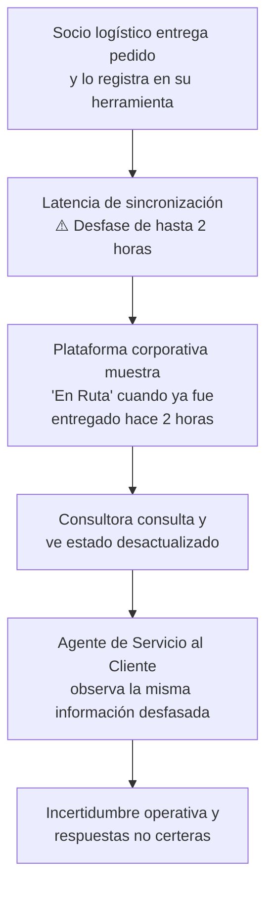
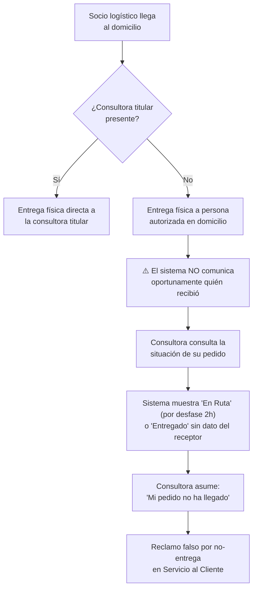

# Problemas y Desfases del Proceso AS-IS

> **Criterio de selección:** Solo se documentan los problemas que afectan **directamente** el proceso desde Despacho $\longrightarrow$ Transporte $\longrightarrow$ Entrega $\longrightarrow$ Actualización $\longrightarrow$ Consulta. Los problemas de inventario, producción y procesos internos de almacén quedan documentados como contexto en la información general de Yanbal.
>
> **Navegación:** [[01 - Proceso actual]] | [[02 - Actores relevantes]] | [[03 - Actividades y eventos]] | [[04 - Sistemas e información]] | [[06 - Evidencia y fuentes]]  
> **Requerimientos asociados:** [[01 - Matriz Consolidada de Requerimientos]] | [[04 - Trazabilidad y Registro de Depuración]]

---

## 1. Registro de Problemas Seleccionados en el Alcance

### Problema 1: Desfase de hasta 2 horas en la actualización del tracking (PR-03)

| Campo | Detalle |
|---|---|
| **Elemento** | Desfase de hasta 2 horas en la actualización del estado de entrega |
| **Por qué pertenece al AS-IS** | Es el **problema central** del proceso delimitado. Afecta directamente las etapas de Entrega $\longrightarrow$ Actualización $\longrightarrow$ Consulta. La entrega física ocurre en campo, pero el sistema no refleja el estado actualizado durante un lapso de hasta 2 horas, generando una "ventana ciega" de información que impacta a la consultora y a Servicio al Cliente. |
| **Fuente / Evidencia** | Entrevista min 23:19–24:18: *"Actualmente nuestro sistema de tracking nos arroja una trazabilidad o un estatus de seguimiento en promedio de dos horas [...] Si es que el pedido ya fue entregado, el sistema todavía se actualiza hasta en un lapso de dos horas. Entonces eso nos da un margen de desconocimiento"*. |
| **Parte del proceso donde interviene** | Entrega $\longrightarrow$ Actualización del estado $\longrightarrow$ Consulta/Trazabilidad. |
| **Requerimientos asociados** | [[02 - Especificación de Requerimientos Funcionales#RF-10\|RF-10]] (Sincronización de estados) y [[03 - Especificación de Requerimientos No Funcionales#RNF-01\|RNF-01]] (Latencia de propagación). |

**Cadena de Causalidad:**

- **Impacto documentado:** Incertidumbre operativa de hasta 2 horas por pedido, respuestas no concluyentes en Servicio al Cliente y pérdida de confiabilidad en el canal de seguimiento.
- **Meta declarada por el negocio (NEC-01):** Reducir el desfase a un máximo permisible de **30 minutos ($\le 30$ min)** o idealmente a tiempo real sincrónico (`min 23:29, min 1:07–1:16 p2`). Se mantiene como objetivo pendiente de validación técnica en [[03 - Especificación de Requerimientos No Funcionales#RNF-01|RNF-01]].

---

### Problema 2: Margen de desconocimiento de la situación del pedido (PR-04)

| Campo | Detalle |
|---|---|
| **Elemento** | Los agentes de Servicio al Cliente carecen de datos en tiempo real para absolver consultas |
| **Por qué pertenece al AS-IS** | Es la **consecuencia directa** del PR-03 en la etapa de consulta y atención. Cuando una consultora se comunica preguntando por su pedido, el operador en Salesforce visualiza la misma información desactualizada, sin poder confirmar si el paquete ya fue entregado en campo. |
| **Fuente / Evidencia** | Entrevista min 24:29–24:36: *"para poder responder ante algún reclamo o ante la consulta del mismo cliente final a través de nuestro servicio al cliente acerca del estatus de su pedido"*. |
| **Parte del proceso donde interviene** | Consulta / Trazabilidad. |
| **Requerimientos asociados** | [[02 - Especificación de Requerimientos Funcionales#RF-11\|RF-11]] (Consulta de trazabilidad) y [[02 - Especificación de Requerimientos Funcionales#RF-12\|RF-12]] (Visualización de receptor). |

**Descripción del impacto:**
1. **Respuestas inexactas:** El agente informa que el pedido sigue "En Ruta" cuando físicamente ya fue recibido.
2. **Pérdida de confianza:** La consultora percibe descontrol sobre la ubicación de su mercancía.
3. **Sobrecarga del canal de atención:** Llamadas reiteradas de seguimiento que se evitarían con información oportuna.

---

### Problema 3: Falta de visibilidad sobre el receptor real — persona autorizada (PR-05)

| Campo | Detalle |
|---|---|
| **Elemento** | Cuando una persona autorizada recibe el pedido, la consultora no dispone de esa información en el sistema |
| **Por qué pertenece al AS-IS** | Afecta directamente las etapas de **Entrega** y **Consulta**. En la venta directa de Yanbal, es habitual que la consultora no se encuentre en casa y una persona autorizada reciba el paquete. Como el sistema no comunica oportunamente quién recibió, la titular reporta que "no recibió su pedido" cuando el producto ya está en su domicilio. |
| **Fuente / Evidencia** | Entrevista min 24:45–25:01: *"No necesariamente el cliente final es el que recibe la entrega del pedido, sino puede ser alguna persona autorizada y el cliente final, al hacer la trazabilidad a través de nuestro sistema, no necesariamente tiene esa información. Entonces es ahí donde está nuestro reto"*. |
| **Parte del proceso donde interviene** | Entrega $\longrightarrow$ Consulta / Trazabilidad. |
| **Requerimientos asociados** | [[02 - Especificación de Requerimientos Funcionales#RF-07\|RF-07]] (Captura de receptor) y [[02 - Especificación de Requerimientos Funcionales#RF-12\|RF-12]] (Visualización en consulta). |

**Mecanismo del Problema:**

---

## 2. Problemas Excluidos del Alcance Detallado

| Problema Excluido | Área de Origen | Razón Metodológica de Exclusión |
|---|---|---|
| **PR-01: Desfase de 6h en merma operativa** | Almacén, Picking | Descuadre de inventario durante la preparación de pedidos. Ocurre **antes** de que el pedido llegue a despacho. |
| **PR-02: Riesgo de quiebre de stock y venta perdida** | Comercialización | Consecuencia de PR-01 en plataforma Maya/SAP Commerce. Etapa comercial previa. |
| **PR-06: Cuello de botella en peritaje de logística inversa** | Almacén Central | Evaluación interna física (Calidad + Seguridad Patrimonial) al interior del almacén sobre carga retornada. Fuera del flujo de distribución. |

---

## 3. Punto Exacto Donde Aparece el Desfase en el Proceso

| Etapa del Proceso AS-IS | Situación Operativa | Diagnóstico de Sincronía |
|---|---|---|
| **Despacho** | Registro de salida de despacho en centro de distribución | Sincrónico: el pedido pasa a estado *"Despachado"* en los sistemas locales |
| **Transporte (En Ruta)** | El transportista inicia traslado de la carga | Sincrónico: el estado se actualiza a *"En Ruta"* |
| **Entrega física en campo** | El transportista entrega el paquete o reporta incidencia | **PUNTO CRÍTICO DE RUPTURA:** El registro en campo tarda hasta **2 horas** en propagarse hacia los sistemas corporativos centrales |
| **Consulta y atención** | Consultora o agente verifican la situación del pedido | Consecuencia: se visualiza información desfasada durante la ventana de hasta 2 horas |
