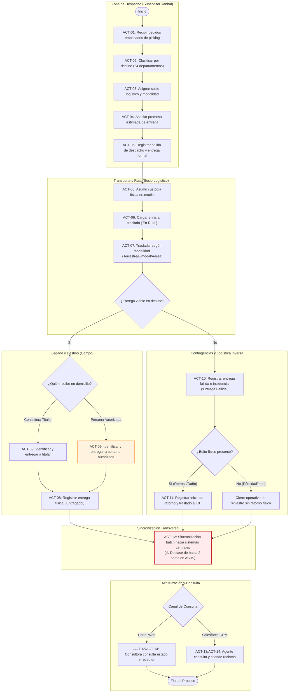
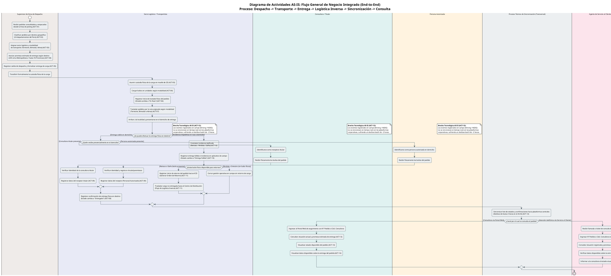
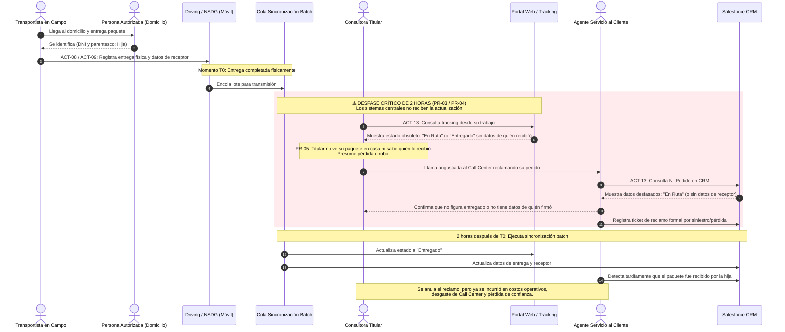
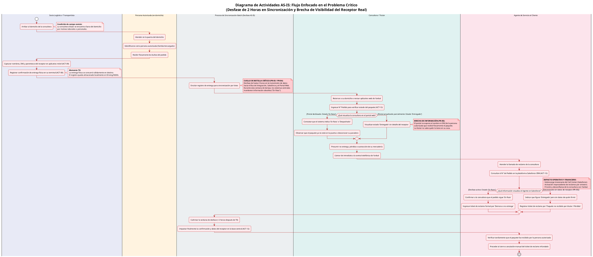

# Diagramas de Actividades del Negocio (AS-IS)

> **Proyecto:** Diseño e Implementación de Arquitectura Empresarial — Caso Yanbal Perú  
> **Área Operativa:** Cadena de Distribución y Transporte  
> **Alcance del Proceso:** Despacho $\longrightarrow$ Transporte/Ruta $\longrightarrow$ Llegada $\longrightarrow$ Entrega $\longrightarrow$ Logística Inversa $\longrightarrow$ Actualización $\longrightarrow$ Consulta  
> **Marco Metodológico:** RUP (*Rational Unified Process*) — Modelado de Comportamiento del Negocio / UML 2.5 / UTP APF1 (§ 3.3, ítem 3)  
>
> **Navegación del Módulo de Actividades:**  
> [[01 - Diagramas de Actividades del Negocio (AS-IS)]]  
> **Archivos PlantUML Fuentes:**  
> - [`01_Flujo_General_AS_IS_Integrado.puml`](file:///c:/Users/joses/Obsidian/arq-emp/arq-emp%20AS-IS/Diagrama%20de%20Actividades/01_Flujo_General_AS_IS_Integrado.puml)  
> - [`02_Flujo_AS_IS_Problema_Critico_Desfase_Receptor.puml`](file:///c:/Users/joses/Obsidian/arq-emp/arq-emp%20AS-IS/Diagrama%20de%20Actividades/02_Flujo_AS_IS_Problema_Critico_Desfase_Receptor.puml)  
> - [`CUN_01_Despachar.puml`](file:///c:/Users/joses/Obsidian/arq-emp/arq-emp%20AS-IS/Diagrama%20de%20Actividades/CUN_01_Despachar.puml) | [`CUN_02_Trasladar.puml`](file:///c:/Users/joses/Obsidian/arq-emp/arq-emp%20AS-IS/Diagrama%20de%20Actividades/CUN_02_Trasladar.puml) | [`CUN_03_Entregar.puml`](file:///c:/Users/joses/Obsidian/arq-emp/arq-emp%20AS-IS/Diagrama%20de%20Actividades/CUN_03_Entregar.puml) | [`CUN_04_Gestionar_Entrega_Fallida_Retorno.puml`](file:///c:/Users/joses/Obsidian/arq-emp/arq-emp%20AS-IS/Diagrama%20de%20Actividades/CUN_04_Gestionar_Entrega_Fallida_Retorno.puml) | [`CUN_05_Consultar_Trazabilidad.puml`](file:///c:/Users/joses/Obsidian/arq-emp/arq-emp%20AS-IS/Diagrama%20de%20Actividades/CUN_05_Consultar_Trazabilidad.puml)  
>
> **Enlaces a Módulos Relacionados:**  
> [[01 - Proceso actual]] | [[02 - Actores relevantes]] | [[03 - Actividades y eventos]] | [[05 - Problemas y desfases]]  
> [[01 - Matriz Consolidada de Requerimientos]] | [[01 - Diagrama General de Casos de Uso del Negocio (CUN)]] | [[02 - Tabla de Roles y Actividades del Negocio]] | [[01 - Diagrama de Clases de Dominio (Nivel Dominio)]]

---

## 1. Fundamentación y Propósito Metodológico

El presente documento formaliza los **Diagramas de Actividades del Negocio en su estado actual (AS-IS)**, dando cumplimiento riguroso y exhaustivo a las directrices estipuladas en la [Guía Oficial de Propuesta de Proyecto Final](file:///c:/Users/joses/Obsidian/arq-emp/arq-emp%20AS-IS/trascirto%20pdf/02%20-%20Gu%C3%ADa%20Oficial%20de%20Propuesta%20de%20Proyecto%20Final.md) (APF1, § 3.3, numeral 3), la cual exige taxativamente:
1. **Flujo general de los procesos de negocio actuales:** Representación integrada de extremo a extremo que articula la totalidad de las actividades operativas de la cadena.
2. **Flujo de los procesos de negocio actuales enfocados en el problema crítico a resolver:** Representación focalizada que modela la causa raíz de las ineficiencias del negocio (el desfase de actualización de hasta 2 horas y la falta de visibilidad del receptor real).

### Principios de Modelado bajo RUP y UML 2.5:
- **Carriles de Responsabilidad (*Swimlanes*):** Las acciones están distribuidas en particiones organizacionales que delimitan claramente las obligaciones de cada rol humano:
  - `Supervisor de Zona de Despacho` («Business Worker»): Control interno de egreso en el CD de Yanbal.
  - `Socio Logístico / Transportista` («Business Actor»): Contratista tercero responsable de la custodia física, traslado multimodal y entrega en campo.
  - `Consultora / Consultor` («Business Actor»): Cliente primario y destinataria titular.
  - `Persona Autorizada` («Business Actor»): Receptor presencial en destino ante la ausencia de la titular.
  - `Agente de Servicio al Cliente` («Business Worker»): Operador interno de soporte en la plataforma CRM Salesforce.
- **Tratamiento Metodológico de los Sistemas:** Siguiendo el estándar RUP de modelado de negocio, las plataformas técnicas (Driving, NSDG, Salesforce, Portal Web) no se configuran como actores del negocio, sino como herramientas de soporte de las actividades humanas o como actividades transversales de sincronización técnica de datos.

---

## 2. Diagrama de Flujo General de Procesos AS-IS (End-to-End)

El flujo general modela el ciclo de vida operativo completo: desde que un pedido empacado arriba a la Zona de Despacho hasta su entrega física (o retorno por siniestro) y su posterior consulta informativa.

### 2.1. Representación Gráfica Integrada (Mermaid)

### 2.2. Código Fuente PlantUML Oficial

> **Archivo descargable:** [`01_Flujo_General_AS_IS_Integrado.puml`](file:///c:/Users/joses/Obsidian/arq-emp/arq-emp%20AS-IS/Diagrama%20de%20Actividades/01_Flujo_General_AS_IS_Integrado.puml)

---

## 3. Diagrama Enfocado en el Problema Crítico (Desfase de 2h y Receptor)

Este diagrama modela de forma minuciosa la patología operacional que experimenta Yanbal en su operación actual: la interacción perversa entre la **latencia de sincronización batch de 2 horas (`PR-03` / `PR-04`)** y la **recepción por Persona Autorizada sin visibilidad en línea (`PR-05`)**.

### 3.1. Representación del Problema Crítico (Mermaid)

### 3.2. Código Fuente PlantUML del Problema Crítico

> **Archivo descargable:** [`02_Flujo_AS_IS_Problema_Critico_Desfase_Receptor.puml`](file:///c:/Users/joses/Obsidian/arq-emp/arq-emp%20AS-IS/Diagrama%20de%20Actividades/02_Flujo_AS_IS_Problema_Critico_Desfase_Receptor.puml)

---

## 4. Catálogo de Diagramas de Actividades por Caso de Uso del Negocio (CUN)

Complementando los diagramas integrados, el proyecto dispone de la descomposición modular por cada uno de los 5 Casos de Uso del Negocio definidos en el módulo [[01 - Diagrama General de Casos de Uso del Negocio (CUN)]]:

| Caso de Uso del Negocio | Título Operativo del CUN | Archivo Fuente `.puml` | Actividades AS-IS Comprendidas | Actores / Swimlanes Intervinientes |
| :--- | :--- | :--- | :---: | :--- |
| **`CUN-01`** | **Despachar Pedidos desde Centro de Distribución** | [`CUN_01_Despachar.puml`](file:///c:/Users/joses/Obsidian/arq-emp/arq-emp%20AS-IS/Diagrama%20de%20Actividades/CUN_01_Despachar.puml) | `ACT-01` a `ACT-05` | Supervisor de Zona de Despacho, Socio Logístico |
| **`CUN-02`** | **Trasladar Pedidos hacia Destino Nacional** | [`CUN_02_Trasladar.puml`](file:///c:/Users/joses/Obsidian/arq-emp/arq-emp%20AS-IS/Diagrama%20de%20Actividades/CUN_02_Trasladar.puml) | `ACT-06`, `ACT-07` | Socio Logístico / Transportista |
| **`CUN-03`** | **Entregar Pedido en Domicilio** | [`CUN_03_Entregar.puml`](file:///c:/Users/joses/Obsidian/arq-emp/arq-emp%20AS-IS/Diagrama%20de%20Actividades/CUN_03_Entregar.puml) | `ACT-08`, `ACT-09` | Socio Logístico, Consultora Titular, Persona Autorizada |
| **`CUN-04`** | **Gestionar Entrega Fallida y Retorno por Logística Inversa** | [`CUN_04_Gestionar_Entrega_Fallida_Retorno.puml`](file:///c:/Users/joses/Obsidian/arq-emp/arq-emp%20AS-IS/Diagrama%20de%20Actividades/CUN_04_Gestionar_Entrega_Fallida_Retorno.puml) | `ACT-10`, `ACT-11` | Socio Logístico / Transportista |
| **`CUN-05`** | **Consultar Trazabilidad y Situación del Pedido** | [`CUN_05_Consultar_Trazabilidad.puml`](file:///c:/Users/joses/Obsidian/arq-emp/arq-emp%20AS-IS/Diagrama%20de%20Actividades/CUN_05_Consultar_Trazabilidad.puml) | `ACT-13`, `ACT-14` | Consultora / Consultor, Agente de Servicio al Cliente |

---

## 5. Matriz de Trazabilidad Integral de Actividades

La siguiente matriz certifica la coherencia y consistencia bidireccional entre las actividades operativas (`ACT-01` a `ACT-14`), los roles ejecutores, los diagramas de comportamiento (CUN / Actividades), los requerimientos de solución (`RF` / `RNF`) y los problemas reales constatados en la entrevista (`PR-01` a `PR-05`):

| Código Actividad | Nombre Operativo de la Actividad | Rol Responsable (*Swimlane*) | CUN Vinculado | Requerimiento de Solución | Problema AS-IS Asociado | Evidencia en Entrevista (`trascrito.text`) |
| :---: | :--- | :--- | :---: | :---: | :---: | :--- |
| **`ACT-01`** | Recepción de pedidos empacados de picking | Supervisor de Zona de Despacho | `CUN-01` | — | — | min 14:43–17:41 |
| **`ACT-02`** | Clasificación geográfica por destino (24 deptos) | Supervisor de Zona de Despacho | `CUN-01` | `RF-01` | — | min 17:34–19:30 |
| **`ACT-03`** | Asignación de transportista y modalidad | Supervisor de Zona de Despacho | `CUN-01` | `RF-02` | — | min 17:34–19:30 |
| **`ACT-04`** | Asociación de promesa estimada de entrega | Supervisor de Zona de Despacho | `CUN-01` | `RF-04` | — | min 22:38–22:54 |
| **`ACT-05`** | Registro de salida de despacho y entrega física | Supervisor Despacho / Transportista | `CUN-01` | `RF-03` | — | min 19:15–19:30 |
| **`ACT-06`** | Carga e inicio de traslado ("En Ruta") | Socio Logístico / Transportista | `CUN-02` | `RF-05` | — | min 19:15–19:53 |
| **`ACT-07`** | Traslado físico por ruta nacional según modalidad | Socio Logístico / Transportista | `CUN-02` | — | — | min 22:38–22:54 |
| **`ACT-08`** | Registro de confirmación de entrega en destino | Socio Logístico / Transportista | `CUN-03` | `RF-06` | `PR-01`, `PR-03` | min 19:15–20:55 |
| **`ACT-09`** | Registro de identidad del receptor presencial | Socio Logístico / Transportista | `CUN-03` | `RF-07` | `PR-05` | min 24:45–25:01 |
| **`ACT-10`** | Registro de entrega fallida por incidencia tipificada | Socio Logístico / Transportista | `CUN-04` | `RF-08` | `PR-02` | min 20:03–20:55 |
| **`ACT-11`** | Registro de inicio de retorno (Logística Inversa) | Socio Logístico / Transportista | `CUN-04` | `RF-09` | `PR-02` | min 20:03–20:55 |
| **`ACT-12`** | Sincronización diferida de estados (Transversal) | Proceso Batch Transversal | — | `RF-10`, `RNF-01` | `PR-03`, `PR-04` | min 28:35–28:50 |
| **`ACT-13`** | Consulta de situación y promesa de entrega | Consultora / Agente Servicio Cliente | `CUN-05` | `RF-11` | `PR-03`, `PR-04` | min 22:03–22:28 |
| **`ACT-14`** | Visualización de datos de entrega y receptor | Consultora / Agente Servicio Cliente | `CUN-05` | `RF-12` | `PR-05` | min 24:45–25:01 |
