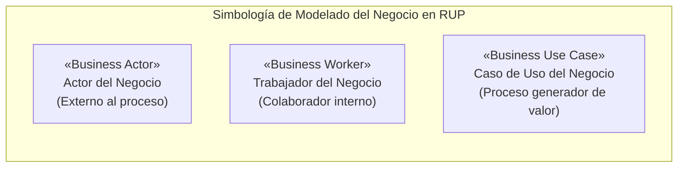
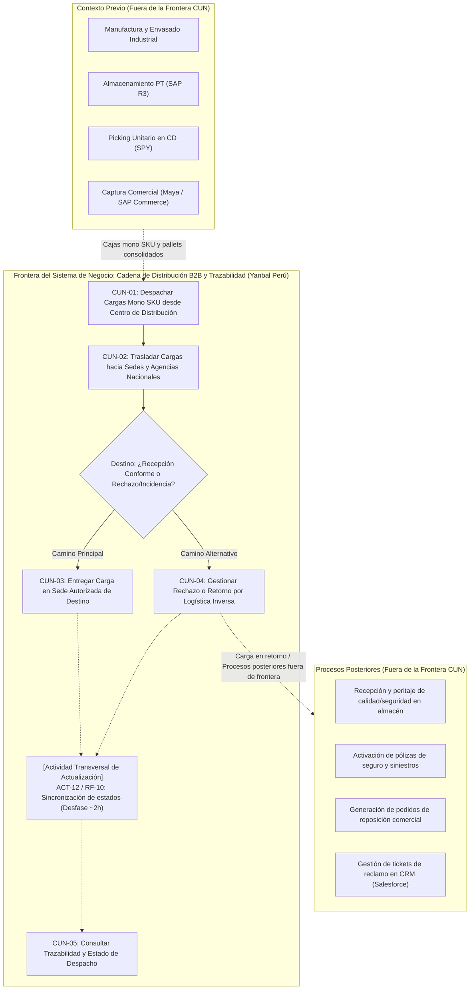
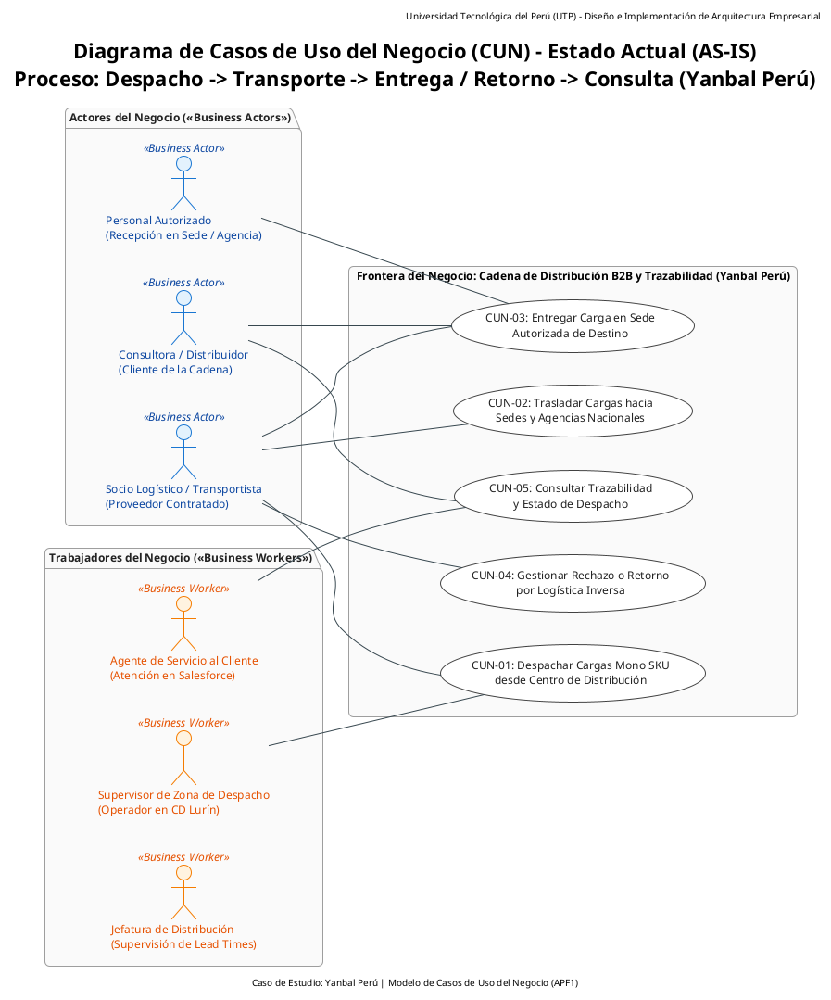

# Diagrama General de Casos de Uso del Negocio (CUN)

> **Proyecto:** Diseño e Implementación de Arquitectura Empresarial — Caso Yanbal Perú  
> **Área Operativa:** Cadena de Distribución y Transporte  
> **Alcance del Proceso:** Despacho $\longrightarrow$ Transporte/Ruta $\longrightarrow$ Llegada $\longrightarrow$ Entrega $\longrightarrow$ Actualización $\longrightarrow$ Consulta  
> **Marco Metodológico:** RUP (*Rational Unified Process*) — Disciplina de Modelado del Negocio / UML 2.5 / UTP APF1  
>
> **Navegación del Módulo CUN:**  
> [[01 - Diagrama General de Casos de Uso del Negocio (CUN)]] | [[02 - Tabla de Roles y Actividades del Negocio]] | [[03 - Especificación de Casos de Uso del Negocio]] | [[04 - Trazabilidad de Casos de Uso del Negocio]]  
> **Enlaces a la Base AS-IS:**  
> [[01 - Proceso actual]] | [[02 - Actores relevantes]] | [[03 - Actividades y eventos]] | [[04 - Sistemas e información]] | [[05 - Problemas y desfases]] | [[06 - Evidencia y fuentes]]  
> **Enlaces a Requerimientos:**  
> [[01 - Matriz Consolidada de Requerimientos]] | [[02 - Especificación de Requerimientos Funcionales]] | [[03 - Especificación de Requerimientos No Funcionales]] | [[04 - Trazabilidad y Registro de Depuración]]

---

## 1. Marco Conceptual del Modelado del Negocio (RUP / UML)

En la disciplina de **Modelado del Negocio** (*Business Modeling*) del marco RUP (*Rational Unified Process*), un **Caso de Uso del Negocio (CUN)** (*Business Use Case*) representa un proceso central que ejecuta la organización para proporcionar un resultado de valor observable y directo a un actor que interactúa con ella.

A diferencia de los casos de uso de sistemas (CUS), los CUN modelan la **operación del negocio en su estado actual (AS-IS)**, delimitando las responsabilidades de los roles humanos y organizacionales sin incorporar como actores del negocio a componentes técnicos ni sistemas de software.

### Clasificación de Actores del Negocio
1. **Actores del Negocio (*Business Actors*):** Entidades externas que interactúan con el negocio, demandando o ejecutando servicios:
   - **Consultora / Consultor de Yanbal:** Cliente primario que recibe el pedido en su domicilio y realiza el seguimiento de su entrega.
   - **Persona Autorizada:** Receptor presencial en el domicilio cuando la consultora titular se encuentra ausente.
   - **Socio Logístico / Transportista:** Proveedor externo asociado (contratista) que asume la custodia física, traslada la mercancía, ejecuta la entrega en destino y gestiona las contingencias de retorno.
2. **Trabajadores del Negocio (*Business Workers*):** Roles internos de Yanbal que ejecutan tareas dentro del proceso:
   - **Supervisor de Despacho:** Operador interno responsable de clasificar los pedidos por destino geográfico, asociar transportista/modalidad y formalizar el egreso de carga en muelle.
   - **Agente de Servicio al Cliente:** Operador interno que consulta la situación del pedido en el CRM (Salesforce) para atender a las consultoras.
   - **Jefatura de Distribución:** Responsable de la supervisión de lead times, acuerdos de nivel de servicio y gobierno de la red logística.

> [!IMPORTANT]
> **Tratamiento Metodológico de la Sincronización:**  
> La sincronización de estados entre las herramientas de transporte y las plataformas corporativas (asociada a `ACT-12` y `RF-10`) **no constituye un Caso de Uso del Negocio independiente ni un actor del negocio**, sino una **actividad técnica transversal de actualización** del proceso AS-IS que opera de forma automatizada en segundo plano.

---

## 2. Delimitación de Frontera del Negocio (Alcance AS-IS)

- **Punto de Inicio:** Recepción física de las cajas mono SKU consolidadas en la Zona de Despacho del Centro de Distribución Lurín.
- **Bifurcación Operativa en Destino:** Desde el traslado en ruta (`CUN-02`), el flujo contempla dos caminos alternativos directos:
  1. *Camino Principal:* Entrega conforme en sede o agencia autorizada (`CUN-03`).
  2. *Camino Alternativo:* Incidencia confirmada (retraso, pérdida o daño) o rechazo, y registro del inicio de retorno por logística inversa (`CUN-04`).
- **Punto de Cierre:** Entrega efectiva y consignada en la sede o agencia autorizada (`CUN-03`) o registro del inicio de retorno de la carga no entregada (en retraso o daño con bulto físico) / registro de incidencia por pérdida (`CUN-04`).

---

## 3. Catálogo de los 5 Casos de Uso del Negocio (CUN)

El módulo se estructura en **exactamente 5 Casos de Uso del Negocio**, correspondientes con los Requerimientos Funcionales de la [[01 - Matriz Consolidada de Requerimientos]]:

| Código | Nombre del Caso de Uso del Negocio | Actor(es) Principal(es) | Requerimientos Trazados | Actividades AS-IS Cubiertas |
|:---:|:---|:---|:---:|:---:|
| **CUN-01** | **Despachar Cargas Mono SKU desde Centro de Distribución** | Supervisor de Zona de Despacho *(Worker)* Socio Logístico *(Actor)* | **RF-01, RF-02, RF-03, RF-04** | `ACT-01`, `ACT-02`, `ACT-03`, `ACT-04`, `ACT-05` |
| **CUN-02** | **Trasladar Cargas hacia Sedes y Agencias Nacionales** | Socio Logístico *(Actor)* | **RF-05** | `ACT-06`, `ACT-07` |
| **CUN-03** | **Entregar Carga en Sede Autorizada de Destino** | Socio Logístico *(Actor)* Consultora / Distribuidor *(Actor)* Personal Autorizado (en Sede) *(Actor)* | **RF-06, RF-07** | `ACT-08`, `ACT-09` |
| **CUN-04** | **Gestionar Rechazo o Retorno por Logística Inversa** | Socio Logístico *(Actor)* | **RF-08, RF-09** | `ACT-10`, `ACT-11` |
| **CUN-05** | **Consultar Trazabilidad y Estado de Despacho** | Consultora / Distribuidor *(Actor)* Agente de Servicio al Cliente *(Worker)* | **RF-11, RF-12** | `ACT-13`, `ACT-14` |

*(Nota de trazabilidad: `RF-10` corresponde a la actividad transversal de actualización `ACT-12`, que alimenta los datos consultados en `CUN-05`).*

---

## 4. Diagramas de Casos de Uso del Negocio (CUN)

### 4.1. Diagrama General en Mermaid

```mermaid
flowchart TD
    %% Actores del Negocio (Externos)
    subgraph ACTORES_EXTERNOS ["«Business Actors» (Actores del Negocio)"]
        direction TB
        CONS["👤 Consultora / Distribuidor<br/>«Business Actor»"]
        FAM["👤 Personal Autorizado (en Sede)<br/>«Business Actor»"]
        SOCIO["🚚 Socio Logístico / Transportista<br/>«Business Actor»"]
    end

    %% Trabajadores del Negocio (Internos)
    subgraph TRABAJADORES_INTERNOS ["«Business Workers» (Trabajadores del Negocio)"]
        direction TB
        SUP["👔 Supervisor de Zona de Despacho<br/>«Business Worker»"]
        AG["🎧 Agente de Servicio al Cliente<br/>«Business Worker»"]
        JEF["📋 Jefatura de Distribución<br/>«Business Worker»"]
    end

    %% Frontera de Casos de Uso del Negocio
    subgraph FRONTERA_NEGOCIO ["Sistema de Negocio: Cadena de Distribución B2B y Trazabilidad (Yanbal Perú)"]
        direction TB

        CUN01(["«Business Use Case»<br/><b>CUN-01</b><br/>Despachar Cargas Mono SKU desde<br/>Centro de Distribución"])
        CUN02(["«Business Use Case»<br/><b>CUN-02</b><br/>Trasladar Cargas hacia<br/>Sedes y Agencias Nacionales"])
        CUN03(["«Business Use Case»<br/><b>CUN-03</b><br/>Entregar Carga en<br/>Sede Autorizada de Destino"])
        CUN04(["«Business Use Case»<br/><b>CUN-04</b><br/>Gestionar Rechazo o Retorno<br/>por Logística Inversa"])
        CUN05(["«Business Use Case»<br/><b>CUN-05</b><br/>Consultar Trazabilidad y<br/>Estado de Despacho"])
    end

    %% Asociaciones CUN-01
    SUP --- CUN01
    SOCIO --- CUN01

    %% Asociaciones CUN-02
    SOCIO --- CUN02

    %% Asociaciones CUN-03 (Camino Principal de Entrega)
    SOCIO --- CUN03
    CONS --- CUN03
    FAM --- CUN03

    %% Asociaciones CUN-04 (Camino Alternativo de Contingencia)
    SOCIO --- CUN04

    %% Asociaciones CUN-05 (Consulta de Seguimiento)
    CONS --- CUN05
    AG --- CUN05
```

---

### 4.2. Diagrama General en PlantUML (Estándar Formal UML / RUP)

> **Archivos fuente `.puml` disponibles en la carpeta:**  
> - 📄 Diagrama Maestro: [`CUN_Diagrama_General.puml`](file:///c:/Users/joses/Obsidian/arq-emp%20AS-IS/Diagrama%20de%20Casos%20de%20Uso%20del%20Negocio%20(CUN)/CUN_Diagrama_General.puml)  
> - 📄 Vista Despacho y Transporte: [`CUN_Paquete_Despacho_Transporte.puml`](file:///c:/Users/joses/Obsidian/arq-emp%20AS-IS/Diagrama%20de%20Casos%20de%20Uso%20del%20Negocio%20(CUN)/CUN_Paquete_Despacho_Transporte.puml)  
> - 📄 Vista Entrega y Logística Inversa: [`CUN_Paquete_Entrega_LogisticaInversa.puml`](file:///c:/Users/joses/Obsidian/arq-emp%20AS-IS/Diagrama%20de%20Casos%20de%20Uso%20del%20Negocio%20(CUN)/CUN_Paquete_Entrega_LogisticaInversa.puml)  
> - 📄 Vista Consulta de Trazabilidad: [`CUN_Paquete_Consulta.puml`](file:///c:/Users/joses/Obsidian/arq-emp%20AS-IS/Diagrama%20de%20Casos%20de%20Uso%20del%20Negocio%20(CUN)/CUN_Paquete_Consulta.puml)

---

## 5. Justificación Metodológica de las Correcciones

1. **Eliminación de la sincronización como CUN:**  
   La sincronización de bases de datos (`ACT-12` / `RF-10`) es una tarea técnica automatizada de integración, no un proceso donde un actor humano del negocio reciba un servicio directo. Se mantiene en la matriz como requerimiento funcional del sistema, pero se excluye de la capa de casos de uso del negocio, modelándose como actividad técnica transversal de actualización.
2. **Eliminación de la relación `<<extend>>` entre CUN-03 y CUN-04:**  
   La entrega física en domicilio (`CUN-03`) y la contingencia por logística inversa (`CUN-04`) representan **dos caminos alternativos directos** del ciclo de transporte desde el estado *"En Ruta"*. Si la entrega se concreta, se ejecuta `CUN-03`; si ocurre una incidencia tipificada (retraso, pérdida o daño), se ejecuta directamente `CUN-04`.
3. **Actor único en CUN-04:**  
   En estricta consonancia con `ACT-10`, `ACT-11`, `RF-08` y `RF-09`, el responsable de tipificar la entrega fallida y ejecutar el retorno material hacia el Centro de Distribución es exclusivamente el **Socio Logístico / Transportista**.
4. **Diferenciación de escenarios en CUN-04 (Retorno físico vs. Pérdida):**  
   Se subsana la contradicción de postcondición: el inicio formal de retorno (`ACT-11` / `RF-09`) rige únicamente cuando existe bulto físico presente (retraso o daño). En contingencias de pérdida de mercancía, se registra formalmente la entrega fallida por pérdida (`ACT-10` / `RF-08`) sin afirmar ni exigir un retorno físico inexistente.
