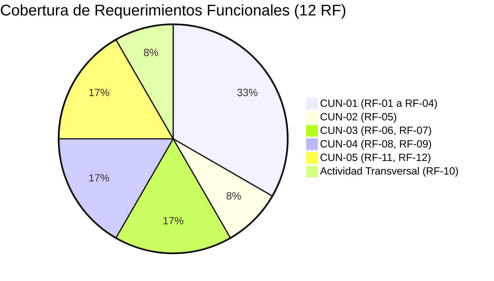

# Trazabilidad de Casos de Uso del Negocio

> **Proyecto:** Diseño e Implementación de Arquitectura Empresarial — Caso Yanbal Perú  
> **Área Operativa:** Cadena de Distribución y Transporte  
> **Alcance del Proceso:** Despacho $\longrightarrow$ Transporte/Ruta $\longrightarrow$ Llegada $\longrightarrow$ Entrega $\longrightarrow$ Actualización $\longrightarrow$ Consulta  
> **Marco Metodológico:** RUP (*Rational Unified Process*) / UML 2.5 / UTP APF1  
>
> **Navegación del Módulo CUN:**  
> [[01 - Diagrama General de Casos de Uso del Negocio (CUN)]] | [[02 - Tabla de Roles y Actividades del Negocio]] | [[03 - Especificación de Casos de Uso del Negocio]] | [[04 - Trazabilidad de Casos de Uso del Negocio]]  
> **Enlaces a la Base AS-IS:**  
> [[01 - Proceso actual]] | [[02 - Actores relevantes]] | [[03 - Actividades y eventos]] | [[04 - Sistemas e información]] | [[05 - Problemas y desfases]] | [[06 - Evidencia y fuentes]]  
> **Enlaces a Requerimientos:**  
> [[01 - Matriz Consolidada de Requerimientos]] | [[02 - Especificación de Requerimientos Funcionales]] | [[03 - Especificación de Requerimientos No Funcionales]] | [[04 - Trazabilidad y Registro de Depuración]]

---

## 1. Propósito de la Trazabilidad

Este documento constituye el **instrumento de auditoría y coherencia metodológica** del módulo de Casos de Uso del Negocio. Su objetivo es:
1. Demostrar la **cobertura total y sin vacíos** de las actividades operativas del proceso AS-IS (`ACT-01` a `ACT-14`) dentro de los **5 Casos de Uso del Negocio (`CUN-01` a `CUN-05`)** y la actividad transversal de sincronización.
2. Vincular de forma bidireccional los CUN con los 12 Requerimientos Funcionales (`RF-01` a `RF-12`) y los 7 Requerimientos No Funcionales (`RNF-01` a `RNF-07`) de la [[01 - Matriz Consolidada de Requerimientos]].
3. Fundamentar la posición metodológica de **`RF-10` como actividad técnica transversal de actualización**, garantizando que ningún CUN contenga premisas técnicas de software ni información descartada.

---

## 2. Matriz de Trazabilidad Bidireccional Consolidada (CUN $\longleftrightarrow$ Requerimientos $\longleftrightarrow$ AS-IS)

| Código CUN | Nombre del Caso de Uso del Negocio | Actor(es) Responsable(s) | Requerimientos Funcionales Trazados | Actividades AS-IS Cubiertas | Requerimientos No Funcionales | Evidencia Primaria (`trascrito.text`) |
|:---:|:---|:---|:---:|:---:|:---:|:---|
| **CUN-01** | **Despachar Pedidos desde Centro de Distribución** | Supervisor de Zona de Despacho *(Worker)* Socio Logístico *(Actor)* | **RF-01, RF-02, RF-03, RF-04** | [[03 - Actividades y eventos#ACT-01\|ACT-01]], [[03 - Actividades y eventos#ACT-02\|ACT-02]], [[03 - Actividades y eventos#ACT-03\|ACT-03]], [[03 - Actividades y eventos#ACT-04\|ACT-04]], [[03 - Actividades y eventos#ACT-05\|ACT-05]] | [[03 - Especificación de Requerimientos No Funcionales#RNF-02\|RNF-02]], [[03 - Especificación de Requerimientos No Funcionales#RNF-05\|RNF-05]], [[03 - Especificación de Requerimientos No Funcionales#RNF-07\|RNF-07]] | Líneas 14, 16-18, 21-22 (min 17:34–19:44, 22:38) |
| **CUN-02** | **Trasladar Pedidos hacia Destino Nacional** | Socio Logístico *(Actor)* | **RF-05** | [[03 - Actividades y eventos#ACT-06\|ACT-06]], [[03 - Actividades y eventos#ACT-07\|ACT-07]] | [[03 - Especificación de Requerimientos No Funcionales#RNF-02\|RNF-02]], [[03 - Especificación de Requerimientos No Funcionales#RNF-03\|RNF-03]], [[03 - Especificación de Requerimientos No Funcionales#RNF-07\|RNF-07]] | Líneas 17-18 (min 19:15–19:53) |
| **CUN-03** | **Entregar Pedido en Domicilio** | Socio Logístico *(Actor)* Consultora *(Actor)* Familiar Autorizado *(Actor)* | **RF-06, RF-07** | [[03 - Actividades y eventos#ACT-08\|ACT-08]], [[03 - Actividades y eventos#ACT-09\|ACT-09]] | [[03 - Especificación de Requerimientos No Funcionales#RNF-06\|RNF-06]], [[03 - Especificación de Requerimientos No Funcionales#RNF-07\|RNF-07]] | Líneas 18, 25 (min 19:53, 24:45–25:01) |
| **CUN-04** | **Gestionar Entrega Fallida y Retorno por Logística Inversa** | Socio Logístico *(Actor)* | **RF-08, RF-09** | [[03 - Actividades y eventos#ACT-10\|ACT-10]], [[03 - Actividades y eventos#ACT-11\|ACT-11]] | [[03 - Especificación de Requerimientos No Funcionales#RNF-05\|RNF-05]], [[03 - Especificación de Requerimientos No Funcionales#RNF-07\|RNF-07]] | Líneas 19-20 (min 20:03–20:55) |
| **CUN-05** | **Consultar Trazabilidad y Situación del Pedido** | Consultora *(Actor)* Agente de Servicio al Cliente *(Worker)* | **RF-11, RF-12** | [[03 - Actividades y eventos#ACT-13\|ACT-13]], [[03 - Actividades y eventos#ACT-14\|ACT-14]] | [[03 - Especificación de Requerimientos No Funcionales#RNF-03\|RNF-03]], [[03 - Especificación de Requerimientos No Funcionales#RNF-05\|RNF-05]] | Líneas 21-22, 24-25 (min 22:03–22:47, 24:29) |

---

## 3. Tratamiento de la Actividad Transversal de Sincronización (`ACT-12` / `RF-10`)

> [!IMPORTANT]
> **Fundamento de la Exclusión de Sincronización como CUN Independiente:**  
> - En la [[01 - Matriz Consolidada de Requerimientos]], **`RF-10`** (*Sincronización y disponibilidad de estados de distribución*) se mantiene como un requerimiento funcional obligatorio del sistema.  
> - Sin embargo, en el **Modelado del Negocio (RUP)**, un Caso de Uso del Negocio debe representar una interacción directa con un actor que recibe valor de negocio. La sincronización de bases de datos entre las herramientas de transporte (NSDG/Driving) y las plataformas corporativas centrales (Salesforce/Portales) a través del Bus Corporativo es una **tarea técnica automatizada que opera en segundo plano** (`ACT-12`).  
> - Por tanto, `ACT-12` / `RF-10` actúa como la **actividad transversal de actualización del AS-IS** que procesa los eventos originados en `CUN-01`, `CUN-02`, `CUN-03` y `CUN-04`, disponibilizando la información que posteriormente es leída en `CUN-05` (con el desfase diagnosticado de hasta 2 horas, problema **PR-03**).

---

## 4. Matriz de Cobertura de Actividades Operativas AS-IS

| Actividad AS-IS | Nombre de la Actividad | Instancia del Proceso que la Cubre | Estado de Cobertura |
|:---:|:---|:---:|:---:|
| **ACT-01** | Recibir pedidos empacados desde la línea de picking | `CUN-01` | ✅ Cubierta (Paso 1 Flujo Básico) |
| **ACT-02** | Clasificar pedidos por destino geográfico (24 departamentos) | `CUN-01` | ✅ Cubierta (Paso 2 Flujo Básico) |
| **ACT-03** | Asignar socio logístico y modalidad (terrestre, bimodal, aérea) | `CUN-01` | ✅ Cubierta (Paso 3 Flujo Básico) |
| **ACT-04** | Asociar promesa estimada de entrega (24h Lima / 7d provincias) | `CUN-01` | ✅ Cubierta (Paso 4 Flujo Básico) |
| **ACT-05** | Registrar salida de despacho y entrega formal de carga | `CUN-01` | ✅ Cubierta (Paso 5 Flujo Básico) |
| **ACT-06** | Registrar inicio de traslado físico del pedido | `CUN-02` | ✅ Cubierta (Paso 1-2 Flujo Básico) |
| **ACT-07** | Trasladar pedidos por la ruta asignada según modalidad | `CUN-02` | ✅ Cubierta (Paso 4 Flujo Básico) |
| **ACT-08** | Registrar confirmación de entrega física en destino | `CUN-03` | ✅ Cubierta (Paso 4-5 Flujo Básico) |
| **ACT-09** | Registrar datos de la persona que recibe el paquete | `CUN-03` | ✅ Cubierta (Paso 4 Flujo Básico / Alt. 2.a) |
| **ACT-10** | Registrar entrega fallida por incidencia (retraso, pérdida, daño) | `CUN-04` | ✅ Cubierta (Paso 2-3 Flujo Básico) |
| **ACT-11** | Registrar inicio de retorno del pedido hacia el CD | `CUN-04` | ✅ Cubierta (Paso 5-6 Flujo Básico) |
| **ACT-12** | Sincronizar y disponibilizar estados registrados en campo | *Actividad Transversal (RF-10)* | ✅ Cubierta (Actualización en background hacia CUN-05) |
| **ACT-13** | Consultar situación y promesa por N° Pedido o Cód. Consultora | `CUN-05` | ✅ Cubierta (Paso 1-2 Flujo Básico) |
| **ACT-14** | Visualizar datos del receptor real en canales de atención | `CUN-05` | ✅ Cubierta (Paso 4 Flujo Básico / Necesidad RF-12) |

---

## 5. Matriz de Cobertura de Requerimientos Funcionales y No Funcionales

| Requisito | Denominación Oficial en la Matriz | Mapeo en el Modelo CUN | Rol del Requisito en el Proceso |
|:---:|:---|:---:|:---|
| **RF-01** | Clasificación geográfica de pedidos para despacho | `CUN-01` | Clasificación y canalización por 24 departamentos, provincias y distritos. |
| **RF-02** | Gestión de datos de socio logístico y modalidad | `CUN-01` | Vinculación del transportista y modo de envío (terrestre, bimodal, aérea). |
| **RF-03** | Registro de salida de despacho del CD | `CUN-01` | Egreso formal de muelle y cambio al estado *"Despachado"*. |
| **RF-04** | Gestión y visualización de la promesa de entrega | `CUN-01` | Asociación y despliegue del lead time (24h Lima / 7d provincias). |
| **RF-05** | Registro de inicio de traslado (Estado 'En Ruta') | `CUN-02` | Inicio de recorrido físico y cambio formal al estado *"En Ruta"*. |
| **RF-06** | Registro de entrega exitosa (Estado 'Entregado') | `CUN-03` | Confirmación de entrega en destino con estampa temporal. |
| **RF-07** | Registro de la identidad del receptor real | `CUN-03` | Captura de la condición de quien recibe (titular o familiar autorizado). |
| **RF-08** | Registro de entrega fallida e incidencias | `CUN-04` | Tipificación exclusiva de contingencias: retraso, pérdida o daño. |
| **RF-09** | Registro de retorno de carga por logística inversa | `CUN-04` | Registro del inicio de retorno del pedido hacia el Centro de Distribución. |
| **RF-10** | Sincronización y disponibilidad de estados | *Actividad Transversal* | Propagación automática de estados hacia plataformas centrales (`ACT-12`). |
| **RF-11** | Consulta de trazabilidad con soporte multicriterio | `CUN-05` | Búsqueda por Número de Pedido o Código de Consultora/Cliente. |
| **RF-12** | Visualización de datos del receptor en consulta | `CUN-05` | Necesidad derivada de visibilizar oportunamente el receptor real (familiar) para mitigar reclamos prematuros (PR-04/PR-05). |
| **RNF-01** | Tiempo de propagación de estados de entrega | Transversal a `ACT-12` | Reducción de latencia de 2h a meta $\le 30$ min. |
| **RNF-02** | Soporte territorial nacional y operación multimodal | `CUN-01`, `CUN-02` | Cobertura en los 24 departamentos bajo 3 modalidades. |
| **RNF-03** | Capacidad para grandes volúmenes de datos | `CUN-02`, `CUN-05` | Escalabilidad ante alta carga de transacciones y consultas concurrentes. |
| **RNF-04** | Interoperabilidad mediante Bus corporativo | Transversal a `ACT-12` | Integración estandarizada a través del Bus Corporativo de Yanbal. |
| **RNF-05** | Restricción de acceso según nivel de rol | Transversal a todos | Segregación entre roles operativos y roles de gestión. |
| **RNF-06** | Validación formal de seguridad informática | `CUN-03`, `CUN-05` | Validación de integridad por Seguridad Informática corporativa. |
| **RNF-07** | Facilidad de uso y adaptación a la operación | `CUN-01`, `CUN-02`, `CUN-03`, `CUN-04` | Adaptación ergonómica al flujo real de trabajo en despacho y campo. |

---

## 6. Certificación de No Dependencia de Conceptos Descartados

Se audita y certifica que los 5 Casos de Uso del Negocio presentan **cero dependencia respecto a los elementos excluidos**:

| Concepto Previamente Descartado | CUNs Auditados | Dictamen de Auditoría | Evidencia en la Especificación |
|:---|:---:|:---:|:---|
| **"Manifiesto de carga"** | `CUN-01` | ✅ **Ausente** | El egreso se formaliza digitalmente en Driving/NSDG (Paso 5 Flujo Básico de CUN-01). |
| **"Pesaje de comprobación en balanza"** | `CUN-01` | ✅ **Ausente** | Se utiliza la volumetría teórica generada previamente en picking (Regla RN-03). |
| **"Hitos o checkpoints intermedios en ruta"** | `CUN-02` | ✅ **Ausente** | El pedido se mantiene en estado macro "En Ruta" sin garitas ni paradas GPS (Regla RN-05). |
| **"Ausencia de receptor" y "Dirección errónea"** | `CUN-04` | ✅ **Ausente** | Causales restringidas estrictamente a **retraso, pérdida o daño** (Regla RN-08). |
| **"Obligatoriedad de DNI y bloqueo de sistema"** | `CUN-03` | ✅ **Ausente** | Se captura la condición de quien recibe (titular o familiar) sin campos rígidos no sustentados. |
| **"Peritaje de almacén, seguros y reposición"** | `CUN-04` | ✅ **Ausente** | El caso de uso concluye con el registro del inicio de retorno de la carga (Regla RN-09); almacén queda fuera. |
| **"Gestión de tickets de reclamo en CRM"** | `CUN-05` | ✅ **Ausente** | CUN-05 se delimita a la consulta de información; la apertura de tickets pertenece a postventa. |
| **"Campañas comerciales y cierres de catálogo"** | `CUN-05` | ✅ **Ausente** | Sustentado en volumen cualitativo de datos sin asociar eventos comerciales no sustentados. |
| **"Prohibición de enlaces punto a punto"** | Transversal | ✅ **Ausente** | El Bus corporativo se mantiene como restricción existente sin adjetivos prohibitivos. |
| **"Supuestos de movilidad en calle, clics o segundos"** | `CUN-03` | ✅ **Ausente** | Ergonomía adaptada a la dinámica operativa real sin métricas cronometradas arbitrarias. |
