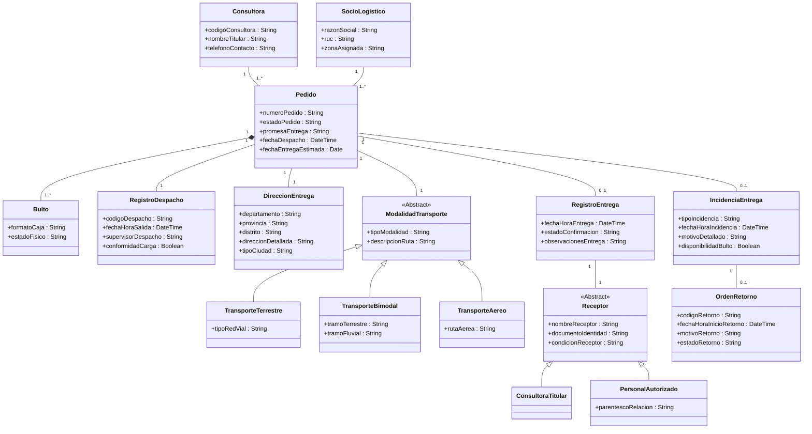
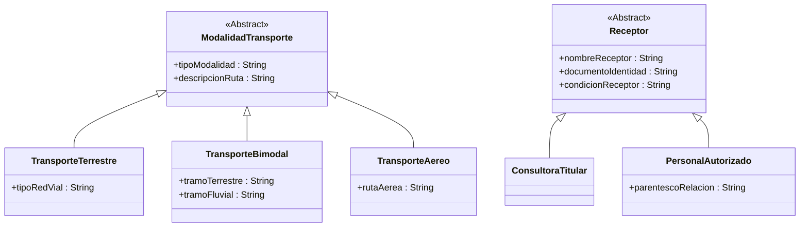
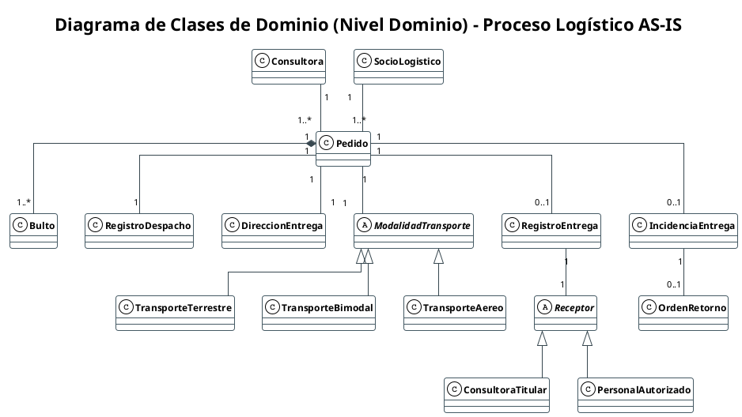

# 2.6. Diagrama de Clases (Nivel Dominio AS-IS)

> **Proyecto:** Diseño e Implementación de Arquitectura Empresarial — Caso Yanbal Perú  
> **Área Operativa:** Cadena de Distribución y Transporte  
> **Alcance del Proceso:** Despacho $\longrightarrow$ Transporte/Ruta $\longrightarrow$ Llegada $\longrightarrow$ Entrega $\longrightarrow$ Actualización $\longrightarrow$ Consulta  
> **Marco Metodológico:** RUP (*Rational Unified Process*) — Disciplina de Modelado del Negocio / UML 2.5 / UTP APF1 (§ 3.3, ítem 4)  
>
> **Navegación del Módulo de Dominio:**  
> [[01 - Diagrama de Clases de Dominio (Nivel Dominio)]] | [[02 - Diccionario de Datos del Modelo de Dominio]] | [[03 - Matriz del Modelo de Dominio]]  
> **Enlaces a la Base AS-IS:**  
> [[01 - Proceso actual]] | [[02 - Actores relevantes]] | [[03 - Actividades y eventos]] | [[04 - Sistemas e información]] | [[05 - Problemas y desfases]] | [[06 - Evidencia y fuentes]]  
> **Enlaces a Requerimientos y CUN:**  
> [[01 - Matriz Consolidada de Requerimientos]] | [[01 - Diagrama General de Casos de Uso del Negocio (CUN)]] | [[02 - Tabla de Roles y Actividades del Negocio]]

---

## Introducción y Propósito Metodológico

El **Diagrama de Clases de Dominio** (*Domain Model*) describe la estructura conceptual y el vocabulario estático fundamental del negocio en su estado actual (**AS-IS**). En estricta concordancia con la disciplina de Modelado del Negocio de RUP y la Guía Oficial de Proyecto Final (UTP APF1, § 3.3, ítem 4):

1. **Perspectiva Conceptual del Negocio:** Modela conceptos, documentos, personas, roles físicos y eventos del mundo real de la distribución física de Yanbal Perú. **No representa tablas de bases de datos, claves primarias/foráneas de software ni clases de diseño o programación**.
2. **Sin Detalles de Implementación Técnica:** Se omiten operaciones o métodos computacionales (como `guardar()`, `calcular()`, `consultar()`), concentrándose exclusivamente en las entidades esenciales, sus atributos descriptivos de negocio, sus multiplicidades y sus relaciones estructurales.
3. **Consistencia Absoluta con los CUN:** Deriva directamente de los 5 Casos de Uso del Negocio aprobados (`CUN-01` a `CUN-05`) y de las actividades operativas (`ACT-01` a `ACT-14`), garantizando plena trazabilidad semántica sin incorporar entidades inventadas ni funcionalidades futuras.

---

## 2.6.1. Identificación de Conceptos (Extracción de Sustantivos)

Para identificar las clases conceptuales candidatas del dominio sin incurrir en subjetividades, se aplicó la **técnica formal de extracción de sustantivos** (análisis gramatical de Larman / RUP) sobre la transcripción de la entrevista al Ing. Joao Condorpusa y las narrativas de proceso de Yanbal Perú.

A continuación se presenta la matriz de depuración lingüística, clasificando cada término extraído como **Clase de Dominio**, **Atributo**, **Rol / Actor** o **Elemento Fuera de Alcance**:

| Sustantivo Extraído del Texto | Ocurrencia / Contexto en la Operación AS-IS | Categoría Metodológica | Justificación de la Decisión de Modelado |
|:---|:---|:---:|:---|
| **Pedido** | *"llega el pedido consolidado a la zona de despacho..."* | **Clase de Dominio** | Concepto central del negocio; posee identidad, estado, ciclo de vida y múltiples relaciones. |
| **Número de Pedido** | *"la llave de consulta es el número de pedido..."* | **Atributo** | Identificador maestro simple; se modela como atributo identificador de `Pedido`. |
| **Estado del Pedido** | *"cambia a despachado, en ruta, entregado..."* | **Atributo** | Propiedad descriptiva que representa la situación del ciclo de vida de `Pedido`. |
| **Promesa de Entrega** | *"promesa de 24 horas en Lima y hasta 7 días en provincias..."* | **Atributo** | Plazo comprometido de servicio; atributo normativo asociado a `Pedido`. |
| **Bulto / Caja de Despacho** | *"se empaca en uno de los 8 formatos de cajas..."* | **Clase de Dominio** | Unidad física material empaquetada. Un pedido puede contener uno o más bultos. |
| **Formato de Caja** | *"formatos del 1 al 8 según peso y volumetría..."* | **Atributo** | Propiedad dimensional estandarizada de empaque de cada `Bulto`. |
| **Registro de Despacho** | *"se formaliza la salida en muelle y entrega de custodia..."* | **Clase de Dominio** | Constancia formal transaccional de egreso físico y transferencia de responsabilidad en CD. |
| **Muelle de Despacho** | *"zona de muelle del Centro de Distribución..."* | *Contexto Físico* | Ubicación física donde opera el supervisor; queda representada en `RegistroDespacho`. |
| **Consultora / Consultor** | *"la consultora titular que emite la orden comercial..."* | **Clase de Dominio** | Cliente primario del negocio; cuenta con atributos de contacto y emite pedidos. |
| **Código de Consultora** | *"búsqueda por código de consultora en el sistema..."* | **Atributo** | Código alfanumérico identificador comercial asociado a la `Consultora`. |
| **Dirección de Entrega** | *"dirección domiciliaria en los 24 departamentos..."* | **Clase de Dominio** | Concepto territorial estructurado con departamento, provincia, distrito y tipo de ciudad. |
| **Departamento / Provincia** | *"zonificación a nivel de 24 departamentos..."* | **Atributo** | Subdivisiones territoriales que componen la `DireccionEntrega`. |
| **Tipo de Ciudad** | *"distinción entre ciudad principal y ciudad alejada..."* | **Atributo** | Criterio operativo de accesibilidad que rige el lead time dentro de `DireccionEntrega`. |
| **Socio Logístico / Transportista** | *"empresas terceras contratadas para el reparto..."* | **Clase de Dominio** | Proveedor corporativo de transporte responsable de la custodia física y ruta. |
| **Modalidad de Transporte** | *"transporte terrestre, bimodal o aéreo..."* | **Clase de Dominio** *(Abstracta)* | Canal físico de traslado condicionado por la geografía nacional. |
| **Transporte Terrestre** | *"vía carretera troncal y costa..."* | **Clase de Dominio** *(Subclase)* | Especialización de modalidad vial por red troncal. |
| **Transporte Bimodal** | *"combinado terrestre y fluvial en selva..."* | **Clase de Dominio** *(Subclase)* | Especialización que articula carretera con embarcación fluvial. |
| **Transporte Aéreo** | *"vuelos de carga para ciudades como Iquitos..."* | **Clase de Dominio** *(Subclase)* | Especialización aérea para destinos sin acceso vial. |
| **Registro de Entrega** | *"confirmación de entrega física en destino..."* | **Clase de Dominio** | Comprobante transaccional capturado en campo al culminar exitosamente el flujo. |
| **Receptor** | *"quien recibe presencialmente en el domicilio..."* | **Clase de Dominio** *(Abstracta)* | Persona física que atiende la entrega, exhibe identificación y firma. |
| **Consultora Titular** | *"la titular se encuentra presente en su casa..."* | **Clase de Dominio** *(Subclase)* | Especialización donde quien recibe es la dueña de la cuenta. |
| **Persona Autorizada** | *"recibe un familiar, vecino o persona autorizada..."* | **Clase de Dominio** *(Subclase)* | Especialización de receptor tercero (eje del problema **PR-05**). |
| **Parentesco / Relación** | *"vínculo declarado de quien recibió (hija, apoderado)..."* | **Atributo** | Vínculo con la titular; atributo distintivo de `PersonalAutorizado`. |
| **Incidencia de Entrega** | *"contingencia por retraso, pérdida o daño..."* | **Clase de Dominio** | Registro formal de excepción que interrumpe la entrega regular. |
| **Tipo de Causal** | *"exclusivamente retraso, pérdida o daño..."* | **Atributo** | Tipificación estandarizada y sustentada de la `IncidenciaEntrega`. |
| **Orden de Retorno** | *"registro de retorno de carga por logística inversa..."* | **Clase de Dominio** | Expediente documental que ampara el viaje de regreso de bultos hacia el CD. |
| **Pallets / Cajas Mono SKU / UA** | *"envasado industrial, pallets de 6,800 posiciones..."* | *Fuera de Alcance* | Procesos fabriles y de almacenamiento previo ajenos a la distribución. |
| **Línea de Picking / SPY** | *"picking unitario por volumetría en CD..."* | *Fuera de Alcance* | Proceso interno previo a la llegada del pedido a la zona de despacho. |
| **Peritaje de Calidad / Seguros** | *"inspección técnica en almacén y pólizas de seguro..."* | *Fuera de Alcance* | Procesos internos posteriores al retorno de la carga, ajenos a la distribución. |
| **Tickets de Reclamo / CRM** | *"gestión de tickets en Salesforce/CELLFORCE..."* | *Fuera de Alcance* | Proceso comercial/atención post-venta fuera de la frontera física logística. |

---

## 2.6.2. Definición de Atributos Conceptuales

A continuación se especifican las **16 clases conceptuales de dominio** resultantes de la extracción de sustantivos, agrupadas por su ámbito operativo en la cadena de distribución:

### Detalle por Ámbitos Operativos

#### A. Ámbito: Núcleo de Pedido y Despacho
1. **`Pedido`:** Unidad comercial y logística central que consolida los productos solicitados por una consultora.
   - `numeroPedido` (`String`): Llave maestra asignada comercialmente; unifica el seguimiento físico y digital.
   - `estadoPedido` (`String`): Situación en la red (*"Despachado"*, *"En Ruta"*, *"Entregado"*, *"Entrega Fallida"*).
   - `promesaEntrega` (`String`): Plazo contractual máximo según geografía (24h Lima / 7d provincias).
   - `fechaDespacho` (`DateTime`): Timestamp de salida formal del CD hacia custodia del transportista.
   - `fechaEntregaEstimada` (`Date`): Fecha máxima calculada de arribo para el control de lead times.
2. **`Bulto`:** Caja o paquete individual consolidado. Un pedido contiene 1 a varios bultos según peso y volumen.
   - `formatoCaja` (`String`): Tamaño normalizado asignado en picking (uno de los 8 formatos estandarizados).
   - `estadoFisico` (`String`): Condición exterior del embalaje (*"Íntegro"* o *"Dañado"*).
3. **`RegistroDespacho`:** Constancia documental y transaccional formal de salida en muelle del CD.
   - `codigoDespacho` (`String`): Identificador único del despacho generado en muelle.
   - `fechaHoraSalida` (`DateTime`): Estampa exacta de transferencia formal de custodia.
   - `supervisorDespacho` (`String`): Identificación del Supervisor de Zona de Despacho responsable.
   - `conformidadCarga` (`Boolean`): Indicador de aceptación física firmado/validado por el transportista.

#### B. Ámbito: Comercial y Destino Geográfico
4. **`Consultora`:** Cliente primario que realiza la compra y figura como titular destinataria.
   - `codigoConsultora` (`String`): Código único en Maya/SAP; criterio de búsqueda multicriterio (`RF-11`).
   - `nombreTitular` (`String`): Nombres y apellidos completos de la consultora titular.
   - `telefonoContacto` (`String`): Teléfono registrado para coordinaciones de entrega en ruta.
5. **`DireccionEntrega`:** Destino geográfico domiciliario registrado para los 24 departamentos del Perú.
   - `departamento` (`String`): Uno de los 24 departamentos. Determina la zonificación y lead time.
   - `provincia` (`String`): Provincia correspondiente al domicilio de entrega.
   - `distrito` (`String`): Distrito político específico donde se ejecuta la última milla.
   - `direccionDetallada` (`String`): Vía, número, urbanización y referencias físicas del inmueble.
   - `tipoCiudad` (`String`): Clasificación de accesibilidad (*"Ciudad Principal"* o *"Ciudad Alejada"*).

#### C. Ámbito: Transporte y Red Logística
6. **`SocioLogistico`:** Proveedor externo de transporte contratado responsable del traslado y de reportar en ruta.
   - `razonSocial` (`String`): Denominación legal de la empresa contratista de transporte.
   - `ruc` (`String`): Registro Único de Contribuyentes para respaldo fiscal y contractual.
   - `zonaAsignada` (`String`): Corredor logístico o departamento asignado según licitación.
7. **`ModalidadTransporte` (Abstracta):** Canal físico asignado al pedido según la geografía del destino.
   - `tipoModalidad` (`String`): Modalidad macro (*"Terrestre"*, *"Bimodal"*, *"Aérea"*).
   - `descripcionRuta` (`String`): Descripción de la ruta troncal y puntos de conexión.
8. **`TransporteTerrestre`:** Especialización vial por camiones o furgones por la red vial de costa y troncales.
   - `tipoRedVial` (`String`): Clasificación de la vía (*Red Troncal Costa / Vía Sierra*).
9. **`TransporteBimodal`:** Especialización combinada (tramo carretero terrestre + barcaza fluvial en selva).
   - `tramoTerrestre` (`String`): Trayecto carretero hasta el puerto de embarque.
   - `tramoFluvial` (`String`): Cuenca fluvial navegada hasta la localidad ribereña.
10. **`TransporteAereo`:** Especialización aérea comercial para destinos inaccesibles por tierra (Iquitos).
    - `rutaAerea` (`String`): Conexión de vuelo de carga entre terminales aeroportuarios.

#### D. Ámbito: Entrega y Receptor en Destino
11. **`RegistroEntrega`:** Constancia formal del acto de entrega capturada en campo por el transportista.
    - `fechaHoraEntrega` (`DateTime`): Timestamp exacto de recepción material en domicilio.
    - `estadoConfirmacion` (`String`): Constancia de completitud (*"Entregado"*).
    - `observacionesEntrega` (`String`): Notas circunstanciales de la entrega domiciliaria.
12. **`Receptor` (Abstracta):** Persona física presente en el inmueble que se identifica y recibe las cajas.
    - `nombreReceptor` (`String`): Nombres y apellidos completos de quien recibe.
    - `documentoIdentidad` (`String`): Documento Nacional de Identidad verificado (DNI/CE).
    - `condicionReceptor` (`String`): Condición del receptor (*"Titular"* o *"Personal Autorizado"*).
13. **`ConsultoraTitular`:** Especialización donde quien atiende es la propietaria del pedido.
14. **`PersonalAutorizado`:** Especialización donde quien recibe es un tercero autorizado (eje de **PR-05**).
    - `parentescoRelacion` (`String`): Vínculo o relación declarada con la consultora (familiar, vecina, encargado).

#### E. Ámbito: Contingencias y Logística Inversa
15. **`IncidenciaEntrega`:** Reporte formal de no-entrega por causal sustentada.
    - `tipoIncidencia` (`String`): Causal estandarizada exclusiva (*"Retraso"*, *"Pérdida"*, *"Daño"*).
    - `fechaHoraIncidencia` (`DateTime`): Momento exacto de constatación de la contingencia.
    - `motivoDetallado` (`String`): Detalle circunstancial del incidente en ruta o destino.
    - `disponibilidadBulto` (`Boolean`): Indicador de presencia física (`true` en retraso/daño; `false` en pérdida).
16. **`OrdenRetorno`:** Instrumento de logística inversa para el flete de regreso de paquetes no entregados al CD.
    - `codigoRetorno` (`String`): Identificador único del expediente de devolución.
    - `fechaHoraInicioRetorno` (`DateTime`): Estampa de inicio de viaje inverso hacia Lurín.
    - `motivoRetorno` (`String`): Causal técnica derivada de la incidencia tipificada.
    - `estadoRetorno` (`String`): Situación del traslado inverso (*"En Retorno"*).

---

## 2.6.3. Identificación de la Jerarquía

El modelo conceptual incorpora **dos jerarquías de generalización/especialización estrictamente justificadas por la realidad operativa de Yanbal**:

### Justificación Operativa de las Jerarquías:

1. **Jerarquía 1: `ModalidadTransporte` $\longrightarrow$ `TransporteTerrestre`, `TransporteBimodal`, `TransporteAereo`**
   - **Sustento del Negocio:** Para atender a los 24 departamentos del Perú, Yanbal no puede emplear una flota homogénea. La distribución nacional requiere tres esquemas operacionales disjuntos:
     - *Transporte Terrestre:* Opera camiones y furgones sobre carreteras troncales y corredores viales costeros y andinos accesibles.
     - *Transporte Bimodal:* Imprescindible para penetrar la selva baja y zonas ribereñas, articulando un tramo carretero inicial con barcazas fluviales hasta el puerto local.
     - *Transporte Aéreo:* Vía exclusiva para enlazar destinos distantes e inaccesibles por tierra (como Iquitos), despachando carga en aerolíneas comerciales o cargueras.

2. **Jerarquía 2: `Receptor` $\longrightarrow$ `ConsultoraTitular`, `PersonalAutorizado`**
   - **Sustento del Negocio (Eje de PR-05 / RF-07 / RF-12):** En la venta por catálogo, la consultora titular trabaja con frecuencia fuera del hogar durante el horario diurno de reparto.
   - La entrega puede consumarse ante la propia titular (`ConsultoraTitular`) o ante un receptor alterno en el predio (`PersonalAutorizado`).
   - Ambas clases comparten nombre y documento de identidad, pero `PersonalAutorizado` requiere la captura diferencial de su vínculo (`parentescoRelacion`). La falta de visibilización oportuna de esta distinción es la causa raíz de las quejas y reclamos por "pedido no recibido" diagnosticados en **PR-05**.

---

## 2.6.4. Matriz de Relaciones y Multiplicidad

A continuación se fundamentan las 10 relaciones estructurales del dominio, sustentando cada multiplicidad desde las reglas operativas de la cadena AS-IS:

| Entidad Origen | Notación UML | Multiplicidad | Entidad Destino | Justificación Operativa del Negocio (AS-IS) |
|:---|:---:|:---:|:---|:---|
| **Consultora** | Asociación (`--`) | `1` a `1..*` | **Pedido** | Una consultora titular genera uno o varios pedidos en sucesivas campañas comerciales. Cada pedido pertenece obligatoriamente a una única consultora titular. |
| **Pedido** | Composición fuerte (`*--`) | `1` a `1..*` | **Bulto** | Todo pedido se consolida en una o varias cajas (Formatos 1 al 8) según cubicaje. El bulto carece de sentido comercial y existencia independiente fuera del pedido que agrupa sus artículos. |
| **Pedido** | Asociación (`--`) | `1` a `1` | **RegistroDespacho** | Todo pedido formalmente despachado cuenta con una única constancia de egreso en muelle y transferencia de custodia física al transportista. |
| **Pedido** | Asociación (`--`) | `1` a `1` | **DireccionEntrega** | Cada pedido contiene exactamente un único destino domiciliario registrado para su despacho dentro del territorio nacional (24 departamentos). |
| **SocioLogistico** | Asociación (`--`) | `1` a `1..*` | **Pedido** | Un transportista asume y traslada múltiples pedidos consolidando su hoja de ruta. Cada pedido en despacho es confiado a un único socio logístico. |
| **Pedido** | Asociación (`--`) | `1` a `1` | **ModalidadTransporte** | Cada pedido es canalizado mediante una modalidad de transporte específica (terrestre, bimodal o aérea) según la accesibilidad física de su destino. |
| **Pedido** | Asociación / Opcional (`--`) | `1` a `0..1` | **RegistroEntrega** | Un pedido entregado con éxito genera una constancia de entrega física (`1`). Mientras se encuentre en ruta o si deviene en entrega fallida, no cuenta con dicho registro (`0`). |
| **RegistroEntrega** | Asociación (`--`) | `1` a `1` | **Receptor** | Toda constancia de entrega consumada identifica y consigna formalmente a la persona física que recibió el paquete en el domicilio. |
| **Pedido** | Asociación / Opcional (`--`) | `1` a `0..1` | **IncidenciaEntrega** | Si un pedido sufre una contingencia en ruta o destino, genera un reporte formal de incidencia (`1`). Si el pedido transita y se entrega normalmente, no posee incidencia (`0`). |
| **IncidenciaEntrega** | Asociación / Condicionada (`--`) | `1` a `0..1` | **OrdenRetorno** | **Regla de Negocio CUN-04:** Si la incidencia cuenta con bulto físico presente (retraso o daño), se emite la orden de retorno (`1`). Si la incidencia fue por pérdida total o robo (sin bulto físico), la multiplicidad es cero (`0`). |

---

## 2.6.5. Reglas de Negocio Incorporadas en el Modelo

1. **Regla de Integridad de Custodia (CUN-01 / ACT-05):**
   - El `Pedido` cambia formalmente a estado *"Despachado"* únicamente cuando se emite el `RegistroDespacho` con `conformidadCarga = true`.
2. **Regla de Receptor y Mitigación de Reclamos (CUN-03 / PR-05 / RF-07):**
   - Cuando el pedido es recibido por `PersonalAutorizado`, es obligatorio registrar `parentescoRelacion` y `documentoIdentidad` en el `RegistroEntrega` para certificar la recepción física domiciliaria.
3. **Regla de Retorno Físico Condicionado (CUN-04 / RF-08 / RF-09):**
   - La `OrdenRetorno` solo se instancia si en `IncidenciaEntrega` se cumple `disponibilidadBulto = true`. En caso de pérdida total, se formaliza la incidencia sin movilización inversa de carga física.
4. **Regla de Vinculación de Lead Time Geográfico (CUN-01 / ACT-04):**
   - La `DireccionEntrega.departamento` y `DireccionEntrega.tipoCiudad` condicionan la selección de `ModalidadTransporte` y la parametrización de `Pedido.promesaEntrega` (24h para Lima Metropolitana / hasta 7 días para provincias).

---

## Código PlantUML Oficial del Dominio

El script fuente descargable se encuentra en [`Diagrama_Clases_Dominio.puml`](file:///c:/Users/joses/Obsidian/arq-emp%20AS-IS/Diagrama%20de%20Clases%20(Nivel%20Dominio)/Diagrama_Clases_Dominio.puml):

---

## Enlaces a Entregables Complementarios

- **[[02 - Diccionario de Datos del Modelo de Dominio]]:** Definición formal de cada entidad, atributo, tipo conceptual, regla operativa y evidencia en la entrevista.
- **[[03 - Matriz del Modelo de Dominio]]:** Matriz de ciclo de vida (CRUD / X) que vincula las 16 clases con los 5 CUN, las 14 actividades AS-IS y los 12 RF.
