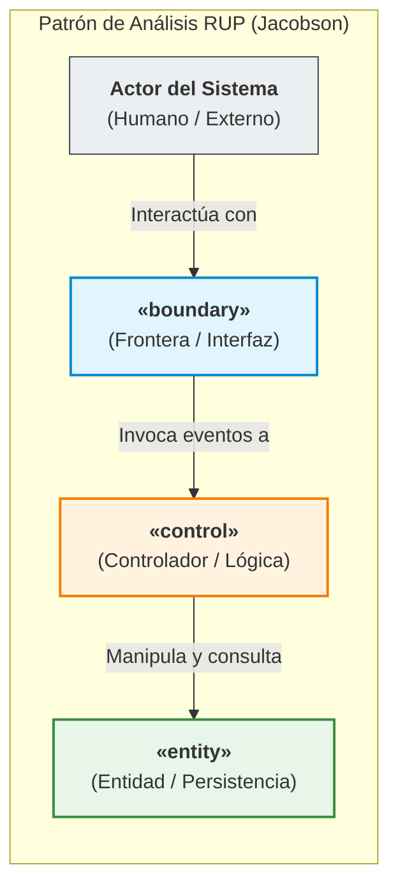

# Diagrama de Clases de Análisis (Modelo RUP BCE)

> **Proyecto:** Diseño e Implementación de Arquitectura Empresarial — Caso Yanbal Perú  
> **Área Operativa:** Cadena de Distribución y Transporte  
> **Marco Metodológico:** RUP (*Rational Unified Process*) — Disciplina de Análisis y Diseño / UML 2.5 / UTP APF1 (§ 3.3, ítem 7)  
> **Diagramas PlantUML:** [[Clases_Analisis_BCE_General.puml]] | [[VOPC_Realizacion_CUS.puml]]  
> **Enlaces a Requerimientos y Casos de Uso:**  
> [[01 - Matriz Consolidada de Requerimientos]] | [[01 - Diagrama General de Casos de Uso del Sistema (CUS)]] | [[02 - Especificación y Fichas Técnicas Oficiales de Casos de Uso]]  
> **Enlaces al Modelo de Dominio:**  
> [[01 - Diagrama de Clases de Dominio (Nivel Dominio)]] | [[Diagrama_Clases_Dominio.puml]]

---

## 1. Fundamentación y Propósito de las Clases de Análisis

En la metodología **RUP (*Rational Unified Process*)**, el **Modelo de Análisis** constituye el puente conceptual entre los requerimientos funcionales del sistema (expresados en los Casos de Uso del Sistema - CUS) y la arquitectura de diseño de software. 

A diferencia del Modelo de Dominio (que describe exclusivamente el negocio del mundo real), las **Clases de Análisis** modelan la estructura preliminar de la **solución de software** propuesta para Yanbal Perú, distribuyendo el comportamiento del sistema mediante el patrón canónico **Boundary-Control-Entity (BCE)** propuesto por Ivar Jacobson:

### Reglas Semánticas del Modelo RUP BCE
1. **Aislamiento de Interfaces (`<<boundary>>`):** Los actores humanos y los sistemas externos solo interactúan directamente con clases frontera; nunca acceden directamente a controladores o entidades.
2. **Coordinación Transaccional (`<<control>>`):** Los controladores encapsulan las reglas de negocio y los flujos alternativos de los CUS, desacoplando la presentación gráfica del almacenamiento de datos.
3. **Persistencia Pasiva (`<<entity>>`):** Las entidades de análisis representan la información duradera del sistema; no conocen a los controladores ni a las interfaces de usuario.

---

## 2. Catálogo de Clases de Análisis del Sistema

### 2.1. Clases de Frontera (`<<boundary>>`)

| Clase Boundary | Actor Vinculado | Subsistema | Responsabilidad en la Solución | CUS Realizado |
|:---|:---|:---|:---|:---:|
| **`FrmZonificacionDespacho`** | Supervisor de Despacho | Despacho CD | Pantalla web de escritorio para filtrar y agrupar pedidos por los 24 departamentos y tipo de localidad (principal/alejada). | `CUS-01` |
| **`FrmAsignacionTransporte`** | Supervisor de Despacho | Despacho CD | Pantalla para asociar el socio logístico contratado (Olva, Scharff, Urbano) y la modalidad de traslado (terrestre, bimodal, aérea). | `CUS-02` |
| **`FrmRegistroSalidaCD`** | Supervisor de Despacho | Despacho CD | Formulario para registrar la conformidad física de salida en rampa y transferir formalmente la carga al transportista. | `CUS-03`, `CUS-04` |
| **`AppMovilInicioRuta`** | Transportista | Móvil Ruta | Interfaz móvil nativa para que el conductor confirme el inicio de viaje con captura automática de estampa temporal y GPS. | `CUS-05` |
| **`AppMovilConfirmacionEntrega`** | Transportista | Móvil Entrega | Pantalla móvil para capturar la firma digital y los datos del receptor (nombre, DNI, parentesco en caso de ser persona autorizada). | `CUS-06`, `CUS-07` |
| **`AppMovilGestionIncidencia`** | Transportista | Móvil Contingencia | Pantalla móvil para registrar fallas de entrega tipificadas (retraso, pérdida, daño) y generar la solicitud de retorno físico. | `CUS-08`, `CUS-09` |
| **`ApiSincronizacionTracking`** | Bus ESB / Central | Integración | Endpoint/API REST de alta disponibilidad para recibir y procesar los lotes de eventos encolados en campo reduciendo el desfase a $\le 30$ min. | `CUS-10` |
| **`PortalWebConsultaTracking`** | Consultora de Belleza | Consulta Web | Portal responsivo de autoservicio donde la consultora ingresa su N° Pedido o código para ver el estado y quién recibió su caja. | `CUS-11`, `CUS-12` |
| **`InterfaseSalesforceCRM`** | Agente SAC | Atención SAC | Componente de integración integrado a la consola Salesforce para visualizar en tiempo real la situación del pedido y receptor. | `CUS-11`, `CUS-12` |

---

### 2.2. Clases de Control (`<<control>>`)

| Clase Control | Responsabilidad Central | Reglas de Negocio / Validaciones Clave | CUS que Coordina |
|:---|:---|:---|:---:|
| **`CtrlDespacho`** | Orquestar el flujo de preparación, zonificación geográfica, asignación multimodal y egreso formal en CD Lurín. | • Valida que el pedido esté en estado consolidado. • Aplica reglas de promesa: 24h Lima / hasta 7d provincias. • Genera el código maestro de despacho. | `CUS-01`, `CUS-02`, `CUS-03`, `CUS-04` |
| **`CtrlTransporteRuta`** | Controlar la transición operativa a *"En Ruta"* e inicializar la telemetría del viaje. | • Valida que el despacho tenga transportista asignado. • Estampa la fecha/hora real de partida y coordenadas. | `CUS-05` |
| **`CtrlConfirmacionEntrega`** | Procesar la entrega final en domicilio y validar la identidad del receptor. | • Obliga al registro de DNI y nombres del receptor. • Si no es titular, exige capturar parentesco/vínculo (**PR-05**). • Transiciona el estado a *"Entregado"*. | `CUS-06`, `CUS-07` |
| **`CtrlIncidenciaRetorno`** | Gestionar las contingencias que impiden la entrega regular y gobernar la logística inversa. | • Tipifica estrictamente la causa: Retraso, Pérdida o Daño. • Si hay bulto físico presente, habilita orden de retorno al CD. | `CUS-08`, `CUS-09` |
| **`CtrlSincronizacion`** | Despachar los eventos de campo hacia la base de datos corporativa y plataformas consumidoras. | • Procesa encolamiento offline ante falta de red móvil. • Garantiza la meta de actualización $\le 30$ min (**RNF-01**). | `CUS-10` |
| **`CtrlConsultaTracking`** | Resolver las consultas de trazabilidad desde el Portal Web y Salesforce CRM. | • Busca por N° Pedido o Código de Consultora. • Expone explícitamente los datos de la persona autorizada. | `CUS-11`, `CUS-12` |

---

### 2.3. Clases de Entidad (`<<entity>>`)

| Clase Entity | Atributos de Análisis Esenciales | Rol de Información Persistente |
|:---|:---|:---|
| **`Pedido`** | `numeroPedido`, `estadoPedido`, `promesaEntrega`, `fechaDespacho`, `fechaEntregaEstimada` | Objeto transaccional nuclear de la trazabilidad. |
| **`Bulto`** | `formatoCaja` (1 a 8), `estadoFisico` (Íntegro/Dañado) | Paquete físico embalado en el CD. |
| **`RegistroDespacho`** | `codigoDespacho`, `fechaHoraSalida`, `supervisorDespacho`, `conformidadCarga` | Constancia formal de egreso del Centro de Distribución. |
| **`DireccionEntrega`** | `departamento`, `provincia`, `distrito`, `tipoCiudad`, `direccionDetallada` | Ubicación geográfica normalizada de destino. |
| **`SocioLogistico`** | `ruc`, `razonSocial`, `nombreComercial`, `contactoOperativo` | Operador contratado responsable de la custodia en ruta. |
| **`RegistroEntrega`** | `codigoEntrega`, `fechaHoraEntrega`, `firmaConformidad` | Acta electrónica de recepción física en destino. |
| **`Receptor`** | `nombresReceptor`, `numeroDocumento`, `tipoReceptor`, `parentescoRelacion` | Persona que atiende y recibe el pedido en domicilio (**eje de solución PR-05**). |
| **`IncidenciaEntrega`** | `codigoIncidencia`, `tipoCausal` (Retraso/Pérdida/Daño), `fechaHoraIncidencia`, `descripcion` | Registro de anomalía operativa en campo. |
| **`OrdenRetorno`** | `numeroOrdenRetorno`, `fechaInicioRetorno`, `motivoRetorno`, `estadoRetorno` | Documento que respalda la logística inversa hacia Lurín. |
| **`EventoTracking`** | `idEvento`, `tipoEvento`, `fechaHoraRegistro`, `latitudGPS`, `longitudGPS`, `estadoSincronizacion` | Registro atómico de hito de seguimiento para la línea de tiempo. |

---

## 3. Matriz de Realización de Casos de Uso del Sistema (VOPC)

La siguiente matriz evidencia la trazabilidad estricta demostrando que cada funcionalidad requerida (`CUS-01` a `CUS-12`) cuenta con una realización BCE completa:

| Código CUS | Nombre del Caso de Uso del Sistema | Boundary Participante | Control Participante | Entities Participantes |
|:---:|:---|:---|:---|:---|
| **`CUS-01`** | Clasificar Pedidos Geográficamente | `FrmZonificacionDespacho` | `CtrlDespacho` | `Pedido`, `DireccionEntrega` |
| **`CUS-02`** | Asignar Transportista y Modalidad | `FrmAsignacionTransporte` | `CtrlDespacho` | `Pedido`, `SocioLogistico` |
| **`CUS-03`** | Registrar Salida de Despacho | `FrmRegistroSalidaCD` | `CtrlDespacho` | `Pedido`, `Bulto`, `RegistroDespacho` |
| **`CUS-04`** | Asociar Promesa Estimada de Entrega | `FrmRegistroSalidaCD` | `CtrlDespacho` | `Pedido`, `DireccionEntrega` |
| **`CUS-05`** | Registrar Inicio de Traslado | `AppMovilInicioRuta` | `CtrlTransporteRuta` | `Pedido`, `EventoTracking` |
| **`CUS-06`** | Registrar Confirmación de Entrega | `AppMovilConfirmacionEntrega` | `CtrlConfirmacionEntrega` | `Pedido`, `RegistroEntrega`, `EventoTracking` |
| **`CUS-07`** | Registrar Identidad del Receptor | `AppMovilConfirmacionEntrega` | `CtrlConfirmacionEntrega` | `Receptor`, `RegistroEntrega` |
| **`CUS-08`** | Registrar Entrega Fallida por Incidencia | `AppMovilGestionIncidencia` | `CtrlIncidenciaRetorno` | `Pedido`, `IncidenciaEntrega`, `EventoTracking` |
| **`CUS-09`** | Registrar Orden de Retorno de Carga | `AppMovilGestionIncidencia` | `CtrlIncidenciaRetorno` | `OrdenRetorno`, `IncidenciaEntrega`, `Bulto` |
| **`CUS-10`** | Sincronizar Estados de Distribución | `ApiSincronizacionTracking` | `CtrlSincronizacion` | `EventoTracking`, `Pedido`, `RegistroEntrega` |
| **`CUS-11`** | Consultar Trazabilidad de Pedido | `PortalWebConsultaTracking` `InterfaseSalesforceCRM` | `CtrlConsultaTracking` | `Pedido`, `EventoTracking` |
| **`CUS-12`** | Visualizar Información del Receptor Real | `PortalWebConsultaTracking` `InterfaseSalesforceCRM` | `CtrlConsultaTracking` | `Receptor`, `RegistroEntrega` |

---
