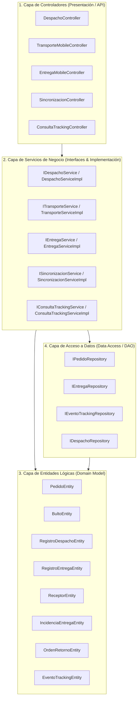

# Diagrama de Clases del Diseño (Modelo Lógico de Software)

> **Proyecto:** Diseño e Implementación de Arquitectura Empresarial — Caso Yanbal Perú  
> **Área Operativa:** Cadena de Distribución y Transporte  
> **Marco Metodológico:** RUP (*Rational Unified Process*) — Disciplina de Diseño de Software / UML 2.5 / UTP APF1 (§ 3.3, ítem 8)  
> **Diagrama PlantUML:** [[Clases_Diseno_Logico_General.puml]]  
> **Modelo Previo (Análisis):** [[01 - Diagrama de Clases de Análisis (Modelo BCE)]] | [[Clases_Analisis_BCE_General.puml]]  
> **Especificación de CUS:** [[01 - Diagrama General de Casos de Uso del Sistema (CUS)]] | [[02 - Especificación y Fichas Técnicas Oficiales de Casos de Uso]]

---

## 1. Fundamentación y Propósito del Diseño Lógico

El **Diagrama de Clases del Diseño** representa la solución de software desde una perspectiva técnica orientada a objetos formal. A diferencia de las Clases de Análisis (que se mantienen en un nivel conceptual estereotipado con Boundary, Control y Entity), el **Modelo de Diseño**:

1. **Estructura en Capas Arquitectónicas:** Implementa una arquitectura en capas estándar de la industria (*Layered Architecture*):
   - **Capa de Controladores (Application / Web / Mobile Controllers):** Expone endpoints y maneja peticiones de usuarios y terminales móviles.
   - **Capa de Servicios de Negocio (Business Services / Interfaces):** Contiene la lógica transaccional, validaciones de reglas de negocio y cálculo de lead times.
   - **Capa de Entidades del Dominio Lógico (Domain Entities):** Clases con atributos fuertemente tipificados (`Long`, `String`, `LocalDateTime`, `byte[]`, `Double`) y métodos de mutación de estado controlada.
   - **Capa de Repositorios / DAO (Data Access Layer):** Abstracciones de persistencia para interactuar con la base de datos relacional.
2. **Definición de Visibilidad y Firmas:** Cada clase contiene atributos privados (`-`) y operaciones públicas (`+`) con parámetros fuertemente tipificados y valores de retorno explícitos.
3. **Mapeo Directo a los Requerimientos:** Satisface la totalidad de los 12 Casos de Uso del Sistema (`CUS-01` a `CUS-12`).

---

## 2. Catálogo de Capas y Clases de Diseño



---

### 2.1. Capa de Controladores de Aplicación

| Clase Controladora | Métodos Principales | Parámetros y Retorno | CUS Soportado |
|:---|:---|:---|:---:|
| **`DespachoController`** | `+obtenerPedidosPorZona()`<br/>`+asignarSocioYModalidad()`<br/>`+formalizarSalidaDespacho()` | `(dep: String, tipo: String): List<PedidoDTO>`<br/>`(pedId: Long, socId: Long, mod: String): ResponseDTO`<br/>`(request: SalidaDespachoRequest): DespachoResultDTO` | `CUS-01`<br/>`CUS-02`<br/>`CUS-03`, `CUS-04` |
| **`TransporteMobileController`** | `+iniciarTraslado()`<br/>`+capturarPosicionGPS()` | `(request: InicioRutaRequest): ResponseDTO`<br/>`(request: TelemetriaRequest): void` | `CUS-05` |
| **`EntregaMobileController`** | `+confirmarEntregaDomicilio()`<br/>`+registrarIncidencia()` | `(request: ConfirmacionEntregaRequest): EntregaResultDTO`<br/>`(request: IncidenciaRequest): IncidenciaResultDTO` | `CUS-06`, `CUS-07`<br/>`CUS-08`, `CUS-09` |
| **`SincronizacionController`** | `+procesarLoteEventos()` | `(loteRequest: LoteSyncRequest): SyncResponseDTO` | `CUS-10` |
| **`ConsultaTrackingController`** | `+consultarTrazabilidad()` | `(criterio: String): TrazabilidadDTO` | `CUS-11`, `CUS-12` |

---

### 2.2. Capa de Servicios de Negocio (`Services`)

- **`DespachoServiceImpl`**: Contiene el algoritmo de validación de pedidos empaquetados procedentes de picking (SPY) y ejecuta la asociación de la promesa de entrega (24h para Lima Metropolitana, hasta 7 días calendario para departamentos de provincias).
- **`TransporteServiceImpl`**: Registra la salida física efectiva de muelle, asocia la unidad de transporte y genera el primer evento telemétrico de inicio de ruta.
- **`EntregaServiceImpl`**: 
  - Procesa la confirmación de entrega en destino.
  - Valida obligatoriamente la presencia de la firma digital (`byte[]`) y los datos completos de identificación de la persona que recibe (`ReceptorEntity`).
  - Si el receptor no es la consultora titular, obliga a persistir el campo `parentescoRelacion` (resolviendo la brecha de información de **PR-05**).
  - En caso de entrega fallida, categoriza la contingencia entre Retraso, Pérdida o Daño; si la causal contempla mercadería física remanente, genera automáticamente la `OrdenRetornoEntity`.
- **`SincronizacionServiceImpl`**: Recibe paquetes de eventos encolados en dispositivos móviles que operaron fuera de cobertura (modo offline) y realiza el impacto en la base de datos central en transacciones por lotes, garantizando el cumplimiento del SLA de propagación menor a 30 minutos (**RNF-01**).
- **`ConsultaTrackingServiceImpl`**: Expone de manera desacoplada los estados, marcas temporales y datos del receptor tanto para el Portal Web de Consultoras como para el CRM de Servicio al Cliente (Salesforce).

---

### 2.3. Capa de Entidades Lógicas del Dominio

Las entidades incorporan tipos de datos exactos de software e identificadores de clave primaria/foránea:

```
PedidoEntity (id: Long, numeroPedido: String, estadoPedido: String, promesaEntrega: String, fechaDespacho: LocalDateTime, fechaEntregaEstimada: LocalDate)
   ├── 1..* BultoEntity (id: Long, formatoCaja: String, estadoFisico: String, pedidoId: Long)
   ├── 0..1 RegistroDespachoEntity (id: Long, codigoDespacho: String, fechaHoraSalida: LocalDateTime, supervisorDespacho: String, conformidadCarga: boolean)
   ├── 0..1 RegistroEntregaEntity (id: Long, codigoEntrega: String, fechaHoraEntrega: LocalDateTime, firmaDigitalBytes: byte[], receptorId: Long)
   │           └── 1 ReceptorEntity (id: Long, nombres: String, numeroDocumento: String, tipoReceptor: String, parentescoRelacion: String)
   └── 0..1 IncidenciaEntregaEntity (id: Long, codigoIncidencia: String, tipoCausal: String, fechaHoraIncidencia: LocalDateTime, descripcion: String)
               └── 0..1 OrdenRetornoEntity (id: Long, numeroOrdenRetorno: String, fechaInicioRetorno: LocalDateTime, motivoRetorno: String)
```

---

## 3. Trazabilidad con Requerimientos Funcionales y No Funcionales

| Elemento de Diseño Lógico | Requerimiento Funcional | Requerimiento No Funcional Respaldado |
|:---|:---:|:---|
| `DespachoController.obtenerPedidosPorZona()` | **RF-01** | `RNF-02` (Soporte a nivel de los 24 departamentos) |
| `DespachoController.asignarSocioYModalidad()` | **RF-02** | `RNF-02` (Operación multimodal: terrestre, bimodal, aérea) |
| `DespachoServiceImpl.registrarEgresoCD()` | **RF-03**, **RF-04** | `RNF-05` (Control de acceso por rol de Supervisor) |
| `TransporteMobileController.iniciarTraslado()` | **RF-05** | `RNF-07` (Usabilidad optimizada para conductores en muelle) |
| `EntregaMobileController.confirmarEntregaDomicilio()` | **RF-06**, **RF-07** | `RNF-04` (Integridad y no repudio mediante firma digital y DNI) |
| `EntregaServiceImpl.registrarFallaEntrega()` | **RF-08**, **RF-09** | `RNF-06` (Auditoría de mermas y siniestros) |
| `SincronizacionController.procesarLoteEventos()` | **RF-10** | `RNF-01` (Latencia $\le 30$ min) y `RNF-03` (Resiliencia ante pérdida de red) |
| `ConsultaTrackingController.consultarTrazabilidad()` | **RF-11**, **RF-12** | `RNF-01` (Disponibilidad inmediata de datos del receptor en Salesforce) |

---
