# Diagrama de Contexto del Negocio — Proceso AS-IS

> **Proyecto:** Diseño e Implementación de Arquitectura Empresarial — Caso Yanbal Perú  
> **Área Operativa:** Cadena de Distribución y Transporte  
> **Alcance del Proceso:** Despacho $\longrightarrow$ Transporte/Ruta $\longrightarrow$ Llegada $\longrightarrow$ Entrega $\longrightarrow$ Actualización $\longrightarrow$ Consulta  
> **Marco Metodológico:** RUP (*Rational Unified Process*) — Disciplina de Modelado del Negocio / TOGAF Business Architecture / UTP APF1 (§ 3.3)  
>
> **Navegación del Módulo de Contexto:**  
> [[01 - Diagrama de Contexto del Negocio (AS-IS)]] | [[Contexto_Negocio_AS_IS.puml]]  
> **Enlaces a Modelos Previos:**  
> [[01 - Diagrama General de Casos de Uso del Negocio (CUN)]] | [[02 - Tabla de Roles y Actividades del Negocio]] | [[01 - Diagrama de Clases de Dominio (Nivel Dominio)]] | [[01 - Diagrama General de Casos de Uso del Sistema (CUS)]]

---

## 1. Fundamentación Metodológica del Diagrama de Contexto de Negocio

El **Diagrama de Contexto de Negocio** (*Business Context Diagram*) establece la frontera operativa del macroproceso bajo estudio y delimita formalmente sus intercambios con el entorno organizacional y externo, **manteniéndose estrictamente en la capa de negocio (sin descender a software, clases, APIs o bases de datos)**.

### 1.1. Principio de Caja Negra (*Black Box*)
Conforme a las directrices de la disciplina de Modelado del Negocio en RUP y TOGAF:
1. **El Proceso Central es una Caja Negra:** El macroproceso central (*Distribución y Transporte de Pedidos*) engloba todas las actividades internas de despacho en muelle, control de ruta, gestión de entregas y coordinación operativa.
2. **Exclusión de Trabajadores Internos como Entidades Externas:**  
   Para este modelo, el límite del contexto se establece sobre el macroproceso de distribución y transporte; por ello, los roles internos que ejecutan dicho macroproceso no se representan como entidades limítrofes.
3. **Entidades que Rodean la Caja:**  
   Solo deben figurar las entidades que son **externas a la frontera del proceso de distribución**:
   - **Actores Externos del Negocio («Business Actors»):** Entidades fuera de la corporación Yanbal.
   - **Áreas Organizacionales Limítrofes («Business Units»):** Unidades internas de Yanbal adyacentes que proveen insumos o reciben resultados del proceso.

---

## 2. Participantes del Contexto de Negocio Sustentados por la Evidencia

A partir de la entrevista al Ing. Joao Condorpusa Mendoza (`Transcripción original.md`), la tabla de roles del CUN y el flujo de actividades AS-IS, se identifican, con base en la documentación disponible, los siguientes 7 participantes del contexto:

```
                                  ┌────────────────────────┐
                                  │     Área Comercial     │
                                  └───────────┬────────────┘
                                              │
         ┌────────────────────────┐           │           ┌────────────────────────┐
         │ Área de Almacén y      │           │           │  Control de Calidad y  │
         │ Preparación (CD Lurín) │           ▼           │  Seguridad Patrimonial │
         └───────────┬────────────┴─► ╔═══════════════╗ ◄─┴───────────┬────────────┘
                     │                ║   PROCESO     ║               │
                     │                ║   CENTRAL DE  ║               │
                     │                ║ DISTRIBUCIÓN  ║               │
                     │                ║ Y TRANSPORTE  ║   ┌───────────┴────────────┐
                     │                ║ (YANBAL PERÚ) ║ ◄─┤ Área de Servicio       │
                     │                ╚═══════════════╝   │ al Cliente (SAC)       │
                     │                   ▲    ▲    ▲      └────────────────────────┘
                     │                   │    │    │
         ┌───────────┴────────────┐ ┌────┴────┴────┴─────┐ ┌────────────────────────┐
         │ Socio Logístico /      │ │ Consultora /       │ │ Persona Autorizada     │
         │ Transportista (Tercero)│ │ Consultor (Cliente)│ │ (Receptor en Domicilio)│
         └────────────────────────┘ └────────────────────┘ └────────────────────────┘
```

### 2.1. Actores Externos del Negocio («Business Actors» - Fuera de Yanbal)
1. **Socio Logístico / Transportista:**  
   Proveedores externos contratados (Olva, Urbano, Scharff y operadores regionales) que asumen la custodia física de la carga consolidada y ejecutan el reparto multimodal (`Transcripción original.md` min 1:24, 19:15–20:30).
2. **Consultora / Consultor:**  
   Cliente primario de la distribución física de Yanbal; genera la demanda de pedidos y consulta el estado e información de su entrega (`Transcripción original.md` min 22:03–22:28).
3. **Persona Autorizada:**  
   Tercero facultado presente en el domicilio de destino que proporciona los datos de recepción cuando la consultora titular no se encuentra disponible (`Transcripción original.md` min 24:45–25:01).

### 2.2. Áreas Organizacionales Limítrofes (Unidades Internas de Yanbal)
4. **Área Comercial:**  
   Unidad de negocio responsable de canalizar y facturar las compras de las consultoras; transfiere los datos maestros de entrega y requiere la confirmación de entrega para el cierre formal del ciclo de venta (`Transcripción original.md` min 14:43–15:06, 17:34–17:41).
5. **Área de Almacén y Preparación (Centro de Distribución Lurín):**  
   Área encargada de la desconsolidación de cajas máster, picking unitario y acondicionamiento de los pedidos en los 8 formatos de caja; transfiere los bultos terminados y rotulados a la rampa de despacho y recibe las cargas devueltas por logística inversa (`Transcripción original.md` min 4:01–4:19, 16:06–17:34, 20:55).
6. **Área de Servicio al Cliente (Call Center / Mesa de Ayuda):**  
   Unidad interna que atiende consultas telefónicas y reclamos de las consultoras; consulta el estado del pedido y los datos del receptor real para absolver incidencias (`Transcripción original.md` min 24:29–25:01, 28:35–28:59).
7. **Área de Control de Calidad y Seguridad Patrimonial:**  
   Unidad técnica interna evidenciada textualmente en la entrevista (`Transcripción original.md` min 20:55–21:25) que inspecciona los pedidos devueltos en logística inversa para calificar si procede reposición comercial o activación de póliza de seguro ante siniestro.

---

## 3. Diagrama de Contexto de Negocio (Mermaid)

```mermaid
flowchart TD
    %% Proceso Central (Caja Negra)
    CENTRO(["<b>PROCESO DE NEGOCIO CENTRAL</b><br/>━━━━━━━━━━━━━━━━━━━━━━━━━━━━━<br/><b>Distribución y Transporte de Pedidos</b><br/>Yanbal Perú (AS-IS)"]):::centralStyle

    %% Unidades Organizacionales Limítrofes
    COM["<b>Área Comercial</b>"]:::areaStyle
    ALM["<b>Área de Almacén y Preparación</b><br/>(Centro de Distribución Lurín)"]:::areaStyle
    SAC["<b>Área de Servicio al Cliente</b><br/>(Atención de Reclamos)"]:::areaStyle
    CAL["<b>Control de Calidad y<br/>Seguridad Patrimonial</b>"]:::areaStyle

    %% Actores Externos del Negocio
    SOC["<b>Socio Logístico / Transportista</b><br/>(Empresas de Transporte)"]:::actorStyle
    CLI["<b>Consultora / Consultor</b><br/>(Cliente Primario)"]:::actorStyle
    AUT["<b>Persona Autorizada</b><br/>(Receptor en Domicilio)"]:::actorStyle

    %% Intercambios de Negocio de Alto Nivel
    COM -->|1a. Órdenes comerciales facturadas y datos de entrega| CENTRO
    CENTRO -->|1b. Confirmación de entrega del pedido para cierre comercial| COM

    ALM -->|2a. Bultos preparados y rotulados en muelle| CENTRO
    CENTRO -->|2b. Bultos físicos devueltos por logística inversa| ALM

    CENTRO -->|3a. Carga física y ruta para distribución| SOC
    SOC -->|3b. Inicio de traslado, reporte de entrega o incidencia en ruta| CENTRO

    CLI -->|4a. Consulta sobre el estado de su pedido| CENTRO
    CENTRO -->|4b. Estado e información de entrega| CLI

    AUT -->|5a. Datos de recepción en domicilio| CENTRO
    CENTRO -->|5b. Pedido entregado| AUT

    SAC -->|6a. Consulta de estado por atención a consultoras| CENTRO
    CENTRO -->|6b. Información de estado y receptor del pedido| SAC

    CENTRO -->|7a. Pedidos devueltos por siniestro, pérdida o daño| CAL
    CAL -->|7b. Disposición técnica de reposición o activación de póliza| CENTRO

    classDef centralStyle fill:#FFF8E1,stroke:#FF8F00,stroke-width:3px,color:#E65100,font-size:12px;
    classDef areaStyle fill:#E8EAF6,stroke:#3F51B5,stroke-width:2px,color:#1A237E,font-size:11px;
    classDef actorStyle fill:#E1F5FE,stroke:#0288D1,stroke-width:2px,color:#01579B,font-size:11px;
```



---

## 4. Matriz Exhaustiva de Entidades, Flujos y Evidencia Textual

| Entidad Limítrofe | Categoría RUP / TOGAF | Flujo de Entrada al Proceso Central | Flujo de Salida desde el Proceso Central | Cita y Marca de Tiempo en la Entrevista (`Transcripción original.md`) |
|:---|:---:|:---|:---|:---|
| **Área Comercial** | Unidad Organizacional Interna | **Órdenes comerciales facturadas y datos de entrega:**<br/>N° de pedido, código de consultora y dirección domiciliaria completa. | **Confirmación de entrega del pedido:**<br/>Notificación de entrega conforme para el cierre del ciclo transaccional de venta. | *"la generación del pedido se da a través de la plataforma comercial... va cayendo hacia nuestro gestor de picking... pasa a la zona de despacho donde ya tiene amarrada la información comercial"* (`min 14:43, 17:34`). |
| **Área de Almacén y Preparación** (CD Lurín) | Unidad Organizacional Interna | **Bultos preparados y rotulados en muelle:**<br/>Cajas terminadas según volumetría con rótulo de destino para su entrega a rampa. | **Bultos devueltos por logística inversa:**<br/>Reingreso de carga rechazada o fallida para evaluación técnica de retorno. | *"estas cajas master son aperturadas para poder hacer el picking de pedidos a nivel unitario y ocurre la preparación... retorna el pedido hacia el área de almacén"* (`min 4:01, 20:55`). |
| **Socio Logístico / Transportista** | Actor Externo («Business Actor») | **Inicio de traslado, reporte de entrega o incidencia en ruta:**<br/>Confirmación de inicio de ruta, constancia de entrega o reporte de contingencias (retraso, pérdida, daño). | **Carga física y ruta para distribución:**<br/>Bultos consolidados bajo custodia y asignación de tramo nacional (terrestre, bimodal, aéreo). | *"despacho de los pedidos hacia el cliente final a través de proveedores logísticos asociados... el mismo socio logístico hace el registro para hacer un proceso de logística inversa"* (`min 1:24, 20:30`). |
| **Consultora / Consultor** | Actor Externo («Business Actor») | **Consulta sobre el estado de su pedido:**<br/>Petición de información de seguimiento mediante Número de Pedido o Código de Consultora. | **Estado e información de entrega:**<br/>Visualización del estatus actual del pedido e información actualizada de entrega. | *"para nosotros un consultor o una consultora es nuestro cliente... con esas dos informaciones puede hacer el seguimiento de cada estatus del pedido"* (`min 22:03–22:28`). |
| **Persona Autorizada** | Actor Externo («Business Actor») | **Datos de recepción en domicilio:**<br/>Conformidad presencial y datos de identificación en destino cuando la titular no se encuentra en el domicilio. | **Pedido entregado:**<br/>Confirmación formal de entrega del pedido en el domicilio consignado. | *"No necesariamente el cliente final es el que recibe la entrega del pedido, sino puede ser alguna persona autorizada"* (`min 24:45–25:01`). |
| **Área de Servicio al Cliente** | Unidad Organizacional Interna | **Consulta de estado por atención a consultoras:**<br/>Requerimiento de trazabilidad para atender llamadas de consultoras ante demoras o dudas. | **Información de estado y receptor del pedido:**<br/>Datos actualizados de cumplimiento y receptor real para absolver reclamos (`PR-05`). | *"para hacer este tipo de gestiones de consultas, reclamos y otro tipo de trámites con el cliente final"* (`min 28:35–28:59`). |
| **Área de Control de Calidad y Seguridad Patrimonial** | Unidad Organizacional Interna | **Disposición técnica de reposición o activación de póliza:**<br/>Dictamen técnico para reenviar producto a línea o declarar siniestro con garantía. | **Pedidos devueltos por siniestro, pérdida o daño:**<br/>Bultos físicos o reportes de merma derivados de logística inversa para peritaje. | *"El área de almacén evalúa el pedido en base a calidad y en base a seguridad patrimonial para calificarlo si es procedente para el retorno... o en todo caso si se activa algún tipo de seguro o garantía a través de un siniestro"* (`min 20:55–21:25`). |

---

## 5. Script PlantUML Oficial

El script PlantUML se encuentra codificado y sincronizado en:  
👉 **[[Contexto_Negocio_AS_IS.puml]]**
