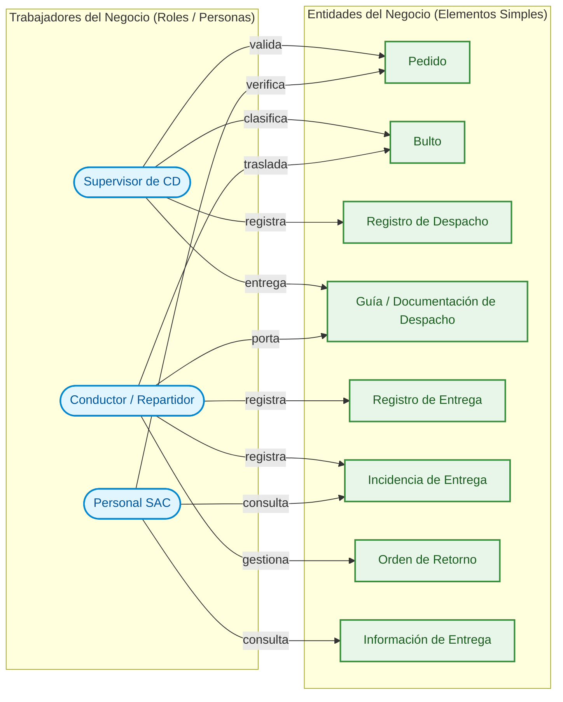

# Modelo de Objetos del Negocio (MON / BOM) — Proceso AS-IS

> **Proyecto:** Diseño e Implementación de Arquitectura Empresarial — Caso Yanbal Perú  
> **Área Operativa:** Cadena de Distribución y Transporte  
> **Alcance del Proceso:** Despacho $\longrightarrow$ Transporte/Ruta $\longrightarrow$ Llegada $\longrightarrow$ Entrega $\longrightarrow$ Actualización $\longrightarrow$ Consulta  
> **Marco Metodológico:** RUP (*Rational Unified Process*) — Disciplina de Modelado del Negocio (*Business Modeling*) / UML 2.5 / UTP APF1  
>
> **Navegación del Módulo MON:**  
> [[01 - Modelo de Objetos del Negocio (MON)]] | [[02 - Matriz de Realización de Casos de Uso del Negocio]] | [[03 - Especificación de Trabajadores y Entidades del Negocio]]  
> **Diagramas PlantUML:**  
> [[MON_Diagrama_General.puml]] | [[MON_Realizacion_CUN.puml]]  
> **Enlaces a Casos de Uso del Negocio (CUN):**  
> [[01 - Diagrama General de Casos de Uso del Negocio (CUN)]] | [[02 - Tabla de Roles y Actividades del Negocio]] | [[03 - Especificación de Casos de Uso del Negocio]] | [[04 - Trazabilidad de Casos de Uso del Negocio]]  
> **Enlaces al Modelo de Dominio:**  
> [[01 - Diagrama de Clases de Dominio (Nivel Dominio)]] | [[02 - Diccionario de Datos del Modelo de Dominio]] | [[03 - Matriz del Modelo de Dominio]]

---

## 1. Fundamentos Metodológicos de RUP: Del CUN al MON

En la disciplina de **Modelado del Negocio** (*Business Modeling*) de RUP (*Rational Unified Process*), el **Modelo de Objetos del Negocio (MON)** —internacionalmente conocido como *Business Object Model (BOM)*— describe la realización estructural y colaborativa del negocio en su estado actual (**AS-IS**). 

Mientras que los **Casos de Uso del Negocio (CUN)** definen los procesos desde una perspectiva de caja negra orientada a los actores del negocio, el **MON** abre esa caja negra para mostrar **cómo colaboran los roles internos (Trabajadores del Negocio) manipulando los artefactos, documentos y conceptos clave (Entidades del Negocio)** para cumplir con los objetivos del proceso.

El hilo conductor de la arquitectura sigue el encadenamiento metodológico estricto:

```mermaid
flowchart LR
    CUN["1. Casos de Uso del Negocio<br/>(CUN-01 a CUN-05)"] 
    --> BW["2. Trabajadores del Negocio<br/>«business worker»"]
    BW --> ACT["3. Acciones Operativas<br/>(Verbos de interacción)"]
    ACT --> BE["4. Entidades del Negocio<br/>«business entity»"]
    BE --> REAL["5. Realización de CUN<br/>(Colaboración estructurada)"]
    REAL --> MON["6. Modelo de Objetos<br/>del Negocio (MON / BOM)"]

    style CUN fill:#ECEFF1,stroke:#455A64,stroke-width:1px
    style BW fill:#E1F5FE,stroke:#0288D1,stroke-width:2px
    style ACT fill:#FFF9C4,stroke:#FBC02D,stroke-width:1px
    style BE fill:#E8F5E9,stroke:#388E3C,stroke-width:2px
    style REAL fill:#F3E5F5,stroke:#7B1FA2,stroke-width:1px
    style MON fill:#E0F2F1,stroke:#00796B,stroke-width:2px
```



### Regla Semántica Fundamental de Visualización
Visualmente, el Modelo de Objetos del Negocio se fundamenta en la relación dirigida:

$$\mathbf{[\text{TRABAJADOR DEL NEGOCIO}]} \xrightarrow{\quad\text{acción (verbo)}\quad} \mathbf{[\text{ENTIDAD DEL NEGOCIO}]}$$

Ejemplos clave del caso Yanbal:
- `[Supervisor de CD]` $\xrightarrow{\quad\text{registra}\quad}$ `[Registro de Despacho]`
- `[Conductor / Repartidor]` $\xrightarrow{\quad\text{registra}\quad}$ `[Registro de Entrega]`
- `[Personal SAC]` $\xrightarrow{\quad\text{consulta}\quad}$ `[Información de Entrega]`

---

## 2. Catálogo de Elementos del MON para Yanbal Perú

### 2.1. Trabajadores del Negocio (`«business worker»`)
Son los colaboradores humanos internos de Yanbal o contratados en su operación logística que ejecutan actividades dentro del límite del sistema de negocio:

| Trabajador del Negocio | Estereotipo | Área / Ubicación | Rol y Responsabilidad Operativa en el AS-IS | CUNs Vinculados |
|:---|:---:|:---|:---|:---:|
| **Supervisor de CD** | `«business worker»` | Centro de Distribución (Lurín) | Responsable operativo en muelle de despacho. Recibe pedidos de picking, verifica su correspondencia, los clasifica geográficamente (24 departamentos), asigna el socio logístico y la modalidad de transporte (terrestre, bimodal, aérea), verifica la promesa de entrega y formaliza el egreso y entrega de custodia. | `CUN-01` |
| **Conductor / Repartidor** | `«business worker»` | Operación de Transporte y Campo | Operador asignado por el transportista/socio logístico. Conduce la unidad de transporte, custodia la carga en ruta nacional, efectúa la entrega física en domicilio a la consultora titular o persona autorizada, o registra contingencias operativas (retraso, daño, pérdida) e inicia el retorno al CD. | `CUN-02`<br/>`CUN-03`<br/>`CUN-04` |
| **Personal SAC** | `«business worker»` | Mesa de Atención / Call Center (SAC) | Agente interno de atención a consultoras. Utiliza el CRM Salesforce / Cellforce para absolver consultas de trazabilidad, estado y promesa de entrega, padeciendo directamente el desfase de sincronización de 2h (`PR-04`) y la falta de visibilidad del receptor (`PR-05`). | `CUN-05` |

---

### 2.2. Entidades del Negocio (`«business entity»`)
Representan la información, documentos físicos/digitales y bienes materiales que los trabajadores del negocio manejan, generan, consultan o transforman durante el proceso:

| # | Entidad del Negocio | Estereotipo | Naturaleza | Descripción en el Negocio de Yanbal |
|:---:|:---|:---:|:---:|:---|
| **1** | **`Pedido`** | `«business entity»` | Conceptual / Transaccional | Orden comercial de la consultora que ampara los productos solicitados. Contiene código de consultora, dirección de entrega, estado del flujo y promesa estimada de entrega. |
| **2** | **`Bulto`** | `«business entity»` | Físico / Material | Paquete o caja consolidada (formatos 1 a 8) manipulada físicamente en despacho, estiba, traslado en ruta y entrega en manos del receptor. |
| **3** | **`Registro de Despacho`** | `«business entity»` | Registro Transaccional | Registro formal que acredita la salida del CD y la transferencia legal de custodia física de los bultos hacia el transportista contratado (asocia el estado *"Despachado"*). |
| **4** | **`Guía / Documentación de Despacho`** | `«business entity»` | Documental / Legal | Conjunto de documentos físicos y electrónicos (Guía de Remisión, Manifiesto de Carga y Hoja de Ruta) que acompaña a la carga para su control y fiscalización en tránsito. |
| **5** | **`Registro de Entrega`** | `«business entity»` | Comprobante / Transaccional | Constancia física o digital generada en campo al completar la entrega, certificando fecha, hora y datos de quien recibió (asocia el estado terminal *"Entregado"*). |
| **6** | **`Incidencia de Entrega`** | `«business entity»` | Registro de Excepción | Registro formal de la contingencia en campo que impidió la entrega exitosa, tipificada en causales sustentadas: retraso, pérdida o daño (asocia el estado *"Entrega Fallida"*). |
| **7** | **`Orden de Retorno`** | `«business entity»` | Documental / Logístico | Instrumento de logística inversa generado cuando existe bulto físico presente para amparar el traslado de devolución de la carga rechazada o siniestrada hacia el CD. |
| **8** | **`Información de Entrega`** | `«business entity»` | Información Consolidada | Conjunto de datos consolidados y sincronizados (estado de tracking, fecha/hora efectiva y receptor real) disponibles para visualización en canales de consulta web y SAC. |

---

### 2.3. Acciones Operativas (Verbos)
Las acciones expresan las operaciones de negocio que cada trabajador realiza sobre cada entidad:

```
┌────────────────────────┐      acción (verbo)       ┌────────────────────────┐
│ «business worker»      │ ────────────────────────> │ «business entity»      │
│ Trabajador del Negocio │                           │ Entidad del Negocio    │
└────────────────────────┘                           └────────────────────────┘
  • Validar                                            • Pedido
  • Registrar                                          • Bulto
  • Trasladar                                          • Registro de Despacho
  • Entregar                                           • Guía de Despacho
  • Consultar                                          • Registro de Entrega
  • Verificar                                          • Incidencia de Entrega
  • Gestionar                                          • Orden de Retorno
  • Clasificar                                         • Información de Entrega
  • Emitir
```

---

## 3. Diagrama General del Modelo de Objetos del Negocio (MON)

El siguiente diagrama modela la estructura completa del MON en Yanbal Perú, integrando los **3 Trabajadores del Negocio**, las **8 Entidades del Negocio**, las **relaciones estructurales entre entidades** y las **acciones operativas** que conectan a los trabajadores con sus respectivas entidades:



---

## 4. Diagrama Conceptual de Interacción Trabajador $\longrightarrow$ Entidad

Para facilitar la lectura gerencial y docente del modelo, a continuación se ilustra la interacción directa por cada trabajador del negocio:

```mermaid
graph TD
    subgraph CD_ZONA ["1. Zona de Despacho (Centro de Distribución)"]
        W1(["«business worker»<br/><b>Supervisor de CD</b>"]):::worker
        E1["«business entity»<br/><b>Pedido</b>"]:::entity
        E2["«business entity»<br/><b>Bulto</b>"]:::entity
        E3["«business entity»<br/><b>Registro de Despacho</b>"]:::entity
        E4["«business entity»<br/><b>Guía / Documentación de Despacho</b>"]:::entity

        W1 -->|valida / verifica| E1
        W1 -->|clasifica por destino| E2
        W1 -->|registra egreso y custodia| E3
        W1 -->|emite manifiesto y ruta| E4
    end

    subgraph TRANSPORTE_CAMPO ["2. Transporte y Entrega en Campo"]
        W2(["«business worker»<br/><b>Conductor / Repartidor</b>"]):::worker
        E5["«business entity»<br/><b>Registro de Entrega</b>"]:::entity
        E6["«business entity»<br/><b>Incidencia de Entrega</b>"]:::entity
        E7["«business entity»<br/><b>Orden de Retorno</b>"]:::entity

        W2 -->|traslada y entrega| E2
        W2 -->|porta en ruta| E4
        W2 -->|registra en domicilio| E5
        W2 -->|registra contingencia| E6
        W2 -->|gestiona logística inversa| E7
    end

    subgraph ATENCION_SAC ["3. Canales de Atención al Cliente"]
        W3(["«business worker»<br/><b>Personal SAC</b>"]):::worker
        E8["«business entity»<br/><b>Información de Entrega</b>"]:::entity

        W3 -->|consulta situación y receptor| E8
        W3 -->|verifica estado de orden| E1
        W3 -->|gestiona reclamo por| E6
    end

    classDef worker fill:#E1F5FE,stroke:#0288D1,stroke-width:2px,color:#01579B;
    classDef entity fill:#E8F5E9,stroke:#388E3C,stroke-width:2px,color:#1B5E20;
```



---

## 5. Correspondencia Arquitectónica con los CUN de Yanbal

Cada interacción del Modelo de Objetos del Negocio se desprende de los 5 Casos de Uso del Negocio aprobados para la operación de Yanbal:

| CUN Vinculado | Nombre del Caso de Uso del Negocio | Trabajador(es) Interviniente(s) | Entidad(es) del Negocio Manipulada(s) | Acción(es) Principal(es) |
|:---:|:---|:---|:---|:---|
| **CUN-01** | Despachar Cargas Mono SKU desde Centro de Distribución | **Supervisor de CD** | `Pedido`, `Bulto`, `Registro de Despacho`, `Guía / Documentación de Despacho` | `validar`, `clasificar`, `emitir`, `registrar` |
| **CUN-02** | Trasladar Cargas hacia Sedes y Agencias Nacionales | **Conductor / Repartidor** | `Bulto`, `Guía / Documentación de Despacho`, `Pedido` | `trasladar`, `custodiar`, `portar` |
| **CUN-03** | Entregar Carga en Sede Autorizada de Destino | **Conductor / Repartidor** | `Bulto`, `Registro de Entrega`, `Pedido`, `Información de Entrega` | `entregar`, `capturar`, `registrar` |
| **CUN-04** | Gestionar Rechazo o Retorno por Logística Inversa | **Conductor / Repartidor** | `Incidencia de Entrega`, `Orden de Retorno`, `Bulto`, `Pedido` | `reportar`, `registrar`, `gestionar` |
| **CUN-05** | Consultar Trazabilidad y Estado de Despacho | **Personal SAC** | `Información de Entrega`, `Pedido`, `Incidencia de Entrega` | `consultar`, `verificar`, `gestionar` |

Para el desglose exhaustivo de cómo cada trabajador realiza las actividades específicas (`ACT-01` a `ACT-14`) a través de estas entidades, consultar la [[02 - Matriz de Realización de Casos de Uso del Negocio]].
