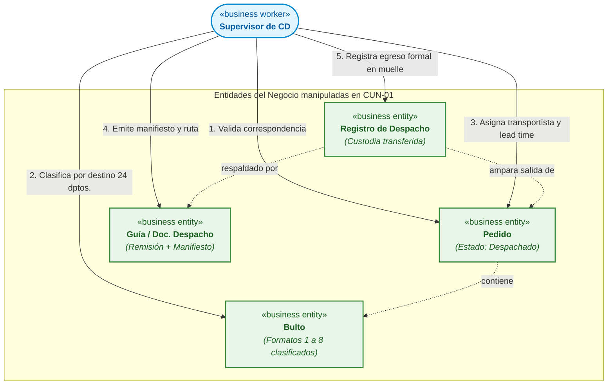
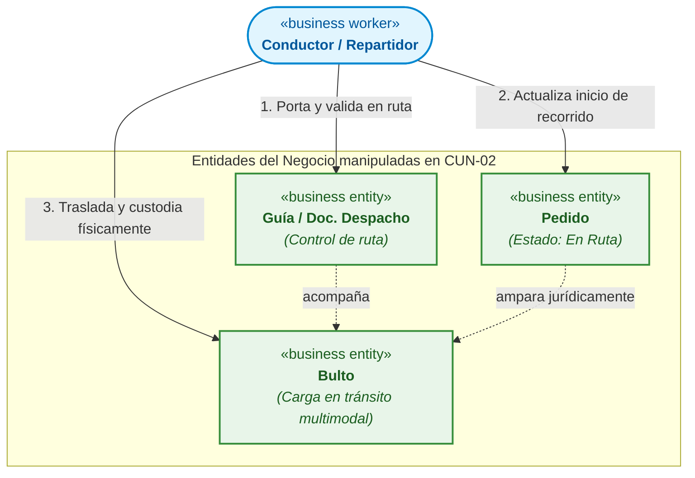
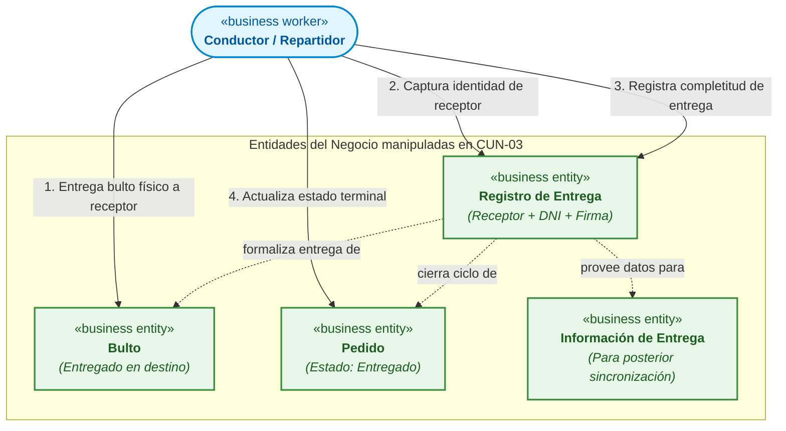
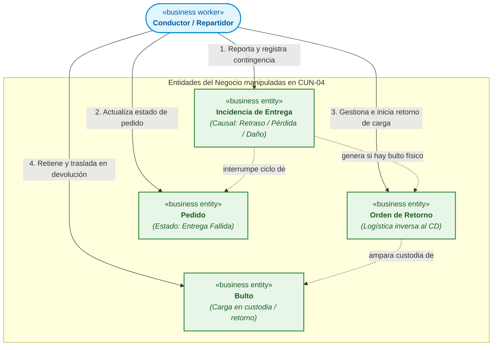
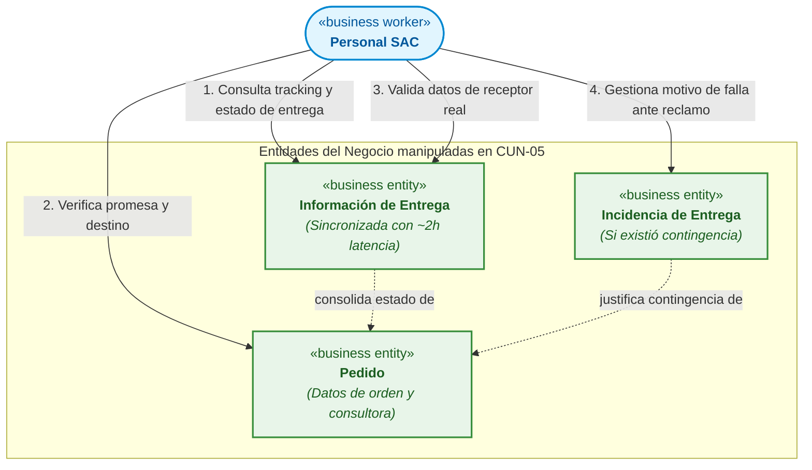

# Matriz de Realización de Casos de Uso del Negocio (CUN $\longrightarrow$ MON)

> **Proyecto:** Diseño e Implementación de Arquitectura Empresarial — Caso Yanbal Perú  
> **Área Operativa:** Cadena de Distribución y Transporte  
> **Alcance del Proceso:** Despacho $\longrightarrow$ Transporte/Ruta $\longrightarrow$ Llegada $\longrightarrow$ Entrega $\longrightarrow$ Actualización $\longrightarrow$ Consulta  
> **Marco Metodológico:** RUP (*Rational Unified Process*) — Realización de Casos de Uso del Negocio (*Business Use Case Realization*) / UML 2.5 / UTP APF1  
>
> **Navegación del Módulo MON:**  
> [[01 - Modelo de Objetos del Negocio (MON)]] | [[02 - Matriz de Realización de Casos de Uso del Negocio]] | [[03 - Especificación de Trabajadores y Entidades del Negocio]]  
> **Diagramas PlantUML:**  
> [[MON_Diagrama_General.puml]] | [[MON_Realizacion_CUN.puml]]  
> **Enlaces a Casos de Uso del Negocio (CUN):**  
> [[01 - Diagrama General de Casos de Uso del Negocio (CUN)]] | [[02 - Tabla de Roles y Actividades del Negocio]] | [[03 - Especificación de Casos de Uso del Negocio]] | [[04 - Trazabilidad de Casos de Uso del Negocio]]  
> **Enlaces al Modelo de Dominio:**  
> [[01 - Diagrama de Clases de Dominio (Nivel Dominio)]] | [[02 - Diccionario de Datos del Modelo de Dominio]] | [[03 - Matriz del Modelo de Dominio]]

---

## 1. Concepto de Realización de Casos de Uso del Negocio en RUP

En la metodología **RUP**, la **Realización de un Caso de Uso del Negocio** (*Business Use Case Realization*) es el constructo que describe **cómo** se ejecuta internamente un CUN específico. Demuestra la colaboración orquestada entre los **Trabajadores del Negocio** (`«business worker»`) que ejecutan las actividades operativas y las **Entidades del Negocio** (`«business entity»`) que son manipuladas, creadas, consultadas o actualizadas.

Cada fila de la matriz responde a la fórmula operativa:

$$\text{CUN} \;\times\; \text{Actividad AS-IS} \;\times\; \text{Trabajador del Negocio} \;\xrightarrow{\quad\text{Acción (Verbo)}\quad}\; \text{Entidad del Negocio} \;\times\; \text{Efecto en el Negocio}$$

---

## 2. Matriz Consolidada de Realización: CUN vs. Trabajador vs. Acción vs. Entidad

A continuación se presenta la matriz integral que vincula las **14 actividades AS-IS** (`ACT-01` a `ACT-14`) con los **5 CUN**, los **3 Trabajadores del Negocio**, los **verbos de acción** y las **8 Entidades del Negocio**, señalando además la operación sobre el ciclo de vida de la entidad (**C:** Crear, **R:** Leer/Consultar, **U:** Actualizar, **X:** Cerrar/Archivar):

| CUN | Actividad AS-IS | Trabajador del Negocio | Acción Operativa (Verbo) | Entidad del Negocio Involucrada | Tipo Op. | Efecto Operativo y Estado de la Entidad | Requerimiento Trazado |
|:---:|:---:|:---|:---|:---|:---:|:---|:---:|
| **CUN-01** | `ACT-01` | **Supervisor de CD** | **Recibe / Valida** | `Bulto` | **R** | Inspecciona integridad de cajas 1 a 8 procedentes de la línea de picking. | RF-01 |
| **CUN-01** | `ACT-01` | **Supervisor de CD** | **Verifica** | `Pedido` | **R** | Corrobora el N° de pedido rotulado con la orden de picking. | RF-01 |
| **CUN-01** | `ACT-02` | **Supervisor de CD** | **Clasifica** | `Bulto` | **U** | Agrupa bultos según destino geográfico (24 departamentos) usando Driving. | RF-01 |
| **CUN-01** | `ACT-03` | **Supervisor de CD** | **Asigna** | `Pedido` | **U** | Vincula proveedor logístico y modalidad de transporte (terrestre, bimodal, aérea). | RF-02 |
| **CUN-01** | `ACT-04` | **Supervisor de CD** | **Asocia / Verifica** | `Pedido` | **U** | Asigna lead time estimado de entrega (24h Lima / 7d provincias). | RF-03 |
| **CUN-01** | `ACT-05` | **Supervisor de CD** | **Emite** | `Guía / Doc. Despacho` | **C** | Genera guía de remisión física y digital, manifiesto de carga y ruta. | RF-04 |
| **CUN-01** | `ACT-05` | **Supervisor de CD** | **Registra** | `Registro de Despacho` | **C** | Formaliza egreso de muelle y transferencia de custodia (Estado *"Despachado"*). | RF-04 |
| **CUN-02** | `ACT-06` | **Conductor / Repartidor** | **Valida / Porta** | `Guía / Doc. Despacho` | **R** | Revisa documentación de amparo antes de encender unidad y salir a ruta. | RF-05 |
| **CUN-02** | `ACT-06` | **Conductor / Repartidor** | **Actualiza** | `Pedido` | **U** | Inicia recorrido formal en sistema (cambio a Estado *"En Ruta"*). | RF-05 |
| **CUN-02** | `ACT-07` | **Conductor / Repartidor** | **Traslada / Custodia** | `Bulto` | **U** | Desplaza la carga física por la ruta asignada según modalidad de transporte. | RF-05 |
| **CUN-03** | `ACT-08` | **Conductor / Repartidor** | **Entrega** | `Bulto` | **X** | Pone materialmente las cajas en manos del receptor en el domicilio. | RF-06 |
| **CUN-03** | `ACT-08` | **Conductor / Repartidor** | **Registra** | `Registro de Entrega` | **C** | Registra comprobante de entrega conforme en sistema móvil (Estado *"Entregado"*). | RF-06 |
| **CUN-03** | `ACT-09` | **Conductor / Repartidor** | **Captura / Registra** | `Registro de Entrega` | **U** | Identifica receptor real (Consultora Titular o Persona Autorizada con DNI). | RF-07 |
| **CUN-04** | `ACT-10` | **Conductor / Repartidor** | **Reporta / Registra** | `Incidencia de Entrega` | **C** | Registra causal tipificada de falla: retraso, pérdida o daño (Estado *"Entrega Fallida"*). | RF-08 |
| **CUN-04** | `ACT-11` | **Conductor / Repartidor** | **Gestiona / Inicia** | `Orden de Retorno` | **C** | Emite constancia de devolución física hacia el CD (solo si hay bulto presente). | RF-09 |
| **Transv.** | `ACT-12` | *(Sistema / Middleware)* | **Sincroniza** | `Información de Entrega` | **C / U** | Propaga estados de campo a base central (afectado por desfase de hasta 2h). | RF-10 |
| **CUN-05** | `ACT-13` | **Personal SAC** | **Consulta** | `Información de Entrega` | **R** | Visualiza en Salesforce estado del pedido y promesa de entrega para la consultora. | RF-11 |
| **CUN-05** | `ACT-13` | **Personal SAC** | **Verifica** | `Pedido` | **R** | Valida código de consultora o número de pedido ingresado. | RF-11 |
| **CUN-05** | `ACT-14` | **Personal SAC** | **Consulta / Valida** | `Información de Entrega` | **R** | Visualiza datos del receptor real (expuesto al problema de visibilidad PR-05). | RF-12 |
| **CUN-05** | `ACT-14` | **Personal SAC** | **Gestiona** | `Incidencia de Entrega` | **R / U** | Verifica reportes de pérdida o rechazo para absolver reclamos de la consultora. | RF-11 |

---

## 3. Realizaciones por Caso de Uso del Negocio (Sub-Diagramas de Colaboración)

A continuación se desglosa la realización interna de cada uno de los 5 CUN mediante sub-diagramas Mermaid focalizados:

### 3.1. Realización de CUN-01: Despachar Pedidos desde Centro de Distribución
- **Objetivo:** Formalizar la clasificación, asignación de transporte, documentación y egreso físico de pedidos desde el CD de Lurín.
- **Trabajador Responsable:** `Supervisor de CD`.
- **Entidades Participantes:** `Pedido`, `Bulto`, `Guía / Documentación de Despacho`, `Registro de Despacho`.

---

### 3.2. Realización de CUN-02: Trasladar Pedidos hacia Destino Nacional
- **Objetivo:** Conducir físicamente la carga por la red troncal y secundaria del país según la modalidad asignada (terrestre, bimodal, aérea) amparada por la documentación de ruta.
- **Trabajador Responsable:** `Conductor / Repartidor`.
- **Entidades Participantes:** `Bulto`, `Guía / Documentación de Despacho`, `Pedido`.

---

### 3.3. Realización de CUN-03: Entregar Pedido en Domicilio
- **Objetivo:** Ejecutar la entrega material de los bultos en la dirección de la consultora, verificar al receptor (titular o persona autorizada) y generar la constancia de entrega conforme.
- **Trabajador Responsable:** `Conductor / Repartidor`.
- **Entidades Participantes:** `Bulto`, `Registro de Entrega`, `Pedido`, `Información de Entrega`.

---

### 3.4. Realización de CUN-04: Gestionar Entrega Fallida y Retorno por Logística Inversa
- **Objetivo:** Tipificar la no-entrega por causal técnica justificada (retraso, pérdida, daño) y formalizar la devolución física de carga hacia el CD cuando existe bulto presente.
- **Trabajador Responsable:** `Conductor / Repartidor`.
- **Entidades Participantes:** `Incidencia de Entrega`, `Orden de Retorno`, `Bulto`, `Pedido`.

---

### 3.5. Realización de CUN-05: Consultar Trazabilidad y Situación del Pedido
- **Objetivo:** Atender solicitudes de consultoras sobre estado de pedido, fecha comprometida de llegada e identidad del receptor real, consumiendo los datos sincronizados en Salesforce.
- **Trabajador Responsable:** `Personal SAC`.
- **Entidades Participantes:** `Información de Entrega`, `Pedido`, `Incidencia de Entrega`.

---

## 4. Síntesis de Relación Trabajador $\longrightarrow$ Acción $\longrightarrow$ Entidad

La siguiente tabla resume cómo se integran los elementos según el requerimiento del modelado:

| Trabajador del Negocio | Verbos de Acción | Entidades del Negocio sobre las que Actúa |
|:---|:---|:---|
| **Supervisor de CD** | • `Validar` • `Clasificar` • `Asignar` • `Emitir` • `Registrar` | • `Pedido` • `Bulto` • `Guía / Documentación de Despacho` • `Registro de Despacho` |
| **Conductor / Repartidor** | • `Trasladar` • `Custodiar` • `Portar` • `Entregar` • `Registrar` • `Reportar` • `Gestionar` | • `Bulto` • `Guía / Documentación de Despacho` • `Pedido` • `Registro de Entrega` • `Incidencia de Entrega` • `Orden de Retorno` |
| **Personal SAC** | • `Consultar` • `Verificar` • `Validar` • `Gestionar` | • `Información de Entrega` • `Pedido` • `Incidencia de Entrega` |
