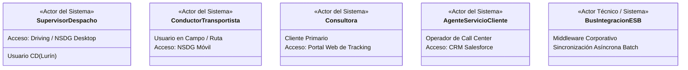

# Diagrama General de Casos de Uso del Sistema (CUS) — Proceso AS-IS

> **Proyecto:** Diseño e Implementación de Arquitectura Empresarial — Caso Yanbal Perú  
> **Área Operativa:** Cadena de Distribución y Transporte  
> **Alcance del Proceso:** Despacho $\longrightarrow$ Transporte/Ruta $\longrightarrow$ Llegada $\longrightarrow$ Entrega $\longrightarrow$ Actualización $\longrightarrow$ Consulta  
> **Marco Metodológico:** RUP (*Rational Unified Process*) — Modelo de Casos de Uso del Sistema / UML 2.5 / UTP APF1 (§ 3.3, ítem 6 y Sesión 8)  
>
> **Navegación del Módulo CUS:**  
> [[01 - Diagrama General de Casos de Uso del Sistema (CUS)]] | [[02 - Especificación y Fichas Técnicas Oficiales de Casos de Uso]]  
> **Diagramas PlantUML:**  
> [[CUS_Diagrama_General.puml]] | [[CUS_Subsistema_Despacho_Transporte.puml]] | [[CUS_Subsistema_Entrega_Consulta.puml]]  
> **Enlaces a Requerimientos y CUN:**  
> [[01 - Matriz Consolidada de Requerimientos]] | [[02 - Especificación de Requerimientos Funcionales]] | [[01 - Diagrama General de Casos de Uso del Negocio (CUN)]]  
> **Enlaces a Dominio y Objetos:**  
> [[01 - Diagrama de Clases de Dominio (Nivel Dominio)]] | [[01 - Modelo de Objetos del Negocio (MON)]]

---

## 1. Fundamentación y Propósito Metodológico

El **Modelo de Casos de Uso del Sistema (CUS)** documenta las capacidades y funcionalidades de software que los sistemas de información proveen a los usuarios humanos y a otros sistemas para soportar las actividades operativas de la cadena logística de **Yanbal Perú** en su estado actual (**AS-IS**).

Conforme a las directrices de la **Guía Oficial de Propuesta de Proyecto Final (UTP APF1, § 3.3, ítem 6)** y la **Sesión 8 (Ingeniería de Requerimientos y Casos de Uso)**:
1. **Diferenciación estricta CUN vs. CUS:** Mientras que los Casos de Uso del Negocio (`CUN`) modelan los procesos organizacionales de valor observable, los `CUS` modelan la **interacción directa entre un actor y un componente de software**.
2. **Derivación Biunívoca de Requerimientos:** Cada uno de los **12 Requerimientos Funcionales (`RF-01` a `RF-12`)** se materializa en exactamente un Caso de Uso del Sistema (`CUS-01` a `CUS-12`).
3. **Relaciones Estándar UML 2.5:** Se aplican rigurosamente las relaciones de comunicación, inclusión obligatoria (`<<include>>`) y extensión condicional (`<<extend>>`).

---

## 2. Actores del Sistema de Información

Los actores representan los roles humanos y sistemas externos que interactúan directamente con las interfaces y servicios del ecosistema tecnológico AS-IS:



| Actor del Sistema | Tipo de Actor | Sistema / Interfaz Utilizada | Responsabilidad en el Sistema |
|:---|:---:|:---|:---|
| **Supervisor de Despacho** | Humano / Interno | **Driving / NSDG (Desktop)** | Clasifica pedidos por destino, vincula transportistas, asocia promesas de entrega y registra la salida física de muelle. |
| **Conductor / Transportista** | Humano / Externo | **NSDG Móvil (App de Campo)** | Registra el inicio de ruta, confirma la entrega física con receptor y DNI, reporta fallas y registra retornos hacia el CD. |
| **Consultora / Consultor** | Humano / Externo | **Portal Web de Tracking** | Consulta la situación de su pedido mediante N° de Pedido o Código de Consultora y visualiza los datos del receptor real. |
| **Agente de Servicio al Cliente** | Humano / Interno | **Salesforce (Cellforce CRM)** | Consulta el estatus y receptor real para absolver consultas telefónicas y gestionar reclamos de consultoras. |
| **Bus de Integración (ESB)** | Sistema / Middleware | **Bus Corporativo Yanbal** | Procesa y transmite los eventos y estados registrados en campo hacia las bases corporativas (con desfase AS-IS de ~2h). |

---

## 3. Catálogo de los 12 Casos de Uso del Sistema (CUS)

Los 12 CUS se estructuran en **5 subsistemas lógicos** correspondientes a la cadena de valor de distribución:

| Código CUS | Nombre del Caso de Uso del Sistema | Subsistema Lógico | Actor Principal | RF Soportado | CUN Vinculado |
|:---:|:---|:---|:---|:---:|:---:|
| **`CUS-01`** | **Clasificar Pedidos Geográficamente** | Subsistema de Despacho | Supervisor de Despacho | `RF-01` | `CUN-01` |
| **`CUS-02`** | **Asignar Transportista y Modalidad** | Subsistema de Despacho | Supervisor de Despacho | `RF-02` | `CUN-01` |
| **`CUS-03`** | **Registrar Salida de Despacho** | Subsistema de Despacho | Supervisor de Despacho | `RF-03` | `CUN-01` |
| **`CUS-04`** | **Asociar Promesa Estimada de Entrega** | Subsistema de Despacho | Supervisor de Despacho | `RF-04` | `CUN-01` |
| **`CUS-05`** | **Registrar Inicio de Traslado** | Subsistema de Transporte y Ruta | Conductor / Transportista | `RF-05` | `CUN-02` |
| **`CUS-06`** | **Registrar Confirmación de Entrega** | Subsistema de Entrega y Contingencias | Conductor / Transportista | `RF-06` | `CUN-03` |
| **`CUS-07`** | **Registrar Identidad del Receptor** | Subsistema de Entrega y Contingencias | Conductor / Transportista | `RF-07` | `CUN-03` |
| **`CUS-08`** | **Registrar Entrega Fallida por Incidencia** | Subsistema de Entrega y Contingencias | Conductor / Transportista | `RF-08` | `CUN-04` |
| **`CUS-09`** | **Registrar Orden de Retorno de Carga** | Subsistema de Entrega y Contingencias | Conductor / Transportista | `RF-09` | `CUN-04` |
| **`CUS-10`** | **Sincronizar Estados de Distribución** | Subsistema de Sincronización | Bus de Integración (ESB) | `RF-10` | *Transversal* |
| **`CUS-11`** | **Consultar Trazabilidad de Pedido** | Subsistema de Consulta y Seguimiento | Consultora / Agente SAC | `RF-11` | `CUN-05` |
| **`CUS-12`** | **Visualizar Información del Receptor Real** | Subsistema de Consulta y Seguimiento | Consultora / Agente SAC | `RF-12` | `CUN-05` |

---

## 4. Diagrama General de Casos de Uso del Sistema (Mermaid)

El siguiente diagrama modela la arquitectura integral de los Casos de Uso del Sistema, delimitando los 5 subsistemas con sus actores y relaciones de inclusión y extensión:

```mermaid
flowchart LR
    %% Actores del Sistema
    subgraph ACTORES ["Actores del Sistema"]
        ACT_SUP(["Supervisor de Despacho"]):::actorStyle
        ACT_CON(["Conductor / Transportista"]):::actorStyle
        ACT_BUS(["Bus de Integración ESB"]):::systemActorStyle
        ACT_CLI(["Consultora / Consultor"]):::actorStyle
        ACT_SAC(["Agente Servicio al Cliente"]):::actorStyle
    end

    %% Subsistemas de Casos de Uso
    subgraph S1 ["1. Subsistema de Despacho (Driving / NSDG CD)"]
        CU01(["CUS-01: Clasificar Pedidos Geográficamente"]):::usecaseStyle
        CU02(["CUS-02: Asignar Transportista y Modalidad"]):::usecaseStyle
        CU03(["CUS-03: Registrar Salida de Despacho"]):::usecaseStyle
        CU04(["CUS-04: Asociar Promesa Estimada de Entrega"]):::usecaseStyle
    end

    subgraph S2 ["2. Subsistema de Tránsito y Ruta (NSDG Móvil)"]
        CU05(["CUS-05: Registrar Inicio de Traslado"]):::usecaseStyle
    end

    subgraph S3 ["3. Subsistema de Entrega y Contingencias (NSDG Móvil)"]
        CU06(["CUS-06: Registrar Confirmación de Entrega"]):::usecaseStyle
        CU07(["CUS-07: Registrar Identidad del Receptor"]):::usecaseStyle
        CU08(["CUS-08: Registrar Entrega Fallida por Incidencia"]):::usecaseStyle
        CU09(["CUS-09: Registrar Orden de Retorno de Carga"]):::usecaseStyle
    end

    subgraph S4 ["4. Subsistema de Sincronización (Bus ESB)"]
        CU10(["CUS-10: Sincronizar Estados de Distribución"]):::usecaseStyle
    end

    subgraph S5 ["5. Subsistema de Consulta y Seguimiento (Portal / CRM)"]
        CU11(["CUS-11: Consultar Trazabilidad de Pedido"]):::usecaseStyle
        CU12(["CUS-12: Visualizar Información del Receptor Real"]):::usecaseStyle
    end

    %% Asociaciones de Actores con Casos de Uso
    ACT_SUP --> CU01
    ACT_SUP --> CU02
    ACT_SUP --> CU03
    ACT_SUP --> CU04

    ACT_CON --> CU05
    ACT_CON --> CU06
    ACT_CON --> CU08

    ACT_BUS --> CU10

    ACT_CLI --> CU11
    ACT_SAC --> CU11

    %% Relaciones <<include>> y <<extend>>
    CU06 -.->|<<include>>| CU07
    CU09 -.->|<<extend>><br/>[Bulto físico presente]| CU08
    CU11 -.->|<<include>>| CU12

    classDef actorStyle fill:#E1F5FE,stroke:#0288D1,stroke-width:2px,color:#01579B;
    classDef systemActorStyle fill:#ECEFF1,stroke:#455A64,stroke-width:2px,color:#263238;
    classDef usecaseStyle fill:#FFFDE7,stroke:#FBC02D,stroke-width:1.5px,color:#F57F17;
```

---

## 5. Fundamentación de Relaciones `<<include>>` y `<<extend>>`

En estricta adhesión a los estándares UML 2.5 de la Sesión 8:

1. **`CUS-06` `<<include>>` `CUS-07`:**
   - **Semántica:** Al registrar una entrega conforme en destino, el sistema **requiere obligatoriamente** ejecutar `CUS-07 (Registrar Identidad del Receptor)` para capturar si recibió la titular o una persona autorizada con su respectivo DNI y parentesco. La entrega no puede cerrarse en el software sin esta captura.
2. **`CUS-09` `<<extend>>` `CUS-08`:**
   - **Semántica:** `CUS-09 (Registrar Orden de Retorno de Carga)` es una funcionalidad condicional que extiende a `CUS-08 (Registrar Entrega Fallida)`. Solo se ejecuta si se satisface el **Punto de Extensión:** `[Bulto físico presente]` (casos de retraso o daño material). Si la falla es por pérdida o sustracción de mercadería, no se genera orden de retorno físico.
3. **`CUS-11` `<<include>>` `CUS-12`:**
   - **Semántica:** Cuando una consultora o un agente consulta un pedido que ya cuenta con estado de entrega, el sistema incluye obligatoriamente la visualización de los datos de recepción real para resolver y prevenir el problema **PR-05**.

---

## 6. Matriz de Trazabilidad Integral: CUS $\longleftrightarrow$ RF $\longleftrightarrow$ CUN $\longleftrightarrow$ RNF

| Caso de Uso del Sistema | Requerimiento Funcional | Caso de Uso del Negocio | Actividad AS-IS | Requerimiento No Funcional Asociado |
|:---|:---:|:---:|:---:|:---|
| **CUS-01: Clasificar Pedidos Geográficamente** | `RF-01` | `CUN-01` | `ACT-02` | `RNF-02` (24 departamentos), `RNF-05` (Control de roles) |
| **CUS-02: Asignar Transportista y Modalidad** | `RF-02` | `CUN-01` | `ACT-03` | `RNF-02` (3 modalidades de transporte) |
| **CUS-03: Registrar Salida de Despacho** | `RF-03` | `CUN-01` | `ACT-05` | `RNF-05` (Rol supervisor), `RNF-07` (Usabilidad en muelle) |
| **CUS-04: Asociar Promesa Estimada de Entrega** | `RF-04` | `CUN-01` | `ACT-04` | `RNF-02` (24h Lima / 7d provincias) |
| **CUS-05: Registrar Inicio de Traslado** | `RF-05` | `CUN-02` | `ACT-06` | `RNF-03` (Gran volumen), `RNF-07` (Operatividad móvil) |
| **CUS-06: Registrar Confirmación de Entrega** | `RF-06` | `CUN-03` | `ACT-08` | `RNF-06` (Seguridad informática), `RNF-07` (Usabilidad) |
| **CUS-07: Registrar Identidad del Receptor** | `RF-07` | `CUN-03` | `ACT-09` | `RNF-06` (Validación de identidad DNI/CE) |
| **CUS-08: Registrar Entrega Fallida por Incidencia** | `RF-08` | `CUN-04` | `ACT-10` | `RNF-05` (Causales estrictas: retraso, pérdida, daño) |
| **CUS-09: Registrar Orden de Retorno de Carga** | `RF-09` | `CUN-04` | `ACT-11` | `RNF-05` (Logística inversa con bulto presente) |
| **CUS-10: Sincronizar Estados de Distribución** | `RF-10` | *Transversal* | `ACT-12` | `RNF-01` (Latencia 2h $\rightarrow$ $\le 30$ min), `RNF-04` (Bus ESB) |
| **CUS-11: Consultar Trazabilidad de Pedido** | `RF-11` | `CUN-05` | `ACT-13` | `RNF-03` (Alta concurrencia y disponibilidad web/CRM) |
| **CUS-12: Visualizar Información del Receptor Real** | `RF-12` | `CUN-05` | `ACT-14` | `RNF-05` (Visibilidad oportuna mitigando PR-05) |

---

## 7. Fichas Técnicas Oficiales

La especificación completa, paso a paso, con flujos normales y alternativos conforme a la plantilla oficial UTP (Sesión 8) se encuentra en:  
👉 **[[02 - Especificación y Fichas Técnicas Oficiales de Casos de Uso]]**
