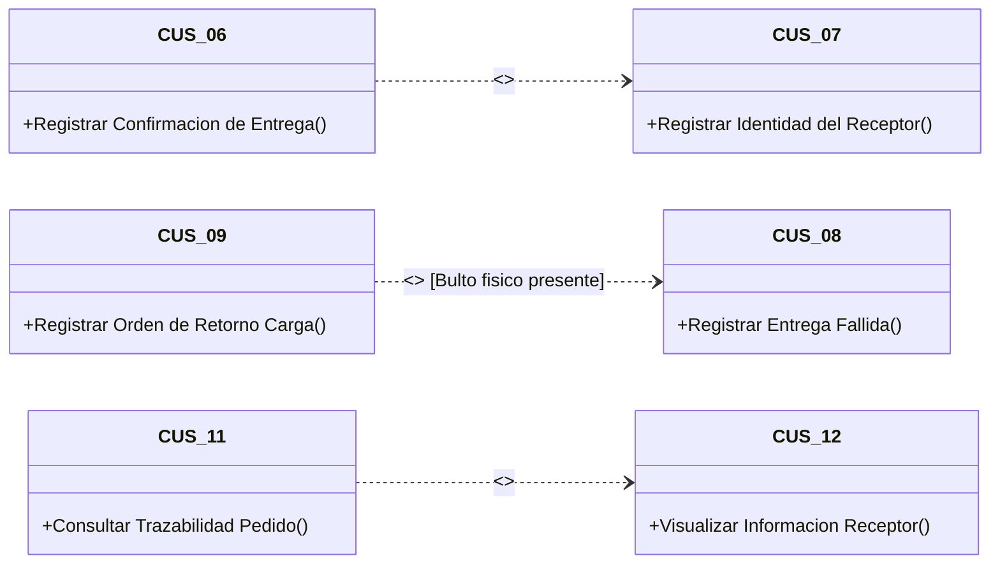

# Especificación y Fichas Técnicas Oficiales de Casos de Uso del Sistema (CUS) — Proceso AS-IS

> **Proyecto:** Diseño e Implementación de Arquitectura Empresarial — Caso Yanbal Perú  
> **Área Operativa:** Cadena de Distribución y Transporte  
> **Alcance del Proceso:** Despacho $\longrightarrow$ Transporte/Ruta $\longrightarrow$ Llegada $\longrightarrow$ Entrega $\longrightarrow$ Actualización $\longrightarrow$ Consulta  
> **Marco Metodológico:** RUP (*Rational Unified Process*) — Plantilla Estándar Oficial UTP (APF1 § 3.3, ítem 6 y Sesión 8)  
>
> **Navegación del Módulo CUS:**  
> [[01 - Diagrama General de Casos de Uso del Sistema (CUS)]] | [[02 - Especificación y Fichas Técnicas Oficiales de Casos de Uso]]  
> **Diagramas PlantUML:**  
> [[CUS_Diagrama_General.puml]] | [[CUS_Subsistema_Despacho_Transporte.puml]] | [[CUS_Subsistema_Entrega_Consulta.puml]]  
> **Enlaces a Requerimientos y CUN:**  
> [[01 - Matriz Consolidada de Requerimientos]] | [[02 - Especificación de Requerimientos Funcionales]] | [[01 - Diagrama General de Casos de Uso del Negocio (CUN)]]  
> **Enlaces a Dominio y Objetos:**  
> [[01 - Diagrama de Clases de Dominio (Nivel Dominio)]] | [[01 - Modelo de Objetos del Negocio (MON)]]

---

## 1. Estructura y Estándar Metodológico UTP

Conforme a las directrices de la **Sesión 8** y la guía **UTP APF1**, cada Caso de Uso del Sistema se especifica rigurosamente mediante su **Ficha Técnica Oficial**, estructurada en los siguientes apartados:

1. **Código y Nombre del Caso de Uso**: Identificador biunívoco (`CUS-XX`) y denominación en verbo infinitivo.
2. **Actor(es)**: Rol humano o sistema técnico que interactúa con la interfaz.
3. **Descripción**: Propósito y contexto funcional del caso de uso.
4. **Precondición**: Estado o condiciones que deben cumplirse en el sistema antes de disparar el flujo.
5. **Flujo Normal (Básico)**: Secuencia numerada de interacciones paso a paso entre el Actor y el Sistema.
6. **Flujos Alternativos / Excepciones**: Desviaciones y tratamientos de error con numeración correlativa al paso normal (ej. `3.1`, `4.1`).
7. **Postcondición**: Estado final de éxito registrado en las bases de datos del sistema.
8. **Relaciones Estándar UML**: Vínculos de inclusión (`<<include>>`) o extensión condicional (`<<extend>>`).
9. **Requerimientos No Funcionales Asociados**: Vínculo a `RNF-XX`.

---

## 2. Índice del Catálogo de Fichas Técnicas

| Subsistema Lógico | Código CUS | Nombre del Caso de Uso | Actor Principal | RF | Relaciones UML |
|:---|:---:|:---|:---|:---:|:---:|
| **1. Despacho** | `CUS-01` | Clasificar Pedidos Geográficamente | Supervisor de Despacho | `RF-01` | — |
| **1. Despacho** | `CUS-02` | Asignar Transportista y Modalidad | Supervisor de Despacho | `RF-02` | — |
| **1. Despacho** | `CUS-03` | Registrar Salida de Despacho | Supervisor de Despacho | `RF-03` | — |
| **1. Despacho** | `CUS-04` | Asociar Promesa Estimada de Entrega | Supervisor de Despacho | `RF-04` | — |
| **2. Transporte y Ruta** | `CUS-05` | Registrar Inicio de Traslado | Conductor / Transportista | `RF-05` | — |
| **3. Entrega y Contingencias** | `CUS-06` | Registrar Confirmación de Entrega | Conductor / Transportista | `RF-06` | `<<include>> CUS-07` |
| **3. Entrega y Contingencias** | `CUS-07` | Registrar Identidad del Receptor | Conductor / Transportista | `RF-07` | *Incluido por CUS-06* |
| **3. Entrega y Contingencias** | `CUS-08` | Registrar Entrega Fallida por Incidencia | Conductor / Transportista | `RF-08` | `<<extend>> por CUS-09` |
| **3. Entrega y Contingencias** | `CUS-09` | Registrar Orden de Retorno de Carga | Conductor / Transportista | `RF-09` | *Extiende a CUS-08* |
| **4. Sincronización** | `CUS-10` | Sincronizar Estados de Distribución | Bus de Integración (ESB) | `RF-10` | — |
| **5. Consulta y Seguimiento** | `CUS-11` | Consultar Trazabilidad de Pedido | Consultora / Agente SAC | `RF-11` | `<<include>> CUS-12` |
| **5. Consulta y Seguimiento** | `CUS-12` | Visualizar Información del Receptor Real | Consultora / Agente SAC | `RF-12` | *Incluido por CUS-11* |

---

## 3. Especificación Detallada de Fichas Técnicas (CUS-01 al CUS-12)

---

### CUS-01: Clasificar Pedidos Geográficamente

| Campo Metodológico | Detalle de Especificación |
|:---|:---|
| **Código** | **CUS-01** |
| **Nombre** | **Clasificar Pedidos Geográficamente** |
| **Subsistema** | Subsistema de Despacho (Driving / NSDG Desktop) |
| **Actor(es)** | **Supervisor de Despacho** (Usuario CD Lurín) |
| **Descripción** | Permite clasificar y canalizar los pedidos según su destino geográfico nacional (departamento, provincia, distrito y tipificación de ciudad: principal o alejada), utilizando los datos de entrega vinculados al pedido para organizar lotes de carga territorial. |
| **Precondición** | 1. El Supervisor de Despacho ha iniciado sesión en el sistema Driving / NSDG con credenciales válidas y rol asignado (`RNF-05`). 2. Los pedidos se encuentran en estado preliminar transferidos desde facturación/empaque con dirección de entrega registrada. |
| **Flujo Normal** | **1.** El Supervisor ingresa al módulo de *Zonificación y Despacho* del sistema. **2.** El sistema presenta la lista de pedidos pendientes de clasificación agrupables por región geográfica. **3.** El Supervisor selecciona los criterios de filtrado territorial (departamento entre los 24 reconocidos, provincia y tipificación de localidad: principal o alejada). **4.** El sistema consulta la base de datos y presenta los pedidos correspondientes al destino seleccionado. **5.** El Supervisor valida la congruencia del lote de pedidos y confirma la clasificación territorial. **6.** El sistema asigna el código de lote geográfico a los pedidos y actualiza su estado operativo a clasificado para despacho. |
| **Flujos Alternativos** | **3.1 Destino geográfico o ubigeo no reconocido:** - Si los datos del pedido no corresponden a los 24 departamentos o presentan incoherencia en la dirección domiciliaria: &nbsp;&nbsp;a) El sistema emite la alerta: *"Inconsistencia en datos de destino geográfico - Pedido retenido en muelle"*. &nbsp;&nbsp;b) El sistema marca el pedido en bandera de incidencia administrativa. &nbsp;&nbsp;c) El Supervisor remite el pedido a coordinación para subsanación. **4.1 No existen pedidos pendientes para el departamento seleccionado:** - El sistema muestra el mensaje informativo: *"No se registran bultos pendientes para la zona seleccionada"* y retorna al paso 3. |
| **Postcondición** | Los pedidos quedan formalmente clasificados por zona geográfica y listos para la asignación de transportista y modalidad de despacho. |
| **Relaciones UML** | Ninguna. |
| **RNF Asociados** | `RNF-02` (Soporte a los 24 departamentos del país), `RNF-05` (Acceso exclusivo por rol Supervisor), `RNF-07` (Usabilidad adaptada a la dinámica de muelle). |

---

### CUS-02: Asignar Transportista y Modalidad

| Campo Metodológico | Detalle de Especificación |
|:---|:---|
| **Código** | **CUS-02** |
| **Nombre** | **Asignar Transportista y Modalidad** |
| **Subsistema** | Subsistema de Despacho (Driving / NSDG Desktop) |
| **Actor(es)** | **Supervisor de Despacho** (Usuario CD Lurín) |
| **Descripción** | Permite vincular a los pedidos previamente zonificados el socio logístico responsable y la modalidad de transporte aplicable (terrestre, bimodal o aérea), garantizando la custodia formal del envío. |
| **Precondición** | 1. Los pedidos deben haber sido clasificados geográficamente (`CUS-01`). 2. El catálogo de socios logísticos y modalidades de envío se encuentra activo en el sistema. |
| **Flujo Normal** | **1.** El Supervisor accede a la sección de *Asignación de Transporte* y selecciona el lote de pedidos clasificados. **2.** El sistema despliega el detalle de pedidos clasificados junto con las opciones de proveedores logísticos homologados. **3.** El Supervisor selecciona el socio logístico asignado (ej. Olva, Urbano, Scharff u operador provincial). **4.** El Supervisor selecciona la modalidad de transporte correspondiente: *Terrestre*, *Bimodal* o *Aérea* (`RNF-02`). **5.** El Supervisor solicita registrar la vinculación. **6.** El sistema valida que el transportista cuente con cobertura en la zona y modalidad indicada. **7.** El sistema vincula el transportista y la modalidad al lote de pedidos y genera el identificador de despacho. |
| **Flujos Alternativos** | **6.1 Transportista no habilitado para la modalidad seleccionada:** - Si el transportista no opera la modalidad seleccionada (ej. operador sin convenio aéreo): &nbsp;&nbsp;a) El sistema notifica: *"El socio logístico seleccionado no opera bajo la modalidad elegida para esta ruta"*. &nbsp;&nbsp;b) El sistema solicita al Supervisor seleccionar otro operador o cambiar la modalidad. &nbsp;&nbsp;c) El flujo retorna al paso 3. **6.2 Incompatibilidad territorial de cobertura:** - Si el socio no cubre la provincia de destino: &nbsp;&nbsp;a) El sistema bloquea la asignación y sugiere los socios logísticos alternativos habilitados. |
| **Postcondición** | El pedido almacena la relación persistente con el socio logístico y la modalidad de transporte seleccionada. |
| **Relaciones UML** | Ninguna. |
| **RNF Asociados** | `RNF-02` (Cobertura multimodal: terrestre, bimodal, aérea en 24 departamentos), `RNF-05` (Control de roles), `RNF-07` (Operatividad). |

---

### CUS-03: Registrar Salida de Despacho

| Campo Metodológico | Detalle de Especificación |
|:---|:---|
| **Código** | **CUS-03** |
| **Nombre** | **Registrar Salida de Despacho** |
| **Subsistema** | Subsistema de Despacho (Driving / NSDG Desktop) |
| **Actor(es)** | **Supervisor de Despacho** (Usuario CD Lurín) |
| **Descripción** | Permite asentar formalmente en el sistema la salida física del pedido desde la zona de muelle del Centro de Distribución de Lurín, transfiriendo la custodia de la carga al transportista y cambiando su estado a *"Despachado"*. |
| **Precondición** | 1. El pedido cuenta con socio logístico y modalidad asignados (`CUS-02`). 2. La carga física se encuentra verificada y consolidada en rampa de salida. |
| **Flujo Normal** | **1.** El Supervisor escanea el código de barras del bulto o ingresa el Número de Pedido en la interfaz de muelle de salida. **2.** El sistema verifica que el pedido cuente con transportista y modalidad asociados. **3.** El sistema muestra los datos del envío y solicita confirmar la entrega física al transportista. **4.** El Supervisor confirma la salida física del vehículo de muelle. **5.** El sistema actualiza el estado del pedido a *"Despachado"* (o *"Pedido despachado"*). **6.** El sistema estampa los datos de auditoría: fecha y hora de despacho, identificador de usuario y muelle de salida. **7.** El sistema emite mensaje de confirmación de salida exitosa. |
| **Flujos Alternativos** | **2.1 Pedido no cuenta con transportista asignado:** - Si el pedido no pasó por `CUS-02`: &nbsp;&nbsp;a) El sistema bloquea el registro: *"No se puede despachar un pedido sin transportista y modalidad vinculada"*. &nbsp;&nbsp;b) El sistema deriva el pedido a la pantalla de asignación (`CUS-02`). **2.2 Bulto físico dañado en muelle antes de salida:** - Si el Supervisor detecta deterioro físico del empaque en rampa: &nbsp;&nbsp;a) El Supervisor marca la opción *"Rechazo en muelle por merma/daño"*. &nbsp;&nbsp;b) El sistema cancela el despacho y devuelve el pedido a acondicionamiento interno. |
| **Postcondición** | El pedido pasa formalmente al estado *"Despachado"* en la base de datos de despacho del CD y se registra en la cola de sincronización. |
| **Relaciones UML** | Ninguna. |
| **RNF Asociados** | `RNF-05` (Rol operativo de supervisión), `RNF-06` (Seguridad informática y trazabilidad de sesión), `RNF-07` (Facilidad de uso en muelle). |

---

### CUS-04: Asociar Promesa Estimada de Entrega

| Campo Metodológico | Detalle de Especificación |
|:---|:---|
| **Código** | **CUS-04** |
| **Nombre** | **Asociar Promesa Estimada de Entrega** |
| **Subsistema** | Subsistema de Despacho (Driving / NSDG Desktop) |
| **Actor(es)** | **Supervisor de Despacho** / Regla Automática de Despacho |
| **Descripción** | Permite asociar y visualizar el plazo y promesa estimada de entrega del pedido en función de su región de destino y modalidad de transporte, estableciendo el estándar operativo de Yanbal: promesa de 24 horas para Lima Metropolitana y rango de hasta 7 días para provincias. |
| **Precondición** | 1. El pedido ha sido clasificado por destino geográfico (`CUS-01`). 2. La fecha y hora de salida de despacho se encuentran registradas (`CUS-03`). |
| **Flujo Normal** | **1.** El Supervisor o el sistema procesa el lote de pedidos despachados. **2.** El sistema evalúa el departamento y localidad de destino del pedido. **3.** Si el destino es Lima Metropolitana o Callao, el sistema asocia la promesa estándar de entrega de **24 horas**. **4.** Si el destino es una provincia en los departamentos restantes (1 a 23), el sistema asocia un plazo estimado dentro del rango de **hasta 7 días**, ajustado por la tipificación de ciudad (principal o alejada). **5.** El sistema calcula la fecha estimada límite de cumplimiento y la almacena vinculada al registro del pedido. **6.** El sistema muestra al Supervisor el resumen de promesas asociadas al lote despachado. |
| **Flujos Alternativos** | **2.1 Destino provincial catalogado como zona de difícil acceso / emergencia vial:** - Si la provincia presenta alerta operativa conocida por el supervisor: &nbsp;&nbsp;a) El Supervisor selecciona la opción *"Ajuste justificado de plazo de contingencia territorial"*. &nbsp;&nbsp;b) El sistema registra la observación y amplía el margen dentro de los parámetros corporativos permitidos. |
| **Postcondición** | El pedido almacena la promesa de entrega y el plazo estimado, disponibles para consulta por parte de las consultoras y Servicio al Cliente. |
| **Relaciones UML** | Ninguna. |
| **RNF Asociados** | `RNF-02` (Soporte a promesas en los 24 departamentos), `RNF-05` (Control de roles), `RNF-07` (Operatividad del cálculo). |

---

### CUS-05: Registrar Inicio de Traslado

| Campo Metodológico | Detalle de Especificación |
|:---|:---|
| **Código** | **CUS-05** |
| **Nombre** | **Registrar Inicio de Traslado** |
| **Subsistema** | Subsistema de Transporte y Ruta (NSDG Móvil) |
| **Actor(es)** | **Conductor / Transportista** (Socio Logístico en Campo) |
| **Descripción** | Permite al transportista registrar en su aplicativo móvil que ha iniciado el traslado físico efectivo de la carga hacia la localidad de entrega, actualizando el estado del pedido a *"En Ruta"*. |
| **Precondición** | 1. El transportista cuenta con el aplicativo NSDG Móvil autenticado en su dispositivo. 2. El pedido se encuentra en estado *"Despachado"* en el sistema. |
| **Flujo Normal** | **1.** El Conductor / Transportista inicia su jornada de reparto en el aplicativo NSDG Móvil. **2.** El sistema móvil despliega la hoja de ruta con la relación de pedidos despachados bajo su custodia. **3.** El transportista selecciona el lote o pedido individual a trasladar. **4.** El transportista pulsa la acción *"Iniciar Traslado / En Ruta"*. **5.** El sistema actualiza el estado del pedido a *"En Ruta"* (o *"Pedido en ruta"*). **6.** El sistema almacena la marca de tiempo (timestamp) de inicio de viaje en la base de datos local del dispositivo móvil. **7.** El sistema muestra la confirmación de estado actualizado y posiciona el pedido en la cola de entregas de la jornada. |
| **Flujos Alternativos** | **4.1 Dispositivo móvil sin conexión a red de datos en zona de muelle:** - Si el transportista no tiene cobertura celular al pulsar el botón: &nbsp;&nbsp;a) El aplicativo móvil almacena el cambio de estado a *"En Ruta"* en almacenamiento local (*offline cache*). &nbsp;&nbsp;b) El sistema emite notificación: *"Estado guardado localmente. Se transmitirá al recuperar señal celular"*. |
| **Postcondición** | El pedido queda en estado *"En Ruta"*, marcando formalmente el inicio del tránsito logístico hacia la dirección de la consultora. |
| **Relaciones UML** | Ninguna. |
| **RNF Asociados** | `RNF-03` (Gran volumen de transacciones de campo), `RNF-05` (Rol operativo de transportista sin permisos de edición administrativa), `RNF-07` (Facilidad de uso en aplicativo móvil). |

---

### CUS-06: Registrar Confirmación de Entrega

| Campo Metodológico | Detalle de Especificación |
|:---|:---|
| **Código** | **CUS-06** |
| **Nombre** | **Registrar Confirmación de Entrega** |
| **Subsistema** | Subsistema de Entrega y Contingencias (NSDG Móvil) |
| **Actor(es)** | **Conductor / Transportista** (Socio Logístico en Campo) |
| **Descripción** | Permite registrar que el pedido ha sido completado y entregado físicamente con éxito en el domicilio de destino, actualizando su estado a *"Entregado"*. Como parte obligatoria de este proceso, el sistema ejecuta la captura de identidad del receptor mediante `CUS-07`. |
| **Precondición** | 1. El pedido se encuentra en estado *"En Ruta"* asignado al transportista en sesión. 2. El transportista se encuentra presente en la dirección domiciliaria de destino. |
| **Flujo Normal** | **1.** El transportista ubica el pedido en su lista de entregas y pulsa *"Efectuar Entrega"*. **2.** El sistema muestra los datos de la entrega: Número de Pedido, Nombre de la Consultora y Dirección. **3.** **El sistema ejecuta obligatoriamente el caso de uso `<<include>> CUS-07 (Registrar Identidad del Receptor)`** para capturar quién recibe físicamente el paquete. **4.** El sistema valida que los datos del receptor hayan sido ingresados satisfactoriamente en `CUS-07`. **5.** El transportista pulsa la confirmación final de *"Cerrar Entrega Exitosa"*. **6.** El sistema actualiza el estado del pedido a *"Entregado"* (o *"Pedido entregado"*). **7.** El sistema captura la fecha y hora exacta del registro y almacena la transacción en la base de datos del aplicativo móvil. **8.** El sistema emite mensaje de confirmación y retira el pedido de la lista de entregas pendientes de la ruta. |
| **Flujos Alternativos** | **3.1 El transportista reporta que no se pudo concretar la entrega:** - Si la entrega no se puede efectuar por alguna contingencia (retraso insalvable, pérdida o daño): &nbsp;&nbsp;a) El transportista cancela la confirmación de entrega. &nbsp;&nbsp;b) El sistema deriva el control a `CUS-08 (Registrar Entrega Fallida por Incidencia)`. **4.1 Datos de receptor incompletos:** - Si no se concluye satisfactoriamente `CUS-07`: &nbsp;&nbsp;a) El sistema impide confirmar la entrega: *"Debe consignar los datos del receptor real antes de cerrar la entrega"*. &nbsp;&nbsp;b) El flujo retorna al paso 3. **7.1 Dispositivo móvil sin conectividad de datos en punto de entrega:** - El sistema guarda la entrega y receptor en base de datos local para su posterior transmisión por el Bus ESB. |
| **Postcondición** | El pedido adquiere el estado final de éxito *"Entregado"* con los datos del receptor real asociados, listo para sincronizarse con las plataformas corporativas. |
| **Relaciones UML** | **`<<include>>` `CUS-07 (Registrar Identidad del Receptor)`**: Es obligatorio capturar al receptor real para poder registrar la entrega conforme. |
| **RNF Asociados** | `RNF-01` (Generación del estado que debe sincronizarse en $\le 30$ min), `RNF-05` (Rol operativo de transportista), `RNF-06` (Seguridad y no repudio del registro), `RNF-07` (Operatividad fluida en campo). |

---

### CUS-07: Registrar Identidad del Receptor

| Campo Metodológico | Detalle de Especificación |
|:---|:---|
| **Código** | **CUS-07** |
| **Nombre** | **Registrar Identidad del Receptor** |
| **Subsistema** | Subsistema de Entrega y Contingencias (NSDG Móvil) |
| **Actor(es)** | **Conductor / Transportista** (Invocado como inclusión de `CUS-06`) |
| **Descripción** | Permite capturar y registrar en el sistema la identidad de la persona que recibe físicamente el paquete en el domicilio de destino, diferenciando explícitamente si quien recibe es la Consultora Titular o una Persona Autorizada (con DNI y parentesco/relación), dando solución directa al problema de negocio **PR-05**. |
| **Precondición** | El transportista ha iniciado el proceso de confirmación de entrega (`CUS-06`). |
| **Flujo Normal** | **1.** El sistema habilita la pantalla de *Identificación del Receptor*. **2.** El transportista consulta a la persona que recibe el paquete y selecciona en el sistema la condición de recepción: &nbsp;&nbsp;&nbsp;&nbsp;a) `Consultora Titular` &nbsp;&nbsp;&nbsp;&nbsp;b) `Persona Autorizada / Tercero` **3.** Si la persona es la **Consultora Titular**: &nbsp;&nbsp;&nbsp;&nbsp;a) El sistema autocompleta el nombre de la consultora. &nbsp;&nbsp;&nbsp;&nbsp;b) El transportista solicita y digita el número de documento de identidad (DNI o Carné de Extranjería). **4.** Si la persona es una **Persona Autorizada / Tercero**: &nbsp;&nbsp;&nbsp;&nbsp;a) El transportista digita los nombres y apellidos completos de la persona receptora. &nbsp;&nbsp;&nbsp;&nbsp;b) El transportista digita el número de DNI / CE del receptor. &nbsp;&nbsp;&nbsp;&nbsp;c) El transportista selecciona el vínculo o parentesco con la titular (ej. familiar directo, conviviente, recepcionista, vecino autorizado). **5.** El transportista pulsa *"Validar Receptor"*. **6.** El sistema valida la consistencia del número de dígitos del documento ingresado (8 dígitos para DNI) y que los campos obligatorios no estén vacíos. **7.** El sistema almacena temporalmente los datos del receptor real y devuelve el control al caso de uso invocador `CUS-06`. |
| **Flujos Alternativos** | **6.1 Documento de identidad no cumple formato numérico:** - Si el DNI no contiene 8 dígitos numéricos válidos: &nbsp;&nbsp;a) El sistema alerta: *"Formato de documento inválido. Verifique el número de DNI/CE"*. &nbsp;&nbsp;b) El transportista corrige el dato y reintenta la validación. **6.2 Persona autorizada se niega a brindar documento de identidad:** - Si la persona autorizada no proporciona documento: &nbsp;&nbsp;a) El transportista selecciona la casilla de excepción operativa: *"Receptor no porta documento físico"*. &nbsp;&nbsp;b) El sistema exige el ingreso obligatorio del nombre completo y observación detallada antes de continuar. |
| **Postcondición** | Los datos del receptor (condición, nombre, DNI y parentesco) quedan estructurados y vinculados al registro de entrega para mitigar reclamos prematuros (`PR-05`). |
| **Relaciones UML** | **Incluido por `CUS-06 (Registrar Confirmación de Entrega)`** mediante la relación `<<include>>`. |
| **RNF Asociados** | `RNF-05` (Responsabilidad de captura por transportista), `RNF-06` (Seguridad informática y protección de datos personales), `RNF-07` (Usabilidad intuitiva en formulario móvil). |

---

### CUS-08: Registrar Entrega Fallida por Incidencia

| Campo Metodológico | Detalle de Especificación |
|:---|:---|
| **Código** | **CUS-08** |
| **Nombre** | **Registrar Entrega Fallida por Incidencia** |
| **Subsistema** | Subsistema de Entrega y Contingencias (NSDG Móvil) |
| **Actor(es)** | **Conductor / Transportista** (Socio Logístico en Campo) |
| **Descripción** | Permite registrar cuando una entrega no puede completarse con éxito en campo, actualizando el estado del pedido a *"Entrega Fallida"* y tipificando la incidencia ocurrida de acuerdo con las causales expresamente confirmadas por el negocio: **retraso, pérdida o daño**. |
| **Precondición** | 1. El pedido se encuentra en estado *"En Ruta"* asignado al transportista. 2. Se ha presentado una contingencia comprobada que impide la entrega física conforme. |
| **Flujo Normal** | **1.** El transportista selecciona el pedido en su aplicativo NSDG Móvil y selecciona la opción *"Reportar Entrega Fallida / Incidencia"*. **2.** El sistema presenta el catálogo oficial de causales de incidencia: &nbsp;&nbsp;&nbsp;&nbsp;a) `Retraso` (contingencia de tiempo, cierre de vía o factor operacional en ruta). &nbsp;&nbsp;&nbsp;&nbsp;b) `Pérdida` (extravío o sustracción de mercadería en trayecto). &nbsp;&nbsp;&nbsp;&nbsp;c) `Daño` (deterioro o merma física del empaque o producto detectado en destino). **3.** El transportista selecciona la causal correspondiente. **4.** El transportista redacta las observaciones descriptivas de la contingencia. **5.** El transportista pulsa *"Registrar Incidencia"*. **6.** El sistema valida la selección y actualiza el estado del pedido a *"Entrega Fallida"* con su causal asociada. **7.** El sistema captura la marca temporal y coordenadas de reporte. **8.** **Punto de Extensión `[Bulto físico presente]`**: Si la causal seleccionada es *Retraso* o *Daño* (la carga física sigue en posesión del transportista), **el sistema ejecuta condicionalmente `<<extend>> CUS-09 (Registrar Orden de Retorno de Carga)`**. **9.** El sistema emite la constancia de entrega fallida registrada y finaliza la atención del bulto. |
| **Flujos Alternativos** | **3.1 Causal seleccionada es 'Pérdida':** - Si la causal es pérdida o robo: &nbsp;&nbsp;a) El sistema no activa el punto de extensión `[Bulto físico presente]`, dado que no existe bulto físico que devolver al CD. &nbsp;&nbsp;b) El sistema genera alerta prioritaria para auditoría y seguridad patrimonial. &nbsp;&nbsp;c) El flujo concluye en el paso 9 sin ejecutar `CUS-09`. |
| **Postcondición** | El pedido pasa formalmente al estado *"Entrega Fallida"* con causal tipificada, bloqueándose para nuevas entregas de la jornada hasta su resolución. |
| **Relaciones UML** | **Extendido por `CUS-09 (Registrar Orden de Retorno de Carga)`** mediante relación `<<extend>>` en el punto de extensión `[Bulto físico presente]`. |
| **RNF Asociados** | `RNF-05` (Registro de incidencias según roles operativos), `RNF-06` (Seguridad e inalterabilidad de la causal reportada), `RNF-07` (Operatividad en contingencias). |

---

### CUS-09: Registrar Orden de Retorno de Carga

| Campo Metodológico | Detalle de Especificación |
|:---|:---|
| **Código** | **CUS-09** |
| **Nombre** | **Registrar Orden de Retorno de Carga** |
| **Subsistema** | Subsistema de Entrega y Contingencias (NSDG Móvil) |
| **Actor(es)** | **Conductor / Transportista** (Extensión condicional de `CUS-08`) |
| **Descripción** | Permite registrar que el transportista inicia el retorno físico del paquete no entregado hacia el Centro de Distribución de Lurín como parte de la logística inversa, vinculando la orden de transporte de retorno al bulto en custodia física. |
| **Precondición** | El pedido ha sido marcado en estado *"Entrega Fallida"* (`CUS-08`) y se cumple la condición de extensión `[Bulto físico presente]` (causales de retraso o daño material). |
| **Flujo Normal** | **1.** El sistema detecta la condición de extensión `[Bulto físico presente]` al concluir la tipificación de `CUS-08`. **2.** El sistema habilita el formulario de *Logística Inversa - Retorno al Centro de Distribución*. **3.** El sistema muestra los datos del bulto físico y solicita confirmación del custodio. **4.** El transportista verifica que el bulto dañado o retrasado se encuentra físicamente asegurado en el vehículo. **5.** El transportista pulsa *"Iniciar Retorno de Carga hacia Almacén"*. **6.** El sistema genera un identificador de orden de retorno logístico. **7.** El sistema actualiza la situación de la carga a *"En Retorno hacia CD Lurín"*. **8.** El sistema entrega al transportista la constancia digital de custodia en retorno y devuelve el control al flujo principal. |
| **Flujos Alternativos** | **4.1 El bulto físico no se encuentra disponible:** - Si el transportista advierte que el paquete no está físicamente disponible para retorno: &nbsp;&nbsp;a) El transportista desmarca la confirmación de bulto presente. &nbsp;&nbsp;b) El sistema rectifica la causal a *"Pérdida"* en `CUS-08`. &nbsp;&nbsp;c) Se anula la orden de retorno físico. |
| **Postcondición** | El pedido cuenta con una orden de logística inversa activa, quedando registrado en tránsito de retorno físico hacia el Centro de Distribución. |
| **Relaciones UML** | **Extiende a `CUS-08 (Registrar Entrega Fallida por Incidencia)`** bajo la condición del punto de extensión: `[Bulto físico presente]`. |
| **RNF Asociados** | `RNF-05` (Control de custodia en logística inversa), `RNF-07` (Usabilidad adaptada a campo). |

---

### CUS-10: Sincronizar Estados de Distribución

| Campo Metodológico | Detalle de Especificación |
|:---|:---|
| **Código** | **CUS-10** |
| **Nombre** | **Sincronizar Estados de Distribución** |
| **Subsistema** | Subsistema de Sincronización (Bus de Integración ESB) |
| **Actor(es)** | **Bus de Integración ESB** (Middleware Técnico / Batch) |
| **Descripción** | Permite transmitir y sincronizar las actualizaciones de estado (Despachado, En Ruta, Entregado, Entrega Fallida) e información de receptor capturadas en campo hacia las bases de datos centrales de Yanbal (repositorios de tracking y CRM), operando en el AS-IS mediante lotes asíncronos con desfase histórico de hasta 2 horas hacia la meta de $\le 30$ minutos. |
| **Precondición** | Existen eventos de cambio de estado o entregas registradas en los sistemas de campo (Driving / NSDG Móvil) pendientes de sincronización. |
| **Flujo Normal** | **1.** El Bus de Integración ESB ejecuta su ciclo programado de sincronización (o recibe disparador por lote de mensajes). **2.** El Bus consulta las colas de eventos de los sistemas de transporte y despacho. **3.** El Bus extrae el lote de transacciones pendientes (estados de pedidos, timestamps y datos del receptor de `CUS-07`). **4.** El Bus valida la integridad de los paquetes de datos y transforma los esquemas a formato corporativo Yanbal. **5.** El Bus transmite las actualizaciones hacia la base de datos de Tracking del Portal Web y el CRM Salesforce. **6.** Los repositorios corporativos confirman la recepción y aplican las actualizaciones a los registros de pedidos. **7.** El Bus de Integración actualiza la marca de agua de sincronización y purga los eventos procesados de la cola activa. |
| **Flujos Alternativos** | **4.1 Error de formato o mensaje corrupto en la cola:** - Si un registro presenta inconsistencia de esquema: &nbsp;&nbsp;a) El Bus traslada el registro fallido a la cola de mensajes no entregados (*Dead-Letter Queue*). &nbsp;&nbsp;b) El Bus continúa procesando el resto del lote sin detener el flujo general. &nbsp;&nbsp;c) Genera una alerta técnica para soporte de TI. **5.1 Pérdida de conectividad con repositorio central (Salesforce o base Web):** - Si el repositorio destino no responde: &nbsp;&nbsp;a) El Bus retiene el lote en cola de reintentos con respaldo exponencial. &nbsp;&nbsp;b) Notifica el incremento de latencia en la monitorización de infraestructura. |
| **Postcondición** | Las actualizaciones de estado y receptores quedan reflejadas en las plataformas corporativas, listas para consulta de las consultoras y agentes de atención. |
| **Relaciones UML** | Ninguna (Caso de uso técnico transversal que habilita la visibilidad en `CUS-11` y `CUS-12`). |
| **RNF Asociados** | `RNF-01` (Reducción del desfase histórico de 2 horas hacia $\le 30$ minutos), `RNF-03` (Capacidad para grandes volúmenes de eventos), `RNF-04` (Interoperabilidad mediante el Bus de Integración corporativo), `RNF-06` (Seguridad informática e integridad de datos). |

---

### CUS-11: Consultar Trazabilidad de Pedido

| Campo Metodológico | Detalle de Especificación |
|:---|:---|
| **Código** | **CUS-11** |
| **Nombre** | **Consultar Trazabilidad de Pedido** |
| **Subsistema** | Subsistema de Consulta y Seguimiento (Portal Web de Tracking / Salesforce CRM) |
| **Actor(es)** | **Consultora / Consultor** (Portal Web) / **Agente de Servicio al Cliente** (Salesforce) |
| **Descripción** | Permite a las consultoras y agentes de atención consultar el estado vigente de un pedido y su promesa estimada de entrega, admitiendo la búsqueda multicriterio mediante *Número de Pedido* o *Código de Consultora*. Cuando el pedido ha sido completado, ejecuta `CUS-12` para desplegar la información del receptor real. |
| **Precondición** | 1. El usuario accede a la interfaz de consulta (Portal Web para consultoras o Salesforce para agentes SAC). 2. El pedido se encuentra registrado en los repositorios corporativos actualizados por el Bus ESB (`CUS-10`). |
| **Flujo Normal** | **1.** El usuario accede a la pantalla de *Seguimiento de Pedidos / Tracking*. **2.** El sistema presenta las opciones de búsqueda: &nbsp;&nbsp;&nbsp;&nbsp;a) Búsqueda por **Número de Pedido**. &nbsp;&nbsp;&nbsp;&nbsp;b) Búsqueda por **Código de Consultora / Cliente**. **3.** El usuario ingresa el parámetro seleccionado y pulsa *"Consultar"*. **4.** El sistema valida que el parámetro cumpla con el formato requerido. **5.** Si la búsqueda fue por **Número de Pedido**: &nbsp;&nbsp;&nbsp;&nbsp;a) El sistema recupera el registro único del pedido. &nbsp;&nbsp;&nbsp;&nbsp;b) Despliega el estado actual (Despachado, En Ruta, Entregado, Entrega Fallida) y la promesa estimada de entrega (24h Lima / hasta 7 días provincias). **6.** Si la búsqueda fue por **Código de Consultora**: &nbsp;&nbsp;&nbsp;&nbsp;a) El sistema recupera la lista de pedidos vigentes asociados a dicho código. &nbsp;&nbsp;&nbsp;&nbsp;b) El usuario selecciona el pedido que desea inspeccionar del listado. &nbsp;&nbsp;&nbsp;&nbsp;c) El sistema despliega el estado y promesa de dicho pedido. **7.** Si el estado del pedido es *"Entregado"*, **el sistema ejecuta obligatoriamente `<<include>> CUS-12 (Visualizar Información del Receptor Real)`** para desplegar quién recibió el paquete en destino. **8.** El usuario visualiza la línea de tiempo completa del pedido y los datos de entrega. |
| **Flujos Alternativos** | **4.1 Parámetro de búsqueda inexistente o no encontrado:** - Si el número de pedido o código de consultora no existe en la base de datos: &nbsp;&nbsp;a) El sistema muestra el mensaje: *"No se encontraron pedidos asociados al criterio ingresado. Verifique el número de pedido o código de consultora"*. &nbsp;&nbsp;b) El flujo retorna al paso 2. **5.1 Pedido en estado 'Entrega Fallida':** - Si el pedido no pudo ser entregado: &nbsp;&nbsp;a) El sistema muestra el estado *"Entrega Fallida"* junto con la causal tipificada (Retraso, Pérdida o Daño) y si se encuentra en retorno hacia CD Lurín. |
| **Postcondición** | El usuario obtiene la visibilidad del estado de su pedido, su promesa de cumplimiento y el detalle del receptor en caso de entregas efectivas. |
| **Relaciones UML** | **`<<include>>` `CUS-12 (Visualizar Información del Receptor Real)`**: Incluido obligatoriamente cuando el pedido consultado cuenta con estado *"Entregado"*. |
| **RNF Asociados** | `RNF-01` (Información visible sujeta al tiempo de propagación), `RNF-03` (Alta concurrencia en portal y CRM), `RNF-07` (Facilidad de uso en portales web y CRM). |

---

### CUS-12: Visualizar Información del Receptor Real

| Campo Metodológico | Detalle de Especificación |
|:---|:---|
| **Código** | **CUS-12** |
| **Nombre** | **Visualizar Información del Receptor Real** |
| **Subsistema** | Subsistema de Consulta y Seguimiento (Portal Web de Tracking / Salesforce CRM) |
| **Actor(es)** | **Consultora / Consultor** / **Agente de Servicio al Cliente** (Invocado como inclusión de `CUS-11`) |
| **Descripción** | Permite exhibir en las pantallas de consulta de pedidos entregados el detalle de la persona que recibió físicamente el paquete en destino (condición de receptor: consultora titular o persona autorizada, nombres, documento de identidad y parentesco), resolviendo directamente el desconocimiento de entrega y mitigando reclamos infundados (**PR-04 / PR-05**). |
| **Precondición** | El caso de uso invocador `CUS-11` ha recuperado un pedido cuyo estado es *"Entregado"*. |
| **Flujo Normal** | **1.** El sistema consulta los datos de recepción capturados en campo durante `CUS-07` y propagados mediante `CUS-10`. **2.** El sistema evalúa la condición de entrega registrada: &nbsp;&nbsp;&nbsp;&nbsp;a) `Consultora Titular` &nbsp;&nbsp;&nbsp;&nbsp;b) `Persona Autorizada / Tercero` **3.** Si la entrega fue recibida por la **Consultora Titular**: &nbsp;&nbsp;&nbsp;&nbsp;a) El sistema muestra la sección: *"Recepción Conforme: Recibido personalmente por la Titular"* con fecha y hora de entrega. **4.** Si la entrega fue recibida por una **Persona Autorizada / Tercero**: &nbsp;&nbsp;&nbsp;&nbsp;a) El sistema resalta la sección informativa: *"Recepción por Persona Autorizada"*. &nbsp;&nbsp;&nbsp;&nbsp;b) Despliega: Nombre completo del receptor, Número de Documento de Identidad (DNI/CE) enmascarado parcialmente por privacidad (`RNF-06`) y Parentesco/Vínculo registrado (ej. Conviviente, Familiar directo, Recepción del inmueble). **5.** En la vista de Salesforce (Agente SAC), el sistema exhibe los datos completos sin enmascaramiento para la validación y atención formal de reclamos. **6.** El sistema incorpora estos datos a la vista detallada de trazabilidad y devuelve el control al caso de uso invocador `CUS-11`. |
| **Flujos Alternativos** | **1.1 Datos del receptor aún no sincronizados por latencia en el Bus ESB (Desfase AS-IS):** - Si el estado es "Entregado" pero los datos del receptor están en tránsito por el desfase de hasta 2 horas (`RNF-01`): &nbsp;&nbsp;a) El sistema muestra el estado *"Entregado"* con la leyenda: *"Detalle del receptor en proceso de actualización en el sistema central"*. &nbsp;&nbsp;b) El sistema sugiere a la consultora reintentar la consulta en unos minutos. |
| **Postcondición** | La consultora o el agente de atención visualizan fehacientemente quién recibió el pedido físico, evitando la apertura de reclamos falsos por pérdida o falta de entrega. |
| **Relaciones UML** | **Incluido por `CUS-11 (Consultar Trazabilidad de Pedido)`** mediante relación `<<include>>`. |
| **RNF Asociados** | `RNF-05` (Visualización diferenciada de datos por rol cliente vs. agente SAC), `RNF-06` (Seguridad informática y privacidad en visualización web), `RNF-07` (Claridad informativa en la interfaz de tracking). |

---

## 4. Síntesis de Relaciones del Modelo de Casos de Uso del Sistema

Con estas 12 especificaciones oficiales, el Modelo de Casos de Uso del Sistema cubre el 100% de los requerimientos funcionales (`RF-01` a `RF-12`), cumpliendo estrictamente los requisitos exigidos para la evaluación del APF1 en la UTP.
