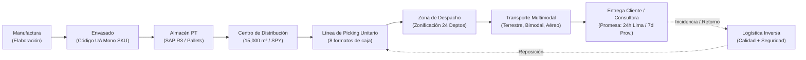

# Información General de la Empresa: Yanbal

> **Navegación:**
> - [[Índice de información]] | [[Transcripción original]]
> - Módulos relacionados: [[Producción]] | [[Inventario y almacén]] | [[Transporte y logística]] | [[Trazabilidad]] | [[Sistemas y tecnología]] | [[Problemas y necesidades]] | [[Actores y responsabilidades]]

---

## 1. Descripción de la Empresa
**Yanbal** es una corporación multinacional del sector de belleza, cosmética y cuidado personal. Su modelo de negocio se basa primordialmente en la venta directa y comercio electrónico a través de una red de **consultoras y consultores independientes** (quienes actúan como clientes primarios ante la cadena logística) hacia los consumidores finales.

La operación analizada en la entrevista corresponde a la **cadena de suministro y distribución en Perú**, liderada en la gestión de distribución por el **Ing. Joao Condorpusa Mendoza**.

---

## 2. Actividad Principal
La actividad central consiste en la **elaboración, acondicionamiento, almacenamiento, preparación y despacho de pedidos a nivel nacional** de productos cosméticos y de bienestar. 

El ciclo operativo integral comprende:
1. **Manufactura y Envasado**: Fabricación y envasado de fórmulas en planta.
2. **Almacenamiento de Productos Terminados**: Recepción en pallets y cajas mono SKU selladas.
3. **Centro de Distribución (CD)**: Desconsolidación de cajas máster, preparación de pedidos minoritarios (picking unitario en base a volumetría) y consolidación.
4. **Despacho y Zonificación**: Clasificación geográfica para los 24 departamentos de Perú.
5. **Transporte y Entrega**: Distribución capilar terrestre, bimodal y aérea a través de socios logísticos asociados.
6. **Logística Inversa**: Gestión de retornos, reclamos o entregas fallidas con evaluación de calidad y reposición.

---

## 3. Productos y Familias de Productos
La empresa maneja diversas líneas y familias de productos con requerimientos diferenciados de manipulación y acondicionamiento:

| Familia de Producto | Descripción y Requerimientos según Entrevista |
| :--- | :--- |
| **Cosméticos** | Maquillaje y productos de belleza de alta rotación. |
| **Dermatológicos** | Productos especializados para el cuidado de la piel. |
| **Cuidado Personal** | Higiene, cuidado corporal y capilar. |
| **Joyerías** | Bisutería fina y accesorios de alto valor y pequeño volumen. |
| **Fragancias** | Perfumería y colonias (requieren cuidado especial por envases frágiles/vidrio). |
| **Farmacéutica / Droguería** | Productos con exigencias regulatorias: **almacenamiento bajo temperatura controlada y hermeticidad**. |

---

## 4. Áreas y Departamentos Mencionados

Las áreas funcionales identificadas en la cadena de valor de Yanbal son:

- **Área de Manufactura:** Responsable de la elaboración física y síntesis de los productos.
- **Área de Envasado:** Encargada del envasado, etiquetado e identificación de unidades en cajas máster mono SKU con código UA.
- **Área de Almacén de Productos Terminados:** Gestiona el stock primario, posiciones de pallets (6,800 posiciones) y transferencias hacia el CD.
- **Centro de Distribución (CD):** Instalación de 15,000 m² dedicada a la desconsolidación, almacenamiento en layout por familias, picking unitario y empaque en 8 formatos de caja.
- **Área de Distribución y Transporte:** Liderada por el Ing. Joao Condorpusa Mendoza; coordina la zonificación, despacho, monitoreo de socios logísticos y cumplimiento de promesas de entrega.
- **Área de Control de Calidad:** Gestiona la cuarentena de productos y evalúa pedidos devueltos en logística inversa.
- **Área de Seguridad Patrimonial:** Evalúa mermas, pérdidas, productos bloqueados y activación de pólizas o garantías ante siniestros.
- **Área Comercial:** Canaliza las órdenes mediante la plataforma **Maya** y **SAP Commerce**.
- **Área de Servicio al Cliente:** Gestiona reclamos, consultas de estatus y atenciones post-venta a través de **Salesforce**.
- **Seguridad Informática / TI:** Audita la integración de sistemas, evalúa vulnerabilidades y asegura la continuidad operativa.

---

## 5. Organización y Funcionamiento General de la Cadena

El flujo macro del negocio se articula de extremo a extremo de la siguiente manera:

### Principios de Operación:
- **Flujo inicial estandarizado:** Entre manufactura, almacén y CD los productos se transportan únicamente en cajas máster selladas mono SKU. No se abren cajas ni se gestionan saldos intermedios en esta fase.
- **Desconsolidación en CD:** Las cajas máster se abren exclusivamente dentro del Centro de Distribución para alimentar las líneas de picking unitario guiadas por el sistema [[Sistemas y tecnología#SPY|SPY]].
- **Atención consolidada:** Los pedidos se arman calculando teóricamente el peso y volumen de los productos, asignándolos automáticamente a uno de los 8 tipos de cajas disponibles.

---

## 6. Personas y Responsables Clave Mencionados

| Persona / Rol | Responsabilidad en la Cadena |
| :--- | :--- |
| **Ing. Joao Condorpusa Mendoza** | Encargado del Área de Distribución de Yanbal (Perú). Supervisa la operación de transporte, tracking, socios logísticos y cumplimiento de lead times. |
| **Roles Directivos** | Definen las directrices estratégicas de la cadena logística completa. |
| **Roles de Gestión** | Configuran parámetros de sistemas (SAP, SPY, NSDG) y establecen reglas para mitigar riesgos en la cadena. |
| **Roles de Coordinación** | Coordinan la sincronización operativa entre almacén, picking y transportistas. |
| **Roles Operativos** | Ejecutan tareas físicas puntuales: manufactura, escaneo de RF, preparación de picking, despacho. |
| **Socios Logísticos Asociados** | Empresas terceras contratistas que operan las flotas de transporte terrestre, bimodal y aéreo. |
| **Consultores / Consultoras** | Clientes principales de Yanbal que comercializan y/o reciben los pedidos. |
| **Clientes Finales / Personas Autorizadas** | Receptores en destino final. |

---

## 7. Información Pendiente de Confirmar

> [!NOTE]
> Los siguientes aspectos no fueron detallados de forma explícita en la entrevista y quedan registrados como puntos a validar en fases posteriores:
> - Ubicación geográfica exacta de la planta de manufactura y su distancia física respecto al Centro de Distribución de 15,000 m².
> - Proveedores de materia prima e insumos químicos utilizados en la etapa previa a la manufactura.
> - Estructura detallada de costos logísticos y tarifas por modalidad de envío (terrestre, bimodal, aérea).
> - Nombres comerciales específicos de los contratistas y socios logísticos de última milla.
