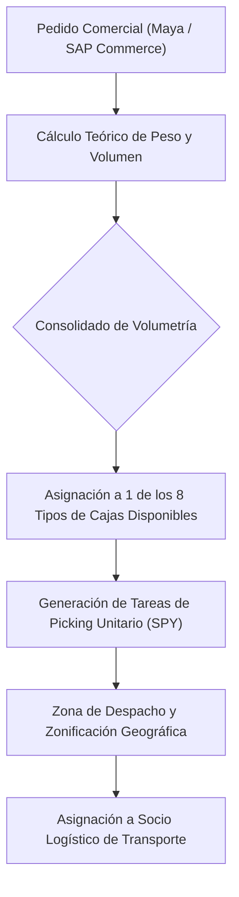
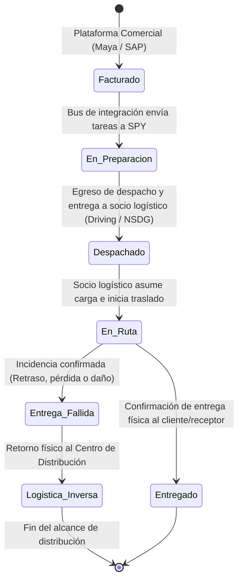

# Transporte y Logística: Yanbal

> **Navegación:**
> - [[Índice de información]] | [[Transcripción original]]
> - Módulos relacionados: [[Información general de la empresa]] | [[Producción]] | [[Inventario y almacén]] | [[Trazabilidad]] | [[Sistemas y tecnología]] | [[Problemas y necesidades]] | [[Actores y responsabilidades]]

---

## 1. Procesos de Transporte

La logística de transporte en Yanbal se divide en dos grandes etapas:

1. **Tránsito Interno (Manufactura $\rightarrow$ Almacén PT $\rightarrow$ Centro de Distribución):**
   - El traslado se realiza exclusivamente en **cajas máster selladas mono SKU**.
   - No se permite abrir cajas, retirar saldos ni realizar redistribuciones en esta etapa de tránsito.
   - Se mantiene la integridad del embalaje primario hasta el ingreso al Centro de Distribución.

2. **Distribución Capilar Nacional (Centro de Distribución $\rightarrow$ Cliente Final / Consultora):**
   - Una vez consolidado el pedido en la zona de empaque, este pasa a la zona de despacho donde es **zonificado**.
   - Se realiza la entrega a los **24 departamentos del Perú**, cubriendo tanto ciudades principales como localidades alejadas.
   - La ejecución está a cargo de **proveedores logísticos asociados** (socios de transporte).

---

## 2. Recepción, Consolidación y Despacho

### Cálculo de Volumetría y Asignación de Cajas
Para la preparación y empaque de los pedidos, Yanbal no improvisa el embalaje:
- El sistema cuenta con un **registro anticipado de datos teóricos de peso y volumetría** de cada SKU.
- Al generarse el pedido, el sistema totaliza teóricamente el peso y volumen consolidado de los artículos.
- Se selecciona automáticamente uno de los **8 tipos de cajas disponibles** según la volumetría requerida.

### Zonificación en Despacho
En la zona de despacho, el pedido consolidado se clasifica mediante su codificación:
- Se agrupan los envíos por destino geográfico (región, provincia, distrito, ciudad principal o alejada).
- Se asocian los datos del **socio logístico de transporte** asignado para la ruta correspondiente.

---

## 3. Modalidades de Envío y Medios de Transporte
Dada la compleja geografía del territorio peruano, Yanbal utiliza tres modalidades de envío:

| Modalidad | Ámbito de Aplicación | Características |
| :--- | :--- | :--- |
| **Terrestre** | Lima Metropolitana, costa y principales ciudades conectadas por red vial nacional. | Transporte por camiones/furgones de socios logísticos. |
| **Bimodal** | Zonas de selva o sierra donde se combina tramo terrestre con transporte fluvial o lacustre. | Utilizado para acceder a ciudades y localidades con accesos fluviales. |
| **Aéreo** | Destinos distantes de alta urgencia o difícil acceso terrestre (ej. Iquitos y regiones remotas). | Envíos mediante aerolíneas comerciales o cargueras aliadas. |

---

## 4. Tiempos de Entrega (Lead Times y Promesa de Servicio)
Yanbal maneja compromisos contractuales de entrega (*lead times*) basados en la ubicación geográfica del cliente/consultora:

- **Lima Metropolitana:** Promesa de entrega de **24 horas**.
- **Provincias y Departamentos:** Rango de entrega de **hasta 7 días** (según lejanía y condiciones de acceso).

---

## 5. Ciclo de Estados del Pedido y Despacho

El ciclo de vida del pedido en la cadena de distribución pasa por las siguientes fases formales:

1. **Facturado:** El pedido se emite y valida en la plataforma comercial ([[Sistemas y tecnología#Maya|Maya]] / [[Sistemas y tecnología#SAP Commerce|SAP Commerce]]) *(Contexto previo)*.
2. **En elaboración / En preparación:** Se ejecutan las tareas de recolección en la línea de picking guiadas por [[Sistemas y tecnología#SPY|SPY]] *(Contexto previo)*.
3. **Despachado (o Pedido Despachado):** El pedido está embalado en zona de despacho, clasificado por destino y entregado formalmente al socio logístico.
4. **Pedido en Ruta (o En Ruta):** El socio logístico carga el pedido e inicia el traslado físico hacia el destino final.
5. **Pedido Entregado (o Entregado):** Entrega física efectiva en manos de la consultora o persona autorizada.
6. **Entrega Fallida / Logística Inversa:** Cuando ocurre una incidencia tipificada (retraso, pérdida o daño), el transportista registra la entrega fallida y el retorno de la carga al Centro de Distribución. *(Nota: La recepción interna en almacén, el peritaje de calidad/seguridad y la reposición comercial corresponden a procesos internos fuera del alcance de distribución).*

---

## 6. Información Registrada en el Proceso

Todo el flujo logístico se encuentra unificado bajo el **Número de Pedido**, el cual funciona como identificador maestro e incluye:
- **Datos Comerciales del Cliente:** Nombre completo, código de consultora/cliente, teléfono y datos de contacto.
- **Datos Geográficos de Entrega:** Dirección detallada, distrito, provincia, departamento/región, clasificación de ciudad (principal o alejada).
- **Datos Operativos:** Tareas de picking generadas, tipo de formato de caja utilizado (entre los 8 formatos), peso teórico y real.
- **Datos de Transporte:** Socio logístico asignado, modalidad de envío (terrestre, bimodal, aérea), estatus de tracking en ruta y fecha/hora estimada de entrega.

---

## 7. Gestión de Incidencias y Logística Inversa

Cuando ocurre una incidencia durante el transporte o en destino tipificada según las fuentes como **retraso, pérdida o daño**:

1. **Corroboración con el Cliente:** Se verifica la situación con la consultora o cliente final afectado.
2. **Registro por el Socio Logístico:** El transportista registra la incidencia como *"Entrega Fallida"* en el sistema de transporte.
3. **Registro de Retorno al Almacén:** El socio logístico registra el retorno físico del paquete hacia el Centro de Distribución por el flujo de logística inversa.

> [!IMPORTANT]
> **Frontera de Alcance Operativo:**  
> La trazabilidad del proceso de distribución concluye formalmente con el **registro del retorno de la carga**. Las actividades posteriores —como la doble evaluación técnica (Control de Calidad y Seguridad Patrimonial) en almacén, la activación de pólizas de seguro y la generación de nuevos pedidos de reposición comercial— se ejecutan al interior del almacén central y corresponden a procesos de calidad, almacén y comercialización, por lo que quedan **fuera del alcance delimitado de distribución**.

---

## 8. Problemas Críticos Identificados en Transporte

- **Desfase de 2 horas en el Sistema de Tracking:**  
  Actualmente, el sistema de seguimiento ([[Sistemas y tecnología#NSDG|NSDG]] / [[Sistemas y tecnología#Driving|Driving]]) tarda en promedio **2 horas en reflejar el cambio de estado** de una entrega realizada en campo.
- **Ventana de Desconocimiento:**  
  Este retardo genera incertidumbre operativa: si un pedido ya se entregó físicamente, el sistema sigue mostrándolo "En ruta" durante dos horas.
- **Impacto en Atención al Cliente:**  
  Cuando una consultora llama a [[Sistemas y tecnología#Salesforce (Cellforce)|Servicio al Cliente]], el operador ve información desactualizada, generando reclamos innecesarios o respuestas erróneas.
- **Falta de Trazabilidad sobre el Receptor Real:**  
  Frecuentemente el paquete es recibido por una **persona autorizada** y no directamente por la consultora titular. Debido al retraso del sistema, la consultora reporta que no recibió el pedido cuando en realidad ya fue entregado a un tercero en su domicilio.

---

## 9. Responsables del Área
- **Responsable Principal:** [[Actores y responsabilidades#Ing. Joao Condorpusa Mendoza|Ing. Joao Condorpusa Mendoza]] (Encargado del Área de Distribución).
- **Supervisores de Despacho y Zonificación:** Responsables del ordenamiento de paquetes según destinos.
- **Socios Logísticos Externos:** Operadores y transportistas responsables del tránsito y la última milla.

---

## 10. Información Pendiente de Confirmar
> [!NOTE]
> - Relación nominal de los proveedores y empresas de transporte contratadas para las rutas terrestres, fluviales y aéreas.
> - Cantidad promedio de pedidos despachados diariamente desde el Centro de Distribución.
> - Criterios específicos para decidir el uso de transporte bimodal vs aéreo en regiones de selva.
