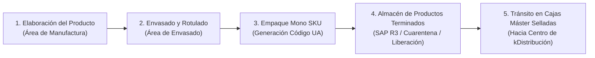
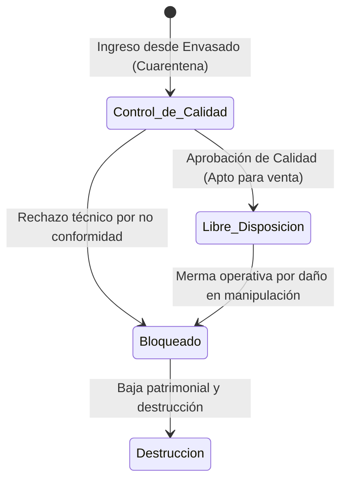

# Producción: Yanbal

> **Navegación:**
> - [[Índice de información]] | [[Transcripción original]]
> - Módulos relacionados: [[Información general de la empresa]] | [[Transporte y logística]] | [[Inventario y almacén]] | [[Trazabilidad]] | [[Sistemas y tecnología]] | [[Problemas y necesidades]] | [[Actores y responsabilidades]]

---

## 1. Procesos Productivos y Etapas

La producción en Yanbal está bajo la responsabilidad directa del **Área de Manufactura**. El flujo productivo sigue tres etapas secuenciales claramente definidas en la entrevista:

### Etapa 1: Elaboración del Producto
- Se realiza la formulación y preparación de los productos según las diferentes familias (cosméticos, dermatológicos, cuidado personal, joyería y fragancias).
- La actividad se gestiona a nivel industrial en la planta de manufactura.

### Etapa 2: Envasado
- El producto a granel elaborado pasa al área de envasado, donde se dosifica en sus recipientes finales (frascos, botellas, estuches, tubos, etc.).
- Se realiza el sellado e identificación unitaria del producto terminado.

### Etapa 3: Empaque y Conformación Mono SKU
- Los productos terminados se agrupan estrictamente en **cajas mono SKU** (cada caja contiene única y exclusivamente unidades de un mismo código/producto, nunca cajas mixtas en esta etapa).
- A cada caja se le asigna e imprime un **Código UA** (*Unidad de Almacenamiento*).
- Durante el transporte hacia el almacén y posterior tránsito hacia el Centro de Distribución, se manipulan como **cajas máster selladas**: no se abren, no se retiran saldos ni se efectúan redistribuciones intermedias.

---

## 2. Responsables del Proceso Productivo

- **Área de Manufactura:** Responsable de la formulación y síntesis de los productos.
- **Área de Envasado:** Operarios y supervisores a cargo de la línea de llenado, sellado y conformación de cajas mono SKU.
- **Área de Control de Calidad:** Inspectores técnicos que supervisan los parámetros de inocuidad, estándares farmacéuticos y cosméticos, gestionando el estatus de cuarentena.
- **Personal de Almacén de PT:** Recepcionistas que escanean el código UA con terminales de radiofrecuencia para ingresar los lotes a SAP R3.

---

## 3. Controles Realizados y Estados del Producto en SAP R3

El control del inventario productivo se realiza en línea mediante el ERP **SAP R3** a nivel productivo. Todo producto terminado que ingresa debe tener configurado su estado. 

Yanbal clasifica la producción en **tres estados principales de inventario**:

| Estado del Producto en SAP | Definición Operativa | Disponibilidad para Pedidos |
| :--- | :--- | :--- |
| **Libre Disposición** | Producto liberado que superó exitosamente todos los controles analíticos y de calidad. | **DISPONIBLE:** Es el único stock habilitado para ser tomado por la plataforma comercial y las líneas de picking. |
| **Control de Calidad** | Producto recién envasado o ingresado que se encuentra en período de **cuarentena**. | **BLOQUEADO TEMPORALMENTE:** En espera de aprobación técnica de calidad para pasar a libre disposición. |
| **Bloqueado** | Producto retenido por razones distintas a la cuarentena de calidad (principalmente por daños en manipulación u operaciones calificados como **merma operativa**). | **NO DISPONIBLE:** Destinado a procesos de destrucción o baja definitiva. |

---

## 4. Información Registrada Durante la Producción

- **Código UA (Unidad de Almacenamiento):** Identificador unívoco asignado desde manufactura a cada caja máster mono SKU.
- **Lectura por Radiofrecuencia (RF):** Los códigos UA son capturados con terminales de radiofrecuencia al salir de envasado e ingresar al almacén.
- **Datos Técnicos del SKU:** Peso unitario, dimensiones y volumetría teórica (registrados previamente en el catálogo maestro para el posterior cálculo de empaque).
- **Estatus de Inventario:** Clasificación en SAP R3 (Libre Disposición, Cuarentena/Control de Calidad, Bloqueado).

---

## 5. Problemas y Dificultades Identificadas

- **Generación de Merma Operativa:**  
  Durante los procesos de manipulación física y traslado interno de cajas, se producen roturas, abolladuras o deterioros de producto (especialmente crítico en fragancias y envases cosméticos).
- **Desfase en el Registro de Merma (hasta 6 horas):**  
  Aunque el ERP SAP R3 opera de forma online, el registro de la merma operativa producida en la jornada no se asienta en tiempo real, sino que se acumula y actualiza recién al final del turno laboral. Esto distorsiona la disponibilidad real del stock durante hasta seis horas continuas.

---

## 6. Materia Prima e Información Pendiente de Confirmar

> [!NOTE]
> - **Materia Prima e Insumos:** En la entrevista se hace mención al paso de producción hacia el almacén, pero no se detallaron los flujos de recepción de insumos químicos, materias primas a granel, envases vacíos ni embalajes primarios.
> - **Tiempos de Cuarentena:** No se especificó el tiempo promedio (horas o días) que permanece un lote en estado de "Control de Calidad" antes de ser liberado a libre disposición.
> - **Criterios de Destrucción:** Frecuencia y protocolos de destrucción física de los productos calificados como merma bloqueada.
