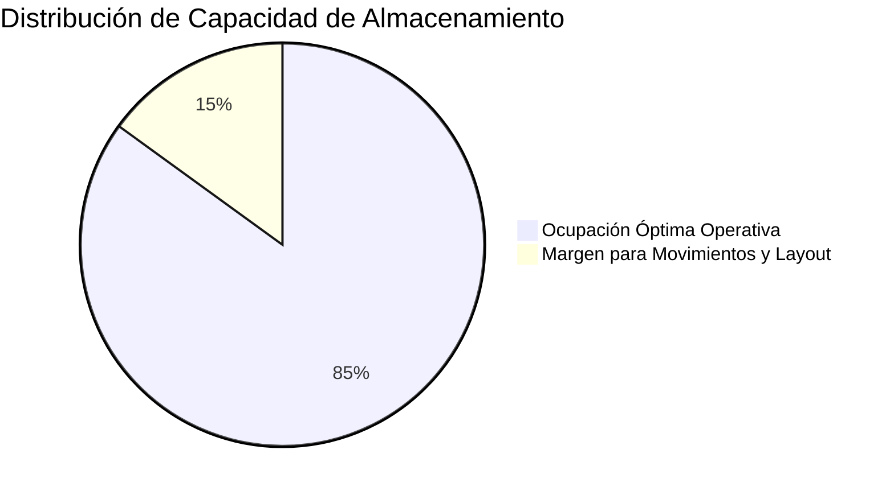

# Inventario y Almacén: Yanbal

> **Navegación:**
> - [[Índice de información]] | [[Transcripción original]]
> - Módulos relacionados: [[Información general de la empresa]] | [[Producción]] | [[Transporte y logística]] | [[Trazabilidad]] | [[Sistemas y tecnología]] | [[Problemas y necesidades]] | [[Actores y responsabilidades]]

---

## 1. Dimensiones Físicas y Capacidad del Almacén

La operación de almacenamiento de Yanbal cuenta con infraestructura de gran escala con las siguientes especificaciones técnicas declaradas:

- **Superficie Total:** **15,000 metros cuadrados** ($m^2$).
- **Posiciones de Almacenamiento:** **6,800 posiciones de pallets** (unidades de almacenamiento paletizadas).
- **Capacidad Instalada:** Capacidad para albergar hasta **2,000,000 de cajas mono SKU**.
- **Capacidad Óptima Operativa:** Se opera a un nivel recomendado de **alrededor del 85% de ocupación**. Este margen del 15% de holgura es indispensable para permitir la redistribución interna de pallets, reubicaciones y optimización dinámica del *layout*.



---

## 2. Organización Física del Almacén (*Layout*)

El almacén no mezcla productos al azar; su disposición física se estructura en base a:

1. **Zonificación por Familias de Productos:**  
   Zonas segregadas para cosméticos, dermatológicos, cuidado personal, joyerías y fragancias.
2. **Acondicionamiento Especial para Productos Farmacéuticos / Droguería:**  
   Aquellos productos catalogados bajo normativa farmacéutica o de droguería cuentan con zonas cerradas bajo estrictas condiciones:
   - **Temperatura controlada:** Para preservar la estabilidad de principios activos y fórmulas sensibles.
   - **Hermeticidad:** Para evitar contaminación cruzada y mantener estándares sanitarios.

---

## 3. Entrada y Salida de Productos (Flujos Operativos)

```mermaid
flowchart TD
    subgraph Entrada
        A["Llegada de Cajas desde Manufactura"] --> B["Identificación con Código UA"]
        B --> C["Lectura con Terminales RF"]
        C --> D["Ingreso Online en SAP R3"]
        D --> E["Sincronización con SPY (WMS in-house)"]
        E --> F["Ubicación física en Rack / Posición según Familia"]
    end
    subgraph Salida_y_Picking
        G["Pedido Facturado ingresa vía Bus"] --> H["SPY genera Tareas de Picking Unitario"]
        H --> I["Apertura de Caja Máster en CD"]
        I --> J["Extracción de Unidades requeridas"]
        J --> K["Consolidación en 1 de 8 formatos de caja"]
        K --> L["Paso a Zona de Despacho"]
    end
```



### Flujo de Entrada:
1. Las cajas llegan identificadas desde manufactura mediante el **Código UA** (*Unidad de Almacenamiento*).
2. El personal operativo escanea el código UA mediante **terminales de radiofrecuencia (RF)**.
3. El ingreso se registra en tiempo real en el ERP **SAP R3** y se sincroniza simultáneamente con el sistema **SPY** (BWMS in-house de Yanbal).
4. El sistema SPY determina la ubicación exacta disponible en función de la familia y los requerimientos ambientales del SKU.

### Flujo de Salida:
1. Las cajas máster se transfieren al Centro de Distribución sin alteración de su precinto.
2. En el CD, las cajas máster se abren para abastecer la línea de picking minoritario a nivel unitario.
3. El sistema SPY guía la recolección unitaria de productos para consolidar el pedido en uno de los **8 formatos de caja** asignados según peso y volumetría.

---

## 4. Control de Stock y Disponibilidad en SAP R3

El inventario centralizado en el almacén es gobernado por **SAP R3**, el cual gestiona los registros en línea y diferencia el inventario en tres estatus clave:

| Estatus en SAP | Significado Operativo | Visibilidad para Venta |
| :--- | :--- | :--- |
| **Libre Disposición** | Stock apto, aprobado por calidad y físicamente disponible. | **Sí:** Solo este stock es tomado por la plataforma Maya para confirmar pedidos. |
| **Control de Calidad** | Lotes en cuarentena técnica. | **No:** Bloqueado a la espera de dictamen de laboratorio. |
| **Bloqueado (Merma)** | Productos dañados por manipulación operativa pendientes de destrucción. | **No:** Inhabilitado para despacho. |

### Herramientas de Consulta y Reportes
A través de transacciones y reportes de SAP R3, el área de almacén puede consultar:
- Stock disponible filtrado por tipo de producto y familia.
- Localización exacta de cada SKU por rack y posición de pallet.
- Contenido detallado de unidades por cada código UA.
- Resúmenes consolidados de existencias por código de producto.
- Balance diferenciado según el estatus (libre disposición, control de calidad, bloqueado).

---

## 5. Problemas Críticos del Inventario: El Desfase de Merma Operativa

El problema operativo más grave expuesto en la entrevista respecto al almacén es la **brecha temporal en el sinceramiento del stock**:

```
[Durante la Jornada Laboral]
Manipulación en picking --> Se daña un producto (Merma física real)
                                   │
                              (DESFASE DE HASTA 6 HORAS)
                                   │  El sistema comercial cree que el producto existe
                                   │  Se continúa vendiendo stock inexistente físicamente
                                   ▼
[Final de la Jornada Laboral]
Registro masivo de la merma en SAP R3 --> Sinceramiento tardío
```

### Efectos y Consecuencias del Desfase:
- **Desfase de hasta 6 horas:** La merma operativa provocada por manipulación o accidentes en la línea de preparación se acumula físicamente a lo largo del turno y recién se digita y procesa al final del día laboral.
- **Riesgo inminente de Quiebre de Stock (*Stockout*):** Cuando un SKU maneja niveles bajos de inventario de seguridad, el desfase de 6 horas oculta que el producto ya se rompió o dañó físicamente.
- **Venta Perdida:** El sistema comercial ([[Sistemas y tecnología#Maya|Maya]] / [[Sistemas y tecnología#SAP Commerce|SAP Commerce]]) continúa visualizando el producto en "Libre Disposición" y lo asigna a nuevas consultoras. Al momento del picking, la unidad no existe físicamente, resultando en órdenes incompletas, quejas de clientes y venta perdida.

---

## 6. Responsables del Almacén e Inventario

- **Personal de Recepción de Almacén:** Escaneo y registro de ingresos con terminales RF.
- **Operarios de Picking en CD:** Manipulación de cajas máster y extracción unitaria bajo directivas de SPY.
- **Supervisores de Inventario:** Ejecución de cuadres, extracción de reportes en SAP R3 y registro final de mermas.
- **Jefatura de Distribución:** [[Actores y responsabilidades#Ing. Joao Condorpusa Mendoza|Ing. Joao Condorpusa Mendoza]].

---

## 7. Información Pendiente de Confirmar

> [!NOTE]
> - Criterios y frecuencia con que se realizan inventarios físicos cíclicos o conteos ciegos en el almacén de 15,000 m².
> - Porcentaje o tasa mensual promedio de merma operativa respecto al volumen total de cajas manipuladas.
> - Detalle sobre si el registro de merma se realiza mediante terminales móviles o desde puestos fijos de escritorio en SAP.
