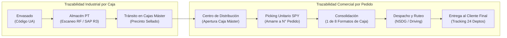

# Trazabilidad: Yanbal

> **Navegación:**
> - [[Índice de información]] | [[Transcripción original]]
> - Módulos relacionados: [[Información general de la empresa]] | [[Producción]] | [[Transporte y logística]] | [[Inventario y almacén]] | [[Sistemas y tecnología]] | [[Problemas y necesidades]] | [[Actores y responsabilidades]]

---

## 1. Modelo Actual de Seguimiento y Trazabilidad

En Yanbal, la trazabilidad opera a través de dos niveles complementarios a lo largo de la cadena de suministro:

1. **Trazabilidad por Unidad de Almacenamiento (Código UA):**  
   Aplica a las cajas máster mono SKU desde la salida de envasado, pasando por la recepción en el almacén de productos terminados, hasta su ingreso al Centro de Distribución.
2. **Trazabilidad por Número de Pedido:**  
   Es la llave maestra que gobierna la preparación de pedidos minoritarios, el empaque en cajas asignadas, la zonificación, el despacho capilar y la última milla hacia la consultora o consumidor final.

---

## 2. Identificadores y Claves de Consulta

Para auditar y conocer el historial o estado actual de un ítem, los actores utilizan los siguientes identificadores:

| Identificador | Nivel de Aplicación | Usuarios / Sistemas | Información Vinculada |
| :--- | :--- | :--- | :--- |
| **Número de Pedido** | Despacho, Picking, Transporte, Entrega | Consultoras, Clientes finales, Servicio al Cliente ([[Sistemas y tecnología#Salesforce (Cellforce)|Salesforce]]), [[Sistemas y tecnología#NSDG|NSDG]] | Nombre y DNI del cliente, dirección exacta, región/provincia/distrito, tareas de picking, formato de caja, socio logístico, historial de estatus. |
| **Código de Consultor / Cliente** | Comercial, Seguimiento | Consultoras de belleza, Fuerza de ventas, Maya | Historial consolidado de pedidos asignados a una consultora específica. |
| **Código UA (*Unidad de Almacenamiento*)** | Producción, Almacén central | Operarios de manufactura, Almacén PT, terminales RF, [[Sistemas y tecnología#SAP R3|SAP R3]], [[Sistemas y tecnología#SPY|SPY]] | Tipo de SKU mono producto, cantidad exacta de unidades por caja, lote de producción, estatus en SAP (libre disposición, calidad, merma). |

---

## 3. Momentos y Puntos de Control de Registro

La información de trazabilidad se captura en siete hitos secuenciales:

1. **Fin de Envasado:** Impresión y adherencia del Código UA a cada caja máster mono SKU.
2. **Recepción en Almacén:** Lectura mediante **terminales de radiofrecuencia (RF)**; creación automática del asiento de inventario en SAP R3.
3. **Liberación de Calidad:** Dictamen técnico en SAP R3 que cambia el estatus de *Control de Calidad (cuarentena)* a *Libre Disposición*.
4. **Armado de Pedido (Línea de Picking):** El sistema **SPY** toma el número de pedido y proyecta la ruta que debe recorrer la caja asignada (entre los 8 formatos disponibles), registrando las estaciones de picking donde se detiene a recolectar unidades.
5. **Salida de Zona de Despacho:** Registro de zonificación y traspaso de custodia física al socio logístico de transporte.
6. **Tránsito y Última Milla:** Actualizaciones de recorrido reportadas por los sistemas [[Sistemas y tecnología#NSDG|NSDG]] y [[Sistemas y tecnología#Driving|Driving]].
7. **Punto de Entrega o Incidencia:** Confirmación de recepción física firmada/validada, o reporte de entrega fallida que dispara el retorno por [[Transporte y logística#7 Gestión de Incidencias y Logística Inversa|logística inversa]].

---

## 4. Responsables del Registro de Datos

- **Operarios de Envasado:** Generación física y verificación del código UA.
- **Operarios de Almacén:** Escaneo con radiofrecuencia para altas y movimientos de pallets.
- **Sistema SPY (Automático):** Asignación y registro de eventos de recolección en línea de picking.
- **Supervisores de Despacho:** Registro de salida física y asignación a camión/ruta.
- **Conductores / Transportistas Asociados:** Marcado de eventos de entrega o novedad en ruta.
- **Agentes de Servicio al Cliente:** Monitoreo y consulta de trazabilidad en Salesforce ante solicitudes de consultoras.

---

## 5. Limitaciones y Brechas Actuales de Trazabilidad

A pesar de contar con un ecosistema de sistemas integrados mediante un Bus central, la entrevista reveló deficiencias críticas en la visibilidad de extremo a extremo:

### Brecha 1: Desfase de hasta 2 horas en el Tracking de Despacho
- El sistema de tracking actualiza los estados en lapsos promedio de **2 horas**.
- Si un socio logístico entrega un pedido a las 10:00 AM, el sistema puede seguir mostrando "En ruta" hasta el mediodía.
- Genera una "ventana ciega" que impide al personal de servicio al cliente brindar información fidedigna e instantánea.

### Brecha 2: Falta de Evidencia en Entregas a Terceros (Familiares Autorizados)
- En la venta por catálogo, es común que la consultora no se encuentre presente en el domicilio y reciba el pedido un familiar autorizado.
- La trazabilidad actual no comunica en tiempo real el nombre o parentesco de quien recepcionó el paquete, provocando reportes prematuros por supuesta pérdida o no entrega.

### Brecha 3: Desfase de 6 horas en Merma Operativa
- La merma producida por rotura durante el picking no se descuenta en vivo, desalineando la trazabilidad entre el stock físico real y el stock digital en SAP.

---

## 6. Información Pendiente de Confirmar

> [!NOTE]
> - ¿Qué tecnología exacta de lectura móvil utilizan los transportistas de los socios logísticos en campo (app para smartphones, POS con firma digital, escáneres propios)?
> - ¿El cliente final tiene acceso a geolocalización por GPS en mapa o únicamente a cambios de estado textuales?
> - ¿Se registra el número de lote de producción individual en la factura de la consultora al nivel de picking unitario?
