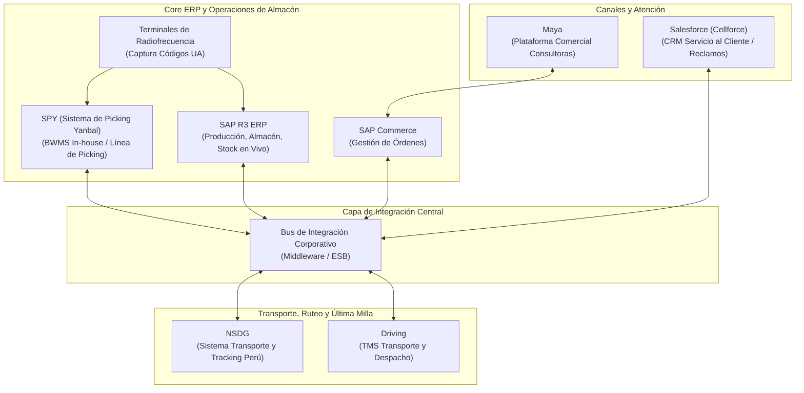

# Sistemas y Tecnología: Ecosistema Yanbal

> **Navegación:**
> - [[Índice de información]] | [[Transcripción original]]
> - Módulos relacionados: [[Información general de la empresa]] | [[Producción]] | [[Transporte y logística]] | [[Inventario y almacén]] | [[Trazabilidad]] | [[Problemas y necesidades]] | [[Actores y responsabilidades]]

---

## 1. Mapa del Ecosistema de Sistemas y Software

En la entrevista con el Ing. Joao Condorpusa Mendoza se especificó con total precisión el mapa de aplicaciones tecnológicas que soportan la operación logística de Yanbal en Perú:

---

## 2. Catálogo Detallado de Sistemas Identificados

### 1. SAP R3 (ERP Corporativo)
- **Tipo:** Software core empresarial (ERP on-premise / corporativo).
- **Alcance Operativo:** Manejado primordialmente por las áreas de **Manufactura** y **Almacén de Productos Terminados**.
- **Funcionalidades:**
  - Control de inventario en línea y en vivo.
  - Gestión de los tres estatus de producto: *Libre Disposición*, *Control de Calidad (cuarentena)* y *Bloqueado (merma operativa)*.
  - Emisión de reportes analíticos personalizados por SKU, familia, ubicación física y unidad de almacenamiento (UA).

### 2. Maya
- **Tipo:** Plataforma comercial web / móvil para la fuerza de ventas.
- **Alcance:** Utilizada por las **consultoras y consultores de Yanbal** para ingresar pedidos y gestionar sus catálogos.
- **Integración:** Se conecta nativamente con SAP Commerce para transferir la demanda hacia la cadena de suministros.

### 3. SAP Commerce
- **Tipo:** Plataforma comercial transaccional de pedidos.
- **Función:** Recibe las compras de Maya, valida las condiciones comerciales y canaliza las órdenes hacia el Bus de Integración para iniciar la preparación física en almacén.

### 4. Bus de Integración (Middleware / ESB)
- **Tipo:** Plataforma de middleware corporativo para la interconexión de sistemas distribuidos.
- **Función:** Orquesta el flujo de datos entre los sistemas de ventas, el ERP SAP R3, el software de almacén (SPY) y los sistemas de despacho/tracking (NSDG, Driving, Salesforce), evitando conexiones punto a punto rígidas.

### 5. SPY (*Sistema de Picking de Yanbal*)
- **Tipo:** BWMS (*Basic Warehouse Management System*) desarrollado **in-house** por y para Yanbal.
- **Ubicación:** Opera en el Centro de Distribución de 15,000 m².
- **Funcionalidades:**
  - Gestión de posiciones de almacenamiento por familias y condiciones especiales.
  - Algoritmo de cálculo de peso y volumetría para seleccionar 1 de los 8 tipos de cajas disponibles.
  - Asignación automatizada de tareas de picking a lo largo de la línea de preparación unitaria.

### 6. NSDG
- **Tipo:** Sistema de transporte y tracking de pedidos desarrollado a medida por una empresa contratista para la operación de Yanbal en Perú.
- **Función:** Registro de eventos de tránsito, asignación de pedidos a socios logísticos y trazabilidad para el seguimiento de entregas en los 24 departamentos.

### 7. Driving
- **Tipo:** TMS (*Transportation Management System*) de clase mundial provisto por un proveedor especializado (utilizado ampliamente en minería, alimentos y cosméticos).
- **Función:** Ruteo dinámico, programación de despacho, zonificación y control de flotas de los socios logísticos asociados.

### 8. Salesforce (*Cellforce*)
- **Tipo:** CRM en la nube para gestión de relaciones con clientes.
- **Función:** Utilizado por los agentes de **Servicio al Cliente** de Yanbal para atender consultas sobre el estado de los pedidos, levantar tickets de reclamo e iniciar solicitudes de reposición ante entregas fallidas o incidencias.

### 9. Terminales de Radiofrecuencia (RF)
- **Tipo:** Dispositivos móviles de hardware para captura de datos en planta y almacén.
- **Función:** Lectura de códigos de barras / QR de las **Unidades de Almacenamiento (Código UA)** para dar altas, confirmar traslados y verificar movimientos en racks.

---

## 3. Clasificación de la Arquitectura: Desarrollo Propio vs Proveedores

El entrevistado destacó que el parque tecnológico se estructura bajo una fórmula híbrida de **7 sistemas principales**:

| Categoría | Cantidad | Sistemas Comprendidos | Características de Adaptación |
| :--- | :---: | :--- | :--- |
| **Sistemas Internos / In-house** | **3** | - **SPY** (WMS propio) - **SAP R3** (Adaptaciones y parametrizaciones a medida para Yanbal) - **NSDG** (Desarrollo a medida por contratista para Yanbal Perú) | Diseñados o personalizados al 100% para ajustarse al flujo de empaque unitario y venta directa de Yanbal. Alta facilidad de uso para los colaboradores. |
| **Sistemas de Proveedores Externos** | **4** | - **Driving** (TMS) - **Salesforce** (CRM) - **SAP Commerce** (Motor comercial) - **Maya** (Capa de frontend de pedidos) | Soluciones de mercado robustas que requirieron adaptaciones específicas para conectarse de forma bidireccional con el Bus de Integración de Yanbal. |

---

## 4. Procesos Manuales y Brechas Tecnológicas

Pese al alto nivel de sistematización, subsisten procesos manuales que originan ineficiencias:

1. **Acumulación Física y Registro Tardío de Mermas:**
   - La merma operativa ocurrida en el día no se digita inmediatamente en SAP R3.
   - El personal acumula físicamente los productos rotos/dañados y registra el lote consolidado al término de la jornada (provocando un **desfase de 6 horas** en el stock).
2. **Desfase en la Transmisión de Estados de Tracking (2 horas):**
   - La sincronización entre las aplicaciones de los transportistas en campo (Driving / NSDG) y el Bus central hacia Salesforce tarda en promedio **dos horas**, manteniendo pedidos en estado desactualizado.
3. **Validación Dual Manual de Devoluciones:**
   - Todo paquete retornado por siniestro debe pasar por inspección ocular física tanto de Calidad como de Seguridad Patrimonial antes de que el sistema libere la autorización de reposición.

---

## 5. Requerimientos Técnicos y Necesidades del Sistema Futuro

El Ing. Joao Condorpusa especificó los **atributos no funcionales clave** que debe satisfacer cualquier evolución tecnológica o nuevo sistema web en Yanbal:

| Requerimiento | Situación Actual | Meta Expresada por el Entrevistado |
| :--- | :--- | :--- |
| **Rapidez / Latencia de Sincronización** | Desfase de hasta **2 horas** en tracking y **6 horas** en merma. | **En simultáneo (tiempo real)** o con un desfase máximo permisible de **30 minutos** (reducción del 75%). |
| **Disponibilidad y Capacidad** | Gestión de 2 millones de cajas y distribución nacional. | Capacidad de procesamiento escalable para **manejar grandes volúmenes de datos** sin degradación de velocidad. |
| **Seguridad Informática** | Exigencia corporativa estricta. | Superar auditorías de seguridad informática para evitar riesgos de vulnerabilidad en la cadena de suministros y accesos no autorizados. |
| **Facilidad de Uso e Integración** | Sistemas in-house altamente amigables. | Mantener interfaces intuitivas para roles operativos y compatibilidad total con el **Bus de Integración**. |

---

## 6. Información Pendiente de Confirmar

> [!NOTE]
> - Protocolos específicos de comunicación del Bus de Integración (APIs REST, colas de mensajería MQ, Web Services SOAP).
> - Mecanismo de contingencia informática en caso de caída temporal del enlace con SAP R3 o con el Centro de Distribución.
