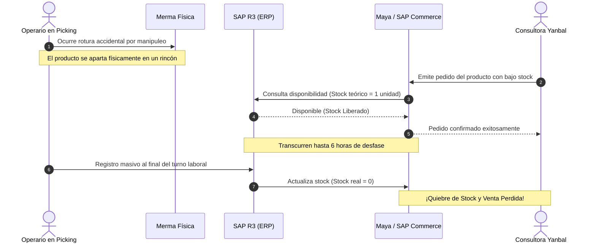
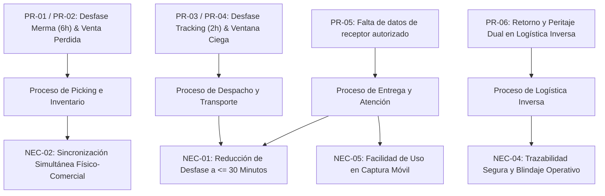

# Problemas y Necesidades: Diagnóstico Operativo Yanbal

> **Navegación:**
> - [[Índice de información]] | [[Transcripción original]]
> - Módulos relacionados: [[Información general de la empresa]] | [[Producción]] | [[Transporte y logística]] | [[Inventario y almacén]] | [[Trazabilidad]] | [[Sistemas y tecnología]] | [[Actores y responsabilidades]]

---

## 1. Matriz de Problemas Identificados en la Entrevista

A partir del análisis exhaustivo del testimonio del Ing. Joao Condorpusa Mendoza, se identifican los siguientes problemas operacionales y tecnológicos:

| Código | Problema Declarado | Proceso Afectado | Sistemas Involucrados | Impacto en el Negocio |
| :---: | :--- | :--- | :--- | :--- |
| **PR-01** | **Desfase de hasta 6 horas en actualización de merma operativa** | Almacenamiento, Preparación de pedidos (Picking) | [[Sistemas y tecnología#SAP R3\|SAP R3]], [[Sistemas y tecnología#SPY\|SPY]] | El inventario en sistema muestra unidades disponibles que ya no existen físicamente por rotura en manipulación. |
| **PR-02** | **Riesgo de Quiebre de Stock y Venta Perdida** | Comercialización y Facturación | [[Sistemas y tecnología#Maya\|Maya]], [[Sistemas y tecnología#SAP Commerce\|SAP Commerce]], SAP R3 | En SKUs con inventario ajustado, el sistema comercial confirma ventas de existencias destruidas. Al no poder atenderse, se generan pedidos incompletos y pérdida neta de ventas. |
| **PR-03** | **Desfase de 2 horas en el sistema de tracking de pedidos** | Transporte, Despacho y Última milla | [[Sistemas y tecnología#NSDG\|NSDG]], [[Sistemas y tecnología#Driving\|Driving]], [[Sistemas y tecnología#Salesforce (Cellforce)\|Salesforce]] | Latencia severa entre el momento de entrega en campo y la actualización digital en la plataforma central. |
| **PR-04** | **Margen de desconocimiento de la situación del pedido** | Atención al cliente y Monitoreo logístico | Salesforce, Maya | Los operadores de Servicio al Cliente no cuentan con datos frescos para resolver consultas o calmar la incertidumbre de la consultora. |
| **PR-05** | **Falta de visibilidad sobre el receptor real (persona autorizada)** | Entrega y Confirmación | NSDG, Salesforce | Si el paquete lo recibe una persona autorizada, la consultora titular desconoce la entrega y levanta un reclamo por "pedido no recibido" cuando el producto ya está en su casa. |
| **PR-06** | **Cuello de botella en la evaluación de retornos por siniestro** | Logística Inversa y Reposición | SAP R3, Almacén central | Requiere doble peritaje físico presencial (Control de Calidad + Seguridad Patrimonial) para determinar cobertura de seguro o reingreso a stock. |

---

## 2. Análisis Detallado de los Problemas Principales

### A. Desfase de Merma Operativa (PR-01 y PR-02)

- **Causa Raíz:** El registro de producto dañado no se efectúa de manera atómica o en tiempo real durante la tarea de picking; se posterga como una tarea administrativa manual para el cierre de turno.
- **Consecuencia Crítica:** Provoca falsos positivos de inventario (*phantom inventory*), golpeando de forma directa a productos de alta demanda o con stock de seguridad mínimo.

---

### B. Desfase de Tracking en Última Milla (PR-03, PR-04 y PR-05)

- **Causa Raíz:** Falta de sincronización instantánea y asincrónica directa entre las herramientas móviles de los socios logísticos (Driving/NSDG) y el Bus central corporativo.
- **Consecuencia Crítica:** Sobrecarga innecesaria del centro de contacto de Servicio al Cliente, fricción con la consultora y sobrecostos operativos de atención.

---

## 3. Matriz de Necesidades Declaradas por el Negocio

En respuesta a las deficiencias operativas, el entrevistado formuló un conjunto específico de necesidades y expectativas para optimizar la operación:

| Código | Necesidad Expresada | Meta / Criterio de Éxito | Prioridad |
| :---: | :--- | :--- | :---: |
| **NEC-01** | **Conexión integrada con menor desfase temporal** | Reducir el desfase de seguimiento desde las actuales **2 horas** a un máximo permisible de **media hora (30 minutos)**, o idealmente en tiempo real sincrónico. | **ALTA (Principal reto)** |
| **NEC-02** | **Sincronización simultánea de inventario físico y comercial** | Disponer de un mecanismo para sincerar la merma operativa al instante, eliminando el desfase de 6 horas para evitar quiebres de stock. | **ALTA** |
| **NEC-03** | **Alta capacidad de procesamiento y disponibilidad** | La plataforma debe procesar altos volúmenes transaccionales (catálogo masivo, 2 millones de cajas instaladas, cobertura nacional en 24 departamentos) sin caídas de servicio. | **MEDIA-ALTA** |
| **NEC-04** | **Validación estricta de Seguridad Informática** | Toda solución debe superar auditorías corporativas de seguridad de la información para mitigar vulnerabilidades e intrusiones en la cadena de suministros. | **ALTA** |
| **NEC-05** | **Preservación de Usabilidad y Conectividad con el Bus** | La solución debe mantener interfaces limpias y de fácil adopción para roles operativos, integrándose nativamente mediante el Bus corporativo sin alterar los 7 sistemas base. | **MEDIA** |

---

## 4. Relación Problemas $\rightarrow$ Procesos $\rightarrow$ Necesidades

---

## 5. Información Pendiente de Confirmar

> [!NOTE]
> - Cantidad estimada de llamadas o tickets que ingresan a Salesforce debido al desfase de dos horas de tracking.
> - Valor monetario acumulado de ventas perdidas por quiebres de stock derivados del desfase de merma operativa.
> - Tiempo promedio que demora la doble evaluación técnica entre Control de Calidad y Seguridad Patrimonial para liberar un pedido siniestrado.
