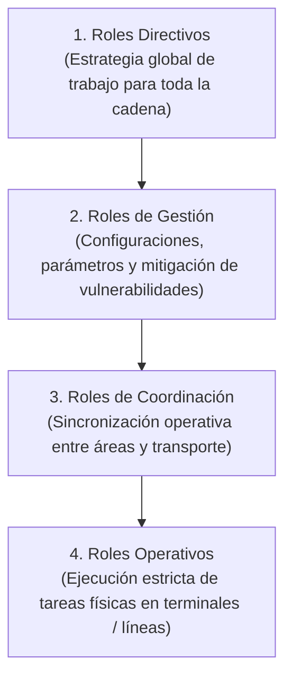

# Actores y Responsabilidades: Yanbal

> **Navegación:**
> - [[Índice de información]] | [[Transcripción original]]
> - Módulos relacionados: [[Información general de la empresa]] | [[Producción]] | [[Transporte y logística]] | [[Inventario y almacén]] | [[Trazabilidad]] | [[Sistemas y tecnología]] | [[Problemas y necesidades]]

---

## 1. Niveles Jerárquicos y Gobernanza de Roles

En la entrevista, el Ing. Joao Condorpusa explicó que la cadena logística de Yanbal opera mediante una estructura segmentada de permisos y atribuciones según la responsabilidad del rol:

| Nivel Jerárquico | Alcance de Atribuciones y Permisos en Sistemas | Restricciones de Seguridad |
| :--- | :--- | :--- |
| **Roles Directivos** | Plantean la estrategia global de trabajo, políticas comerciales y acuerdos de nivel de servicio (SLA) para toda la cadena de suministros. | Acceso a tableros ejecutivos consolidados; no ejecutan transacciones de picking o transporte diario. |
| **Roles de Gestión** | Tienen permisos para realizar modificaciones, parametrizar sistemas ([[Sistemas y tecnología#SAP R3\|SAP R3]], [[Sistemas y tecnología#SPY\|SPY]], [[Sistemas y tecnología#NSDG\|NSDG]]) y calibrar reglas operativas que hacen más o menos permisible la vulneración o flexibilidad de la cadena logística. | No intervienen en la ejecución física de campo. |
| **Roles de Coordinación** | Supervisan el cumplimiento de turnos, balances de carga en líneas de picking y asignación de despachos a socios de transporte. | Permisos de consulta operativa y reasignación de órdenes. |
| **Roles Operativos** | Tienen estrictamente limitada su acción a la **ejecución de una tarea operativa específica** (escaneo de caja UA, recolección unitaria de producto, carga de vehículo). | **Bloqueados:** No pueden modificar parámetros, alterar inventarios maestros ni reprogramar pedidos sin autorización. |

---

## 2. Fichas de Actores Identificados

### A. Liderazgo del Área
#### Ing. Joao Condorpusa Mendoza
- **Cargo:** Encargado del Área de Distribución de Yanbal (Perú).
- **Área:** Distribución y Logística.
- **Actividades que realiza:**
  - Supervisión integral de la cadena logística desde la recepción de pedidos en CD hasta la entrega al cliente final.
  - Gestión y evaluación del desempeño de los proveedores logísticos asociados en los 24 departamentos.
  - Definición y control de los *lead times* de promesa de entrega (24h Lima / hasta 7 días provincias).
  - Coordinación de mejoras operativas y tecnológicas para abatir los desfases de sincronización.
- **Relacionamiento:** Se relaciona directamente con la Dirección de Supply Chain, Jefaturas de Almacén, Contratistas de TI (NSDG), Proveedores Logísticos Asociados, Calidad y Servicio al Cliente.

---

### B. Actores Internos por Áreas Funcionales

#### 1. Personal del Área de Manufactura
- **Área:** Manufactura / Producción Industrial.
- **Actividades que realiza:** Síntesis, formulación y elaboración de productos cosméticos, dermatológicos, cuidado personal, joyería y fragancias.
- **Relacionamiento:** Transfiere el producto terminado a granel hacia el Área de Envasado.

#### 2. Operarios del Área de Envasado
- **Área:** Envasado y Acondicionamiento.
- **Actividades que realiza:** Dosificación en recipientes primarios, sellado, conformación de **cajas mono SKU** y asignación e impresión del **Código UA**.
- **Relacionamiento:** Entrega física y digital de cajas máster al Almacén de Productos Terminados mediante terminales de radiofrecuencia.

#### 3. Operarios de Almacén de Productos Terminados
- **Área:** Almacén Central de PT.
- **Actividades que realiza:** Recepción física de pallets, escaneo de códigos UA con terminales RF, registro en SAP R3 y resguardo bajo condiciones especiales (temperatura controlada y hermeticidad para droguería).
- **Relacionamiento:** Se coordina con Control de Calidad (para liberación de cuarentenas) y transfiere cajas máster selladas hacia el Centro de Distribución.

#### 4. Operarios de Picking del Centro de Distribución
- **Área:** Centro de Distribución (15,000 m²).
- **Actividades que realiza:** Apertura de cajas máster selladas, recolección unitaria guiada por el sistema SPY, consolidación en el formato de caja asignado (1 de 8) y reporte físico de mermas por rotura.
- **Relacionamiento:** Interactúa con supervisores de turno y transfiere pedidos completos hacia la Zona de Despacho.

#### 5. Supervisores de la Zona de Despacho
- **Área:** Despacho y Zonificación.
- **Actividades que realiza:** Clasificación geográfica por departamento/provincia/distrito y entrega formal de carga a los transportistas (registro de salida en Driving/NSDG).
- **Relacionamiento:** Se vincula con el sistema Driving, coordinadores de tráfico y conductores de las empresas de transporte asociadas.

#### 6. Inspectores del Área de Control de Calidad
- **Área:** Calidad y Aseguramiento Técnico.
- **Actividades que realiza:** Muestreo y control de productos en cuarentena en SAP R3; peritaje técnico de pedidos devueltos por logística inversa para calificar aptitud de retorno a la venta.
- **Relacionamiento:** Dictamina ante Almacén PT y Seguridad Patrimonial.

#### 7. Analistas del Área de Seguridad Patrimonial
- **Área:** Prevención de Pérdidas y Seguridad Patrimonial.
- **Actividades que realiza:** Investigación de siniestros, pérdidas, hurtos en ruta o cajas dañadas devueltas; activación de seguros y garantías contractuales contra socios logísticos.
- **Relacionamiento:** Trabaja coordinadamente con Control de Calidad y Jefatura de Distribución.

#### 8. Agentes del Área de Servicio al Cliente
- **Área:** Contact Center / Atención al Cliente.
- **Actividades que realiza:** Recepción de consultas y reclamos de consultoras vía Salesforce; monitoreo de estatus de pedidos y levantamiento de solicitudes de reposición.
- **Relacionamiento:** Se comunica con consultoras/clientes y consulta información a través del Bus hacia los sistemas logísticos.

#### 9. Auditores de Seguridad Informática / TI
- **Área:** Tecnología de la Información.
- **Actividades que realiza:** Validación de requisitos de ciberseguridad, pruebas de vulnerabilidad en sistemas logísticos y mantenimiento de la infraestructura del Bus de Integración.
- **Relacionamiento:** Supervisa a los desarrolladores internos (SPY) y a los proveedores/contratistas de software externo (SAP, Driving, NSDG).

---

### C. Actores Externos

#### 10. Proveedores Logísticos Asociados (Socios de Transporte)
- **Entidad:** Empresas contratistas terceras de transporte nacional.
- **Actividades que realiza:** Carga en Centro de Distribución, traslado terrestre, bimodal o aéreo a los 24 departamentos, entrega de paquetes y ejecución del proceso de retorno por logística inversa.
- **Relacionamiento:** Reportan eventos de tránsito al sistema NSDG / Driving y entregan pedidos a consultoras o familiares autorizados.

#### 11. Contratista de TI (Desarrollador de NSDG)
- **Entidad:** Empresa proveedora de desarrollo de software.
- **Actividades que realiza:** Mantenimiento evolutivo y soporte del sistema de transporte NSDG, adaptado a la operación de Yanbal Perú.
- **Relacionamiento:** Se reporta con TI y con el Área de Distribución.

#### 12. Consultoras y Consultores Independientes de Yanbal
- **Entidad:** Fuerza de ventas directa (consideradas los **clientes primarios** del sistema logístico).
- **Actividades que realiza:** Captación de pedidos en catálogo, ingreso de compras a través de la plataforma comercial Maya y recepción de las cajas consolidadas para su posterior entrega.
- **Relacionamiento:** Utilizan su Código de Consultor y Número de Pedido para monitorear entregas y contactar a Servicio al Cliente.

#### 13. Clientes Finales y Familiares Autorizados
- **Entidad:** Consumidores finales o personas autorizadas en el domicilio de destino.
- **Actividades que realiza:** Recepción física del pedido en el hogar y firma de conformidad de recepción.
- **Relacionamiento:** Interactúan con el conductor del socio logístico y con la consultora titular.

---

## 3. Matriz de Relacionamiento y Traspaso de Custodia

| De Actor (Entrega) | A Actor (Recibe) | Objeto / Información Intercambiada | Sistema / Medio Utilizado |
| :--- | :--- | :--- | :--- |
| **Manufactura** | **Envasado** | Producto a granel elaborado | Registro interno de producción |
| **Envasado** | **Almacén PT** | Cajas mono SKU identificadas con Código UA | Escaneo mediante Terminales RF $\rightarrow$ SAP R3 |
| **Control de Calidad** | **Almacén PT** | Dictamen de liberación de cuarentena | Transacción de estado en SAP R3 (*Libre Disposición*) |
| **Almacén PT** | **Centro de Distribución** | Cajas máster selladas | Movimiento de traslado físico y lógico |
| **Consultora** | **Comercial / CD** | Requerimiento de compra (Pedido) | Plataforma Maya $\rightarrow$ SAP Commerce $\rightarrow$ Bus |
| **SPY (WMS)** | **Operario de Picking** | Lista de tareas de recolección unitaria por ubicación | Pantalla de terminal / SPY |
| **Picking (CD)** | **Zona de Despacho** | Caja consolidada (1 de 8 formatos) rotulada | Número de Pedido |
| **Despacho** | **Socio Logístico** | Paquetes zonificados por departamento | Registro de salida de despacho / Driving / NSDG |
| **Socio Logístico** | **Consultora / Familiar** | Entrega física del pedido en domicilio | Confirmación de entrega en campo (NSDG) |
| **Socio Logístico** | **Almacén / Calidad** | Retorno de paquete por entrega fallida/daño | Registro de retorno por logística inversa (NSDG) |
| **Servicio al Cliente** | **Distribución / Despacho**| Alerta de reclamo o solicitud de reposición urgente | Salesforce $\rightarrow$ Bus de Integración |

---

## 4. Información Pendiente de Confirmar

> [!NOTE]
> - Dotación de personal (número de colaboradores operando en turnos simultáneos en el Centro de Distribución de 15,000 m²).
> - Mecanismos formales de autorización legal requeridos para que un familiar reciba un pedido en ausencia de la consultora titular.

---

## 5. Matriz de actores para APF1

> **Criterio de fuente:** esta matriz organiza la entrevista y los módulos existentes. Cuando el sistema o dato no fue precisado por el entrevistado se marca **[FALTA INFORMACIÓN]**. Los nombres normalizados de aplicaciones requieren validación en [[07 - Vacíos, ambigüedades y validaciones]].

| Actor | Rol | Actividad | Proceso | Sistema utilizado | Información que recibe | Información que genera | Problemas | Fuente / confianza |
|---|---|---|---|---|---|---|---|---|
| Área de Manufactura | Produce/elabora | Elaborar producto | Producción | [FALTA INFORMACIÓN] | Requerimientos internos de producción [FALTA DETALLE] | Producto elaborado para envasado | No especificado | Entrevista / 🟡 |
| Área de Envasado | Acondiciona e identifica | Empacar cajas mono SKU y asignar Código UA | Producción/almacén | Terminal RF; SAP R3 [según módulos] | Producto elaborado | Caja mono SKU identificada con Código UA | No especificado | Entrevista / ✅ |
| Almacén de Productos Terminados | Custodia y registra | Recibir, registrar y ubicar producto | Inventario | SAP R3; terminales RF; SPY [validar detalle] | Código UA, caja/pallet y condición de almacenamiento | Registro de inventario y ubicación | Desfase de merma si el registro se difiere | Entrevista / ✅ |
| Operario de picking | Prepara pedido | Recoger unidades y reportar daño físico | Picking | SPY [nombre por validar] | Tarea de picking y número de pedido | Pedido preparado; reporte de merma [mecanismo no precisado] | Merma se actualiza tardíamente | Entrevista / 🟡 |
| Supervisor de despacho | Zonifica/despacha | Clasificar y entregar carga al socio logístico | Despacho | Driving/NSDG [validar responsable] | Pedido preparado, dirección/destino | Pedido despachado/zonificado | [FALTA INFORMACIÓN] sobre evento y sistema exactos | Entrevista / 🟡 |
| Socio logístico | Transporta y registra eventos | Trasladar, entregar o retornar pedido | Transporte/última milla | NSDG/Driving [validar] | Pedido, destino y datos de entrega | Evento de tránsito, entrega o incidencia | Tracking puede actualizarse tarde | Entrevista / ✅ |
| Consultora/consultor | Cliente primario | Generar pedido y consultar seguimiento | Comercial/seguimiento | Maya; canal de tracking [validar] | Catálogo, estado y promesa de entrega | Pedido; consulta/reclamo | Incertidumbre si el estado está desactualizado | Entrevista / ✅ |
| Cliente final o familiar autorizado | Receptor | Recibir pedido | Entrega | [FALTA INFORMACIÓN] | Pedido | Confirmación de recepción [mecanismo no precisado] | Receptor real no visible oportunamente | Entrevista / 🟡 |
| Servicio al Cliente | Atiende consulta/reclamo | Consultar estado y gestionar atención | Postventa | CRM nombrado “Cellforce/Salesforce” [validar] | Consulta/reclamo y datos de tracking | Atención/ticket [estructura no precisada] | Datos de tracking tardíos | Entrevista / 🟡 |
| Control de Calidad | Dictamina condición | Evaluar cuarentena/retorno | Calidad/logística inversa | SAP R3 [según módulos] | Producto o pedido retornado | Dictamen de liberación/aprobación | Tiempo de evaluación no cuantificado | Entrevista / 🟡 |
| Seguridad Patrimonial | Evalúa siniestro | Revisar pérdida/daño y seguro | Logística inversa | [FALTA INFORMACIÓN] | Pedido retornado e incidencia | Dictamen de siniestro/garantía [FALTA DETALLE] | Doble evaluación secuencial | Entrevista / 🟡 |

### Actores por tipo de modelo

| Modelo | Actores que puede usar | Precisión necesaria |
|---|---|---|
| **CUN — negocio AS-IS** | Consultora, Manufactura, Envasado, Almacén PT, Picking/CD, Socio logístico, Servicio al Cliente, Control de Calidad, Seguridad Patrimonial. | Confirmar alcance final del proceso. |
| **Casos de uso del sistema** | Solo actores que interactúen con la solución cuya frontera sea aprobada. Candidatos: consultora, socio logístico, agente de Servicio al Cliente y/o supervisor de despacho. | [FALTA INFORMACIÓN] sobre qué solución se construirá y quién podrá usarla. |
| **Sistemas externos** | Maya, SAP Commerce, SAP R3, SPY, NSDG, Driving, CRM y Bus de Integración. | No son trabajadores ni actores de negocio; solo serán actores de sistema si intercambian información con la solución definida. |
