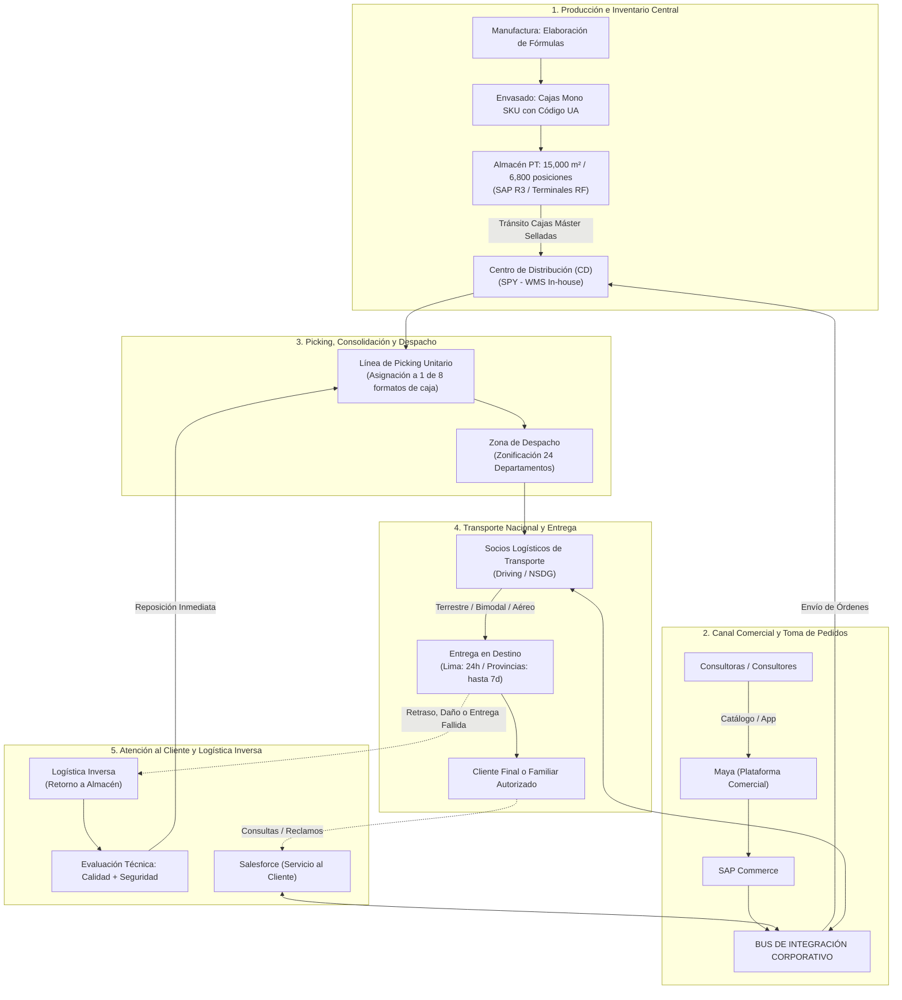

# Base de Conocimiento de Arquitectura Empresarial: Yanbal

> **Mapa de Contenidos (MOC)**  
> Esta base de conocimiento organiza y estructura toda la información obtenida a partir de la entrevista al **Ing. Joao Condorpusa Mendoza**, encargado del área de distribución de **Yanbal (Perú)**, para el desarrollo del proyecto de **Arquitectura Empresarial (Sistema web de logística, inventario y trazabilidad)**.
>
> 🔒 **Garantía de Fidelidad:** El archivo fuente original `trascrito.text` y la grabación audiovisual `ENTREVISTA.mp4` se mantienen intactos. Toda la información documentada está estrictamente respaldada por las declaraciones del entrevistado.
>
> ⚠️ **Nota de Alcance (H-16):** Todo el levantamiento de información y diseño funcional del sistema **Y-Trace** abarca exclusiva y estrictamente la **distribución troncal B2B** (Centro de Distribución → Puntos/Agencias Departamentales). **Se excluye** todo proceso B2C, última milla o reparto domiciliario a consultoras finales.

---

## 1. Índice Modular de Navegación

A continuación se presentan los módulos temáticos organizados con enlaces internos de Obsidian:

```
informacion/
├── 📁 00 - Fuente/
│   └── 📄 [[Transcripción original]] ─────────── Texto íntegro con marcas de tiempo y ficha técnica
├── 📁 01 - Empresa/
│   └── 📄 [[Información general de la empresa]] ─ Modelo de negocio, familias de productos y áreas
├── 📁 02 - Transporte/
│   └── 📄 [[Transporte y logística]] ─────────── Rutas nacionales (24 deptos), 8 formatos de caja, logística inversa
├── 📁 03 - Producción/
│   └── 📄 [[Producción]] ─────────────────────── Manufactura, envasado, cajas mono SKU y estados en SAP R3
├── 📁 04 - Inventario/
│   └── 📄 [[Inventario y almacén]] ──────────── Almacén de 15,000 m², 6,800 posiciones, control por RF y SPY
├── 📁 05 - Trazabilidad/
│   └── 📄 [[Trazabilidad]] ───────────────────── Código UA, Número de Pedido, hitos de control y brechas
├── 📁 06 - Sistemas/
│   └── 📄 [[Sistemas y tecnología]] ──────────── Mapa de 7 sistemas (SAP, SPY, NSDG, Driving, Salesforce) y Bus
├── 📁 07 - Problemas/
│   └── 📄 [[Problemas y necesidades]] ────────── Diagnóstico de desfases (2h tracking, 6h merma) y matriz de metas
└── 📁 08 - Actores/
    └── 📄 [[Actores y responsabilidades]] ────── Matriz de roles (directivos, gestión, coordinación, operativos)
```

---

## 2. Diagrama Macro del Flujo de Valor y de Información

El siguiente flujo resume cómo interactúan los procesos físicos, los sistemas de software y los actores a lo largo de la cadena logística de Yanbal:



---

## 3. Matrices de Relacionamiento Cruzado

### A. Áreas $\rightarrow$ Procesos $\rightarrow$ Responsables
| Área Organizacional | Procesos Asignados | Responsables Clave | Nota Detallada |
| :--- | :--- | :--- | :--- |
| **Manufactura y Envasado** | Síntesis industrial, dosificación, generación de Código UA | Operarios de manufactura y envasado | [[Producción]] |
| **Almacén Central** | Custodia de pallets (6,800 pos.), acondicionamiento especial (droguería) | Recepcionistas con RF, supervisores de stock | [[Inventario y almacén]] |
| **Centro de Distribución** | Desconsolidación, cálculo volumétrico (8 tipos de cajas), picking unitario | Personal de picking, sistema SPY | [[Inventario y almacén]] |
| **Distribución y Transporte** | Zonificación nacional (24 departamentos), gestión de flota asociada | [[Actores y responsabilidades#Ing. Joao Condorpusa Mendoza\|Ing. Joao Condorpusa Mendoza]] | [[Transporte y logística]] |
| **Control de Calidad** | Inspección de cuarentena, calificación técnica en logística inversa | Inspectores técnicos de calidad | [[Producción]] |
| **Seguridad Patrimonial** | Dictamen de siniestros, activación de seguros contra socios de transporte | Analistas de prevención de pérdidas | [[Transporte y logística]] |
| **Comercial y Ventas** | Captación de demanda a través de consultoras | Fuerza de ventas, Consultoras independientes | [[Información general de la empresa]] |
| **Servicio al Cliente** | Gestión de tickets, consultas de estatus, reclamos por terceros receptores | Agentes de atención (Salesforce) | [[Sistemas y tecnología]] |

---

### B. Sistemas $\rightarrow$ Procesos en que se Utilizan
| Sistema Informático | Tipo / Fabricante | Proceso donde se Aplica | Enlace |
| :--- | :--- | :--- | :--- |
| **SAP R3** | ERP Core (Interno adaptado) | Producción, movimientos en almacén, estatus de stock (Libre disposición, Calidad, Bloqueado) | [[Sistemas y tecnología#1 SAP R3 ERP Corporativo\|SAP R3]] |
| **Maya** | Plataforma Comercial (Frontend) | Toma de pedidos web/móvil por consultoras de belleza | [[Sistemas y tecnología#2 Maya\|Maya]] |
| **SAP Commerce** | Motor de Comercio (Externo adaptado) | Procesamiento transaccional de órdenes de venta | [[Sistemas y tecnología#3 SAP Commerce\|SAP Commerce]] |
| **Bus de Integración** | Middleware / ESB Corporativo | Orquestación y paso de mensajes entre los 7 sistemas | [[Sistemas y tecnología#4 Bus de Integración Middleware ESB\|Bus de Integración]] |
| **SPY** | BWMS (Desarrollo In-House Yanbal) | Control de layout en CD, cubicaje (8 cajas) y tareas en línea de picking | [[Sistemas y tecnología#5 SPY Sistema de Picking de Yanbal\|SPY]] |
| **NSDG** | TMS & Tracking (Contratista para Yanbal Perú) | Trazabilidad de envíos, asignación de rutas y control de entregas | [[Sistemas y tecnología#6 NSDG\|NSDG]] |
| **Driving** | TMS (Proveedor externo especializado) | Ruteo dinámico, zonificación y monitoreo de flotas de transporte | [[Sistemas y tecnología#7 Driving\|Driving]] |
| **Salesforce** | CRM en la Nube (Proveedor externo) | Servicio al cliente, gestión de reclamos y consultas de trazabilidad | [[Sistemas y tecnología#8 Salesforce Cellforce\|Salesforce]] |
| **Terminales RF** | Dispositivos móviles de hardware | Lectura física de códigos UA en planta y racks de almacén | [[Sistemas y tecnología#9 Terminales de Radiofrecuencia RF\|Terminales RF]] |

---

### C. Procesos $\rightarrow$ Problemas $\rightarrow$ Necesidades
| Proceso Afectado | Problema Identificado | Causa Principal | Necesidad / Meta Declarada |
| :--- | :--- | :--- | :--- |
| **Picking y Almacén** | **Desfase de hasta 6 horas en merma operativa** | Registro manual por lotes acumulados al final de la jornada laboral | **Sincronización simultánea:** Actualización en vivo del inventario físico hacia el comercial ([[Problemas y necesidades#NEC-02\|NEC-02]]) |
| **Ventas y Facturación** | **Riesgo de quiebre de stock y ventas perdidas** | Venta de producto físicamente destruido por falta de sinceramiento en SAP | Evitar ofrecer stock comprometido en la plataforma Maya ([[Problemas y necesidades#PR-02\|PR-02]]) |
| **Transporte y Entrega** | **Desfase de hasta 2 horas en el tracking de despacho** | Latencia en sincronización de datos móviles de socios logísticos al Bus | **Reducción de latencia:** Lograr respuesta en tiempo real o con desfase $\le$ 30 min ([[Problemas y necesidades#NEC-01\|NEC-01]]) |
| **Atención al Cliente** | **Margen de desconocimiento de la situación del pedido** | Desactualización de estados en Salesforce al momento de reclamos | Disponibilidad de datos frescos de trazabilidad para los agentes ([[Problemas y necesidades#PR-04\|PR-04]]) |
| **Entrega Última Milla** | **Incertidumbre cuando recibe un familiar autorizado** | Ausencia de confirmación inmediata con el nombre del receptor real | Identificación precisa del receptor para evitar falsos reportes de pérdida ([[Problemas y necesidades#PR-05\|PR-05]]) |
| **Logística Inversa** | **Retraso por doble peritaje manual (Calidad + Seguridad)** | Validación física secuencial antes de liberar pedidos de reposición | Estandarización y agilización de garantías y reposiciones urgentes ([[Problemas y necesidades#PR-06\|PR-06]]) |

---

## 4. Cuadro Maestro de Cifras y Datos Técnicos Verificados

Todos los parámetros cuantitativos registrados en la base de conocimiento proceden estrictamente de las respuestas directas del Ing. Joao Condorpusa:

| Métrica / Parámetro | Valor Verificado en Entrevista | Contexto Operativo |
| :--- | :--- | :--- |
| **Superficie del Almacén** | **15,000 $m^2$** | Centro de Almacenamiento y Distribución principal de Yanbal. |
| **Posiciones de Almacenamiento** | **6,800 posiciones** | Unidades de almacenamiento en pallets. |
| **Capacidad Instalada de Cajas** | **2,000,000 cajas** | Capacidad máxima en cajas mono SKU. |
| **Capacidad Óptima de Ocupación** | **~85%** | Permite 15% de holgura para maniobras y reconfiguración del layout. |
| **Formatos de Cajas de Despacho** | **8 tipos de cajas** | Asignados según consolidación teórica de peso y volumetría de cada pedido. |
| **Cobertura Geográfica** | **24 departamentos** | Distribución a nivel nacional (ciudades principales y alejadas). |
| **Modalidades de Transporte** | **3 modalidades** | Terrestre, bimodal (fluvial/lacustre) y aérea. |
| **Lead Time Lima Metropolitana** | **24 horas** | Promesa de entrega en la capital. |
| **Lead Time Provincias** | **Hasta 7 días** | Promesa de entrega en ciudades del interior y zonas alejadas. |
| **Desfase Actual en Tracking** | **~2 horas** | Brecha temporal entre entrega física y actualización digital en sistema. |
| **Desfase Meta en Tracking** | **$\le$ 30 minutos** | Meta crítica de reducción expresada por la jefatura. |
| **Desfase en Registro de Merma** | **Hasta 6 horas** | Brecha por acumulación de merma física durante el turno de picking. |
| **Composición Tecnológica** | **7 sistemas (3 propios + 4 externos)** | SPY, SAP R3 adaptado, NSDG / Driving, Salesforce, SAP Commerce, Maya. |
